# GPIO
   - [RM0008 Reference Manual (STM32F101/2/3/5/7 Series)](https://www.st.com/resource/en/reference_manual/rm0008-stm32f101xx-stm32f102xx-stm32f103xx-stm32f105xx-and-stm32f107xx-advanced-armbased-32bit-mcus-stmicroelectronics.pdf)
   - [DS5319 Datasheet (STM32F101/2/3/5/7 Series)](https://www.st.com/resource/en/datasheet/stm32f103rb.pdf)

## Table of Contents
- [1. Architecture](#1-architecture)
- [2. MemoryMap](#2-memorymap)
- [3. Register](#3-register)
- [4. Test](#4-test)

  

   * 각 GPIO 핀은 소프트웨어로 출력(푸시풀 또는 오픈 드레인), 입력(풀업 또는 풀다운 여부 선택), 또는 주변 장치의 대체 기능으로 구성할 수 있습니다. 
   * 대부분의 GPIO 핀은 디지털 또는 아날로그 대체 기능과 공유됩니다. 모든 GPIO는 고전류를 지원합니다. 
   * I/O의 대체 기능 구성은 필요 시 특정 순서를 따라 잠글 수 있으며, 이는 I/O 레지스터에 불필요한 기록이 이루어지는 것을 방지하기 위함입니다. 
   * I/O는 APB2 버스에 연결되어 있으며, 최대 18 MHz의 토글 속도를 지원합니다. 

## 1.Architecture

Click to collapse

   
  

* 2.3.21 GPIOs (general-purpose inputs/outputs)
   * Each of the GPIO pins can be configured by software as output (push-pull or open-drain), as input (with or without pull-up or pull-down) or as peripheral alternate function.
   * Most of the GPIO pins are shared with digital or analog alternate functions. All GPIOs are high current- capable.
   * The I/Os alternate function configuration can be locked if needed following a specific sequence in order to avoid spurious writing to the I/Os registers.
   * I/Os on APB2 with up to 18 MHz toggling speed.

  
  
  
  

## 2.MemoryMap

Click to collapse

  
  
  
  
  
  
  
  
  
  
  
  

## 3.Register

Click to collapse

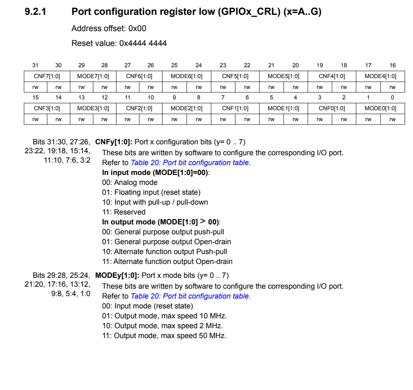  
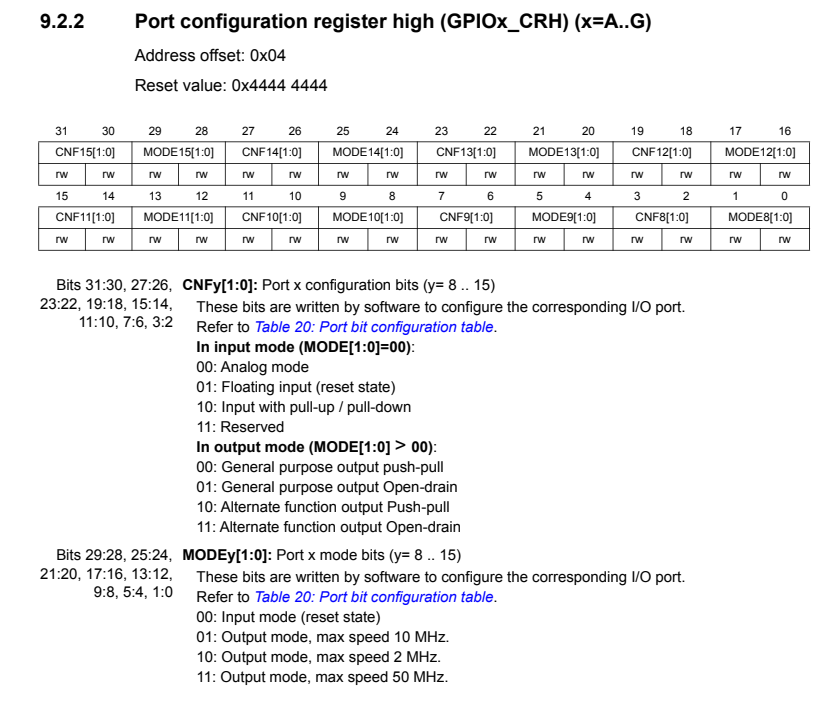  
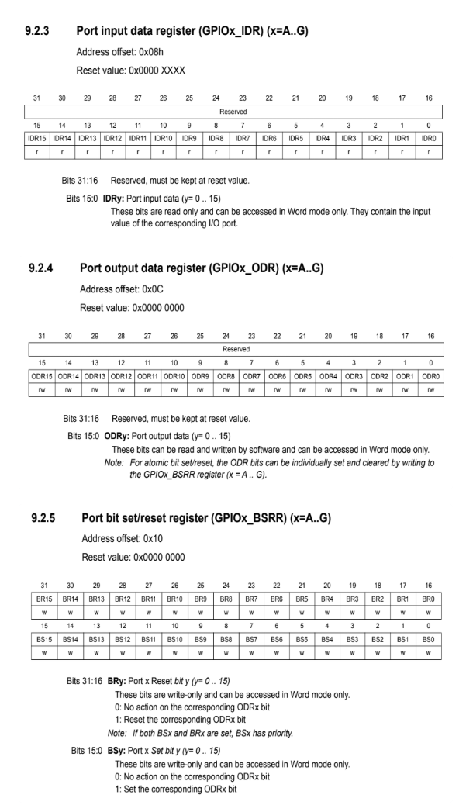  
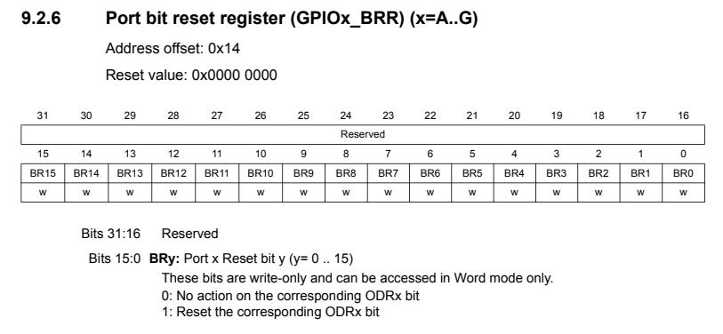  

## 4.Test

Click to collapse

#### 1.	LED test 프로그램을 작성합니다.
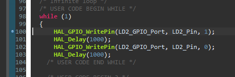  

#### 2.	디버그를 시작합니다.
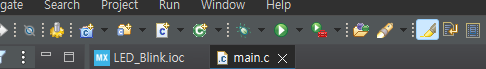  

#### 3.	디버그 메뉴에서 실행을 시작합니다.
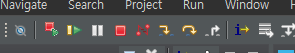  

#### 4.	LD2_GPIO_Port 위에 마우스를 올리면 관련 정보들이 나옵니다.
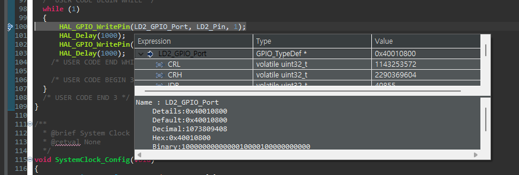  
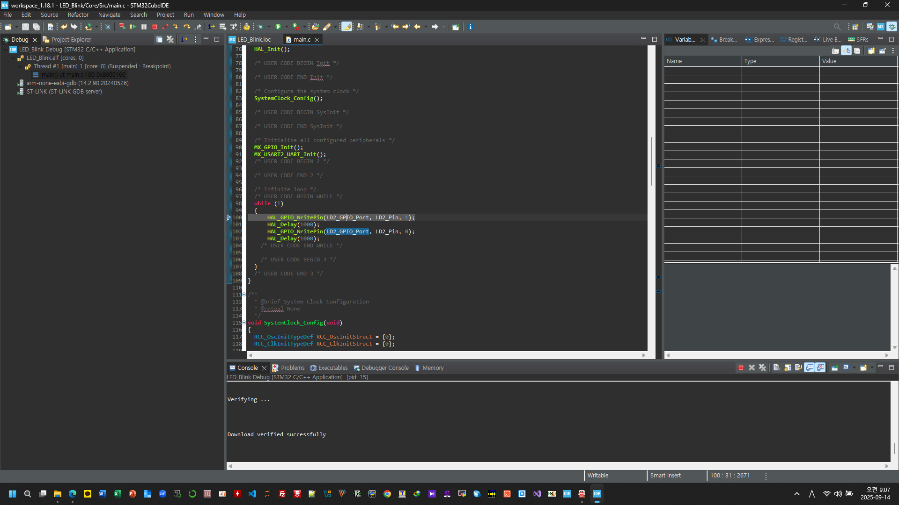  

#### 5.	GPIO A 관련 정보를 위에서 확인하면 관련 레지스터 및 주소 옵셋을 확인할 수 있습니다. 
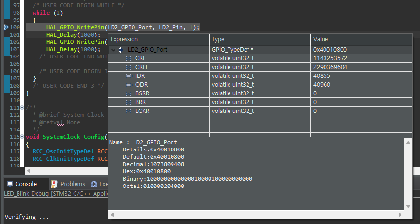  

#### 6.	메모리 값을 확인 및 접근하기 위해서 아래에서 Memory 탭을 누릅니다. 
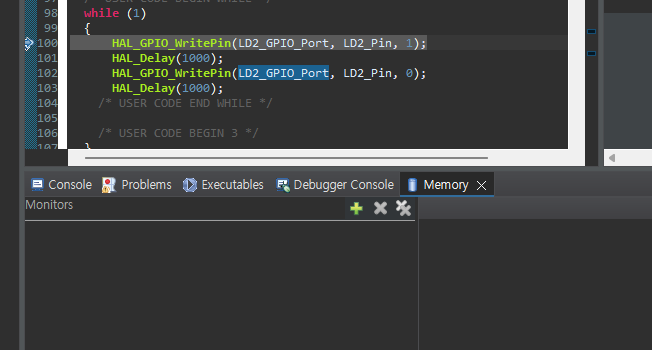  

#### 7.	플러스 버튼을 눌러서 관련 번지를 입력합니다. 값을 0x40010800을 입력합니다. 
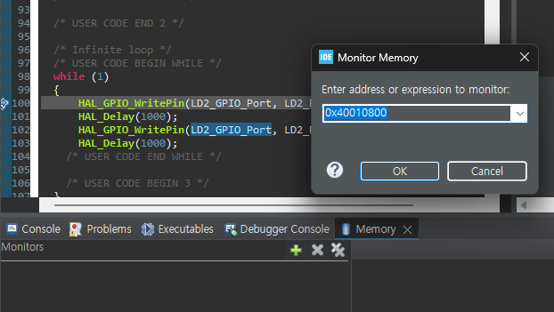  

#### 8.	오른쪽에 관련 메모리 범위와 값이 표현됩니다. 
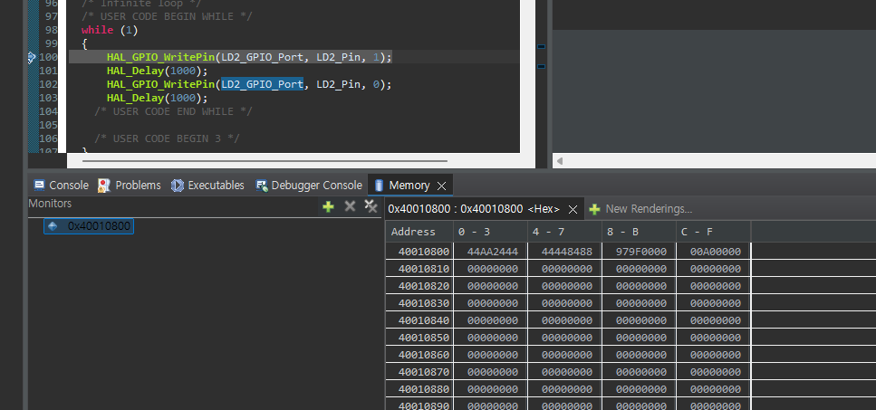  

#### 9.	우선은 값들의 변화를 확인하기 위해서 브레이크 포인트 부터 한단계씩 실행하면서 값의 변화를 확인합니다. 
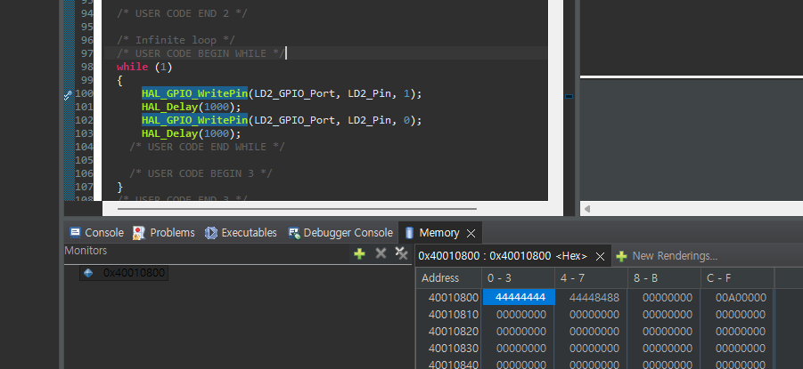  

#### 10.	우선은 값들의 변화를 확인하기 위해서 브레이크 포인트 부터 한단계씩 실행하면서 값의 변화를 확인합니다.  
#### (HAL_GPIO_WritePin(LD2_GPIO_Port, LD2_Pin, 1 실행전); 
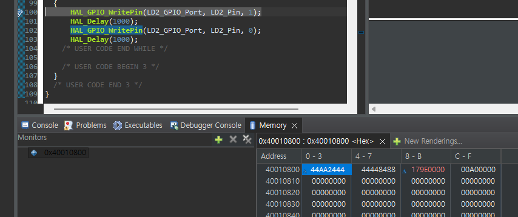  

#### 11.	우선은 값들의 변화를 확인하기 위해서 브레이크 포인트 부터 한단계씩 실행하면서 값의 변화를 확인합니다.  
#### (HAL_GPIO_WritePin(LD2_GPIO_Port, LD2_Pin, 0); 
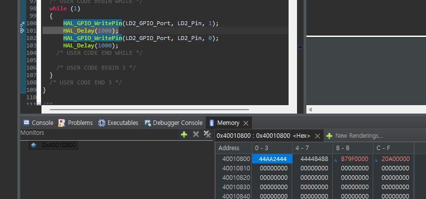  

#### 12.	우선은 값들의 변화를 확인하기 위해서 브레이크 포인트 부터 한단계씩 실행하면서 값의 변화를 확인합니다.  
#### (HAL_GPIO_WritePin(LD2_GPIO_Port, LD2_Pin, 0);    
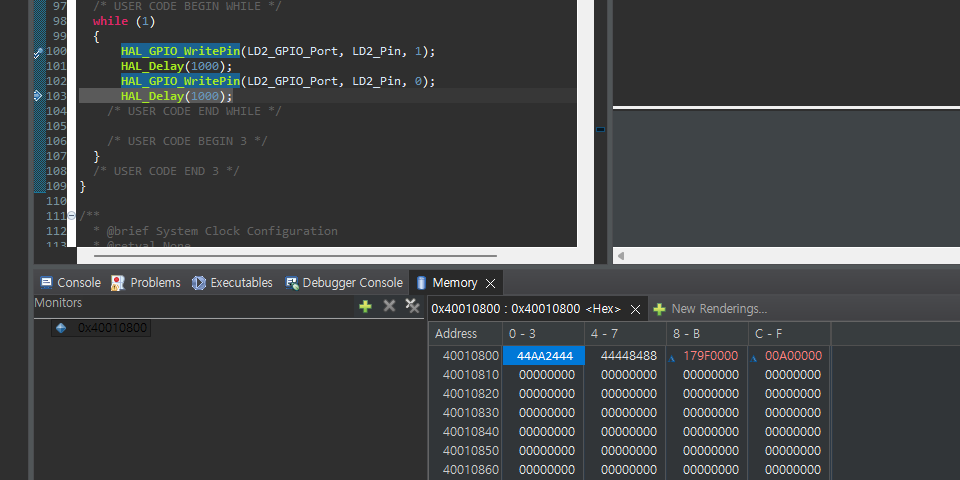  

#### 13.	C-F 위치의 레지스터에서 값을 직접 입력하면서 LED의 상태를 확인하고, 레지스터의 위치와 비교해보면서 동작시켜 봅니다. 
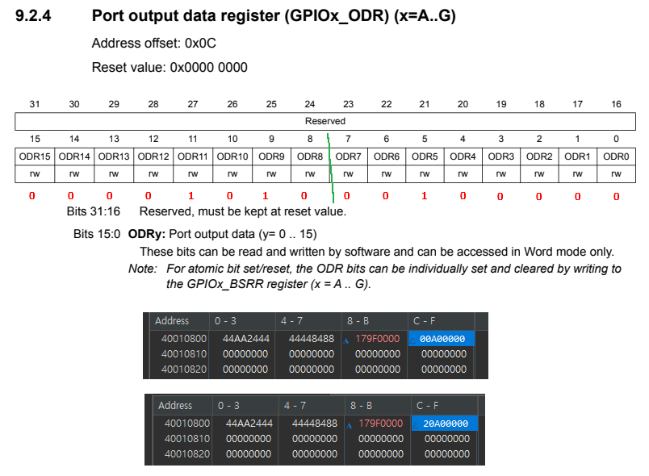  

