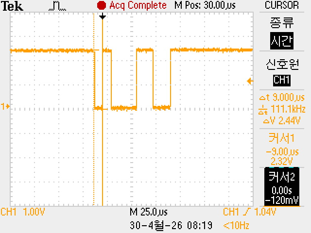

# USART_Print : printf 시리얼 디버깅 

   * 터미널 통신 프로그램 설치 : [https://github.com/TeraTermProject/teraterm/releases?authuser=0]


<br>

<br>

<br>

<br>

<br>

<br>

<br>

```c
/* Private includes ----------------------------------------------------------*/
/* USER CODE BEGIN Includes */
#include <stdio.h>
/* USER CODE END Includes */
```

```c
/* USER CODE BEGIN 0 */
#ifdef __GNUC__
/* With GCC, small printf (option LD Linker->Libraries->Small printf
   set to 'Yes') calls __io_putchar() */
#define PUTCHAR_PROTOTYPE int __io_putchar(int ch)
#else
#define PUTCHAR_PROTOTYPE int fputc(int ch, FILE *f)
#endif /* __GNUC__ */

/**
  * @brief  Retargets the C library printf function to the USART.
  * @param  None
  * @retval None
  */
PUTCHAR_PROTOTYPE
{
  /* Place your implementation of fputc here */
  /* e.g. write a character to the USART1 and Loop until the end of transmission */
  if (ch == '\n')
    HAL_UART_Transmit (&huart2, (uint8_t*) "\r", 1, 0xFFFF);
  HAL_UART_Transmit (&huart2, (uint8_t*) &ch, 1, 0xFFFF);

  return ch;
}
```

```c
  /* USER CODE BEGIN WHILE */
  while (1)
  {
	  printf("Hello World!\n");
	  HAL_Delay(1000);
    /* USER CODE END WHILE */
```

----

# 파형 분석

# UART 115200bps 파형 분석 — 문자 `'1'` (0x31)

> 오실로스코프(Tektronix)로 캡처한 UART 송신 파형을 분석합니다.  
> 전송 문자: ASCII `'1'` (0x31), Baud Rate: 115200bps

---

## 📷 캡처 파형



---

## 🔧 오실로스코프 설정

| 항목 | 값 |
|------|-----|
| 채널 | CH1 |
| 수직 스케일 | 1.00 V/div |
| 시간축 (Time/div) | 25.0 µs/div |
| 트리거 레벨 | 1.04 V |
| 측정 모드 | CURSOR / 시간 |
| 캡처 상태 | Acq Complete |
| 캡처 일시 | 2026-04-30 08:19 |

### 커서 측정값

| 커서 | 시간 | 전압 |
|------|------|------|
| 커서1 | −3.00 µs | 2.32 V |
| 커서2 | 0.00 µs | −120 mV |
| **Δt** | **9.000 µs** | — |
| **ΔV** | — | **2.44 V** |

---

## 📐 UART 115200bps 기본 파라미터

$$T_{bit} = \frac{1}{115200\,\text{bps}} \approx 8.68\,\mu s$$

| 파라미터 | 값 |
|----------|-----|
| Baud Rate | 115,200 bps |
| 비트 주기 (T_bit) | ≈ 8.68 µs |
| 프레임 구성 | Start(1) + Data(8) + Stop(1) = 10 bits |
| 1프레임 전송 시간 | ≈ 86.8 µs |
| 데이터 순서 | LSB First |
| Idle 레벨 | High |
| Start Bit 레벨 | Low |

---

## 🔢 전송 문자 분석 — `'1'` (0x31)

```
ASCII  '1'  =  0x31  =  0b 0011 0001
```

### LSB First 전송 비트 순서

| 비트 | 명칭 | 값 | 전압 레벨 |
|------|------|----|-----------|
| — | **Start bit** | 0 | **Low** |
| D0 (LSB) | 데이터 비트 0 | **1** | **High** |
| D1 | 데이터 비트 1 | 0 | Low |
| D2 | 데이터 비트 2 | 0 | Low |
| D3 | 데이터 비트 3 | 0 | Low |
| D4 | 데이터 비트 4 | 0 | Low |
| D5 | 데이터 비트 5 | 0 | Low |
| D6 | 데이터 비트 6 | **1** | **High** |
| D7 (MSB) | 데이터 비트 7 | **1** | **High** |
| — | **Stop bit** | 1 | **High** |

### 파형 다이어그램

```
        Idle  Start  D0  D1~D5     D6  D7  Stop   Idle
         ___         ___           _________       _____
        |   |       |   |         |         |     |
        |   |_______|   |_________|         |_____|
              8.68µs 8.68µs ~52µs   ~17µs   8.68µs

        HIGH   LOW  HIGH    LOW      HIGH    HIGH
```

> - **Start bit** → Low (8.68 µs)
> - **D0 = 1** → High (8.68 µs)
> - **D1~D5 = 0** → Low 연속 (~43.4 µs, 5비트)
> - **D6, D7 = 1** → High (~17.4 µs, 2비트)
> - **Stop bit** → High (8.68 µs), 이후 Idle 유지

---

## ✅ 커서 측정값으로 Baud Rate 검증

커서 **Δt = 9.000 µs** 는 약 1비트 폭에 해당합니다.

$$\frac{\Delta t}{T_{bit}} = \frac{9.000\,\mu s}{8.68\,\mu s} \approx 1.037\,\text{bit}$$

→ 오차 약 **3.7%** 이내 → 115200 bps **정상 동작 확인** ✅

---

## ⚡ 신호 레벨 분석

| 레벨 | 측정값 | 비고 |
|------|--------|------|
| High (Logic 1) | +2.32 V | 커서1 기준 |
| Low (Logic 0) | −120 mV | 커서2 기준 |
| 전압차 (ΔV) | 2.44 V | 커서 측정값 |

> 신호 레벨이 **3.3V 시스템** 기준으로 정상 범위에 있습니다.  
> (CMOS 입력 기준 High ≥ 0.7×VDD = 2.31V 충족 ✅)

---

## 📊 핵심 요약

| 항목 | 내용 |
|------|------|
| 전송 문자 | `'1'` (ASCII 0x31) |
| Baud Rate | 115,200 bps |
| 비트 주기 | ≈ 8.68 µs |
| 총 프레임 길이 | ≈ 86.8 µs (10비트) |
| 파형 특징 | D1~D5 연속 Low → 긴 Low 구간 뚜렷하게 관측 |
| Baud Rate 검증 | 커서 Δt = 9.000 µs ≈ 1비트 (오차 3.7%) |
| 신호 레벨 | High 2.32V / Low −120mV → 3.3V CMOS 정상 ✅ |

---

## 🛠️ 측정 환경

- **오실로스코프**: Tektronix (CURSOR 모드)
- **측정 채널**: CH1
- **통신 방식**: UART, 115200bps, 8N1 (8-Data, No Parity, 1-Stop)
- **신호 소스**: MCU UART TX 핀 (3.3V CMOS)

---

## 📚 참고

- [UART 프로토콜 개요 (Wikipedia)](https://en.wikipedia.org/wiki/Universal_asynchronous_receiver-transmitter)
- [ASCII 코드표](https://www.asciitable.com/)
- T_bit 계산: `1 / BaudRate = 1 / 115200 ≈ 8.68 µs`

