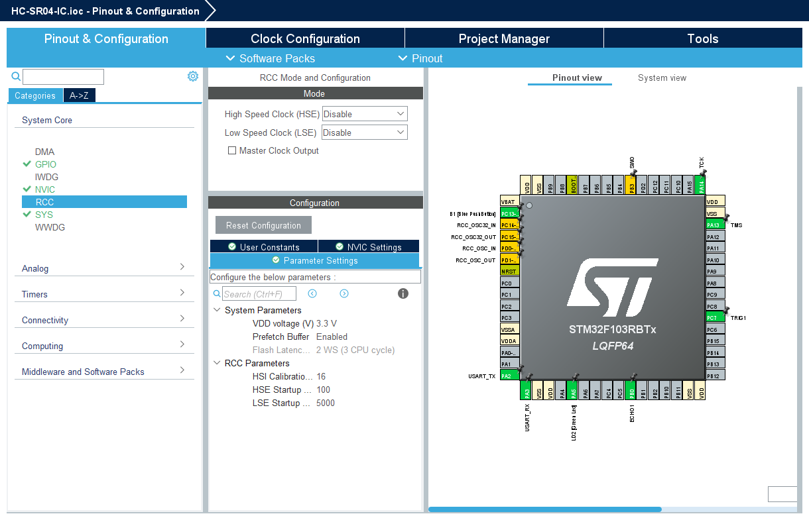
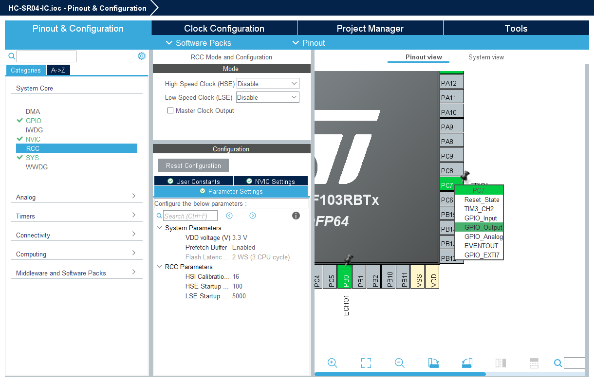
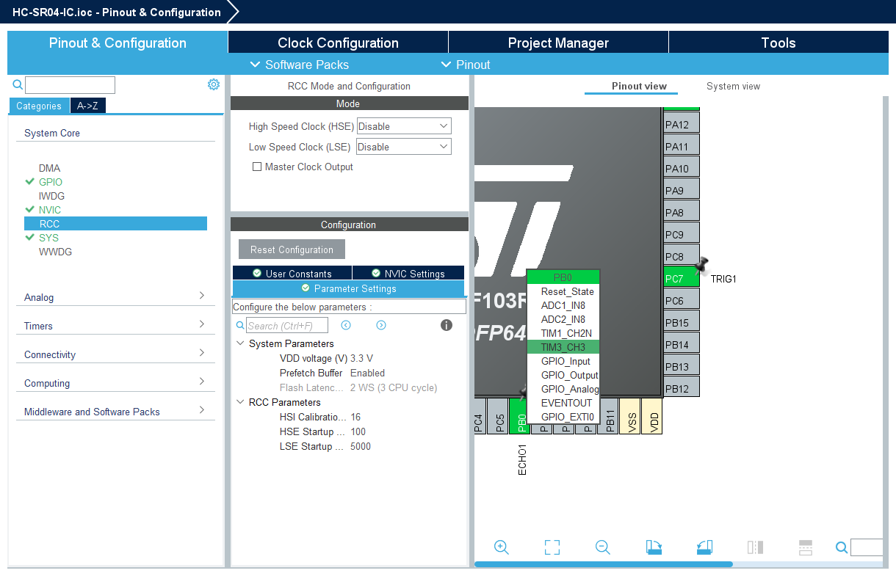
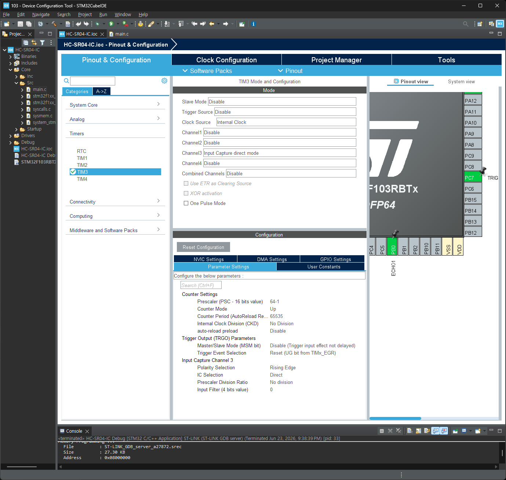
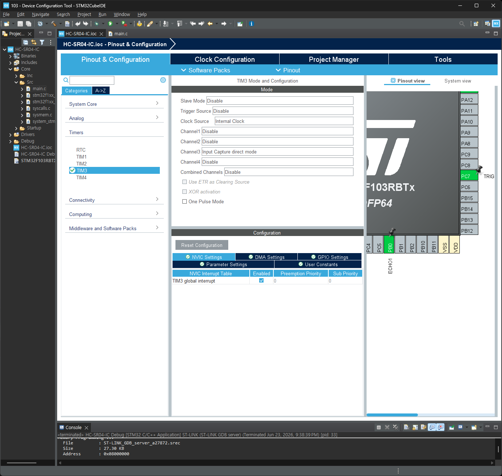
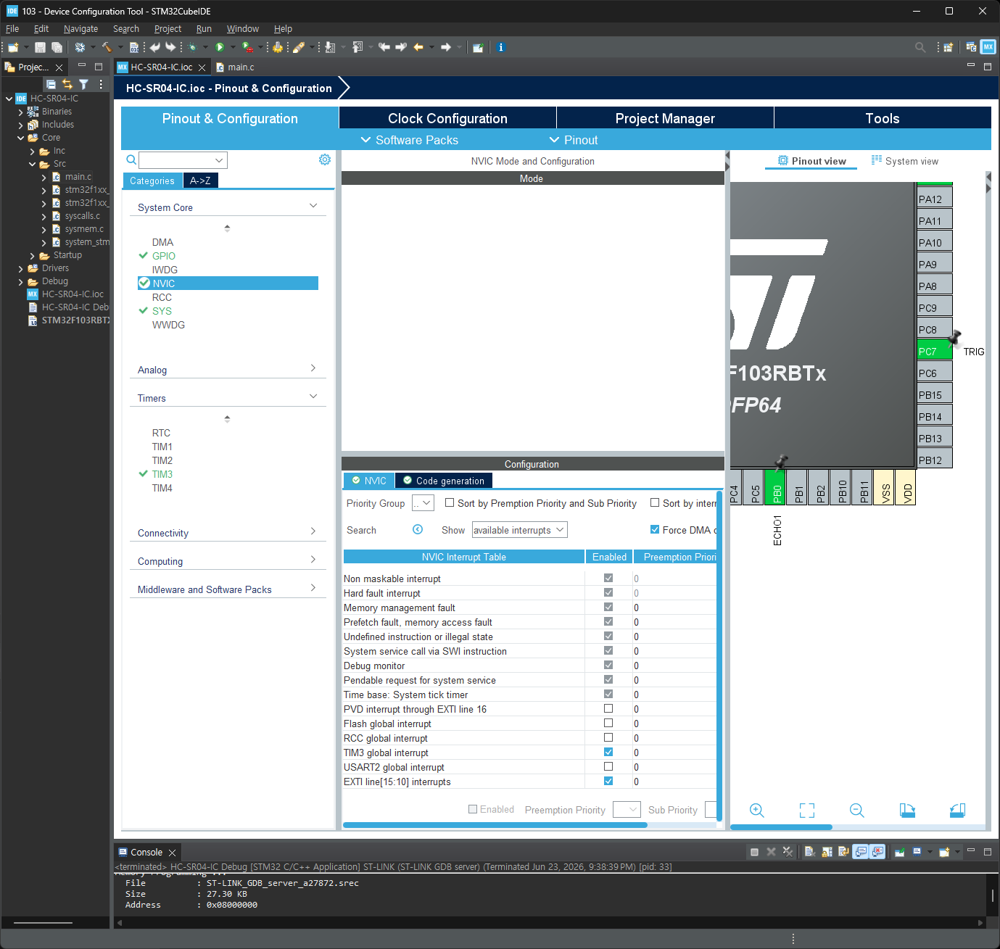
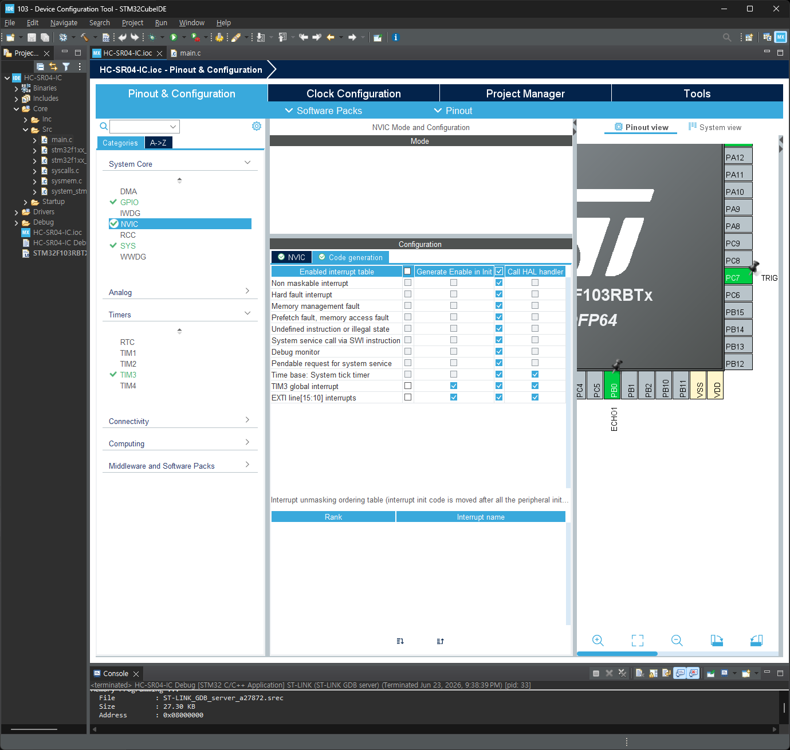
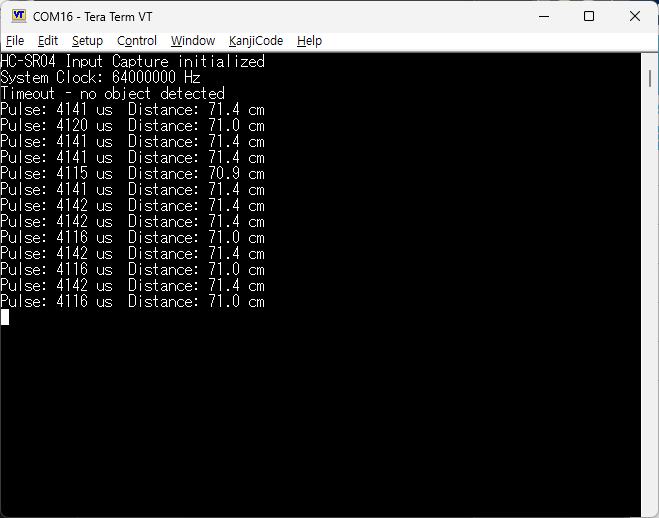
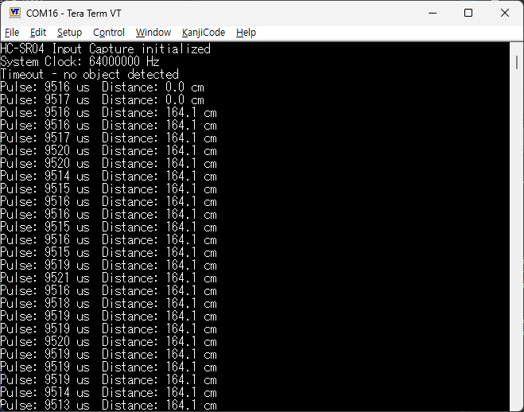

# HC-SR04 Input Capture

 <br>
 <br>
 <br>
 <br>
 <br>
 <br>
 <br>


---

## main.h

```c
/* USER CODE BEGIN Private defines */

/* HC-SR04 pin definitions */
#define TRIG_PIN    TRIG1_Pin
#define TRIG_PORT   TRIG1_GPIO_Port
#define ECHO_PIN    ECHO1_Pin
#define ECHO_PORT   ECHO1_GPIO_Port

/* HC-SR04 timing constants */
#define TRIG_PULSE_US       10      /* 10 us trigger pulse */
#define TIMEOUT_MS          100     /* 100 ms measurement timeout */
#define SOUND_SPEED_FACTOR  58      /* distance (cm) = pulse_width(us) / 58 */

/* TIM3 input capture */
#define IC_PRESCALER        63      /* 64MHz / 64 = 1MHz -> 1 tick = 1 us */
#define IC_PERIOD           65535   /* max 65.535 ms overflow */

/* USER CODE END Private defines */
```

---

## main.c

```c
/* USER CODE BEGIN Includes */
#include <string.h>
#include <stdio.h>
/* USER CODE END Includes */
```

```c
/* USER CODE BEGIN PV */

/* Input capture state */
static volatile uint32_t ic_rising_tick = 0;
static volatile uint32_t ic_falling_tick = 0;
static volatile uint8_t  ic_measurement_done = 0;
static volatile uint8_t  ic_overflow = 0; /* timeout via update event */

/* USER CODE END PV */
```

```c
/* USER CODE BEGIN PFP */
static void delay_us(uint32_t us);
static void HCSR04_Trigger(void);
/* USER CODE END PFP */
```

```c
  /* USER CODE BEGIN 2 */
  printf("HC-SR04 Input Capture initialized\r\n");
  printf("System Clock: %lu Hz\r\n", HAL_RCC_GetSysClockFreq());
  /* USER CODE END 2 */
```

```c
  /* USER CODE BEGIN WHILE */
  while (1)
  {
    uint32_t pulse_width = 0;
    float distance_cm = 0.0f;

    /* Send trigger pulse */
    HCSR04_Trigger();

    /* Wait for measurement with timeout */
    uint32_t tick_start = HAL_GetTick();
    while (ic_measurement_done == 0)
    {
      if ((HAL_GetTick() - tick_start) > TIMEOUT_MS)
      {
        /* Timeout - no echo received, stop both channels */
        HAL_TIM_IC_Stop_IT(&htim3, TIM_CHANNEL_3);
        HAL_TIM_IC_Stop_IT(&htim3, TIM_CHANNEL_4);
        break;
      }
    }

    if (ic_measurement_done)
    {
      /* Calculate pulse width using hardware overflow flag */
      if (ic_overflow)
      {
        /* Timer overflowed between rising and falling edges */
        pulse_width = (IC_PERIOD - ic_rising_tick) + ic_falling_tick;
      }
      else
      {
        /* No overflow */
        pulse_width = ic_falling_tick - ic_rising_tick;
      }

      /* Convert to distance (58 us per cm at sea level) */
      distance_cm = (float)pulse_width / SOUND_SPEED_FACTOR;

      printf("Pulse: %lu us  Distance: %.1f cm\r\n", pulse_width, distance_cm);

      ic_measurement_done = 0;
      ic_overflow = 0;
    }
    else
    {
      printf("Timeout - no object detected\r\n");
    }

    HAL_Delay(200); /* Wait 200ms between measurements */
    /* USER CODE END WHILE */
```

```c
/* USER CODE BEGIN 4 */

/**
  * @brief  Retarget printf to UART2
  */
int __io_putchar(int ch)
{
  HAL_UART_Transmit(&huart2, (uint8_t *)&ch, 1, HAL_MAX_DELAY);
  return ch;
}

int __io_getchar(void)
{
  uint8_t ch;
  HAL_UART_Receive(&huart2, &ch, 1, HAL_MAX_DELAY);
  return ch;
}

/**
  * @brief  Microsecond delay using DWT cycle counter
  *         Uses Cortex-M3 DWT CYCCNT (independent of TIM3)
  *         SystemCoreClock = 64 MHz → 64 cycles = 1 us
  */
static void delay_us(uint32_t us)
{
  CoreDebug->DEMCR |= CoreDebug_DEMCR_TRCENA_Msk;
  DWT->CTRL |= DWT_CTRL_CYCCNTENA_Msk;

  uint32_t start = DWT->CYCCNT;
  uint32_t cycles = us * (SystemCoreClock / 1000000UL);
  while ((DWT->CYCCNT - start) < cycles);
}

/**
  * @brief  Send 10us trigger pulse to HC-SR04 and start input capture
  */
static void HCSR04_Trigger(void)
{
  /* Reset state */
  ic_measurement_done = 0;
  ic_overflow = 0;

  /* Send 10 us HIGH pulse on TRIG pin */
  HAL_GPIO_WritePin(TRIG_PORT, TRIG_PIN, GPIO_PIN_SET);
  delay_us(TRIG_PULSE_US);
  HAL_GPIO_WritePin(TRIG_PORT, TRIG_PIN, GPIO_PIN_RESET);

  /* Reset timer counter for consistent baseline */
  __HAL_TIM_SET_COUNTER(&htim3, 0);

  /* Start input capture on both edges simultaneously:
   *   CH3 = RISING edge  (direct TI3)
   *   CH4 = FALLING edge (indirect TI3) - no polarity toggle needed */
  HAL_TIM_IC_Start_IT(&htim3, TIM_CHANNEL_3);
  HAL_TIM_IC_Start_IT(&htim3, TIM_CHANNEL_4);
}

/**
  * @brief  HAL TIM IC Capture Callback
  *         Called on each capture event (rising -> falling edge)
  */
void HAL_TIM_IC_CaptureCallback(TIM_HandleTypeDef *htim)
{
  if (htim->Instance == TIM3)
  {
    if (htim->Channel == HAL_TIM_ACTIVE_CHANNEL_3)
    {
      /* CH3: Rising edge on TI3 (direct) - save timestamp, keep both channels running */
      ic_rising_tick = HAL_TIM_ReadCapturedValue(&htim3, TIM_CHANNEL_3);
    }
    else if (htim->Channel == HAL_TIM_ACTIVE_CHANNEL_4)
    {
      /* CH4: Falling edge on TI3 (indirect) - capture complete, stop both channels */
      ic_falling_tick = HAL_TIM_ReadCapturedValue(&htim3, TIM_CHANNEL_4);
      HAL_TIM_IC_Stop_IT(&htim3, TIM_CHANNEL_3);
      HAL_TIM_IC_Stop_IT(&htim3, TIM_CHANNEL_4);
      ic_measurement_done = 1;
    }
  }
}

/**
  * @brief  HAL TIM Period Elapsed Callback (overflow handler)
  *         Used to detect timeout when no echo is received
  */
void HAL_TIM_PeriodElapsedCallback(TIM_HandleTypeDef *htim)
{
  if (htim->Instance == TIM3)
  {
    ic_overflow = 1;
  }
}

/* USER CODE END 4 */
```




---
## 필터링

1. 중간값 필터 (Median)
   * 연속 3~5회 측정값을 배열에 저장
   * 정렬 후 중간값만 출력
   * 단점: 1회 측정에 35회 TRIG → 응답 35배 느려짐

2. 글리치 제거 (Outlier Rejection)
   * |현재값 - 직전값| > threshold(예: 50cm 급변) → 무시하고 재측정
   * 연속 N회 이상 불안정하면 일단 직전값 유지
   * 단점: 급격한 실제 거리 변화(물체 갑자기 가까워짐)도 한 번 튕길 수 있음

3. 이동 평균 (Moving Average)
   * 최근 4~8회 측정의 단순 평균
   * 가볍고 부드럽지만 급격한 변화에 둔감

4. IIR 저역 통과 (Exponential Moving Average)
   * filtered = (α × new) + ((1-α) × filtered_prev) (α=0.2~0.3)
   * 메모리 1개만 필요, 가벼움, 실시간성 좋음
   * HW 필터 느낌

* 추천: 2번(글리치 제거) 
   * 듀얼 채널 IC 자체가 정밀하니, crosstalk 같은 가끔 튀는 값만 걸러내는 게 측정 속도 희생이 가장 적습니다.
   * 슬릿 있으면 튀는 값이 거의 없을 테니 필요 없을 수도 있음.


* 아래 4개 필터는 모두 메인 루프의 이 위치에 들어갑니다:

```c
      /* Convert to distance (58 us per cm at sea level) */
      distance_cm = (float)pulse_width / SOUND_SPEED_FACTOR;

      /* ★ 여기에 필터 삽입 ★ */

      printf("Pulse: %lu us  Distance: %.1f cm\r\n", pulse_width, distance_cm);
```

### 1. 중간값 필터 (Median Filter, N=5) : 결과는 가장 좋음
   * 필요 변수 — USER CODE BEGIN PV 영역에 추가:
```c
/* Median filter */
#define MEDIAN_WINDOW 5
static float dist_buffer[MEDIAN_WINDOW] = {0};
static uint8_t dist_idx = 0;
```

* 삽입할 코드:
```c
      /* Median filter */
      dist_buffer[dist_idx] = distance_cm;
      dist_idx = (dist_idx + 1) % MEDIAN_WINDOW;

      /* 정렬 후 중간값 추출 */
      float sorted[MEDIAN_WINDOW];
      for (int i = 0; i < MEDIAN_WINDOW; i++) sorted[i] = dist_buffer[i];
      for (int i = 0; i < MEDIAN_WINDOW - 1; i++) {
        for (int j = i + 1; j < MEDIAN_WINDOW; j++) {
          if (sorted[i] > sorted[j]) {
            float t = sorted[i]; sorted[i] = sorted[j]; sorted[j] = t;
          }
        }
      }
      distance_cm = sorted[MEDIAN_WINDOW / 2];
```



### 2. 글리치 제거 (Outlier Rejection)
   * 필요 변수 — USER CODE BEGIN PV 영역:
```c
/* Glitch filter */
#define GLITCH_THRESHOLD_CM  50.0f
#define GLITCH_MAX_RETRY      3
static float last_valid_dist = 0.0f;
static uint8_t glitch_count = 0;
```

* 삽입할 코드 (이 코드는 printf 위·아래를 모두 감쌉니다):
```c
      /* Glitch rejection */
      if (glitch_count == 0 && last_valid_dist != 0.0f) {
        float delta = (distance_cm > last_valid_dist) ?
                       (distance_cm - last_valid_dist) : (last_valid_dist - distance_cm);
        if (delta > GLITCH_THRESHOLD_CM) {
          glitch_count++;
          if (glitch_count <= GLITCH_MAX_RETRY) {
            distance_cm = last_valid_dist;
            printf("Glitch? retry %d/ %d\r\n", glitch_count, GLITCH_MAX_RETRY);
          }
        } else {
          glitch_count = 0;
          last_valid_dist = distance_cm;
        }
      } else {
        last_valid_dist = distance_cm;
      }

      printf("Pulse: %lu us  Distance: %.1f cm\r\n", pulse_width, distance_cm);

      /* 재측정이 필요한 경우 루프 처음으로 */
      if (glitch_count > 0 && glitch_count <= GLITCH_MAX_RETRY) {
        ic_measurement_done = 0;  /* 이번 printf는 이미 찍었으니 재측정 */
        HAL_Delay(50);
        continue;  /* while(1) 처음으로 → 재측정 */
      }
```

>주의: 이 필터를 쓰려면 printf 아래에 if (glitch_count... ) { continue; } 블록이 필요하므로 printf를 감싸는 구조가 됩니다. 복잡하면 말씀 주세요 — 더 간단한 버전도 가능합니다.

### 3. 이동 평균 (Moving Average, N=8)
   * 필요 변수 — USER CODE BEGIN PV 영역:
```c
/* Moving average */
#define MA_WINDOW 8
static float ma_buffer[MA_WINDOW] = {0};
static uint8_t ma_idx = 0;
static uint8_t ma_filled = 0;
```

* 삽입할 코드:
```c
      /* Moving average */
      ma_buffer[ma_idx] = distance_cm;
      ma_idx = (ma_idx + 1) % MA_WINDOW;
      if (ma_filled < MA_WINDOW) ma_filled++;

      float sum = 0;
      uint8_t count = (ma_filled < MA_WINDOW) ? ma_filled : MA_WINDOW;
      for (int i = 0; i < count; i++) sum += ma_buffer[i];
      distance_cm = sum / (float)count;
```

### 4. IIR 저역 통과 (Exponential Moving Average)
   * 필요 변수 — USER CODE BEGIN PV 영역:
```c
/* IIR EMA filter */
#define EMA_ALPHA  0.25f   /* 0.0~1.0, 작을수록 더 부드러움 */
static float filtered_dist = 0.0f;
static uint8_t ema_first = 1;
```

* 삽입할 코드:

```c
      /* IIR Exponential Moving Average */
      if (ema_first) {
        filtered_dist = distance_cm;
        ema_first = 0;
      } else {
        filtered_dist = EMA_ALPHA * distance_cm + (1.0f - EMA_ALPHA) * filtered_dist;
      }
      distance_cm = filtered_dist;
```

### 요약
   * 필터	저장 변수	계산량	응답 지연	튀는 값 제거
   1. Median	N=5개 버퍼	중간	5회 지연	매우 우수
   2. Glitch	2개 변수	최소	없음	튀는 값만 제거
   3. Moving Avg	N=8개 버퍼	낮음	N/2회 지연	부드러워짐
   4. EMA	2개 변수	최소	약간 느려짐	부드러워짐

* 글리치 제거 추천 이유: 다른 필터는 매 측정마다 값을 변형시키지만, 글리치 제거는 정상값은 그대로 출력하고 crosstalk 같은 갑작스러운 튀는 값만 걸러냅니다.
* 듀얼 채널 IC가 이미 정밀하니 불필요한 평균화를 하지 않는 게 낫습니다.


