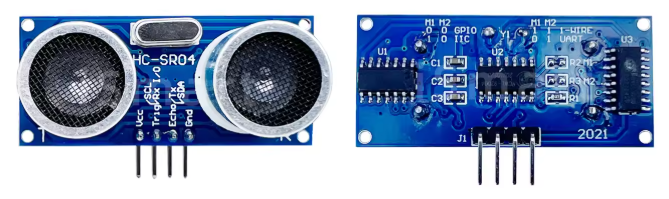
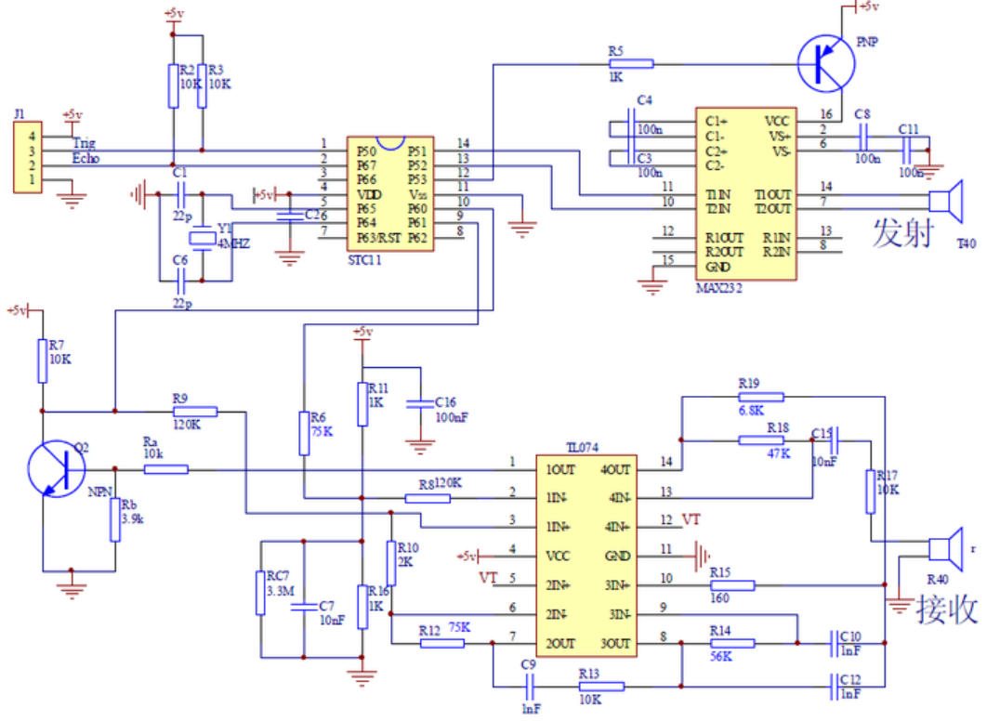
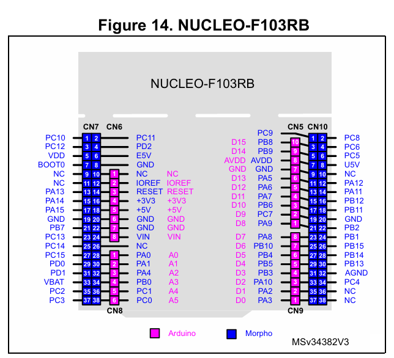
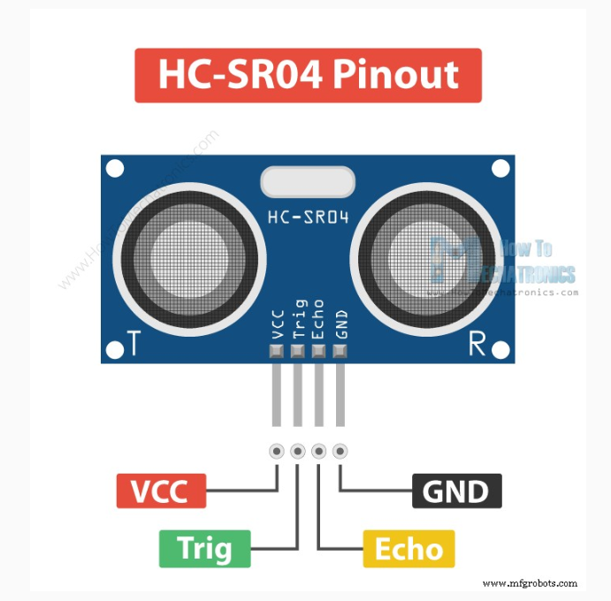
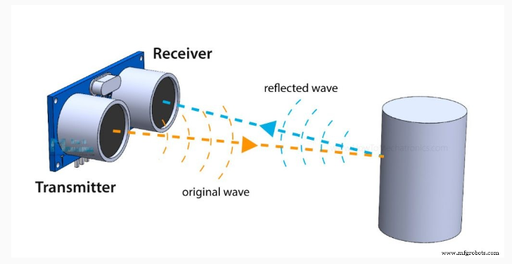
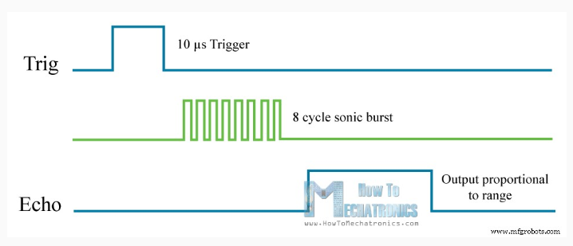
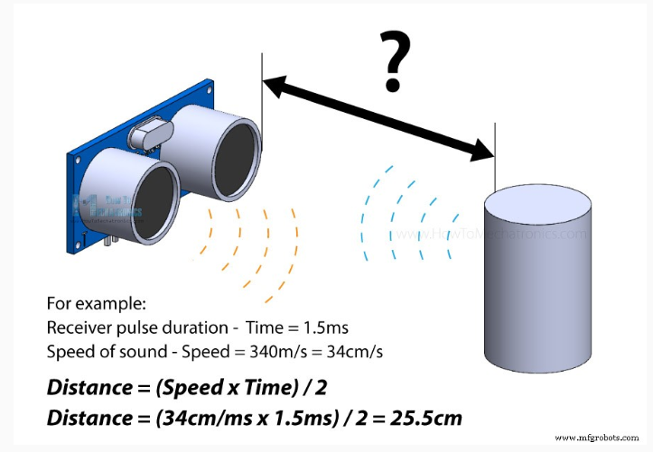
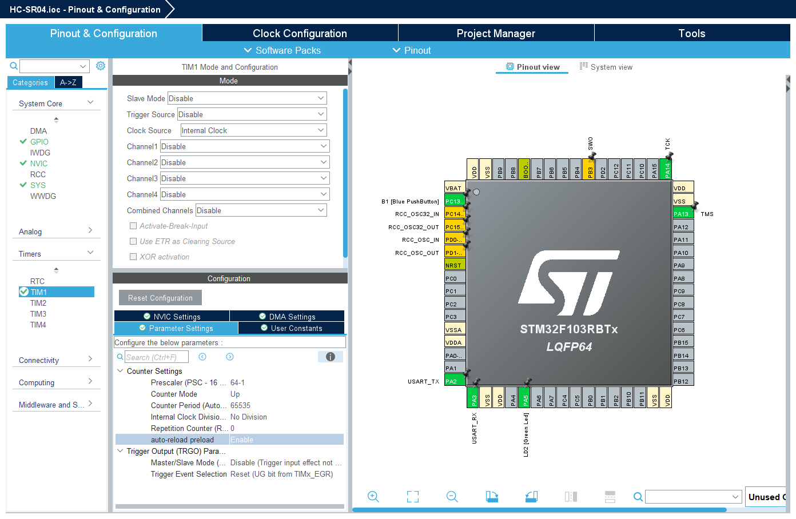
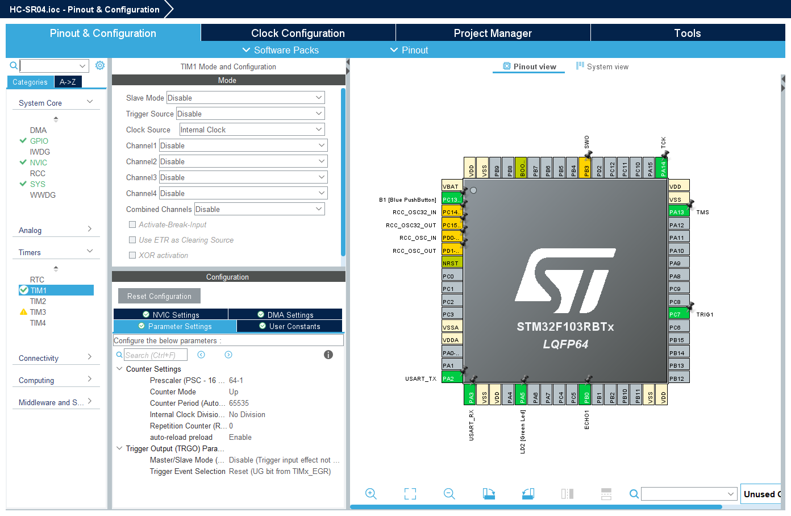
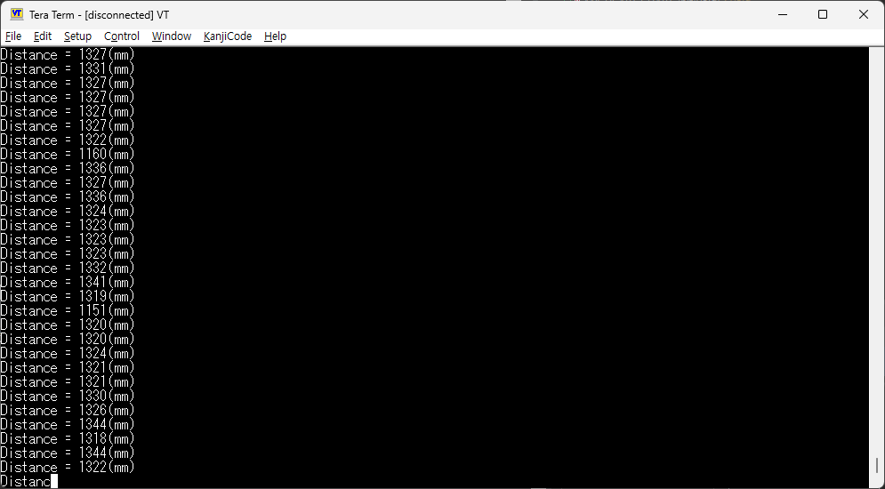

# HC-SR04

 



|       |       |
|:-------:|:-------:|
|  |  | 

  











```c
/* Includes ------------------------------------------------------------------*/
#include "main.h"

/* Private includes ----------------------------------------------------------*/
/* USER CODE BEGIN Includes */
#include <stdio.h>
/* USER CODE END Includes */
```

```c
/* USER CODE BEGIN PD */
#define HIGH 1
#define LOW 0
long unsigned int echo_time;
int dist;
/* USER CODE END PD */
```

```c
/* USER CODE BEGIN 0 */
#ifdef __GNUC__
/* With GCC, small printf (option LD Linker->Libraries->Small printf
   set to 'Yes') calls __io_putchar() */
#define PUTCHAR_PROTOTYPE int __io_putchar(int ch)
#else
#define PUTCHAR_PROTOTYPE int fputc(int ch, FILE *f)
#endif /* __GNUC__ */

/**
  * @brief  Retargets the C library printf function to the USART.
  * @param  None
  * @retval None
  */
PUTCHAR_PROTOTYPE
{
  /* Place your implementation of fputc here */
  /* e.g. write a character to the USART1 and Loop until the end of transmission */
  if (ch == '\n')
    HAL_UART_Transmit (&huart2, (uint8_t*) "\r", 1, 0xFFFF);
  HAL_UART_Transmit (&huart2, (uint8_t*) &ch, 1, 0xFFFF);

  return ch;
}

void timer_start(void)
{
   HAL_TIM_Base_Start(&htim1);
}

void delay_us(uint16_t us)
{
   __HAL_TIM_SET_COUNTER(&htim1, 0); // initislize counter to start from 0
   while((__HAL_TIM_GET_COUNTER(&htim1))<us); // wait count until us
}

void trig(void)
{
   HAL_GPIO_WritePin(TRIG1_GPIO_Port, TRIG1_Pin, HIGH);
   delay_us(10);
   HAL_GPIO_WritePin(TRIG1_GPIO_Port, TRIG1_Pin, LOW);
}

/**
* @brief echo 신호가 HIGH를 유지하는 시간을 (㎲)단위로 측정하여 리턴한다.
* @param no param(void)
*/
long unsigned int echo(void)
{
   long unsigned int echo = 0;

   while(HAL_GPIO_ReadPin(ECHO1_GPIO_Port, ECHO1_Pin) == LOW){}
        __HAL_TIM_SET_COUNTER(&htim1, 0);
        while(HAL_GPIO_ReadPin(ECHO1_GPIO_Port, ECHO1_Pin) == HIGH);
        echo = __HAL_TIM_GET_COUNTER(&htim1);
   if( echo >= 240 && echo <= 23000 ) return echo;
   else return 0;
}
```

```c
  /* USER CODE BEGIN 2 */
  timer_start();
  printf("Ranging with HC-SR04\n");
  /* USER CODE END 2 */

  /* Infinite loop */
  /* USER CODE BEGIN WHILE */
  while (1)
  {
	  trig();
	      echo_time = echo();
	      if( echo_time != 0){
	          dist = (int)(17 * echo_time / 100);
	          printf("Distance = %d(mm)\n", dist);
	      }
	      else printf("Out of Range!\n");
    /* USER CODE END WHILE */

    /* USER CODE BEGIN 3 */
  }
```

```c
uint32_t echo(void) {
    uint32_t start_tick, start_time, end_time;

    // ECHO HIGH 대기 (최대 10ms)
    start_tick = HAL_GetTick();
    while (HAL_GPIO_ReadPin(ECHO1_GPIO_Port, ECHO1_Pin) == GPIO_PIN_RESET) {
        if ((HAL_GetTick() - start_tick) > 10) return 0;  // 10ms 초과 → 실패
    }
    start_time = __HAL_TIM_GET_COUNTER(&htim1);

    // ECHO LOW 대기 (최대 30ms = HC-SR04 최대 측정 시간)
    start_tick = HAL_GetTick();
    while (HAL_GPIO_ReadPin(ECHO1_GPIO_Port, ECHO1_Pin) == GPIO_PIN_SET) {
        if ((HAL_GetTick() - start_tick) > 30) return 0;  // 30ms 초과 → 범위 초과
    }
    end_time = __HAL_TIM_GET_COUNTER(&htim1);

    return end_time - start_time;
}
```

---

## Node.js

```
	          printf("Distance = %d(mm)\n", dist);
```

```
	          printf("Distance1 = %d(mm)\n", dist1);
	          printf("Distance2 = %d(mm)\n", dist2);
```

```
hcsr04-dashboard/
├── server.js
└── public/
    └── index.html
```

```
npm init -y
npm install express socket.io
npm install serialport 
```

```
node server.js 3000 COM3
```


<br>

<br>
