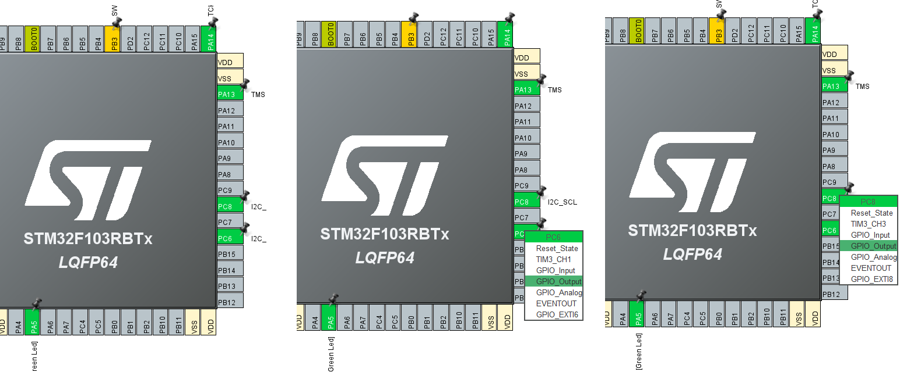
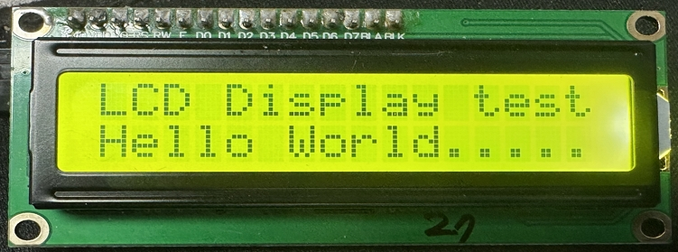
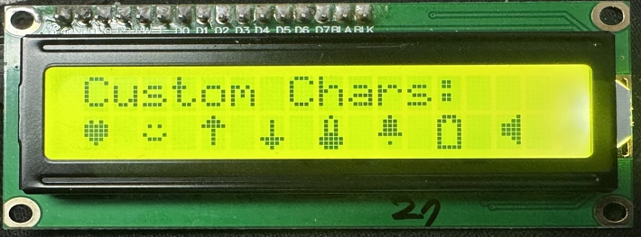
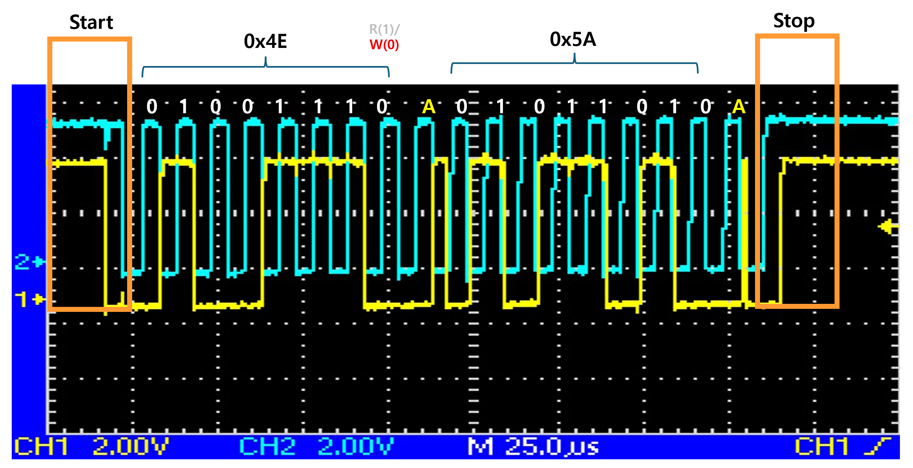

# I2C CLCD-GPIO (Software I2C)

* 하드웨어 구성: PC6(SDA)/PC8(SCL) Open-Drain, 외부 4.7kΩ 풀업 필요
   * I2C_SDA : PC6
   * I2C_SCL : PC8

* 속도 조절: I2C_DELAY (delay_us(5)) 값을 변경하여 조정 (현재 ~100kHz)
   | I2C_DELAY	| 예상 속도	| 비고 | 
   |:-------:| :-------:|:-------:|
   | delay_us(0)	| ~330kHz	| 최대 속도, HAL 오버헤드가 주된 제한 | 
   | delay_us(1)	| ~180kHz	|  | 
   | delay_us(5)	| ~85kHz	| 현재 설정 | 
   | delay_us(10)	| ~45kHz	|  |  
   | delay_us(50)	| ~9.6kHz	|  | 
   | delay_us(1000)	| ~0.5kHz	| 최소 속도 (실질적 하한 없음, 느리게만 동작) | 

* 타이밍 파라미터: SCL 주기 10μs, High/Low 각각 5μs, Start/Stop Setup 4.7μs
* 제한사항: 소프트웨어 I2C는 DMA/멀티마스터/Clock Stretching 미지원 (CLCD 용도로는 무관)   

---

* PC6(I2C_SDA), PC8(I2C_SCL)을 GPIO Open-Drain, Pull-up, High Speed로 추가




---

```c
/* USER CODE BEGIN Includes */
#include <stdio.h>
/* USER CODE END Includes */
```


```c
/* USER CODE BEGIN PD */
#define delay_ms HAL_Delay

#define I2C_DELAY delay_us(5)

//#define ADDRESS   0x3F << 1
#define ADDRESS   0x27 << 1

#define RS1_EN1   0x05
#define RS1_EN0   0x01
#define RS0_EN1   0x04
#define RS0_EN0   0x00
#define BackLight 0x08
/* USER CODE END PD */
```

```c
/* USER CODE BEGIN PV */
static int sw_delay = 0;
static int sw_value = 0;
/* USER CODE END PV */
```

```c
/* USER CODE BEGIN PFP */
static void I2C_Start(void);
static void I2C_Stop(void);
static uint8_t I2C_WriteByte(uint8_t data);
void delay_us(int us);
void LCD_DATA(uint8_t data);
void LCD_CMD(uint8_t cmd);
void LCD_CMD_4bit(uint8_t cmd);
void LCD_INIT(void);
void LCD_XY(char x, char y);
void LCD_CLEAR(void);
void LCD_PUTS(char *str);
void LCD_CreateChar(uint8_t location, const uint8_t *pattern);
void LCD_PutCustomChar(uint8_t location);
void LCD_CreateAllCustomChars(void);
/* USER CODE END PFP */
```

```c
/* USER CODE BEGIN 0 */
#ifdef __GNUC__
#define PUTCHAR_PROTOTYPE int __io_putchar(int ch)
#else
#define PUTCHAR_PROTOTYPE int fputc(int ch, FILE *f)
#endif

PUTCHAR_PROTOTYPE
{
  if (ch == '\n')
    HAL_UART_Transmit(&huart2, (uint8_t*)"\r", 1, 0xFFFF);
  HAL_UART_Transmit(&huart2, (uint8_t*)&ch, 1, 0xFFFF);
  return ch;
}

// --- Software I2C (bit-bang) on PC6(SDA), PC8(SCL) ---

static void I2C_SDA_HIGH(void) {
  HAL_GPIO_WritePin(I2C_SDA_GPIO_Port, I2C_SDA_Pin, GPIO_PIN_SET);
}
static void I2C_SDA_LOW(void) {
  HAL_GPIO_WritePin(I2C_SDA_GPIO_Port, I2C_SDA_Pin, GPIO_PIN_RESET);
}
static void I2C_SCL_HIGH(void) {
  HAL_GPIO_WritePin(I2C_SCL_GPIO_Port, I2C_SCL_Pin, GPIO_PIN_SET);
}
static void I2C_SCL_LOW(void) {
  HAL_GPIO_WritePin(I2C_SCL_GPIO_Port, I2C_SCL_Pin, GPIO_PIN_RESET);
}
static uint8_t I2C_SDA_READ(void) {
  return HAL_GPIO_ReadPin(I2C_SDA_GPIO_Port, I2C_SDA_Pin);
}

static void I2C_Start(void) {
  I2C_SDA_HIGH();
  I2C_SCL_HIGH();
  I2C_DELAY;
  I2C_SDA_LOW();
  I2C_DELAY;
  I2C_SCL_LOW();
}

static void I2C_Stop(void) {
  I2C_SDA_LOW();
  I2C_SCL_HIGH();
  I2C_DELAY;
  I2C_SDA_HIGH();
  I2C_DELAY;
}

static uint8_t I2C_WriteByte(uint8_t data) {
  for (int i = 0; i < 8; i++) {
    if (data & 0x80)
      I2C_SDA_HIGH();
    else
      I2C_SDA_LOW();
    data <<= 1;
    I2C_DELAY;
    I2C_SCL_HIGH();
    I2C_DELAY;
    I2C_SCL_LOW();
  }
  I2C_SDA_HIGH();
  I2C_DELAY;
  I2C_SCL_HIGH();
  I2C_DELAY;
  uint8_t ack = I2C_SDA_READ();
  I2C_SCL_LOW();
  return ack;
}

// --- LCD Driver (via software I2C) ---

void delay_us(int us) {
  sw_value = 3;
  sw_delay = us * sw_value;
  for (int i = 0; i < sw_delay; i++);
}

void LCD_DATA(uint8_t data) {
  uint8_t temp;

  I2C_Start();
  I2C_WriteByte(ADDRESS);
  temp = (data & 0xF0) | RS1_EN1 | BackLight;
  I2C_WriteByte(temp);
  I2C_Stop();

  I2C_Start();
  I2C_WriteByte(ADDRESS);
  temp = (data & 0xF0) | RS1_EN0 | BackLight;
  I2C_WriteByte(temp);
  I2C_Stop();
  delay_us(4);

  I2C_Start();
  I2C_WriteByte(ADDRESS);
  temp = ((data << 4) & 0xF0) | RS1_EN1 | BackLight;
  I2C_WriteByte(temp);
  I2C_Stop();

  I2C_Start();
  I2C_WriteByte(ADDRESS);
  temp = ((data << 4) & 0xF0) | RS1_EN0 | BackLight;
  I2C_WriteByte(temp);
  I2C_Stop();
  delay_us(50);
}

void LCD_CMD(uint8_t cmd) {
  uint8_t temp;

  I2C_Start();
  I2C_WriteByte(ADDRESS);
  temp = (cmd & 0xF0) | RS0_EN1 | BackLight;
  I2C_WriteByte(temp);
  I2C_Stop();

  I2C_Start();
  I2C_WriteByte(ADDRESS);
  temp = (cmd & 0xF0) | RS0_EN0 | BackLight;
  I2C_WriteByte(temp);
  I2C_Stop();
  delay_us(4);

  I2C_Start();
  I2C_WriteByte(ADDRESS);
  temp = ((cmd << 4) & 0xF0) | RS0_EN1 | BackLight;
  I2C_WriteByte(temp);
  I2C_Stop();

  I2C_Start();
  I2C_WriteByte(ADDRESS);
  temp = ((cmd << 4) & 0xF0) | RS0_EN0 | BackLight;
  I2C_WriteByte(temp);
  I2C_Stop();
  delay_us(50);
}

void LCD_CMD_4bit(uint8_t cmd) {
  uint8_t temp;

  I2C_Start();
  I2C_WriteByte(ADDRESS);
  temp = ((cmd << 4) & 0xF0) | RS0_EN1 | BackLight;
  I2C_WriteByte(temp);
  I2C_Stop();

  I2C_Start();
  I2C_WriteByte(ADDRESS);
  temp = ((cmd << 4) & 0xF0) | RS0_EN0 | BackLight;
  I2C_WriteByte(temp);
  I2C_Stop();
  delay_us(50);
}

void LCD_INIT(void) {
  delay_ms(100);

  LCD_CMD_4bit(0x03); delay_ms(5);
  LCD_CMD_4bit(0x03); delay_us(100);
  LCD_CMD_4bit(0x03); delay_us(100);
  LCD_CMD_4bit(0x02); delay_us(100);
  LCD_CMD(0x28);
  LCD_CMD(0x08);
  LCD_CMD(0x01);
  delay_ms(3);
  LCD_CMD(0x06);
  LCD_CMD(0x0C);
}

void LCD_XY(char x, char y) {
  if      (y == 0) LCD_CMD(0x80 + x);
  else if (y == 1) LCD_CMD(0xC0 + x);
  else if (y == 2) LCD_CMD(0x94 + x);
  else if (y == 3) LCD_CMD(0xD4 + x);
}

void LCD_CLEAR(void) {
  LCD_CMD(0x01);
  delay_ms(2);
}

void LCD_PUTS(char *str) {
  while (*str) LCD_DATA(*str++);
}

const uint8_t heart[8] = {
  0b00000, 0b01010, 0b11111, 0b11111,
  0b11111, 0b01110, 0b00100, 0b00000
};

const uint8_t smiley[8] = {
  0b00000, 0b00000, 0b01010, 0b00000,
  0b10001, 0b01110, 0b00000, 0b00000
};

const uint8_t arrow_up[8] = {
  0b00100, 0b01110, 0b11111, 0b00100,
  0b00100, 0b00100, 0b00100, 0b00000
};

const uint8_t arrow_down[8] = {
  0b00000, 0b00100, 0b00100, 0b00100,
  0b00100, 0b11111, 0b01110, 0b00100
};

const uint8_t thermometer[8] = {
  0b00100, 0b01010, 0b01010, 0b01010,
  0b01110, 0b11111, 0b11111, 0b01110
};

const uint8_t bell[8] = {
  0b00100, 0b01110, 0b01110, 0b01110,
  0b11111, 0b00000, 0b00100, 0b00000
};

const uint8_t battery[8] = {
  0b01110, 0b11011, 0b10001, 0b10001,
  0b10001, 0b10001, 0b10001, 0b11111
};

const uint8_t speaker[8] = {
  0b00001, 0b00011, 0b01111, 0b01111,
  0b01111, 0b00011, 0b00001, 0b00000
};

void LCD_CreateChar(uint8_t location, const uint8_t *pattern) {
  if (location > 7) return;
  LCD_CMD(0x40 | (location << 3));
  for (int i = 0; i < 8; i++) {
    LCD_DATA(pattern[i]);
  }
  LCD_CMD(0x80);
}

void LCD_PutCustomChar(uint8_t location) {
  if (location > 7) return;
  LCD_DATA(location);
}

void LCD_CreateAllCustomChars(void) {
  LCD_CreateChar(0, heart);
  LCD_CreateChar(1, smiley);
  LCD_CreateChar(2, arrow_up);
  LCD_CreateChar(3, arrow_down);
  LCD_CreateChar(4, thermometer);
  LCD_CreateChar(5, bell);
  LCD_CreateChar(6, battery);
  LCD_CreateChar(7, speaker);
}
/* USER CODE END 0 */
```

```c
  /* USER CODE BEGIN 2 */
  LCD_INIT();

  LCD_XY(0, 0); LCD_PUTS((char *)"LCD Display test");
  LCD_XY(0, 1); LCD_PUTS((char *)"Hello World.....");

  // Uncomment to enable custom characters:
  //LCD_CreateAllCustomChars();
  //LCD_XY(0, 0); LCD_PUTS("Custom Chars:");
  //LCD_XY(0, 1);
  //LCD_PutCustomChar(0); LCD_DATA(' ');
  //LCD_PutCustomChar(1); LCD_DATA(' ');
  //LCD_PutCustomChar(2); LCD_DATA(' ');
  //LCD_PutCustomChar(3); LCD_DATA(' ');
  //LCD_PutCustomChar(4); LCD_DATA(' ');
  //LCD_PutCustomChar(5); LCD_DATA(' ');
  //LCD_PutCustomChar(6); LCD_DATA(' ');
  //LCD_PutCustomChar(7);
  /* USER CODE END 2 */
```



```c
  /* USER CODE BEGIN 2 */
  LCD_INIT();

//  LCD_XY(0, 0); LCD_PUTS((char *)"LCD Display test");
//  LCD_XY(0, 1); LCD_PUTS((char *)"Hello World.....");

  // Uncomment to enable custom characters:
  LCD_CreateAllCustomChars();
  LCD_XY(0, 0); LCD_PUTS("Custom Chars:");
  LCD_XY(0, 1);
  LCD_PutCustomChar(0); LCD_DATA(' ');
  LCD_PutCustomChar(1); LCD_DATA(' ');
  LCD_PutCustomChar(2); LCD_DATA(' ');
  LCD_PutCustomChar(3); LCD_DATA(' ');
  LCD_PutCustomChar(4); LCD_DATA(' ');
  LCD_PutCustomChar(5); LCD_DATA(' ');
  LCD_PutCustomChar(6); LCD_DATA(' ');
  LCD_PutCustomChar(7);
  /* USER CODE END 2 */
```



```c
  /* USER CODE BEGIN WHILE */
  while (1)
  {
    /* USER CODE END WHILE */

    /* USER CODE BEGIN 3 */
  }
  /* USER CODE END 3 */
```

---

```c
	  unsigned char temp = 0x5A;
	  HAL_I2C_Master_Transmit(&hi2c1, ADDRESS, &temp, 1, 1000);
	  HAL_Delay(1000);
```




