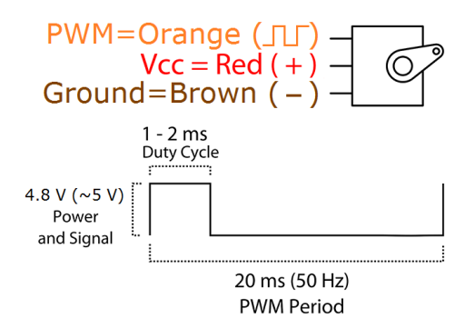
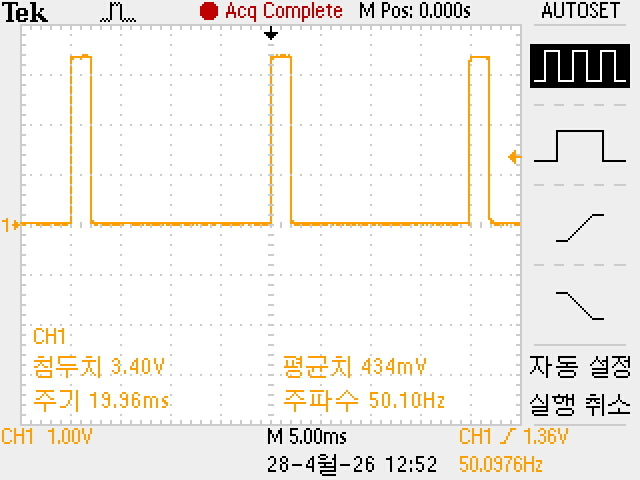
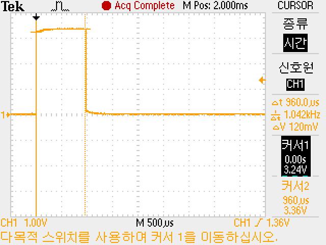
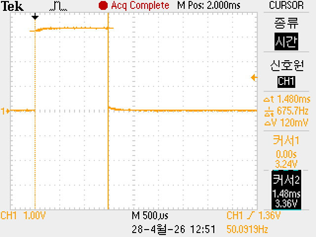
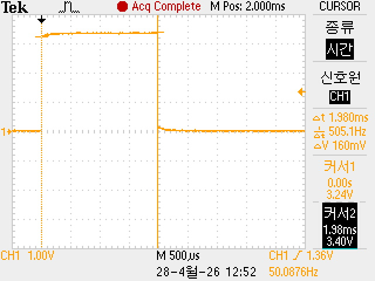

# SG90 Servo 제어를 위한 Timer 설정 (STM32 예제)


<br>


<br>


<br>

<br>


## 1. 기본 조건
- **타이머 클럭** = 64 MHz  
- **Prescaler** = 1280 - 1 = 1279  (0 ~ 65535)
- **Period** = 1000 - 1 = 999 (0 ~ 65535)

---

## 2. 타이머 카운트 주파수
$$
f_{timer} = \frac{64,000,000}{1280} = 50,000 \,\text{Hz}
$$

- 카운트 주파수 = **50 kHz**  
- Tick 주기:  
$$
\frac{1}{50,000} = 20 \,\mu s
$$

$$
\frac{1}{50,000 \, \text{Hz}} = 0.00002 \, \text{s} = 20 \, \mu\text{s}
$$

---

## 3. PWM 주기
$$
T_{PWM} = \frac{Period + 1}{f_{timer}} = \frac{1000}{50,000} = 0.02 \, s = 20 \, ms
$$

✅ 따라서 PWM 주기 = **20 ms (50 Hz)** → SG90 서보 요구사항과 일치  

---

## 4. 펄스 폭 (CCR 값으로 각도 제어)



* Position 
  * "0" (0.5 ms pulse) is middle, 
  * "90" (1.5 ms pulse) is all the way to the right, 
  * "-90" (~2.5 ms pulse) is all the way to the left.

* CCR은 Capture/Compare Register
   * Compare (비교): 타이머의 현재 카운트 값(CNT)과 내가 설정한 CCR 값을 계속 비교합니다.
   * 동작 원리: PWM 모드에서는 카운트 값이 CCR보다 작을 때는 High(1)를 유지하다가, CCR 값에 도달하는 순간 Low(0)로 떨어뜨립니다. 즉, CCR 값은 PWM의 High 구간(Duty Cycle)의 길이를 결정하는 핵심 레지스터입니다.
   * CCR 1당 0.02ms를 의미하는 셈입니다. ($20ms / 1000 = 0.02ms$)

| 각도 | 펄스 폭 (ms) | 계산식 (ARR=1000 기준) | CCR 값 | 
|:---:|:---:|:---:|:---:|
| 0°| 1.0 ms| 1000×(1ms/20ms)=50| 25 | 
| 90°| 1.5 ms| 1000×(1.5ms/20ms)=75| 75 | 
| 180°| 2.0 ms| 1000×(2ms/20ms)=100| 125 | 

- **1 ms** 펄스 폭  
$$\frac{1 \, \text{ms}}{20 \, \mu\text{s}} = 50 \quad \Rightarrow \quad \text{CCR} = 50$$

- **1.5 ms** 펄스 폭  
$$\frac{1.5 \, \text{ms}}{20 \, \mu\text{s}} = 75 \quad \Rightarrow \quad \text{CCR} = 75$$

- **2 ms** 펄스 폭  
$$\frac{2 \, \text{ms}}{20 \, \mu\text{s}} = 100 \quad \Rightarrow \quad \text{CCR} = 100$$

---

## 5. 요약
- Prescaler = **1279**, Period = **999** → 정확히 **50 Hz (20 ms)** PWM 생성  
- CCR 값 50 ~ 100 사이로 설정하여 SG90 서보 각도 (0°~180°) 제어 가능  

---

## 6. 각도별 CCR 값
- 0° → 1 ms → CCR = 25  
- 90° → 1.5 ms → CCR = 75  
- 180° → 2 ms → CCR = 125  



```c
// 0도
__HAL_TIM_SET_COMPARE(&htim2, TIM_CHANNEL_1, 25);
```


```c
// 90도
__HAL_TIM_SET_COMPARE(&htim2, TIM_CHANNEL_1, 75);
```


```c
// 180도
__HAL_TIM_SET_COMPARE(&htim2, TIM_CHANNEL_1, 125);
```


```c
SG90_SetAngle(0);   // 0도
HAL_Delay(1000);

SG90_SetAngle(90);   // 90도
HAL_Delay(1000);

SG90_SetAngle(180);  // 180도
HAL_Delay(1000);
```

---

## 7. 각도를 일반화한 함수
```c
void SG90_SetAngle(uint8_t angle)
{
    // Period = 1000, 주기 = 20ms
    // 0도  → 0.5ms → CCR = 25
    // 90도 → 1.5ms → CCR = 75
    // 180도→ 2.5ms → CCR = 125
    uint32_t ccr_val = 25 + ((uint32_t)angle * 100 / 180);
    __HAL_TIM_SET_COMPARE(&htim2, TIM_CHANNEL_1, ccr_val);
}
```

---

## 8. 사용 예시

### 8.1 특정 각도로 이동

```c
  /* USER CODE BEGIN 2 */
  HAL_TIM_PWM_Start(&htim2, TIM_CHANNEL_1);
  /* USER CODE END 2 */
```

```c
SG90_SetAngle(0);    // 0도
HAL_Delay(1000);

SG90_SetAngle(90);   // 90도
HAL_Delay(1000);

SG90_SetAngle(180);  // 180도
HAL_Delay(1000);
```

### 8.2 각도 이동 확인 : 0° → 180° → 0° 스윕 예시

```c
/* USER CODE BEGIN WHILE */
while (1)
{
    // 0도 → 180도 증가
    for (int angle = 0; angle <= 180; angle++)
    {
        SG90_SetAngle(angle);
        HAL_Delay(100);
    }

    // 180도 → 0도 감소
    for (int angle = 180; angle >= 0; angle--)
    {
        SG90_SetAngle(angle);
        HAL_Delay(100);
    }
    /* USER CODE END WHILE */
```

----
# 코드 수정
----

   * TIM2_CH1 - PA0
   * TIM3_CH1 - PA6

```c
/* USER CODE BEGIN Includes */
#include <stdio.h>
/* USER CODE END Includes */
```

```c
/* USER CODE BEGIN PD */
#define MAX 125  // 2.5ms pulse width (최대 각도)
#define MIN 25   // 0.5ms pulse width (최소 각도)
#define CENTER 75 // 1.5ms pulse width (중앙 각도)
#define STEP 1
/* USER CODE END PD */

/* USER CODE BEGIN PV */
uint8_t ch;
uint8_t pos_pan = 75;
uint8_t pos_tilt = 75;
/* USER CODE END PV */
```

```c
/* USER CODE BEGIN 0 */
#ifdef __GNUC__
/* With GCC, small printf (option LD Linker->Libraries->Small printf
   set to 'Yes') calls __io_putchar() */
#define PUTCHAR_PROTOTYPE int __io_putchar(int ch)
#else
#define PUTCHAR_PROTOTYPE int fputc(int ch, FILE *f)
#endif /* __GNUC__ */

/**
  * @brief  Retargets the C library printf function to the USART.
  * @param  None
  * @retval None
  */
PUTCHAR_PROTOTYPE
{
  /* Place your implementation of fputc here */
  /* e.g. write a character to the USART1 and Loop until the end of transmission */
  if (ch == '\n')
    HAL_UART_Transmit (&huart2, (uint8_t*) "\r", 1, 0xFFFF);
  HAL_UART_Transmit (&huart2, (uint8_t*) &ch, 1, 0xFFFF);

  return ch;
}
```

```c
  /* USER CODE BEGIN 2 */
  HAL_TIM_PWM_Start(&htim2, TIM_CHANNEL_1);
  HAL_TIM_PWM_Start(&htim3, TIM_CHANNEL_1);

  // 초기 위치 설정
  __HAL_TIM_SET_COMPARE(&htim2, TIM_CHANNEL_1, pos_pan);
  __HAL_TIM_SET_COMPARE(&htim3, TIM_CHANNEL_1, pos_tilt);

  printf("Servo Control Ready\r\n");
  printf("Commands: w(up), s(down), a(left), d(right), i(center)\r\n");
  /* USER CODE END 2 */
```

```c
  /* USER CODE BEGIN WHILE */
  while (1)
  {
    if(HAL_UART_Receive(&huart2, &ch, sizeof(ch), 10) == HAL_OK)
    {
      if(ch == 's')
      {
        printf("Down\r\n");
        if(pos_tilt + STEP <= MAX)
          pos_tilt = pos_tilt + STEP;
        else
          pos_tilt = MAX;
      }
      else if(ch == 'w')
      {
        printf("Up\r\n");
        if(pos_tilt - STEP >= MIN)
          pos_tilt = pos_tilt - STEP;
        else
          pos_tilt = MIN;
      }
      else if(ch == 'a')
      {
        printf("Left\r\n");
        if(pos_pan + STEP <= MAX)
          pos_pan = pos_pan + STEP;
        else
          pos_pan = MAX;
      }
      else if(ch == 'd')
      {
        printf("Right\r\n");
        if(pos_pan - STEP >= MIN)
          pos_pan = pos_pan - STEP;
        else
          pos_pan = MIN;
      }
      else if(ch == 'i')
      {
        printf("Center\r\n");
        pos_pan = CENTER;
        pos_tilt = CENTER;
      }

      // PWM 듀티 사이클 업데이트
      __HAL_TIM_SET_COMPARE(&htim2, TIM_CHANNEL_1, pos_pan);
      __HAL_TIM_SET_COMPARE(&htim3, TIM_CHANNEL_1, pos_tilt);

      printf("Pan: %d, Tilt: %d\r\n", pos_pan, pos_tilt);

      HAL_Delay(50); // 서보 응답 시간
    }

    /* USER CODE END WHILE */
```
* 위의 if 포현을 switch case로 변경하면?
```c
/* USER CODE BEGIN WHILE */
  while (1)
  {
    if (HAL_UART_Receive(&huart2, &ch, sizeof(ch), 10) == HAL_OK)
    {
      switch (ch)
      {
        case 's':
          printf("Down\r\n");
          if (pos_tilt + STEP <= MAX)
            pos_tilt += STEP;
          else
            pos_tilt = MAX;
          break;

        case 'w':
          printf("Up\r\n");
          if (pos_tilt - STEP >= MIN)
            pos_tilt -= STEP;
          else
            pos_tilt = MIN;
          break;

        case 'a':
          printf("Left\r\n");
          if (pos_pan + STEP <= MAX)
            pos_pan += STEP;
          else
            pos_pan = MAX;
          break;

        case 'd':
          printf("Right\r\n");
          if (pos_pan - STEP >= MIN)
            pos_pan -= STEP;
          else
            pos_pan = MIN;
          break;

        case 'i':
          printf("Center\r\n");
          pos_pan = CENTER;
          pos_tilt = CENTER;
          break;

        default:
          // 정의되지 않은 키가 입력되었을 때의 처리 (선택 사항)
          break;
      }

      // PWM 듀티 사이클 업데이트
      __HAL_TIM_SET_COMPARE(&htim2, TIM_CHANNEL_1, pos_pan);
      __HAL_TIM_SET_COMPARE(&htim3, TIM_CHANNEL_1, pos_tilt);

      printf("Pan: %d, Tilt: %d\r\n", pos_pan, pos_tilt);

      HAL_Delay(50); // 서보 응답 시간
    }
    /* USER CODE END WHILE */
```

---
# 각도표시
---


```c
/* USER CODE BEGIN Includes */
#include <stdio.h>
/* USER CODE END Includes */
```

```c
/* USER CODE BEGIN PD */
#define MAX 125      // 2.5ms pulse width (180도)
#define MIN 25       // 0.5ms pulse width (0도)
#define CENTER 75    // 1.5ms pulse width (90도)
#define STEP 5       // 이동 단위
/* USER CODE END PD */
```

```c
/* USER CODE BEGIN PV */
uint8_t ch;
uint8_t pos_pan = CENTER;
uint8_t pos_tilt = CENTER;
/* USER CODE END PV */
```

```c
/* USER CODE BEGIN PFP */
uint16_t pwm_to_angle(uint8_t pwm_value);
void display_servo_status(uint8_t pan, uint8_t tilt);
/* USER CODE END PFP */
```

```c
/* USER CODE BEGIN 0 */
#ifdef __GNUC__
/* With GCC, small printf (option LD Linker->Libraries->Small printf
   set to 'Yes') calls __io_putchar() */
#define PUTCHAR_PROTOTYPE int __io_putchar(int ch)
#else
#define PUTCHAR_PROTOTYPE int fputc(int ch, FILE *f)
#endif /* __GNUC__ */

/**
  * @brief  Retargets the C library printf function to the USART.
  * @param  None
  * @retval None
  */
PUTCHAR_PROTOTYPE
{
  /* Place your implementation of fputc here */
  /* e.g. write a character to the USART1 and Loop until the end of transmission */
  if (ch == '\n')
    HAL_UART_Transmit (&huart2, (uint8_t*) "\r", 1, 0xFFFF);
  HAL_UART_Transmit (&huart2, (uint8_t*) &ch, 1, 0xFFFF);

  return ch;
}

/**
  * @brief  PWM 값을 각도로 변환하는 함수
  * @param  pwm_value: PWM 듀티 사이클 값 (25~125)
  * @retval 각도 값 (0~1800, 실제 각도 x 10)
  */
uint16_t pwm_to_angle(uint8_t pwm_value)
{
  // PWM 25~125 범위를 0~180도로 변환
  // 소수점 계산을 위해 10배로 확대 (0~1800)
  // 공식: angle = (pwm_value - 25) * 1800 / (125 - 25)
  return ((uint16_t)(pwm_value - MIN) * 1800) / (MAX - MIN);
}

/**
  * @brief  서보모터 상태를 화면에 출력하는 함수
  * @param  pan: Pan 서보 PWM 값
  * @param  tilt: Tilt 서보 PWM 값
  * @retval None
  */
void display_servo_status(uint8_t pan, uint8_t tilt)
{
  uint16_t pan_angle = pwm_to_angle(pan);
  uint16_t tilt_angle = pwm_to_angle(tilt);
  
  printf("Pan: %3d (%3d.%d°) | Tilt: %3d (%3d.%d°)\r\n", 
         pan, pan_angle/10, pan_angle%10,
         tilt, tilt_angle/10, tilt_angle%10);
}
/* USER CODE END 0 */
```

```c
  /* USER CODE BEGIN 2 */
  // PWM 시작
  HAL_TIM_PWM_Start(&htim2, TIM_CHANNEL_1);
  HAL_TIM_PWM_Start(&htim3, TIM_CHANNEL_1);
  
  // 초기 위치 설정
  __HAL_TIM_SET_COMPARE(&htim2, TIM_CHANNEL_1, pos_pan);
  __HAL_TIM_SET_COMPARE(&htim3, TIM_CHANNEL_1, pos_tilt);
  
  printf("\r\n=== SG90 Servo Control System ===\r\n");
  printf("Commands: w(up), s(down), a(left), d(right), i(center)\r\n");
  printf("Initial Position:\r\n");
  display_servo_status(pos_pan, pos_tilt);
  printf("Ready!\r\n\r\n");
  /* USER CODE END 2 */

```

```c
 /* Infinite loop */
  /* USER CODE BEGIN WHILE */
  while (1)
  {
    if(HAL_UART_Receive(&huart2, &ch, sizeof(ch), 10) == HAL_OK)
    {
      // 명령 처리
      if(ch == 's')  // Down
      {
        printf("Command: Down\r\n");
        if(pos_tilt + STEP <= MAX) 
          pos_tilt = pos_tilt + STEP;
        else 
          pos_tilt = MAX;
      }
      else if(ch == 'w')  // Up
      {
        printf("Command: Up\r\n");
        if(pos_tilt - STEP >= MIN) 
          pos_tilt = pos_tilt - STEP;
        else 
          pos_tilt = MIN;
      }
      else if(ch == 'a')  // Left
      {
        printf("Command: Left\r\n");
        if(pos_pan + STEP <= MAX)	
          pos_pan = pos_pan + STEP;
        else 
          pos_pan = MAX;
      }
      else if(ch == 'd')  // Right
      {
        printf("Command: Right\r\n");
        if(pos_pan - STEP >= MIN)	
          pos_pan = pos_pan - STEP;
        else 
          pos_pan = MIN;
      }
      else if(ch == 'i')  // Center
      {
        printf("Command: Center\r\n");
        pos_pan = CENTER;
        pos_tilt = CENTER;
      }
      else
      {
        printf("Invalid command: %c\r\n", ch);
        continue;  // 잘못된 명령이면 PWM 업데이트 하지 않음
      }

      // PWM 듀티 사이클 업데이트
      __HAL_TIM_SET_COMPARE(&htim2, TIM_CHANNEL_1, pos_pan);
      __HAL_TIM_SET_COMPARE(&htim3, TIM_CHANNEL_1, pos_tilt);
      
      // 상태 출력 (pwm_to_angle 함수 실제 사용됨)
      display_servo_status(pos_pan, pos_tilt);
      
      HAL_Delay(50); // 서보 응답 시간
    }
    
    /* USER CODE END WHILE */
```


```c
/* USER CODE BEGIN WHILE */
  while (1)
  {
    if (HAL_UART_Receive(&huart2, &ch, sizeof(ch), 10) == HAL_OK)
    {
      switch (ch)
      {
        case 's': // Down
          printf("Command: Down\r\n");
          pos_tilt = (pos_tilt + STEP <= MAX) ? (pos_tilt + STEP) : MAX;
          break;

        case 'w': // Up
          printf("Command: Up\r\n");
          pos_tilt = (pos_tilt - STEP >= MIN) ? (pos_tilt - STEP) : MIN;
          break;

        case 'a': // Left
          printf("Command: Left\r\n");
          pos_pan = (pos_pan + STEP <= MAX) ? (pos_pan + STEP) : MAX;
          break;

        case 'd': // Right
          printf("Command: Right\r\n");
          pos_pan = (pos_pan - STEP >= MIN) ? (pos_pan - STEP) : MIN;
          break;

        case 'i': // Center
          printf("Command: Center\r\n");
          pos_pan = CENTER;
          pos_tilt = CENTER;
          break;

        default:
          printf("Invalid command: %c\r\n", ch);
          continue; // 잘못된 명령이면 아래 PWM 업데이트 로직을 건너뜀
      }

      // PWM 듀티 사이클 업데이트 (정상적인 명령일 때만 실행됨)
      __HAL_TIM_SET_COMPARE(&htim2, TIM_CHANNEL_1, pos_pan);
      __HAL_TIM_SET_COMPARE(&htim3, TIM_CHANNEL_1, pos_tilt);

      // 상태 출력
      display_servo_status(pos_pan, pos_tilt);

      HAL_Delay(50); // 서보 응답 시간
    }
  }
  /* USER CODE END WHILE */
```


## Camera + PAN/TILT

* https://www.anaconda.com/download/success?reg=skipped

카메라 확인 프로그램
- 연결된 카메라 자동 검색
- 다중 카메라 동시 표시

* cam_test.py

```python
import cv2

def find_cameras(max_check=5):
    """연결된 카메라 검색"""
    cameras = []
    for i in range(max_check):
        cap = cv2.VideoCapture(i)
        if cap.isOpened():
            ret, _ = cap.read()
            if ret:
                cameras.append(i)
                print(f"[OK] 카메라 {i} 발견")
            cap.release()
    return cameras

def main():
    print("카메라 검색 중...")
    cameras = find_cameras()
   
    if not cameras:
        print("카메라를 찾을 수 없습니다!")
        return
   
    print(f"\n총 {len(cameras)}개 카메라 발견: {cameras}")
    print("ESC 또는 Q: 종료\n")
   
    # 카메라 열기
    caps = {}
    for cam_id in cameras:
        cap = cv2.VideoCapture(cam_id)
        cap.set(cv2.CAP_PROP_FRAME_WIDTH, 640)
        cap.set(cv2.CAP_PROP_FRAME_HEIGHT, 480)
        caps[cam_id] = cap
   
    while True:
        for cam_id, cap in caps.items():
            ret, frame = cap.read()
            if ret:
                # 카메라 번호 표시
                cv2.putText(frame, f"Camera {cam_id}", (10, 30),
                            cv2.FONT_HERSHEY_SIMPLEX, 1, (0, 255, 0), 2)
                cv2.imshow(f"Camera {cam_id}", frame)
       
        key = cv2.waitKey(1) & 0xFF
        if key == 27 or key == ord('q'):  # ESC or Q
            break
   
    # 정리
    for cap in caps.values():
        cap.release()
    cv2.destroyAllWindows()

if __name__ == "__main__":
    main()

```


```
pip install pyserial
python face_tracking_pantilt.py --port COM3
python face_tracking_pantilt.py --port COM7 --camera 2
```

* 코드에서 수정

```
# 수평 제어 (Pan)
# 얼굴이 오른쪽에 있으면 -> 카메라를 오른쪽으로 (d)
# 얼굴이 왼쪽에 있으면 -> 카메라를 왼쪽으로 (a)
if error_x > self.config.deadzone_x:
	self._send_command('a')  # 오른쪽으로
	print(f"[PAN] 오른쪽 이동 (error_x: {error_x})")
	command_sent = True
elif error_x < -self.config.deadzone_x:
	self._send_command('d')  # 왼쪽으로
	print(f"[PAN] 왼쪽 이동 (error_x: {error_x})")
	command_sent = True
```
