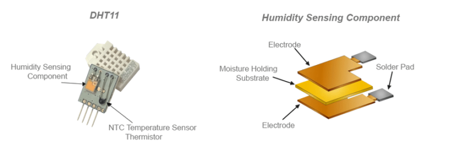
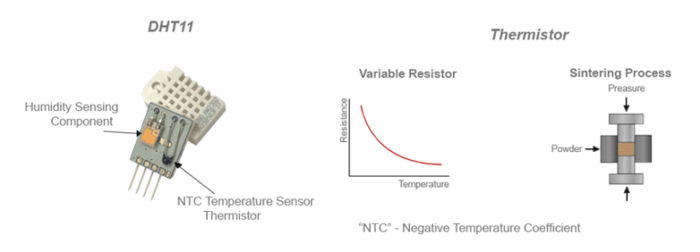
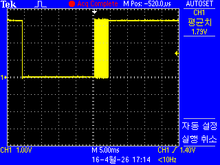
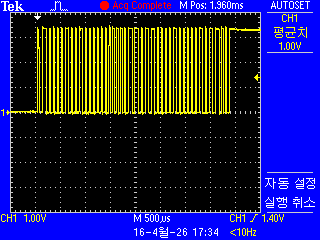
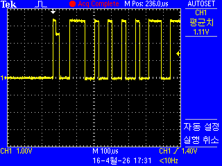

# DHT11 : 온도 습도 센서


---

## DHT11 센서 작동 원리
   * DHT11 센서 모듈 내부를 보면, 기판 앞면에는 NTC 서미스터와 습도 감지 부품이 부착되어 있습니다.
   * 기판 뒷면에는 데이터 수집, 처리 및 DHT11 센서 데이터시트에 명시된 1-Wire 디지털 프로토콜을 통한 데이터 전송을 담당하는 소형 마이크로컨트롤러가 탑재되어 있습니다.

### DHT11 온도 센서
   * 온도 감지는 DHT11 모듈 내부에 통합된 NTC 서미스터가 담당합니다. NTC(Negative Temperature Coefficient, 부특성) 서미스터는 온도와 반비례 관계를 가지는 저항기입니다.
   * 아래 그림에서 볼 수 있듯이, 온도가 상승하면 NTC의 저항 값은 떨어지고 반대의 경우도 마찬가지입니다.



   * 내부 마이크로컨트롤러는 이 NTC 서미스터의 값을 읽고 NTC의 특성 곡선을 사용하여 해당하는 온도 값을 계산한 다음, 1-Wire 데이터 라인을 통해 디지털 온도 값을 전송합니다(초당 1회).

### DHT11 습도 센서
   * 습도 감지는 DHT11 센서 모듈 내부에 있는 습도 감지 부품이 담당합니다. DHT11 센서의 습도 감지 부품은 공기 중의 수분 함량에 따라 정전용량(커패시턴스)이 변하는 수분 민감형 커패시터를 사용합니다.

   * DHT11 센서에 내장된 마이크로컨트롤러는 이 수분 민감형 커패시터를 충전 및 방전시키고, 충·방전 시간을 측정하여 정전용량을 결정합니다.
   * 그런 다음 이 정전용량 값을 디지털 신호로 변환하여 1-Wire 시리얼 인터페이스를 통해 전송합니다.



   * DHT11 습도 센서는 주변 환경의 상대 습도(RH%)를 측정하여 출력합니다. 상대 습도의 공식(방정식)은 다음과 같습니다.

$$RH = \frac{\rho_w}{\rho_s} \times 100\%$$

   * 여기서 $RH$는 상대 습도, $\rho_w$는 특정 온도에서의 수증기 밀도, $\rho_s$는 해당 온도에서 포화 상태일 때의 수증기 밀도를 나타냅니다.

   * 상대 습도는 특정 온도에서 공기가 머금을 수 있는 최대 수증기량과 비교하여 현재 공기 중에 존재하는 수증기량을 측정하는 지표입니다.
   * 공기가 포화 점에 도달하여 더 이상 수증기를 머금을 수 없게 되면 응결이 시작되고, 그 결과 표면에 이슬(수분)이 맺히게 됩니다.

   * 공기 중 수증기의 포화 점은 온도의 영향을 받습니다. 차가운 공기는 포화 상태에 도달하기 전까지 수증기를 머금을 수 있는 용량이 적은 반면, 뜨거운 공기는 포화 상태가 되기 전까지 더 많은 양의 수증기를 머금을 수 있습니다.

   * 상대 습도는 일반적으로 백분율(%)로 표시됩니다. 상대 습도가 100%이면 공기가 완전히 포화되어 응결이 일어나는 상태를 의미합니다.
   * 반대로 상대 습도가 0%이면 공기가 완전히 건조하여 수증기가 전혀 없음을 나타냅니다.

> **참고 (Note)**  <br>
> DHT11 센서의 샘플링 속도는 1Hz로, 습도 및 온도 측정값을 초당 1회 업데이트합니다. <br>
> 따라서 센서 값을 초당 여러 번 읽을 수는 있지만, 센서 내부의 업데이트 속도(샘플링)가 1Hz로 고정되어 있기 때문에 동일한 값을 얻게 됩니다. <br>
> 센서를 이보다 빠른 속도로 읽는 것은 가능하지만 실익이 없습니다.

---

 <br>

 <br>

 <br>

## 1. 통신 프로토콜 개요
* DHT11의 통신은 항상 MCU의 시작 신호로 시작되며, 다음과 같은 단계로 진행됩니다.
   1. Start Signal (MCU → Sensor): MCU가 데이터 선을 최소 18ms 동안 Low로 유지한 후 High로 올립니다.
   2. Response Signal (Sensor → MCU): 센서는 시작 신호를 감지하면 대답으로 Low(80µs)와 High(80µs) 신호를 차례로 보냅니다.
   3. Data Transmission: 총 **40비트(5바이트)**의 데이터를 전송합니다.

## 2. 데이터 구조 (40비트)
* 전송되는 데이터는 총 5개의 세그먼트로 나뉩니다. 각 세그먼트는 8비트(1바이트)입니다.

| 순서|데이터 내용|설명|
|:----:|:----:|:----:|
|1|습도 정수부|현재 습도의 정수 값|
|2|습도 소수부|DHT11은 보통 0으로 처리됨|
|3|온도 정수부|현재 온도의 정수 값|
|4|온도 소수부|DHT11은 보통 0으로 처리됨|
|5|체크섬 (Check-sum)|앞선 4개 바이트의 합 (데이터 오류 검증용)|

* 체크섬 검증식: >$$습도 정수 + 습도 소수 + 온도 정수 + 온도 소수 = 체크섬(하위 8비트)$$

## 3. 데이터 '0'과 '1'을 구별하는 법 (Pulse Width)
  * DHT11은 전압의 높낮이가 아니라 High 상태가 유지되는 시간으로 0과 1을 구분합니다.
  * 모든 비트는 50µs의 Low 신호로 시작된 뒤 High로 전환됩니다.
     * 데이터 '0': High 상태가 약 26~28µs 동안 지속됨.
     * 데이터 '1': High 상태가 약 70µs 동안 지속됨.

## 4. 데이터를 읽는 과정 (Pseudo Code 로직)
* 데이터를 정확히 읽으려면 마이크로초($\mu s$) 단위의 정밀한 타이밍 제어가 필요합니다.
  1. 핀 설정: MCU 핀을 Output으로 설정하고 Low를 18ms 이상 출력합니다.
  2. 모드 전환: 핀을 Input으로 변경하여 센서의 응답을 기다립니다.
  3. 응답 확인: 센서가 보내는 80µs Low, 80µs High 신호를 체크합니다.
  4. 비트 캡처:
     * Low 신호가 끝날 때까지 대기합니다.
     * High 신호가 시작되는 시점부터 시간을 잽니다.
     * 시간이 약 30µs보다 길면 1, 짧으면 0으로 판단하여 변수에 저장합니다.
   5. 검증: 40비트를 모두 읽은 후, 앞의 4바이트 합이 마지막 체크섬 바이트와 일치하는지 확인합니다.
     
* 주의사항
   * 샘플링 간격: DHT11은 데이터 변환 속도가 느리므로, 한 번 데이터를 읽은 후 다시 읽으려면 최소 1~2초의 간격을 두어야 합니다.
   * 풀업 저항: 데이터 선과 VCC 사이에 보통 4.7kΩ ~ 10kΩ의 풀업 저항을 연결해야 신호가 안정적입니다. (모듈 형태는 이미 포함된 경우가 많습니다.)

---------------------------

   * PA0 - DATA


<br>


<br>


<br>

```c
/* USER CODE BEGIN Includes */
#include <stdio.h>
#include <string.h>
/* USER CODE END Includes */
```

```c
/* USER CODE BEGIN PTD */
typedef struct {
    uint8_t temperature;
    uint8_t humidity;
    uint8_t temp_decimal;
    uint8_t hum_decimal;
    uint8_t checksum;
} DHT11_Data;
/* USER CODE END PTD */
```

```c
/* USER CODE BEGIN PD */
#define DHT11_PORT GPIOA
#define DHT11_PIN GPIO_PIN_0
/* USER CODE END PD */
```

```c
/* USER CODE BEGIN PV */
DHT11_Data dht11_data;
char uart_buffer[100];  // uart_buffer 변수 선언 추가
/* USER CODE END PV */
```

```c
/* USER CODE BEGIN PFP */
void DHT11_SetPinOutput(void);
void DHT11_SetPinInput(void);
void DHT11_SetPin(GPIO_PinState state);
GPIO_PinState DHT11_ReadPin(void);
void DHT11_DelayUs(uint32_t us);
uint8_t DHT11_Start(void);
uint8_t DHT11_ReadBit(void);
uint8_t DHT11_ReadByte(void);
uint8_t DHT11_ReadData(DHT11_Data *data);
/* USER CODE END PFP */
```

```c
/* USER CODE BEGIN 0 */
#ifdef __GNUC__
/* With GCC, small printf (option LD Linker->Libraries->Small printf
   set to 'Yes') calls __io_putchar() */
#define PUTCHAR_PROTOTYPE int __io_putchar(int ch)
#else
#define PUTCHAR_PROTOTYPE int fputc(int ch, FILE *f)
#endif /* __GNUC__ */

/**
  * @brief  Retargets the C library printf function to the USART.
  * @param  None
  * @retval None
  */
PUTCHAR_PROTOTYPE
{
  /* Place your implementation of fputc here */
  /* e.g. write a character to the USART1 and Loop until the end of transmission */
  if (ch == '\n')
    HAL_UART_Transmit (&huart2, (uint8_t*) "\r", 1, 0xFFFF);
  HAL_UART_Transmit (&huart2, (uint8_t*) &ch, 1, 0xFFFF);

  return ch;
}

// DHT11 함수 구현
void DHT11_SetPinOutput(void) {
    GPIO_InitTypeDef GPIO_InitStruct = {0};
    GPIO_InitStruct.Pin = DHT11_PIN;
    GPIO_InitStruct.Mode = GPIO_MODE_OUTPUT_PP;
    GPIO_InitStruct.Pull = GPIO_NOPULL;
    GPIO_InitStruct.Speed = GPIO_SPEED_FREQ_HIGH;
    HAL_GPIO_Init(DHT11_PORT, &GPIO_InitStruct);
}

void DHT11_SetPinInput(void) {
    GPIO_InitTypeDef GPIO_InitStruct = {0};
    GPIO_InitStruct.Pin = DHT11_PIN;
    GPIO_InitStruct.Mode = GPIO_MODE_INPUT;
    GPIO_InitStruct.Pull = GPIO_PULLUP;
    HAL_GPIO_Init(DHT11_PORT, &GPIO_InitStruct);
}

void DHT11_SetPin(GPIO_PinState state) {
    HAL_GPIO_WritePin(DHT11_PORT, DHT11_PIN, state);
}

GPIO_PinState DHT11_ReadPin(void) {
    return HAL_GPIO_ReadPin(DHT11_PORT, DHT11_PIN);
}

void DHT11_DelayUs(uint32_t us) {
    __HAL_TIM_SET_COUNTER(&htim2, 0);
    while (__HAL_TIM_GET_COUNTER(&htim2) < us);
}

uint8_t DHT11_Start(void) {
    uint8_t response = 0;

    // 출력 모드로 설정
    DHT11_SetPinOutput();

    // 시작 신호 전송 (18ms LOW)
    DHT11_SetPin(GPIO_PIN_RESET);
    HAL_Delay(20);  // 18ms -> 20ms로 변경 (더 안정적)

    // HIGH로 변경 후 20-40us 대기
    DHT11_SetPin(GPIO_PIN_SET);
    DHT11_DelayUs(30);

    // 입력 모드로 변경
    DHT11_SetPinInput();

    // DHT11 응답 확인 (80us LOW + 80us HIGH)
    DHT11_DelayUs(40);

    if (!(DHT11_ReadPin())) {
        DHT11_DelayUs(80);
        if (DHT11_ReadPin()) {
            response = 1;
        } else {
            response = 0;
        }
    }

    // HIGH가 끝날 때까지 대기
    while (DHT11_ReadPin());

    return response;
}

uint8_t DHT11_ReadBit(void) {
    // LOW 신호가 끝날 때까지 대기 (50us)
    while (!(DHT11_ReadPin()));

    // HIGH 신호 시작 후 30us 대기
    DHT11_DelayUs(30);

    // 여전히 HIGH면 1, LOW면 0
    if (DHT11_ReadPin()) {
        // HIGH가 끝날 때까지 대기
        while (DHT11_ReadPin());
        return 1;
    } else {
        return 0;
    }
}

uint8_t DHT11_ReadByte(void) {
    uint8_t byte = 0;
    for (int i = 0; i < 8; i++) {
        byte = (byte << 1) | DHT11_ReadBit();
    }
    return byte;
}

uint8_t DHT11_ReadData(DHT11_Data *data) {
    if (!DHT11_Start()) {
        return 0; // 시작 신호 실패
    }

    // 5바이트 데이터 읽기
    data->humidity = DHT11_ReadByte();
    data->hum_decimal = DHT11_ReadByte();
    data->temperature = DHT11_ReadByte();
    data->temp_decimal = DHT11_ReadByte();
    data->checksum = DHT11_ReadByte();

    // 체크섬 확인
    uint8_t calculated_checksum = data->humidity + data->hum_decimal +
                                 data->temperature + data->temp_decimal;

    if (calculated_checksum == data->checksum) {
        return 1; // 성공
    } else {
        return 0; // 체크섬 오류
    }
}
/* USER CODE END 0 */
```

```c
  /* USER CODE BEGIN 2 */

  // 타이머 시작 (마이크로초 단위 지연용)
  HAL_TIM_Base_Start(&htim2);

  // UART 초기화 메시지
  sprintf(uart_buffer, "DHT11 Temperature & Humidity Sensor Test\r\n");
  HAL_UART_Transmit(&huart2, (uint8_t*)uart_buffer, strlen(uart_buffer), HAL_MAX_DELAY);

  /* USER CODE END 2 */
```

```c
	    /* USER CODE BEGIN 3 */

	    if (DHT11_ReadData(&dht11_data)) {
	      // 데이터 읽기 성공
	      sprintf(uart_buffer, "Temperature: %d°C, Humidity: %d%%\r\n",
	              dht11_data.temperature, dht11_data.humidity);
	      HAL_UART_Transmit(&huart2, (uint8_t*)uart_buffer, strlen(uart_buffer), HAL_MAX_DELAY);
	    } else {
	      // 데이터 읽기 실패
	      sprintf(uart_buffer, "DHT11 Read Error!\r\n");
	      HAL_UART_Transmit(&huart2, (uint8_t*)uart_buffer, strlen(uart_buffer), HAL_MAX_DELAY);
	    }

	    // 2초 대기 (DHT11은 최소 2초 간격으로 읽어야 함)
	    HAL_Delay(2000);

	  }
	  /* USER CODE END 3 */
```
