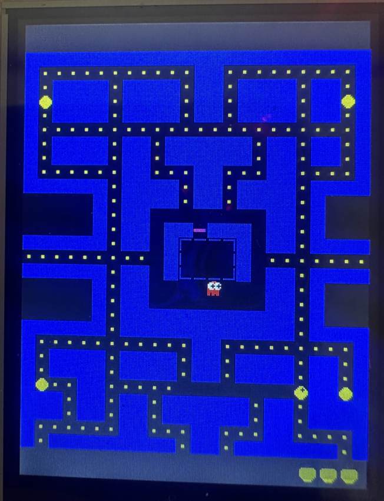
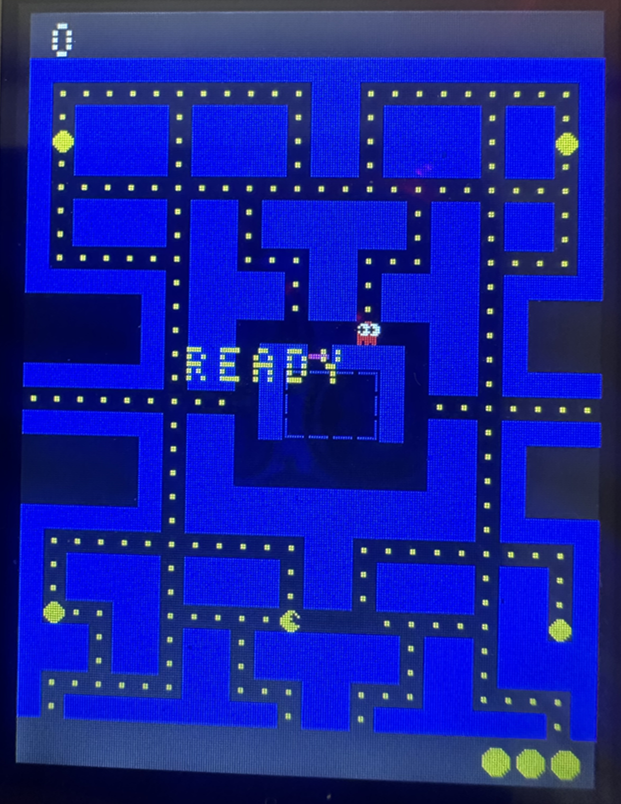

# PAC-MAN Game — STM32F103 + ILI9341 LCD (240x320)




## 개요

STM32F103 (Blue Pill / NUCLEO-F103RB) 에 8비트 병렬 인터페이스로 연결된 ILI9341 TFT LCD (240x320) 에서 동작하는 PAC-MAN 게임.

원래는 로봇 눈 표정 애니메이션(눈 깜빡임, 감정 표현)을 출력하던 프로젝트를 게임으로 전환.

## 하드웨어 구성

| 핀 | 포트 | 기능 |
|---|---|---|
| PA0 | GPIOA | LCD RD (Read) |
| PA1 | GPIOA | LCD WR (Write) |
| PA4 | GPIOA | LCD RS (Command/Data) |
| PB0 | GPIOB | LCD CS (Chip Select) |
| PC1 | GPIOC | LCD RST (Reset) |
| PA8 | GPIOA | LCD D7 (Data bit 7) |
| PA9 | GPIOA | LCD D0 (Data bit 0) |
| PA10 | GPIOA | LCD D2 (Data bit 2) |
| PB3 | GPIOB | LCD D3 (Data bit 3) |
| PB4 | GPIOB | LCD D5 (Data bit 5) |
| PB5 | GPIOB | LCD D4 (Data bit 4) |
| PB10 | GPIOB | LCD D6 (Data bit 6) |
| PC7 | GPIOC | LCD D1 (Data bit 1) |
| PC13 | GPIOC | Button B1 (USER button, Pull-Up) |

- LCD: ILI9341 240x320, 8비트 8080 병렬 인터페이스
- 클록: HSI 8MHz → PLL x16 → 64MHz SYSCLK

## 게임 구조

### 파일 구성

```
Core/
├── Inc/
│   ├── main.h          (변경 없음)
│   ├── Ili9341.h       (변경 없음)
│   └── packman.h       (신규) 게임 상수/타입/함수 선언
└── Src/
    ├── main.c          (수정) 게임 루프 + 버튼 입력
    ├── ili9341.c       (변경 없음)
    └── packman.c       (신규) 전체 게임 로직 및 고속 LCD 드로잉
```

### 게임 데이터

- **그리드**: 24열 × 28행, 셀 크기 10px
- **게임 영역**: (0, 20) ~ (239, 299) — 240×280px
- **HUD**: 상단 20px (점수), 하단 20px (목숨)
- **미로 데이터**: 정적 2차원 배열 (`static const int8_t maze[28][24]`), 실행 중에는 `maze_state`로 복사하여 변경
- **팩맨 시작 위치**: (11, 23) — 미로 하단 중앙, 왼쪽(DIR_L) 진행
- **터널**: row=14, col<0→23, col≥24→0 wrapping

### 미로 셀 타입

| 값 | 타입 | 설명 |
|---|---|---|
| 0 | CELL_EMPTY | 빈 통로 |
| 1 | CELL_WALL | 벽 (파란색) |
| 2 | CELL_DOT | 점 (노란색, 10점) |
| 3 | CELL_POWER | 파워 펠렛 (노란색 원, 50점) |
| 4 | CELL_GHOUSE | 유령의 집 내부 바닥 |
| 5 | CELL_GDOOR | 유령의 집 출입문 (분홍색) |

### 게임 객체

**Pacman (`Pacman_t`)**
- 위치 (col, row): 그리드 좌표
- 현재 방향, 다음 방향 (큐)
- 입 애니메이션 프레임

**Ghost (`Ghost_t`)**
- 4마리: Blinky(빨강), Pinky(분홍), Inky(청록), Clyde(주황)
- 모드: Chase / Scatter / Frightened / Eaten
- 집 안/밖 플래그
- 산란 목표 좌표 (모드별 타겟)

### 입력 처리

- **PC13 버튼** (Pull-Up, Active Low)
- **짧은 누름 ( < 500ms)**: 방향 순환 (없음 → 오른쪽 → 아래 → 왼쪽 → 위 → 반복)
- **게임 오버/승리 상태**: 버튼 누르면 재시작
- 디바운스: 200ms

### 게임 로직 (Packman_Tick)

매 틱(160ms) 마다 실행:

1. `move_pacman()` — 다음 방향 시도 → 현재 방향 이동 → 점/파워 먹기
2. `move_ghost()` — 유령 방향 선택 (타겟 기반) → 이동
3. `draw_pacman()` / `draw_ghost()` — 화면 갱신
4. `check_collisions()` — 팩맨/유령 충돌 검사
5. 파워 모드 타이머 체크 (6초)
6. `respawn_ghosts()` / `release_ghosts()` — 리스폰/출소
7. `check_win()` — 승리 조건 검사
8. `draw_hud()` — 점수/목숨 갱신

### 유령 AI

- 교차로에서 타겟까지의 유클리드 거리 제곱이 가장 작은 방향 선택
- 후진 불가 (단, Frightened 진입 시 강제 반전)
- Frightened 모드: 랜덤 방향 선택
- Eaten 모드: 움직이지 않음 → 2초 후 집으로 리스폰

### 고속 LCD 드로잉

GPIO 레지스터 (BSRR/BRR) 직접 접근 방식:

```c
GPIOA->BSRR = pa_set | (pa_clr << 16);
GPIOB->BSRR = pb_set | (pb_clr << 16);
GPIOC->BSRR = pc_set | (pc_clr << 16);
```

- FillRect: 8회 언롤링 루프로 고속 전송
- FillCircle: 수평선 스캔라인 방식
- 동일한 드로잉 코드가 `main.c` (LCD 초기화)와 `packman.c` (게임 렌더링)에 각각 static 으로 존재

## 빌드

STM32CubeIDE 에서 Debug/Release 구성:

1. 프로젝트 열기
2. `Core/Inc/packman.h` 및 `Core/Src/packman.c` 자동 인식 (sourceEntries 에 `Core` 포함)
3. 빌드 (Ctrl+B)

## 알려진 문제 / Todo

- [ ] 유령 출소 전 집 안 대기 애니메이션 (상하 움직임)
- [ ] 사운드 출력 (버저/PWM)
- [ ] 레벨 전환 (난이도 증가)
- [ ] 프레임 속도와 게임 로직 분리 (variable tick)
- [ ] 타이머 인터럽트 기반 Tick (현재는 main loop delay)

## 이력

- 2025-09-17: 프로젝트 생성 (CubeMX, ILI9341 초기화)
- 2025-xx: 로봇 눈 표정 애니메이션 구현
- 2026-06-22: PAC-MAN 게임으로 전환 (packman.h/c 추가, main.c 수정)
- 2026-06-22 (2차): 고스트 잔상 수정, 폰트 재설계, 팩맨 시작위치/방향 보정, 유령집 외곽선만 표시, READY 배경 복원

---

## Main Code

```c
#include "packman.h"
#include <string.h>
#include <stdlib.h>
```

```c
// ============================================================================
// Fast GPIO macros (register direct access)
// ============================================================================
#define LCD_CS_LOW()    GPIOB->BRR = GPIO_PIN_0
#define LCD_CS_HIGH()   GPIOB->BSRR = GPIO_PIN_0
#define LCD_RS_LOW()    GPIOA->BRR = GPIO_PIN_4
#define LCD_RS_HIGH()   GPIOA->BSRR = GPIO_PIN_4
#define LCD_WR_LOW()    GPIOA->BRR = GPIO_PIN_1
#define LCD_WR_HIGH()   GPIOA->BSRR = GPIO_PIN_1
#define LCD_RD_HIGH()   GPIOA->BSRR = GPIO_PIN_0
#define LCD_RST_LOW()   GPIOC->BRR = GPIO_PIN_1
#define LCD_RST_HIGH()  GPIOC->BSRR = GPIO_PIN_1
```

```c
static inline void LCD_Write8Fast(uint8_t data) {
    uint32_t pa_set = 0, pa_clr = 0;
    if(data & 0x01) pa_set |= GPIO_PIN_9;  else pa_clr |= GPIO_PIN_9;
    if(data & 0x04) pa_set |= GPIO_PIN_10; else pa_clr |= GPIO_PIN_10;
    if(data & 0x80) pa_set |= GPIO_PIN_8;  else pa_clr |= GPIO_PIN_8;

    uint32_t pb_set = 0, pb_clr = 0;
    if(data & 0x08) pb_set |= GPIO_PIN_3;  else pb_clr |= GPIO_PIN_3;
    if(data & 0x10) pb_set |= GPIO_PIN_5;  else pb_clr |= GPIO_PIN_5;
    if(data & 0x20) pb_set |= GPIO_PIN_4;  else pb_clr |= GPIO_PIN_4;
    if(data & 0x40) pb_set |= GPIO_PIN_10; else pb_clr |= GPIO_PIN_10;

    uint32_t pc_set = 0, pc_clr = 0;
    if(data & 0x02) pc_set |= GPIO_PIN_7;  else pc_clr |= GPIO_PIN_7;

    GPIOA->BSRR = pa_set | (pa_clr << 16);
    GPIOB->BSRR = pb_set | (pb_clr << 16);
    GPIOC->BSRR = pc_set | (pc_clr << 16);

    LCD_WR_LOW();
    __NOP();
    LCD_WR_HIGH();
}

static inline void LCD_Write16Fast(uint16_t color) {
    LCD_Write8Fast(color >> 8);
    LCD_Write8Fast(color & 0xFF);
}

static void LCD_WriteCommand(uint8_t cmd) {
    LCD_CS_LOW(); LCD_RS_LOW(); LCD_Write8Fast(cmd); LCD_CS_HIGH();
}

static void LCD_WriteData(uint8_t data) {
    LCD_CS_LOW(); LCD_RS_HIGH(); LCD_Write8Fast(data); LCD_CS_HIGH();
}

static void LCD_SetWindow(uint16_t x1, uint16_t y1, uint16_t x2, uint16_t y2) {
    LCD_WriteCommand(0x2A);
    LCD_CS_LOW(); LCD_RS_HIGH();
    LCD_Write8Fast(x1 >> 8); LCD_Write8Fast(x1 & 0xFF);
    LCD_Write8Fast(x2 >> 8); LCD_Write8Fast(x2 & 0xFF);
    LCD_CS_HIGH();
    LCD_WriteCommand(0x2B);
    LCD_CS_LOW(); LCD_RS_HIGH();
    LCD_Write8Fast(y1 >> 8); LCD_Write8Fast(y1 & 0xFF);
    LCD_Write8Fast(y2 >> 8); LCD_Write8Fast(y2 & 0xFF);
    LCD_CS_HIGH();
    LCD_WriteCommand(0x2C);
}

static void LCD_FillRectFast(uint16_t x, uint16_t y, uint16_t w, uint16_t h, uint16_t color) {
    if(x >= 240 || y >= 320 || w == 0 || h == 0) return;
    if(x + w > 240) w = 240 - x;
    if(y + h > 320) h = 320 - y;

    LCD_SetWindow(x, y, x + w - 1, y + h - 1);
    uint32_t total = (uint32_t)w * h;
    uint8_t hi = color >> 8;
    uint8_t lo = color & 0xFF;
    LCD_CS_LOW(); LCD_RS_HIGH();
    while(total >= 8) {
        LCD_Write8Fast(hi); LCD_Write8Fast(lo);
        LCD_Write8Fast(hi); LCD_Write8Fast(lo);
        LCD_Write8Fast(hi); LCD_Write8Fast(lo);
        LCD_Write8Fast(hi); LCD_Write8Fast(lo);
        LCD_Write8Fast(hi); LCD_Write8Fast(lo);
        LCD_Write8Fast(hi); LCD_Write8Fast(lo);
        LCD_Write8Fast(hi); LCD_Write8Fast(lo);
        LCD_Write8Fast(hi); LCD_Write8Fast(lo);
        total -= 8;
    }
    while(total--) { LCD_Write8Fast(hi); LCD_Write8Fast(lo); }
    LCD_CS_HIGH();
}

static void LCD_Fill(uint16_t color) {
    LCD_FillRectFast(0, 0, 240, 320, color);
}

// ============================================================================
// LCD Initialization
// ============================================================================
static void LCD_Init(void) {
    LCD_RD_HIGH();
    LCD_CS_HIGH();

    LCD_RST_LOW(); HAL_Delay(50);
    LCD_RST_HIGH(); HAL_Delay(50);

    LCD_WriteCommand(0x01); HAL_Delay(100);
    LCD_WriteCommand(0x11); HAL_Delay(120);

    LCD_WriteCommand(0xCF);
    LCD_WriteData(0x00); LCD_WriteData(0xC1); LCD_WriteData(0x30);
    LCD_WriteCommand(0xED);
    LCD_WriteData(0x64); LCD_WriteData(0x03); LCD_WriteData(0x12); LCD_WriteData(0x81);
    LCD_WriteCommand(0xE8);
    LCD_WriteData(0x85); LCD_WriteData(0x00); LCD_WriteData(0x78);
    LCD_WriteCommand(0xCB);
    LCD_WriteData(0x39); LCD_WriteData(0x2C); LCD_WriteData(0x00);
    LCD_WriteData(0x34); LCD_WriteData(0x02);
    LCD_WriteCommand(0xF7); LCD_WriteData(0x20);
    LCD_WriteCommand(0xEA); LCD_WriteData(0x00); LCD_WriteData(0x00);
    LCD_WriteCommand(0xC0); LCD_WriteData(0x23);
    LCD_WriteCommand(0xC1); LCD_WriteData(0x10);
    LCD_WriteCommand(0xC5); LCD_WriteData(0x3E); LCD_WriteData(0x28);
    LCD_WriteCommand(0xC7); LCD_WriteData(0x86);
    LCD_WriteCommand(0x36); LCD_WriteData(0x48);
    LCD_WriteCommand(0x3A); LCD_WriteData(0x55);
    LCD_WriteCommand(0xB1); LCD_WriteData(0x00); LCD_WriteData(0x18);
    LCD_WriteCommand(0xB6); LCD_WriteData(0x08); LCD_WriteData(0x82); LCD_WriteData(0x27);
    LCD_WriteCommand(0xF2); LCD_WriteData(0x00);
    LCD_WriteCommand(0x26); LCD_WriteData(0x01);
    LCD_WriteCommand(0xE0);
    LCD_WriteData(0x0F); LCD_WriteData(0x31); LCD_WriteData(0x2B); LCD_WriteData(0x0C);
    LCD_WriteData(0x0E); LCD_WriteData(0x08); LCD_WriteData(0x4E); LCD_WriteData(0xF1);
    LCD_WriteData(0x37); LCD_WriteData(0x07); LCD_WriteData(0x10); LCD_WriteData(0x03);
    LCD_WriteData(0x0E); LCD_WriteData(0x09); LCD_WriteData(0x00);
    LCD_WriteCommand(0xE1);
    LCD_WriteData(0x00); LCD_WriteData(0x0E); LCD_WriteData(0x14); LCD_WriteData(0x03);
    LCD_WriteData(0x11); LCD_WriteData(0x07); LCD_WriteData(0x31); LCD_WriteData(0xC1);
    LCD_WriteData(0x48); LCD_WriteData(0x08); LCD_WriteData(0x0F); LCD_WriteData(0x0C);
    LCD_WriteData(0x31); LCD_WriteData(0x36); LCD_WriteData(0x0F);

    LCD_WriteCommand(0x11); HAL_Delay(120);
    LCD_WriteCommand(0x29); HAL_Delay(50);
}
```

```c
// ============================================================================
// GPIO Initialization (LCD + Button)
// ============================================================================
static void MX_GPIO_Init(void) {
    GPIO_InitTypeDef GPIO_InitStruct = {0};

    __HAL_RCC_GPIOC_CLK_ENABLE();
    __HAL_RCC_GPIOD_CLK_ENABLE();
    __HAL_RCC_GPIOA_CLK_ENABLE();
    __HAL_RCC_GPIOB_CLK_ENABLE();

    // LCD control pins initial state
    HAL_GPIO_WritePin(GPIOC, GPIO_PIN_1, GPIO_PIN_RESET);
    HAL_GPIO_WritePin(GPIOA, GPIO_PIN_0|GPIO_PIN_1|GPIO_PIN_4, GPIO_PIN_SET);
    HAL_GPIO_WritePin(GPIOB, GPIO_PIN_0, GPIO_PIN_SET);

    GPIO_InitStruct.Mode = GPIO_MODE_OUTPUT_PP;
    GPIO_InitStruct.Pull = GPIO_NOPULL;
    GPIO_InitStruct.Speed = GPIO_SPEED_FREQ_HIGH;

    // LCD RST (PC1)
    GPIO_InitStruct.Pin = GPIO_PIN_1;
    HAL_GPIO_Init(GPIOC, &GPIO_InitStruct);

    // LCD Control (PA0, PA1, PA4) + Data (PA8, PA9, PA10)
    GPIO_InitStruct.Pin = GPIO_PIN_0|GPIO_PIN_1|GPIO_PIN_4|GPIO_PIN_8|GPIO_PIN_9|GPIO_PIN_10;
    HAL_GPIO_Init(GPIOA, &GPIO_InitStruct);

    // LCD CS (PB0) + Data (PB3, PB4, PB5, PB10)
    GPIO_InitStruct.Pin = GPIO_PIN_0|GPIO_PIN_3|GPIO_PIN_4|GPIO_PIN_5|GPIO_PIN_10;
    HAL_GPIO_Init(GPIOB, &GPIO_InitStruct);

    // LCD Data D1 (PC7)
    GPIO_InitStruct.Pin = GPIO_PIN_7;
    HAL_GPIO_Init(GPIOC, &GPIO_InitStruct);

    // Button B1 (PC13) - Input with pull-up
    GPIO_InitStruct.Pin = GPIO_PIN_13;
    GPIO_InitStruct.Mode = GPIO_MODE_INPUT;
    GPIO_InitStruct.Pull = GPIO_PULLUP;
    HAL_GPIO_Init(GPIOC, &GPIO_InitStruct);
}

// ============================================================================
// System Clock (64MHz via HSI + PLL)
// ============================================================================
void SystemClock_Config(void) {
    RCC_OscInitTypeDef RCC_OscInitStruct = {0};
    RCC_ClkInitTypeDef RCC_ClkInitStruct = {0};

    RCC_OscInitStruct.OscillatorType = RCC_OSCILLATORTYPE_HSI;
    RCC_OscInitStruct.HSIState = RCC_HSI_ON;
    RCC_OscInitStruct.HSICalibrationValue = RCC_HSICALIBRATION_DEFAULT;
    RCC_OscInitStruct.PLL.PLLState = RCC_PLL_ON;
    RCC_OscInitStruct.PLL.PLLSource = RCC_PLLSOURCE_HSI_DIV2;
    RCC_OscInitStruct.PLL.PLLMUL = RCC_PLL_MUL16;
    if (HAL_RCC_OscConfig(&RCC_OscInitStruct) != HAL_OK) Error_Handler();

    RCC_ClkInitStruct.ClockType = RCC_CLOCKTYPE_HCLK|RCC_CLOCKTYPE_SYSCLK
                                |RCC_CLOCKTYPE_PCLK1|RCC_CLOCKTYPE_PCLK2;
    RCC_ClkInitStruct.SYSCLKSource = RCC_SYSCLKSOURCE_PLLCLK;
    RCC_ClkInitStruct.AHBCLKDivider = RCC_SYSCLK_DIV1;
    RCC_ClkInitStruct.APB1CLKDivider = RCC_HCLK_DIV2;
    RCC_ClkInitStruct.APB2CLKDivider = RCC_HCLK_DIV1;

    if (HAL_RCC_ClockConfig(&RCC_ClkInitStruct, FLASH_LATENCY_2) != HAL_OK) Error_Handler();
}

// ============================================================================
// Button state tracking
// ============================================================================
static uint8_t btn_prev = 1;
static uint32_t btn_press_ms = 0;

static void handle_button(void) {
    uint8_t btn_now = HAL_GPIO_ReadPin(GPIOC, GPIO_PIN_13);

    if (btn_prev == 1 && btn_now == 0) {
        // Press detected
        btn_press_ms = HAL_GetTick();
    }

    if (btn_prev == 0 && btn_now == 1) {
        // Release detected
        uint32_t hold_ms = HAL_GetTick() - btn_press_ms;
        if (hold_ms < 500) {
            // Short press
            Packman_OnButton();
        }
    }

    // Long press handling (while held)
    if (btn_now == 0 && btn_prev == 0) {
        if (HAL_GetTick() - btn_press_ms > 500) {
            // Long press - could toggle pause, but simple: do nothing
            btn_press_ms = HAL_GetTick(); // reset to avoid repeat
        }
    }

    btn_prev = btn_now;
}
```

```c
// ============================================================================
// Main
// ============================================================================
int main(void) {
    HAL_Init();
    SystemClock_Config();
    MX_GPIO_Init();

    LCD_Init();
    LCD_Fill(0x0000);

    srand(HAL_GetTick());

    Packman_Init();

    while (1) {
        handle_button();

        uint32_t now = HAL_GetTick();
        static uint32_t last_tick = 0;
        if (now - last_tick >= TICK_MS) {
            Packman_Tick();
            last_tick = now;
        }

        HAL_Delay(10);
    }
}
```


