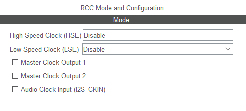
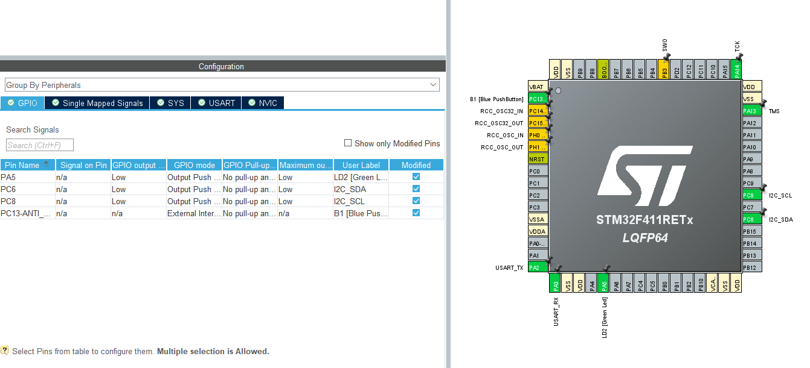
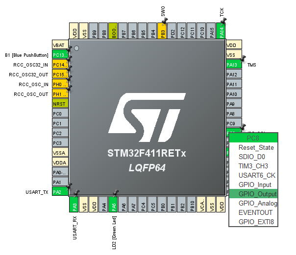
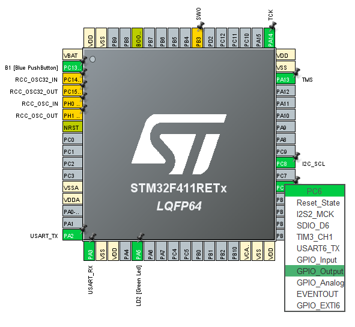

# MPU6050 - GPIO I2C

* GPIO 핀 설정
   * I2C_SDA → PC6 (GPIOC, Pin 6)
   * I2C_SCL → PC8 (GPIOC, Pin 8)

---









---

# Core/Inc/main.c

```c
/* USER CODE BEGIN Includes */
#include <stdio.h>
#include <string.h>
#include <math.h>
/* USER CODE END Includes */
```

```c
/* USER CODE BEGIN PD */
#define MPU6050_ADDR         0x68
#define MPU6050_WHO_AM_I     0x75
#define MPU6050_PWR_MGMT_1   0x6B
#define MPU6050_ACCEL_XOUT_H 0x3B
#define MPU6050_GYRO_XOUT_H  0x43
#define MPU6050_TEMP_OUT_H   0x41
#define ACCEL_SCALE          16384.0f
#define GYRO_SCALE           131.0f
#define GYRO_CALIB_SAMPLES   64
/* USER CODE END PD */
```

```c
/* USER CODE BEGIN PV */
static uint8_t mpu6050_rx_buf[14];
static char uart_tx_buf[128];
static volatile int16_t gyro_bias_x, gyro_bias_y, gyro_bias_z;
/* USER CODE END PV */
```

```c
/* USER CODE BEGIN PFP */
static void I2C_InitPins(void);
static void I2C_Start(void);
static void I2C_Stop(void);
static uint8_t I2C_WriteByte(uint8_t data);
static uint8_t I2C_ReadByte(uint8_t ack);
static uint8_t I2C_IsDeviceReady(uint8_t addr);
static uint8_t I2C_Mem_Write(uint8_t dev_addr, uint8_t mem_addr, uint8_t *data, uint16_t len);
static uint8_t I2C_Mem_Read(uint8_t dev_addr, uint8_t mem_addr, uint8_t *data, uint16_t len);
static void I2C_Scan(void);
static uint8_t MPU6050_Init(void);
static void MPU6050_CalibrateGyro(void);
static void MPU6050_ReadData(void);
/* USER CODE END PFP */
```

```c
/* USER CODE BEGIN 0 */

/******************************************************************************
 * Software I2C (Bit-bang) implementation
 * I2C_SDA: PC6, I2C_SCL: PC8
 ******************************************************************************/

#define I2C_SDA_LOW()   HAL_GPIO_WritePin(I2C_SDA_GPIO_Port, I2C_SDA_Pin, GPIO_PIN_RESET)
#define I2C_SDA_HIGH()  HAL_GPIO_WritePin(I2C_SDA_GPIO_Port, I2C_SDA_Pin, GPIO_PIN_SET)
#define I2C_SCL_LOW()   HAL_GPIO_WritePin(I2C_SCL_GPIO_Port, I2C_SCL_Pin, GPIO_PIN_RESET)
#define I2C_SCL_HIGH()  HAL_GPIO_WritePin(I2C_SCL_GPIO_Port, I2C_SCL_Pin, GPIO_PIN_SET)
#define I2C_SDA_READ()  HAL_GPIO_ReadPin(I2C_SDA_GPIO_Port, I2C_SDA_Pin)

static void I2C_Delay(void)
{
  for (volatile uint32_t i = 0; i < 100; i++);
}

static void I2C_InitPins(void)
{
  GPIO_InitTypeDef GPIO_InitStruct = {0};

  __HAL_RCC_GPIOC_CLK_ENABLE();

  GPIO_InitStruct.Pin = I2C_SCL_Pin | I2C_SDA_Pin;
  GPIO_InitStruct.Mode = GPIO_MODE_OUTPUT_OD;
  GPIO_InitStruct.Pull = GPIO_PULLUP;
  GPIO_InitStruct.Speed = GPIO_SPEED_FREQ_HIGH;
  HAL_GPIO_Init(I2C_SCL_GPIO_Port, &GPIO_InitStruct);

  I2C_SDA_HIGH();
  I2C_SCL_HIGH();
}

static void I2C_Start(void)
{
  I2C_SDA_HIGH();
  I2C_SCL_HIGH();
  I2C_Delay();
  I2C_SDA_LOW();
  I2C_Delay();
  I2C_SCL_LOW();
  I2C_Delay();
}

static void I2C_Stop(void)
{
  I2C_SDA_LOW();
  I2C_Delay();
  I2C_SCL_HIGH();
  I2C_Delay();
  I2C_SDA_HIGH();
  I2C_Delay();
}

static uint8_t I2C_WriteByte(uint8_t data)
{
  for (uint32_t i = 0; i < 8; i++)
  {
    if (data & 0x80)
      I2C_SDA_HIGH();
    else
      I2C_SDA_LOW();
    data <<= 1;
    I2C_Delay();
    I2C_SCL_HIGH();
    I2C_Delay();
    I2C_SCL_LOW();
    I2C_Delay();
  }
  I2C_SDA_HIGH();
  I2C_Delay();
  I2C_SCL_HIGH();
  I2C_Delay();
  uint8_t ack = I2C_SDA_READ();
  I2C_SCL_LOW();
  I2C_Delay();
  return ack;
}

static uint8_t I2C_ReadByte(uint8_t ack)
{
  uint8_t data = 0;
  I2C_SDA_HIGH();
  for (uint32_t i = 0; i < 8; i++)
  {
    data <<= 1;
    I2C_SCL_HIGH();
    I2C_Delay();
    if (I2C_SDA_READ())
      data |= 1;
    I2C_SCL_LOW();
    I2C_Delay();
  }
  if (ack)
    I2C_SDA_HIGH();
  else
    I2C_SDA_LOW();
  I2C_Delay();
  I2C_SCL_HIGH();
  I2C_Delay();
  I2C_SCL_LOW();
  I2C_Delay();
  return data;
}

static uint8_t I2C_IsDeviceReady(uint8_t addr)
{
  I2C_Start();
  uint8_t ack = I2C_WriteByte(addr << 1);
  I2C_Stop();
  return ack;
}

static uint8_t I2C_Mem_Write(uint8_t dev_addr, uint8_t mem_addr, uint8_t *data, uint16_t len)
{
  I2C_Start();
  if (I2C_WriteByte(dev_addr << 1))
  {
    I2C_Stop();
    return 1;
  }
  if (I2C_WriteByte(mem_addr))
  {
    I2C_Stop();
    return 1;
  }
  for (uint16_t i = 0; i < len; i++)
  {
    if (I2C_WriteByte(data[i]))
    {
      I2C_Stop();
      return 1;
    }
  }
  I2C_Stop();
  return 0;
}

static uint8_t I2C_Mem_Read(uint8_t dev_addr, uint8_t mem_addr, uint8_t *data, uint16_t len)
{
  I2C_Start();
  if (I2C_WriteByte(dev_addr << 1))
  {
    I2C_Stop();
    return 1;
  }
  if (I2C_WriteByte(mem_addr))
  {
    I2C_Stop();
    return 1;
  }
  I2C_Start();
  if (I2C_WriteByte((dev_addr << 1) | 1))
  {
    I2C_Stop();
    return 1;
  }
  for (uint16_t i = 0; i < len; i++)
  {
    data[i] = I2C_ReadByte(i >= len - 1);
  }
  I2C_Stop();
  return 0;
}

static void I2C_Scan(void)
{
  uint8_t i;
  uint8_t found = 0;

  sprintf(uart_tx_buf, "\r\nI2C Scanning...\r\n");
  HAL_UART_Transmit(&huart2, (uint8_t*)uart_tx_buf, strlen(uart_tx_buf), 100);

  for (i = 1; i < 127; i++)
  {
    if (I2C_IsDeviceReady(i) == 0)
    {
      sprintf(uart_tx_buf, "I2C device found at 0x%02X\r\n", i);
      HAL_UART_Transmit(&huart2, (uint8_t*)uart_tx_buf, strlen(uart_tx_buf), 100);
      found++;
    }
  }

  if (found == 0)
  {
    sprintf(uart_tx_buf, "No I2C devices found!\r\n");
    HAL_UART_Transmit(&huart2, (uint8_t*)uart_tx_buf, strlen(uart_tx_buf), 100);
  }
  else
  {
    sprintf(uart_tx_buf, "Found %d device(s)\r\n", found);
    HAL_UART_Transmit(&huart2, (uint8_t*)uart_tx_buf, strlen(uart_tx_buf), 100);
  }
}

static uint8_t MPU6050_Init(void)
{
  uint8_t whoami;
  uint8_t pwr;

  HAL_Delay(100);

  if (I2C_Mem_Read(MPU6050_ADDR, MPU6050_WHO_AM_I, &whoami, 1))
  {
    sprintf(uart_tx_buf, "WHO_AM_I read failed!\r\n");
    HAL_UART_Transmit(&huart2, (uint8_t*)uart_tx_buf, strlen(uart_tx_buf), 100);
    return 1;
  }

  sprintf(uart_tx_buf, "WHO_AM_I = 0x%02X\r\n", whoami);
  HAL_UART_Transmit(&huart2, (uint8_t*)uart_tx_buf, strlen(uart_tx_buf), 100);

  if (whoami != 0x68 && whoami != 0x98)
  {
    sprintf(uart_tx_buf, "Unknown device! (WHO_AM_I = 0x%02X)\r\n", whoami);
    HAL_UART_Transmit(&huart2, (uint8_t*)uart_tx_buf, strlen(uart_tx_buf), 100);
    return 1;
  }

  pwr = 0x00;
  if (I2C_Mem_Write(MPU6050_ADDR, MPU6050_PWR_MGMT_1, &pwr, 1))
  {
    sprintf(uart_tx_buf, "PWR_MGMT_1 write failed!\r\n");
    HAL_UART_Transmit(&huart2, (uint8_t*)uart_tx_buf, strlen(uart_tx_buf), 100);
    return 1;
  }

  HAL_Delay(100);

  sprintf(uart_tx_buf, "MPU6050 initialized\r\n");
  HAL_UART_Transmit(&huart2, (uint8_t*)uart_tx_buf, strlen(uart_tx_buf), 100);

  return 0;
}

static void MPU6050_CalibrateGyro(void)
{
  int32_t sum_x = 0, sum_y = 0, sum_z = 0;
  uint8_t i;

  sprintf(uart_tx_buf, "Gyro calibrating... keep sensor still\r\n");
  HAL_UART_Transmit(&huart2, (uint8_t*)uart_tx_buf, strlen(uart_tx_buf), 100);

  for (i = 0; i < GYRO_CALIB_SAMPLES; i++)
  {
    if (I2C_Mem_Read(MPU6050_ADDR, MPU6050_GYRO_XOUT_H, mpu6050_rx_buf, 6) == 0)
    {
      sum_x += (int16_t)((mpu6050_rx_buf[0] << 8) | mpu6050_rx_buf[1]);
      sum_y += (int16_t)((mpu6050_rx_buf[2] << 8) | mpu6050_rx_buf[3]);
      sum_z += (int16_t)((mpu6050_rx_buf[4] << 8) | mpu6050_rx_buf[5]);
    }
    HAL_Delay(5);
  }

  gyro_bias_x = (int16_t)(sum_x / GYRO_CALIB_SAMPLES);
  gyro_bias_y = (int16_t)(sum_y / GYRO_CALIB_SAMPLES);
  gyro_bias_z = (int16_t)(sum_z / GYRO_CALIB_SAMPLES);

  sprintf(uart_tx_buf, "Gyro bias: %4d %4d %4d\r\n", gyro_bias_x, gyro_bias_y, gyro_bias_z);
  HAL_UART_Transmit(&huart2, (uint8_t*)uart_tx_buf, strlen(uart_tx_buf), 100);
}

static void MPU6050_ReadData(void)
{
  int16_t accel_x, accel_y, accel_z;
  int16_t gyro_x, gyro_y, gyro_z;
  int16_t temp_raw;
  int16_t temp_int, temp_whole, temp_frac;
  float ax, ay, az;
  int16_t roll, pitch;

  if (I2C_Mem_Read(MPU6050_ADDR, MPU6050_ACCEL_XOUT_H, mpu6050_rx_buf, 14))
  {
    sprintf(uart_tx_buf, "I2C read failed!\r\n");
    HAL_UART_Transmit(&huart2, (uint8_t*)uart_tx_buf, strlen(uart_tx_buf), 100);
    return;
  }

  accel_x = (int16_t)((mpu6050_rx_buf[0] << 8) | mpu6050_rx_buf[1]);
  accel_y = (int16_t)((mpu6050_rx_buf[2] << 8) | mpu6050_rx_buf[3]);
  accel_z = (int16_t)((mpu6050_rx_buf[4] << 8) | mpu6050_rx_buf[5]);
  temp_raw = (int16_t)((mpu6050_rx_buf[6] << 8) | mpu6050_rx_buf[7]);
  gyro_x  = (int16_t)((mpu6050_rx_buf[8] << 8) | mpu6050_rx_buf[9]) - gyro_bias_x;
  gyro_y  = (int16_t)((mpu6050_rx_buf[10] << 8) | mpu6050_rx_buf[11]) - gyro_bias_y;
  gyro_z  = (int16_t)((mpu6050_rx_buf[12] << 8) | mpu6050_rx_buf[13]) - gyro_bias_z;

  ax = (float)accel_x / ACCEL_SCALE;
  ay = (float)accel_y / ACCEL_SCALE;
  az = (float)accel_z / ACCEL_SCALE;

  roll  = (int16_t)(atan2f(-ay, az) * 57.29578f);
  pitch = (int16_t)(atan2f(ax, sqrtf(ay*ay + az*az)) * 57.29578f);

  temp_int = (int16_t)(((int32_t)temp_raw * 100 / 340) + 3653);
  temp_whole = temp_int / 100;
  temp_frac = temp_int % 100;
  if (temp_frac < 0) temp_frac = -temp_frac;

  sprintf(uart_tx_buf, "ACC: %6d %6d %6d  GYRO: %6d %6d %6d  RPY: %4d %4d %4d  TEMP: %d.%02d C\r\n",
          accel_x, accel_y, accel_z, gyro_x, gyro_y, gyro_z,
          roll, pitch, 0,
          temp_whole, temp_frac);
  HAL_UART_Transmit(&huart2, (uint8_t*)uart_tx_buf, strlen(uart_tx_buf), 100);
}
/* USER CODE END 0 */
```

```c

  I2C_InitPins();
  HAL_Delay(500);

  I2C_Scan();

  ret = MPU6050_Init();
  if (ret != 0)
  {
    sprintf(uart_tx_buf, "MPU6050 init failed. Check wiring!\r\n");
    HAL_UART_Transmit(&huart2, (uint8_t*)uart_tx_buf, strlen(uart_tx_buf), 100);
    while (1);
  }

  MPU6050_CalibrateGyro();

  HAL_Delay(200);
  /* USER CODE END 2 */

```

```c
  /* Infinite loop */
  /* USER CODE BEGIN WHILE */
  while (1)
  {
    MPU6050_ReadData();
    HAL_Delay(500);
    /* USER CODE END WHILE */
```

---
# log data

```

I2C Scanning...
I2C device found at 0x68
Found 1 device(s)
WHO_AM_I = 0x98
MPU6050 initialized
Gyro calibrating... keep sensor still
Gyro bias: -106  320  -17
ACC:  -3488 -10644  12580  GYRO:     -6     71    -23  RPY:   40  -11    0  TEMP: 41.75 C
ACC:  -3468 -10660  12456  GYRO:     -9    -51     14  RPY:   40  -11    0  TEMP: 41.98 C
ACC:  -3496 -10604  12560  GYRO:    -12     -6     -4  RPY:   40  -12    0  TEMP: 41.61 C
ACC:  -3544 -10692  12572  GYRO:     -7     21     38  RPY:   40  -12    0  TEMP: 41.61 C
ACC:  -3492 -10700  12540  GYRO:     -4    -62     32  RPY:   40  -11    0  TEMP: 41.80 C
ACC:  -3492 -10640  12576  GYRO:      3    129     16  RPY:   40  -11    0  TEMP: 41.89 C
ACC:  -3512 -10668  12500  GYRO:    -11    -17     33  RPY:   40  -12    0  TEMP: 41.47 C
ACC:  -3528 -10636  12564  GYRO:     -2    146     11  RPY:   40  -12    0  TEMP: 41.94 C
ACC:  -3508 -10644  12568  GYRO:     -6    -62    -17  RPY:   40  -12    0  TEMP: 41.94 C
ACC:  -3476 -10632  12496  GYRO:    -17     29     23  RPY:   40  -11    0  TEMP: 41.75 C
ACC:  -3424 -10632  12588  GYRO:     13    -33     13  RPY:   40  -11    0  TEMP: 42.13 C
ACC:  -3536 -10612  12524  GYRO:     11     23     38  RPY:   40  -12    0  TEMP: 42.08 C
ACC:  -3488 -10636  12556  GYRO:     -1     25     20  RPY:   40  -11    0  TEMP: 41.75 C
ACC:  -3500 -10752  12568  GYRO:      1    103     16  RPY:   40  -11    0  TEMP: 41.89 C
```


