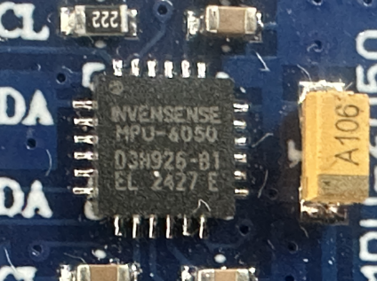
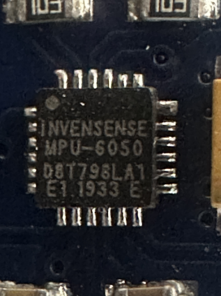

# Troubleshooting: MPU6050 모듈 동작 불량

 

## 1. 증상

MPU6050(GY-521) 모듈을 STM32F411(NUCLEO-F411RE)에 연결했을 때 모듈별로 다른 증상 발생:

| 증상 | 원인 | 비고 |
|------|------|------|
| I2C 스캔 성공, WHO_AM_I = **0x70** | MPU6500 호환칩 | 코드에서 0x70 미허용 → init 실패 |
| I2C 스캔 성공, WHO_AM_I = **0x98**, 초기 동작 후 `I2C read failed!` 연속 | I2C 버스 Lock, 타이밍 불안정 | 소프트웨어 개선으로 해결 |
| I2C 스캔 실패 (No I2C devices found!) | 배선 불량, 전원 문제, 모듈 불량 | 하드웨어 점검 필요 |

---

## 2. 근본 원인

### 2.1 WHO_AM_I = 0x70 (MPU6500 호환칩)

- **INVENSENSE MPU-6050** 마킹이지만 실제로는 **MPU6500 계열** 호환칩이 탑재된 모듈이 있음
- MPU6050: WHO_AM_I = 0x68 (AD0=GND) 또는 0x98 (일부 리비전)
- **MPU6500: WHO_AM_I = 0x70**
- 레지스터 맵은 대부분 호환되므로 가속도/자이로 읽기에 문제 없음
- 기존 코드가 0x70을 `Unknown device`로 처리하여 init 실패

### 2.2 I2C 소프트웨어 비트뱅 안정성

PC6(SDA), PC8(SCL)을 GPIO로 소프트웨어 I2C 구현 시 다음 문제 발생:

#### 1) SDA 릴리즈 후 딜레이 부족
- ACK 전송 후 SDA를 HIGH로 릴리즈한 직후 SCL을 상승시키면, SDA가 HIGH로 안정되기 전에 첫 번째 비트를 읽음
- 특히 10kΩ 풀업에서 버스 커패시턴스가 있을 경우 SDA 상승 시간이 부족
- → 데이터 비트 오류, 잘못된 레지스터 값 읽힘

#### 2) I2C 버스 Lock (Slave가 SDA를 LOW로 유지)
- 통신 중 에러가 발생하면 MPU6050이 SDA를 LOW로 잡고 있는 상태(Bus Lock)가 됨
- 이후 모든 I2C 통신이 실패 (`I2C read failed!` 연속)
- 기존 코드는 에러 발생 후 버스 복구 없이 계속 통신 시도 → 악순환

#### 3) GPIO 초기화 순서
- STM32CubeMX 생성 코드(MX_GPIO_Init)가 I2C 핀(PC6/PC8)을 **Push-Pull + LOW**로 설정
- 이후 I2C_InitPins에서 **Open-Drain + HIGH**로 재설정하지만, 순간적으로 LOW가 출력되는 글리치 발생 가능

#### 4) I2C 타이밍 마진 부족
- I2C_Delay 루프 카운트 100은 컴파일러 최적화에 따라 실제 시간이 변동
- 일부 모듈/환경에서 SCL 주파수가 너무 빨라 통신 불안정

---

## 3. 수정 사항

| # | 수정 내용 | 파일 위치 | 설명 |
|---|----------|-----------|------|
| 1 | **WHO_AM_I 허용값에 0x70 추가** | `main.c:326` | MPU6500 호환칩 감지 및 허용 |
| 2 | **I2C_Delay 100→250 증가** | `main.c:97` | SCL 주파수 여유 확보 (~70kHz→~28kHz) |
| 3 | **I2C_ReadByte: SDA 릴리즈 후 딜레이 추가** | `main.c:185` | SDA가 HIGH 안정된 후 SCL 상승 |
| 4 | **I2C_ResetBus() 함수 추가** | `main.c:116-133` | SCL 9회 토글 + START/STOP으로 버스 복구 |
| 5 | **I2C_InitPins: OD 전환 전 HIGH 먼저 설정** | `main.c:106-107` | MX_GPIO_Init의 PP+LOW 글리치 방지 |
| 6 | **MPU6050_Init: Device Reset 추가** | `main.c:303-304` | PWR_MGMT_1에 0x80写入 후 100ms 대기 → 레지스터 초기화 |
| 7 | **PWR_MGMT_1: CLKSEL=0x01 (Gyro PLL)** | `main.c:339` | 내부 발진기 대신 Gyro PLL로 클럭 안정화 |
| 8 | **에러 발생 시 I2C_ResetBus() 호출** | `main.c:313,369,403` | WHO_AM_I/보정/읽기 실패 시 자동 버스 복구 및 재시도 |

---

## 4. 하드웨어 확인 사항

| 항목 | 확인 방법 | 기준 |
|------|-----------|------|
| **풀업 저항** | SCL-3.3V, SDA-3.3V 저항 측정 (전원 OFF) | 4.7kΩ ~ 10kΩ |
| **전원 전압** | VCC-GND 멀티미터 측정 | 3.3V ±0.1V |
| **AD0 연결** | AD0-GND 저항 측정 | 0Ω (Short) |
| **배선 길이** | 점퍼선 길이 | I2C는 40cm 이내 권장 |
| **브레드보드** | 접촉 불량 확인 | 압력/재장착 |

---

## 5. 부품 식별

실제 마킹 비교:

| 마킹 | WHO_AM_I | 동작 | 비고 |
|------|----------|------|------|
| INVENSENSE MPU-6050 03H926-B1 EL 2427 E | 0x98 | 정상 | 정품 MPU6050 |
| INVENSENSE MPU-6050 D8T798LA1 E1 1933 E | **0x70** | 초기 실패 | MPU6500 호환칩 추정 |

두 부품의 폰드(Die/패키지 버전)가 다르며, 후자는 MPU6050이 아닌 **호환칩(MPU6500)** 이 탑재된 것으로 보임.

---

## 6. 참고: MPU6050 vs MPU6500

| 항목 | MPU6050 | MPU6500 |
|------|---------|---------|
| WHO_AM_I | 0x68 / 0x98 | **0x70** |
| I2C 주소 | 0x68 (AD0=GND) | 0x68 (AD0=GND) |
| 레지스터 맵 | - | 대부분 호환 |
| FIFO 크기 | 1024 bytes | 512 bytes |
| 소비전류 | 3.8mA | 3.4mA |
| 패키지 | QFN-24 | QFN-24 (호환) |

> 기본적인 가속도/자이로/온도 읽기에는 두 칩 간 차이가 없으므로, WHO_AM_I만 0x70을 허용하면 MPU6500도 정상 동작합니다.
