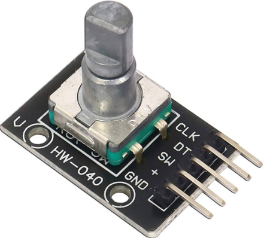

# Rotary_Encoder



## NUCLEO-F103RB 기준 하드웨어 구성:
   * Encoder A Phase (CH1): PA6 (TIM3_CH1) ← D12
   * Encoder B Phase (CH2): PA7 (TIM3_CH2) ← D11
   * USART2 (디버그 출력): PA2(TX), PA3(RX) — 115200 baud
   * B1 버튼: PC13 — Encoder count 리셋
   * LD2: PA5 — 동작 표시 LED

## 📁 프로젝트 구조
```
C:\work\stm32_rotary_encoder\
└── Core\
    ├── Inc\main.h
    └── Src\main.c
```

## 🔌 하드웨어 연결 (NUCLEO-F103RB)

| 신호	| 핀 | 	TIM3 매핑	|  보드 커넥터 | 
|:------:|:------:|:------:|:------:|
| Encoder Phase A |	PA6	| TIM3_CH1	| D12 |
| Encoder Phase B |	PA7	| TIM3_CH2	| D11 |
| USART2 TX	| PA2	| - |	- |
| USART2 RX	| PA3	| - |	- |
| B1 (Reset)	| PC13 |	-	| User Button |
| LD2 (LED)	| PA5	| -	 | Built-in LED |

## ⚙️ TIM3 Encoder Mode 동작 원리
   * 타이머를 Encoder Mode TI1+TI2 (SMS=011) 로 설정하여 하드웨어적으로 로터리 엔코더의 위상차를 감지합니다:
```
PA6 (TI1)  ──┬──┬──┬──┬──    ↑    ↑         ↑    ↑
             │  │  │  │      TI1  TI2       TI1  TI2
PA7 (TI2)  ──┬──┬──┬──┬──    rising rising   rising  rising
             │  │  │  │      + low  + low    + high  + high
         CW: └──┘──┘──┘──▶  COUNT UP        COUNT DOWN
         CCW: ◀──┘──┘──┘──  COUNT DOWN       COUNT UP
```
   * 4배 분해능: A/B 두 신호의 모든 엣지에서 카운트 (기계식 24PPR → 96 counts/회전)
   * 자동 방향 감지: TIM3->CR1 레지스터의 DIR 비트가 하드웨어에서 자동 갱신
   * 오버플로우 자연 처리: int16_t 차분 연산으로 16-bit 타이머 랩어라운드에 강건

## 🧠 주요 코드 설명
1. 타이머 초기화 (MX_TIM3_Encoder_Init)
   * 레지스터 직접 설정 방식으로 HAL 의존성 없이 동작:
```
TIM3->SMCR = (0x03 << 0);       // Encoder Mode 3 (TI1+TI2)
TIM3->CCMR1 = (0x01 << 0) |     // CC1S=01: TI1 selected
              (0x01 << 8);       // CC2S=01: TI2 selected
TIM3->PSC = 0;                   // 프리스케일러 없음 (최대 해상도)
TIM3->ARR = 0xFFFF;              // 16-bit 풀 레인지
```
2. 위치 추적 (PrintEncoderStatus)
   * 16-bit 타이머 카운터의 차분을 누적하여 32-bit 위치 값으로 확장:
```
int16_t diff = (int16_t)(TIM3->CNT) - g_last_count;
g_encoder_pos += diff;           // 오버플로우에 강건한 누적
```

3. 버튼 리셋 (HAL_GPIO_EXTI_Callback)
   * B1 버튼(PC13) Rising Edge 인터럽트 → 메인루프에서 카운터 리셋 + LED 3번 점멸
```
📟 USART 출력 예시
========================================
  Rotary Encoder Demo (TIM3 Encoder Mode)
========================================
  POS: position  CNT: timer  DIR: direction
----------------------------------------
POS:     +0  CNT:     0  DIR: CW (+)
POS:    +12  CNT:    12  DIR: CW (+)
POS:    +24  CNT:    24  DIR: CW (+)
POS:    +22  CNT:    22  DIR: CCW (-)
>>> ENCODER RESET (B1 pressed) <<<
POS:     +0  CNT:     0  DIR: CW (+)
```


