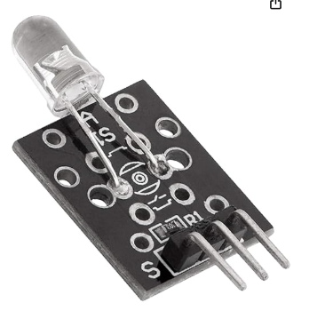
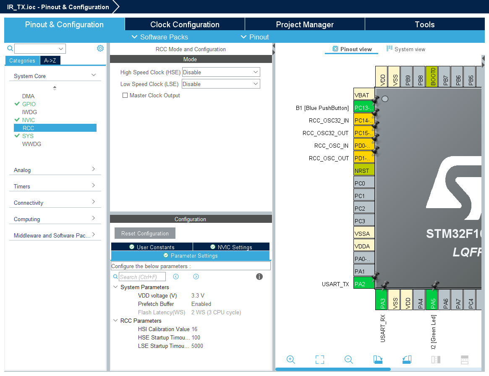
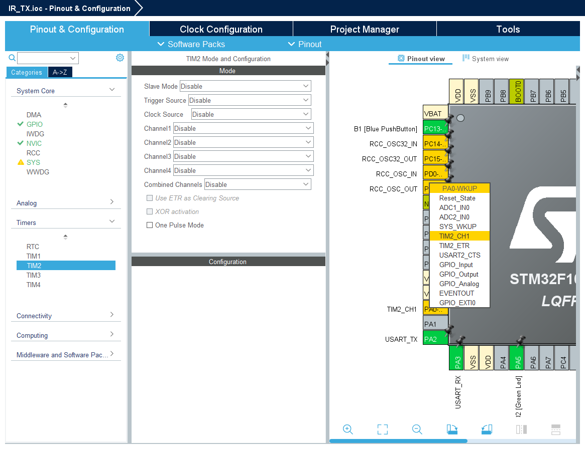
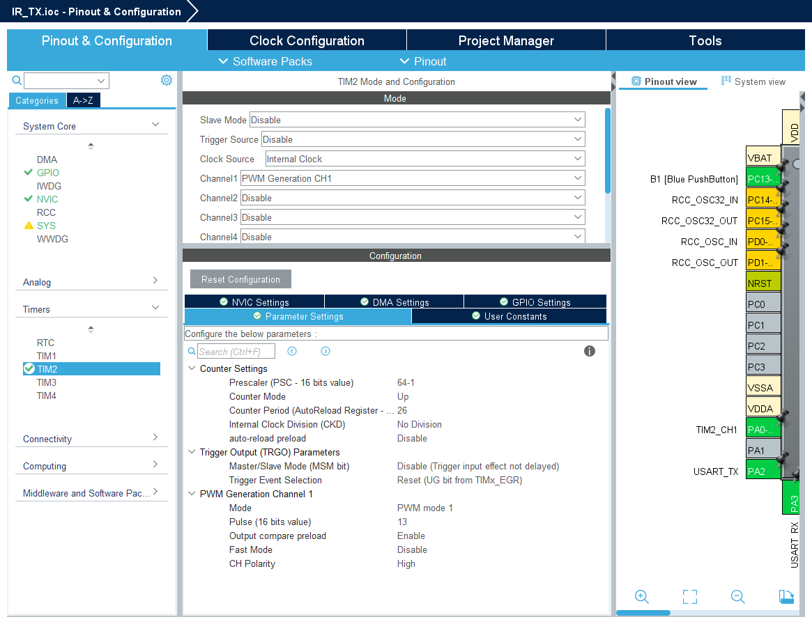
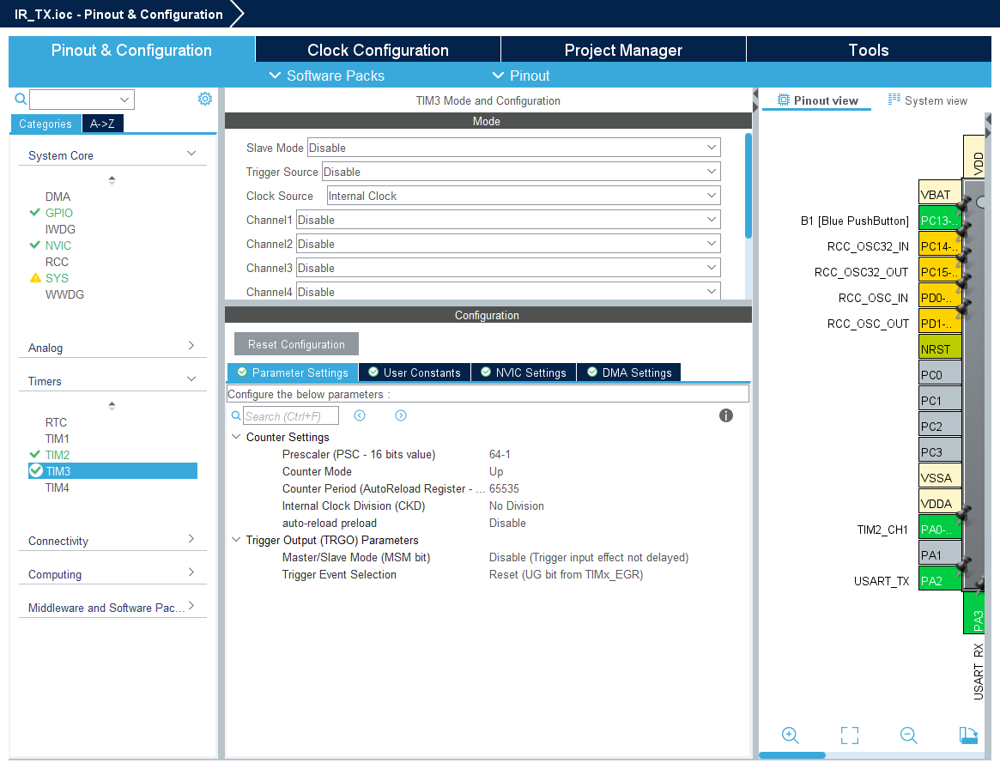

# IR Transmitter Module KY-005

   * KY-005는 Keyes 37-in-1 Arduino 키트(HW-489로도 판매)에 포함된 적외선(IR) 송신기 모듈입니다.
   * 핵심 부품은 단일 940nm IR LED로, IRremote 라이브러리와 함께 사용하면 <br>
     Arduino가 TV나 에어컨 리모컨과 동일한 38kHz 리모컨 신호를 송신할 수 있습니다.
   * 이 매뉴얼은 핀 배치, 배선도, 최신 IRremote 코드, KY-005 + KY-022 기록 및 재생 프로젝트, <br>
     문제 해결, Fritzing 부품 다운로드를 다룹니다.

   * Arduino, ESP32, ESP8266, Raspberry Pi, Pi Pico(3.3V 또는 5V 로직)와 함께 사용할 수 있습니다.
   * KY-022 IR 수신기와 함께 사용하면 실제 리모컨 코드를 캡처하고 재생할 수 있습니다.

---

## KY-005 사양



   * 이 모듈은 매우 간단하며, 5mm 적외선 LED와 3개의 수핀 헤더 핀으로 구성되어 있습니다.
   * 주의하여 다루십시오. IR 빛을 눈에 직접 비추지 마십시오.

| 파라미터 | 값 |
|---|---|
| 다른 이름 | HW-489 |
| 동작 전압 | 3.3 – 5 V |
| IR LED 파장 | 940 nm |
| 반송파 주파수 | 38 kHz |
| 순방향 전류 | 30 – 60 mA |
| 소비 전력 | 90 mW |
| 동작 온도 | −10°C ~ +50°C |
| 크기 | 18.5 × 15 mm |

---

## KY-005 핀 배치 (HW-489)

   * KY-005에는 2.54mm 간격의 헤더 핀 3개가 있습니다.
   * 신호 핀은 **S**로 표시되어 있습니다. 표시 없는 중간 핀이 **VCC**이고, **–** 핀이 접지(GND)입니다.

| 핀 | 라벨 | 기능 | 연결 대상 |
|---|---|---|---|
| 1 | S | 신호 — IR 반송파 출력 | IRremote 송신 핀 (Uno의 경우 핀 3) |
| 2 | 중간 (라벨 없음) | VCC | +5V (ESP32/Pi의 경우 +3.3V) |
| 3 | – | 접지 (GND) | GND |

   * **참고:** KY-005는 기본적으로 브레이크아웃 기판에 납땜된 IR LED일 뿐이며, 드라이버 트랜지스터가 내장되어 있지 않습니다.
   * 이는 통신 거리에 영향을 미칩니다(아래 '거리 및 IR LED 드라이버' 섹션 참조).

---

## KY-005 배선도

   * 보드의 전원 핀(중간)과 접지 핀(-)을 각각 Arduino의 +5V와 GND에 연결합니다.

   * 신호 핀(S)을 Arduino Uno의 핀 3에 연결합니다.

   * IR 송신기의 핀 번호는 IRremote 라이브러리에 의해 결정됩니다. 다른 플랫폼은 다른 핀을 사용할 수 있습니다.

| KY-005 | Arduino Uno |
|---|---|
| S | 핀 3 |
| 중간 | +5V |
| – | GND |

---

## KY-005 Arduino 코드 (IRremote)

   * 이 섹션은 **IRremote v4.x**를 사용합니다 (`#include <IRremote.hpp>`). 이전 버전이 설치되어 있다면 Arduino Library Manager를 통해 업데이트하십시오.
   * IRremote는 Sony, NEC, RC5, Samsung 등 다양한 프로토콜을 즉시 지원합니다.

### IR 코드 송신하기

   * IRremote 라이브러리가 프로토콜 인코딩을 처리합니다.
   * 사용자는 함수 이름과 코드 값만 제공하면 됩니다.
   * 아래 예제는 Sony TV 전원 코드를 송신합니다. 필요에 따라 `sendSony`를 `sendNEC`, `sendRC5`, `sendSamsung` 등으로 바꾸십시오.
   * 장치의 주소와 명령 값은 LIRC와 같은 IR 데이터베이스에서 확인하거나 KY-022 IR 수신기로 캡처하십시오.

```cpp
#include <IRremote.hpp>   // IRremote v4.x

#define IR_SEND_PIN 3     // KY-005 신호 핀 (S)

void setup() {
  IrSender.begin(IR_SEND_PIN);
}

void loop() {
  IrSender.sendSony(0xA90, 12);           // Sony TV 전원 (하드코딩 예제)
  // IrSender.sendNEC(0x04, 0x08, 0);    // NEC — 사용자 값으로 변경
  delay(3000);
}
```

**프로토콜이 인식되지 않습니까?** 리모컨의 프로토콜이 UNKNOWN으로 표시되면 아래 '기록 및 재생 프로젝트'를 사용하십시오. 이 방식은 원시 IR 타이밍을 캡처하여 프로토콜 지식 없이도 모든 장치에서 작동합니다.

---

## IR 기록 및 재생 리모컨 만들기 (KY-005 + KY-022)

   * KY-022 IR 수신기로 모든 IR 리모컨의 버튼을 캡처한 다음 KY-005 송신기로 재생합니다.
   * 이 방식은 원시 IR 타이밍을 캡처하므로 IRremote가 인식하지 못하는 프로토콜을 포함한 모든 리모컨에서 작동합니다.

### 배선

| 모듈 | 핀 | Arduino |
|---|---|---|
| KY-022 (수신기) | S | 핀 2 |
| KY-022 | 중간 (VCC) | +5V |
| KY-022 | – | GND |
| KY-005 (송신기) | S | 핀 3 |
| KY-005 | 중간 (VCC) | +5V |
| KY-005 | – | GND |

### 1단계 — KY-022로 원시 타이밍 캡처하기

   * 이 스케치를 업로드하고 시리얼 모니터(9600 baud)를 연 다음, 복제하려는 버튼을 누르십시오.
   * 시리얼 모니터에 출력된 `uint16_t rawData[]` 배열을 복사하십시오.

```cpp
#include <IRremote.hpp>   // IRremote v4.x

#define IR_RECEIVE_PIN 2  // KY-022 신호 핀 (S)

void setup() {
  Serial.begin(9600);
  IrReceiver.begin(IR_RECEIVE_PIN, ENABLE_LED_FEEDBACK);
  Serial.println(F("리모컨을 KY-022에 조준하고 버튼을 누르세요:"));
}

void loop() {
  if (IrReceiver.decode()) {
    IrReceiver.printIRResultRawFormatted(&Serial, true);  // rawData[] 배열 출력
    Serial.println();
    IrReceiver.resume();
  }
}
```

### 2단계 — KY-005로 재생하기

   * 캡처한 `rawData[]` 배열을 아래 스케치에 붙여넣고 업로드하십시오.
   * KY-005가 원래 리모컨이 보낸 것과 동일한 신호를 재생합니다.

```cpp
#include <IRremote.hpp>   // IRremote v4.x

#define IR_SEND_PIN 3     // KY-005 신호 핀 (S)

// 캡처 스케치가 출력한 rawData[] 배열을 여기에 붙여넣으세요
uint16_t rawData[] = {
  9000, 4500,
  560, 560, 560, 1690, 560, 560, 560, 560,
  560, 1690, 560, 560, 560, 1690, 560, 560,
  560
};

void setup() {
  IrSender.begin(IR_SEND_PIN);
}

void loop() {
  IrSender.sendRaw(rawData, sizeof(rawData) / sizeof(rawData[0]), 38);
  delay(3000);
}
```

   * **통신 거리 및 가시선:** KY-005를 장치의 수신기 창에 직접 조준하여 1~3m 이내로 유지하십시오.
   * 대부분의 IR 수신기는 ±30° 각도 내에서 수신합니다.
   * 재생이 불안정하면 더 가까이 이동하거나 송신 사이의 `delay()`를 늘리십시오.

---

## KY-005 통신 거리 및 IR LED 드라이버

   * KY-005 회로는 최소한의 구성입니다:
   * 940nm 적외선 LED와 전류 제한 저항만 있으며 트랜지스터 드라이버는 없습니다.
   * 이는 통신 거리에 영향을 미칩니다.

   * Arduino 디지털 핀은 최대 40mA까지 공급할 수 있지만, 안전한 연속 전류 한계는 20~25mA에 가깝습니다.
   * 5~10m 거리에서 안정적인 동작을 위해 IR LED는 일반적으로 100~200mA의 피크 전류가 필요합니다.
   * 20~25mA에서는 1~3m 범위를 안정적으로 커버할 수 있습니다 — TV를 향해 직접 조준하는 리모컨으로 충분한 거리입니다.
   * 스케치가 코드를 송신했지만 장치가 응답하지 않는다면, 짧은 통신 거리가 가장 일반적인 원인입니다.

### 트랜지스터로 통신 거리 향상시키기

   * Arduino와 KY-005 사이에 소형 NPN 트랜지스터(2N2222 또는 BC547)를 추가하여 LED를 최대 전류로 구동하십시오:

```
Arduino 핀 → 1kΩ 저항 → 트랜지스터 베이스
트랜지스터 컬렉터 → KY-005 S 핀
트랜지스터 에미터 → GND (KY-005 – 핀도 GND에 연결)
KY-005 중간 핀 (VCC) → +5V
```

   * 트랜지스터가 포화되어 공급 전압의 최대 전류를 LED에 흘립니다 — 일반적으로 3~5배의 통신 거리 향상을 얻을 수 있습니다.
   * 대부분의 리모컨 사용 사례(소파에서 TV까지)에서는 트랜지스터 없이 기본 모듈만으로 충분합니다.

   * **팁:** IR LED는 좁은 빔을 가집니다.
   * KY-005를 수신기에 직접 조준하십시오 — 30°만 벗어나도 신호 세기가 크게 감소할 수 있습니다.
   * IRremote 라이브러리가 38kHz 반송파 변조를 자동으로 처리합니다.

---

## KY-005 적외선 송신기 응용 분야

   * KY-005는 IR 리모컨 신호에 응답하는 모든 장치를 제어할 수 있습니다. 일반적인 사용 사례:

- **TV, 에어컨 및 오디오 제어** — 장치를 수정하지 않고 전원, 볼륨, 입력 전환을 자동화합니다.
- **홈 오토메이션 IR 브리지** — ESP8266 또는 ESP32와 결합하여 Wi-Fi 또는 음성 비서를 통해 IR 장치를 제어합니다.
- **로봇 간 통신** — 전선 없이 단거리에서 로봇 간에 단방향 신호를 주고받습니다.
- **간단한 IR 데이터 링크** — 가시선 IR 채널을 통해 두 Arduino 간에 센서 판독값이나 명령을 전송합니다.

---

## 문제 해결 및 FAQ

### Q1. KY-005로 모든 IR 장치(TV, 에어컨, 선풍기)를 제어할 수 있습니까?
   * 예, 장치가 표준 IR 리모컨을 사용한다면 가능합니다.
   * IRremote 라이브러리는 NEC, Sony, RC5, Samsung 등 많은 프로토콜을 지원합니다.
   * 장치가 명령을 무시하거나 잘못된 동작을 보이면 프로토콜과 코드 값이 특정 모델과 일치하는지 확인하십시오(동일 브랜드라도 모델에 따라 다른 코드를 사용하는 경우가 많습니다).
   * 알 수 없는 프로토콜의 경우 이 페이지의 KY-022 캡처 스케치를 사용하여 원래 리모컨에서 코드를 직접 읽은 다음 KY-005로 재생하십시오.

### Q2. KY-005는 송신과 수신을 모두 할 수 있습니까?
   * 아니요 — 송신만 가능합니다. KY-005는 수신 회로가 없는 단일 IR LED입니다.
   * 기존 리모컨의 신호를 캡처하여 재생하려면 KY-022 IR 수신기 모듈도 함께 필요합니다.

### Q3. 38kHz 반송파 주파수는 무엇을 위한 것입니까?
   * 대부분의 IR 리모컨은 신호를 38kHz로 변조하여 수신기가 햇빛이나 백열등과 같은 주변 IR 소스와 구별할 수 있도록 합니다.
   * IRremote 라이브러리가 38kHz 변조를 자동으로 처리합니다 — 사용자는 프로토콜 이름과 코드 값만 제공하면 됩니다.

### Q4. IRremote 라이브러리 없이 KY-005를 사용할 수 있습니까?
   * 가능하지만, 38kHz 반송파와 모든 프로토콜 타이밍을 코드에서 직접 생성해야 합니다.
   * IRremote 라이브러리가 이 모든 것을 처리하므로 표준 선택입니다. 특별한 이유가 없다면 라이브러리를 사용하십시오.

### Q5. KY-005는 ESP32나 Raspberry Pi Pico에서 작동합니까?
   * 예 — 둘 다 KY-005가 지원하는 3.3V 로직을 사용합니다. ESP32에서 IRremote는 RMT 주변장치를 사용합니다.
   * `IrSender.begin(IR_SEND_PIN)`으로 초기화하고 FastLED 등 다른 라이브러리와 RMT 채널을 공유하지 않도록 주의하십시오.
   * 충돌이 발생하면 include 전에 `#define NO_LED_FEEDBACK_CODE`를 추가하십시오.
   * Raspberry Pi Pico에서는 RP2040용으로 컴파일된 Arduino-IRremote 라이브러리를 사용하십시오 — 이 페이지의 스케치가 수정 없이 작동합니다.

### Q6. KY-005, KY-022, KY-026의 차이점은 무엇입니까?
   * - **KY-005** — IR 송신기(940nm LED)
   * - **KY-022** — IR 수신기(복조기) — 함께 사용하면 송수신 쌍을 구성합니다.
   * - **KY-026** — 화염 감지기 — 리모컨 신호가 아닌 화재 감지를 위해 다른 IR 파장을 사용하는 완전히 다른 센서입니다.

### Q7. 장치가 응답하지 않거나 통신 거리가 매우 짧습니다
   * KY-005에는 트랜지스터 드라이버가 없습니다. Arduino 핀 전류(20~25mA)에서 1~3m를 안정적으로 커버합니다.
   * 먼저 KY-005를 더 가까이 이동하고 장치의 수신기 창(일반적으로 전면 패널의 작은 어두운 렌즈)에 직접 조준하십시오.
   * 또한 LED가 실제로 방출되고 있는지 확인하십시오: 스마트폰의 전면 카메라를 LED에 대고 송신을 트리거하면 화면에 보라색/흰색 섬광이 보여야 합니다.
   * 섬광이 없으면 배선 또는 전원 문제입니다.
   * 더 긴 통신 거리가 필요하면 위의 '통신 거리 향상' 섹션에 설명된 대로 NPN 트랜지스터(2N2222 또는 BC547)를 추가하십시오.

### Q8. 신호가 간헐적으로 송신됩니다 — 어떻게 진단합니까?
   * 배선부터 확인하십시오: 느슨한 헤더 핀이 가장 일반적인 원인입니다 — 다시 꽂거나 납땜하십시오.
   * 다음으로 주변 IR 간섭을 확인하십시오: 직사광선과 일부 형광등이 수신기를 포화시킬 수 있습니다 — 차광하거나 실내로 이동해 보십시오.
   * 마지막으로 스마트폰 카메라에 LED를 대고 송신을 트리거하여 LED가 방출되는지 확인하십시오 — 보라색/흰색 섬광이 보이면 방출이 확인됩니다.
   * 섬광이 없으면 코드 문제가 아닌 배선 또는 전원 문제입니다.

### Q9. 스케치가 컴파일되지 않습니다 — IRremote.h 관련 오류
   * IRremote v2.x가 설치되어 있습니다. v4 API는 이전 버전과 호환되지 않습니다.
   * Arduino IDE → Sketch → Include Library → Manage Libraries → IRremote 검색 → 최신 4.x 버전 설치로 업데이트하십시오.
   * include를 `#include <IRremote.h>`에서 `#include <IRremote.hpp>`(.h가 아닌 .hpp)로 변경하고 <br>
     `IRsend irsend;`를 `setup()`에서 `IrSender.begin(IR_SEND_PIN);`으로 대체하십시오.

---

### 관련 모듈
- **KY-022 IR 수신기** — 캡처 및 재생을 위해 KY-005와 직접 페어링됩니다.
- **통신 모듈** 카테고리에서 다른 무선 및 신호 전송 옵션을 확인하십시오.

---

## KY-005 Fritzing 부품

   * KY-005의 Fritzing 부품은 공식 Keyes 라이브러리나 사용자 제작 라이브러리에서 다운로드할 수 있습니다.
   * (Fritzing 앱 → 부품 → 가져오기)


---

# 📡 IR Remote Control Project (NEC Protocol) for STM32F103

* 이 프로젝트는 **STM32F103 (Nucleo-F103RB)** 보드와 IR 수신 센서를 이용하여,
* 적외선 리모컨의 신호를 분석하고 데이터를 UART로 출력하는 임베디드 실습 프로젝트입니다.

## 1. 적외선 송신 모듈

</img><br>

</img></img><br>
</img></img><br>
</img><br>


## 2. 📖 IR 통신 프로토콜 이론 (NEC Protocol)

* 가장 흔히 사용되는 **NEC 프로토콜**은 38kHz의 반송파(Carrier)에 실려 전송되며, **펄스 거리 부조화(Pulse Distance Width)** 방식을 사용하여 데이터를 구분합니다.

### 🔹 신호 구조 (Logical '0' vs '1')
NEC 프로토콜은 인터럽트 간의 시간 간격으로 비트를 판별합니다.
- **Lead Code:** 9ms High + 4.5ms Low (약 13.5ms의 간격)로 통신의 시작을 알림.
- **Logical '0':** 총 간격 약 **1.125ms**
- **Logical '1':** 총 간격 약 **2.25ms**

### 🔹 데이터 프레임 (32-bit)
1. **Address (8-bit):** 기기 식별 번호
2. **Address Inverse (8-bit):** 주소 오류 검출
3. **Command (8-bit):** 버튼 고유 기능 코드
4. **Command Inverse (8-bit):** 명령 오류 검출

### 🔹 🛰️ NEC 프로토콜 송신(TX) 프로세스

* 1단계: 동기화 단계 (Lead Code 생성)
   * 수신기가 데이터 전송을 준비할 수 있도록 거대한 "시작 신호"를 쏘는 과정입니다.
   * 물리적 신호: 9ms 동안 38kHz PWM 신호를 출력(Burst)한 후, 4.5ms 동안 신호를 완전히 끕니다(Space).
   * 송신 로직:
      * PWM_Start() 실행 후 9ms 대기
      * PWM_Stop() 실행 후 4.5ms 대기
   * 의미: 이 신호는 주변 노이즈와 실제 데이터를 구분하는 기준점이 되며, 수신기의 AGC(자동 이득 제어)를 설정하는 역할을 합니다.

* 2단계: 데이터 변조 단계 (Bit Encoding)
   * "Pulse Distance" 방식에 따라 비트 0과 1을 시간 간격의 차이로 만들어냅니다.
   * 공통 동작: 모든 비트의 시작은 562.5µs의 PWM Burst로 시작합니다.
   * Logic '0' 생성: Burst 이후 562.5µs 동안 Space(꺼짐) 상태를 유지합니다. (총 간격 1.125ms)
   * Logic '1' 생성: Burst 이후 1.6875ms 동안 Space(꺼짐) 상태를 유지합니다. (총 간격 2.25ms)
   * 송신 로직:
      * PWM_Start() → 562µs 대기 → PWM_Stop() → (비트 값에 따라 562µs 또는 1688µs 대기)
      * 기술적 특징: 수신기는 하강 엣지(Falling Edge) 사이의 시간을 측정하므로, 송신기는 다음 비트의 Burst 시작점까지의 거리를 조절하여 데이터를 실어 보냅니다.

* 3단계: 프레임 구성 및 종료 (Frame Assembly & Stop Bit)
   * 정해진 규격에 맞춰 32비트 데이터를 순차적으로 송출하고 마침표를 찍습니다.
   * 데이터 구성: [Address(8bit)] → [~Address(8bit)] → [Command(8bit)] → [~Command(8bit)] 순서로 총 32번 반복 송신합니다.
   * Stop Bit: 32비트 전송이 끝난 직후, 마지막 비트의 간격을 명시적으로 종료하기 위해 562.5µs의 최종 Burst를 한 번 더 쏘고 마무리합니다.
   * 의미: 마지막 비트가 1인지 0인지 확인하려면 마지막 하강 엣지가 필요하기 때문에, 종료 비트(Stop Bit)를 반드시 보내줘야 수신 측에서 32번째 비트를 정상적으로 처리할 수 있습니다.

* 💡 송신 시 주의사항 (README 추가용)
    * 반송파(Carrier): 단순히 LED를 켜는 것이 아니라 반드시 38kHz 주파수로 점멸시켜야 수신기가 인식할 수 있습니다.
    * 듀티 사이클(Duty Cycle): 38kHz PWM의 Duty는 보통 **1/3(33%) 또는 1/2(50%)**를 사용합니다. 33%를 사용하면 전력 소모를 줄이면서 도달 거리를 확보할 수 있습니다.
    * 엔디안(Endianness): 대부분의 NEC 리모컨은 각 바이트 내에서 LSB(최하위 비트)부터 먼저 송신합니다. (예: 0x88 송신 시 0비트부터 7비트 순으로 8번 전송)

---

## 3. 🛠️ 하드웨어 설정 (STM32 CubeMX)

  * TIM2 (PWM 생성용):
  	* Channel: PWM Generation CH1 (예: PA0 또는 PA5 등 보드에 따라 다름)
  	* Prescaler: 64-1 (64MHz 기준) -> $1\mu s$ 단위.
  	* Counter Period (ARR): 26 (약 $38kHz$ 주파수 생성: $1,000,000 / 38,000 \approx 26$)
  	* Pulse (Duty Cycle): 13 (50% Duty Cycle 설정)
  * TIM3 (타이밍 제어용):
  	* $\mu s$ 단위의 지연(Delay)을 만들기 위해 기존 수신용 설정을 그대로 사용하거나
  	* HAL_Delay보다 정밀한 delay_us 함수를 구현해야 합니다.

 <br>
 <br>
 <br>
 <br>

---

## 4. 💻 핵심 구현 코드

```c
void delay_us(uint16_t us);
void IR_Send_Bit(uint8_t bit);
void IR_Send_NEC(uint8_t addr, uint8_t cmd);
void PWM_Start(void);
void PWM_Stop(void);
```


```c
// 마이크로초 단위 지연 함수 (TIM3 활용)
void delay_us(uint16_t us) {
    __HAL_TIM_SET_COUNTER(&htim3, 0);
    while (__HAL_TIM_GET_COUNTER(&htim3) < us);
}

// 38kHz PWM 신호를 켜고 끄는 함수
void PWM_Start(void) {
    HAL_TIM_PWM_Start(&htim2, TIM_CHANNEL_1);
}

void PWM_Stop(void) {
    HAL_TIM_PWM_Stop(&htim2, TIM_CHANNEL_1);
}

// NEC 프로토콜의 데이터 비트 전송
void IR_Send_Bit(uint8_t bit) {
    // 모든 비트는 562.5us의 Burst(PWM ON)로 시작
    PWM_Start();
    delay_us(562);
    PWM_Stop();

    if (bit) {
        // Logic '1': 1.6875ms Space
        delay_us(1688);
    } else {
        // Logic '0': 562.5us Space
        delay_us(562);
    }
}

// 전체 NEC 프레임 전송 함수
void IR_Send_NEC(uint8_t addr, uint8_t cmd) {
    // 1. Lead Code (9ms PWM ON + 4.5ms Space)
    PWM_Start();
    delay_us(9000);
    PWM_Stop();
    delay_us(4500);

    // 2. Address (8bit) 전송
    for (int i = 7; i >= 0; i--) IR_Send_Bit((addr >> i) & 1);
    // 3. Address Inverse (8bit) 전송
    for (int i = 7; i >= 0; i--) IR_Send_Bit(~(addr >> i) & 1);
    // 4. Command (8bit) 전송
    for (int i = 7; i >= 0; i--) IR_Send_Bit((cmd >> i) & 1);
    // 5. Command Inverse (8bit) 전송
    for (int i = 7; i >= 0; i--) IR_Send_Bit(~(cmd >> i) & 1);

    // 6. Stop Bit (최종 마무리 펄스)
    PWM_Start();
    delay_us(562);
    PWM_Stop();
}
```

```c
while (1)
  {
    // 사용자 버튼(B1)을 누르면 1번 버튼 데이터(Addr: 0x20, Cmd: 0x88) 전송
    if (HAL_GPIO_ReadPin(B1_GPIO_Port, B1_Pin) == GPIO_PIN_RESET) {
        IR_Send_NEC(0x20, 0x88);
        HAL_Delay(500); // 디바운싱 및 중복 전송 방지
    }
  }
```

### 5. 실행결과

* 데이터 형식을 보면 20DF(주소와 주소 반전)는 고정되어 있고, Cmd 부분과 그 뒤의 ~Cmd 부분이 변하고 있습니다.
  * Address: 0x20 (반전된 값 0xDF와 합쳐져 0x20DF 형성)
  * Command: 각 버튼의 고유값입니다.

</img><br>

```
--- IR Receiver Ready ---
Raw: 0x20DF8877 | Addr: 0x20 | Cmd: 0x88
Raw: 0x20DF48B7 | Addr: 0x20 | Cmd: 0x48
Raw: 0x20DFC837 | Addr: 0x20 | Cmd: 0xC8
Raw: 0x20DF28D7 | Addr: 0x20 | Cmd: 0x28
Raw: 0x20DFA857 | Addr: 0x20 | Cmd: 0xA8
Raw: 0x20DF6897 | Addr: 0x20 | Cmd: 0x68
Raw: 0x20DFE817 | Addr: 0x20 | Cmd: 0xE8
Raw: 0x20DF18E7 | Addr: 0x20 | Cmd: 0x18
Raw: 0x20DF9867 | Addr: 0x20 | Cmd: 0x98
```

| 버튼	| Raw Data (32bit)	| Command (8bit)	| 비고 | 
|:---:|:---:|:---:|:---:|
| 1	| 0x20DF8877	| 0x88	|  | 
| 2	| 0x20DF48B7	| 0x48	| | 
| 3	| 0x20DFC837	| 0xC8	| | 
| 4	| 0x20DF28D7	| 0x28	| | 
| 5	| 0x20DFA857	| 0xA8	| | 
| 6	| 0x20DF6897	| 0x68	| | 
| 7	| 0x20DFE817	| 0xE8	| | 
| 8	| 0x20DF18E7	| 0x18	| | 
| 9	| 0x20DF9867	| 0x98  |  | 


---

작성하신 STM32F103 기반의 NEC 수신 코드가 아주 깔끔하게 잘 정리되어 있네요!수신 펌웨어가 Falling Edge 간의 시간 차이를 측정하는 방식이므로, 송신 펌웨어는 이에 정확히 대응되도록 물리적인 신호를 만들어주어야 합니다.여기서 가장 중요한 핵심은 적외선 리모컨 신호의 물리적 특성입니다. IR 수신 센서(주로 수신 모듈 내부)는 38kHz 주파수로 깜빡이는(Modulated) 빛이 들어올 때 LOW(0V)를 출력하고, 빛이 없을 때 HIGH(3,3V/5V)를 출력합니다.따라서 송신할 때는 이 반대로 신호를 쏘아주어야 수신부에서 정상적으로 인식합니다.1. ⚙️ 하드웨어 설정 (STM32 CubeMX)송신을 위해서는 38kHz 반송파(Carrier)를 생성할 타이머와 데이터 전송 타이밍(ms 단위)을 제어할 타이머가 필요합니다. 타이머 하나로 모두 처리하기 위해 TIM2를 사용한 PWM + Delay 방식을 제어하는 것이 가장 직관적입니다.TIM2 설정 (38kHz PWM 생성용 - PA0 또는 PA1 등 PWM 출력 핀)Clock Source: Internal Clock (64MHz 가정)Channel 1: PWM Generation CH1Prescaler (PSC): 0 (64MHz 그대로 사용)Counter Period (ARR): 1684 ($\frac{64MHz}{38kHz} \approx 1684$)Pulse (Duty Cycle): 842 (50% Duty Cycle 유지)TIM3 설정 (1µs 단위 마이크로초 딜레이용)Prescaler (PSC): 64-1 (1MHz 클럭 생성 -> 1카운트당 1µs)Counter Period (ARR): 655352. 💻 핵심 구현 코드 (송신 펌웨어)수신 코드의 데이터 분석 구조([Address(8)] [~Address(8)] [Command(8)] [~Command(8)])에 맞춰 32비트 데이터를 프레임으로 조립하고, NEC 규격에 맞게 PWM을 켜고 끄는 제어 코드입니다.

* 마이크로초 Delay 함수 및 PWM 제어 매크로

```C
/* USER CODE BEGIN PV */
extern TIM_HandleTypeDef htim2; // PWM용 (38kHz)
extern TIM_HandleTypeDef htim3; // 딜레이용 (1µs 카운팅)

// 1µs 단위 정밀 딜레이 함수
void delay_us(uint16_t us) {
    __HAL_TIM_SET_COUNTER(&htim3, 0);
    while (__HAL_TIM_GET_COUNTER(&htim3) < us);
}

// IR LED 켜기 (38kHz PWM 출력 시작)
void IR_LED_ON(void) {
    HAL_TIM_PWM_Start(&htim2, TIM_CHANNEL_1);
}

// IR LED 끄기 (PWM 출력 정지 및 핀을 LOW로 유지)
void IR_LED_OFF(void) {
    HAL_TIM_PWM_Stop(&htim2, TIM_CHANNEL_1);
    // 안전을 위해 출력 핀 상태를 완전히 LOW로 고정 (CubeMX 설정에 맞춰 확인 필요)
}
/* USER CODE END PV */
```

* NEC 프로토콜 송신 함수

```C
/* USER CODE BEGIN 4 */
void NEC_Transmit(uint8_t address, uint8_t command) {
    // 1. 32비트 데이터 프레임 조립
    // 수신부 비트 시프트 방향(ir_data <<= 1)에 맞춰 MSB(최상위 비트)부터 전송하도록 배치
    uint32_t tx_data = 0;
    tx_data |= ((uint32_t)address) << 24;
    tx_data |= ((uint32_t)~address & 0xFF) << 16;
    tx_data |= ((uint32_t)command) << 8;
    tx_data |= ((uint32_t)~command & 0xFF);

    // 2. Lead Code 송신 (9ms ON + 4.5ms OFF)
    IR_LED_ON();
    delay_us(9000);
    IR_LED_OFF();
    delay_us(4500);

    // 3. 32비트 데이터 순차 송신 (MSB to LSB)
    for (int i = 31; i >= 0; i--) {
        uint8_t bit = (tx_data >> i) & 0x01;

        if (bit == 0) {
            // Logic '0': 0.56ms ON + 0.565ms OFF (총 1.125ms)
            IR_LED_ON();
            delay_us(560);
            IR_LED_OFF();
            delay_us(565);
        } else {
            // Logic '1': 0.56ms ON + 1.69ms OFF (총 2.25ms)
            IR_LED_ON();
            delay_us(560);
            IR_LED_OFF();
            delay_us(1690);
        }
    }

    // 4. Stop Bit 송신 (프레임의 끝을 알리는 0.56ms ON 후 종료)
    IR_LED_ON();
    delay_us(560);
    IR_LED_OFF();
}
/* USER CODE END 4 */
```

* 메인 루프 실행 예시 (1번 버튼 신호 반복 송신)
```C
  /* USER CODE BEGIN 2 */
  // 타이머 3 (딜레이용) 시작
  HAL_TIM_Base_Start(&htim3);
  /* USER CODE END 2 */

  /* USER CODE BEGIN WHILE */
  while (1)
  {
      // 예시: 2초마다 1번 버튼 데이터 (Addr: 0x20, Cmd: 0x88) 송신
      NEC_Transmit(0x20, 0x88);
      
      HAL_Delay(2000); 
      
    /* USER CODE END WHILE */
  }
```

3. 💡 구현 및 테스트 시 주의사항수신 데이터 비트 반전 확인: 보내시는 데이터 구조는 [Addr] [~Addr] [Cmd] [~Cmd] 형태입니다. 작성하신 수신부의 변환 코드(uint8_t address = (ir_data >> 24) & 0xFF;)에 완벽히 대응되도록 송신 코드 내에서 비트 연산(~address & 0xFF) 처리를 해두었으므로, NEC_Transmit(0x20, 0x88); 형태로 직관적으로 호출하시면 됩니다.트랜지스터 구동 회로 필수:STM32 GPIO의 출력 전류(최대 20mA 내외)만으로는 IR 송신 LED를 멀리까지 쏘아주지 못합니다. 수 센티미터 이상의 통신 거리를 확보하려면 NPN 트랜지스터(예: 2N2222)나 MOSFET을 사용하여 외부 전원으로 IR LED를 구동하는 회로를 구성하는 것이 좋습니다.

* https://arduinomodules.info/
