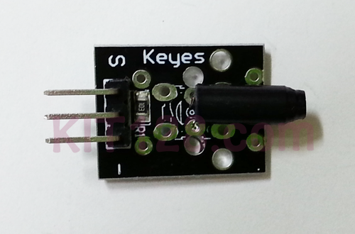
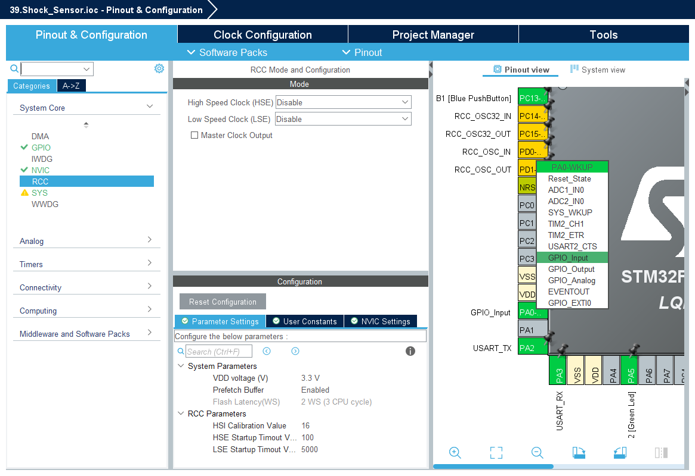
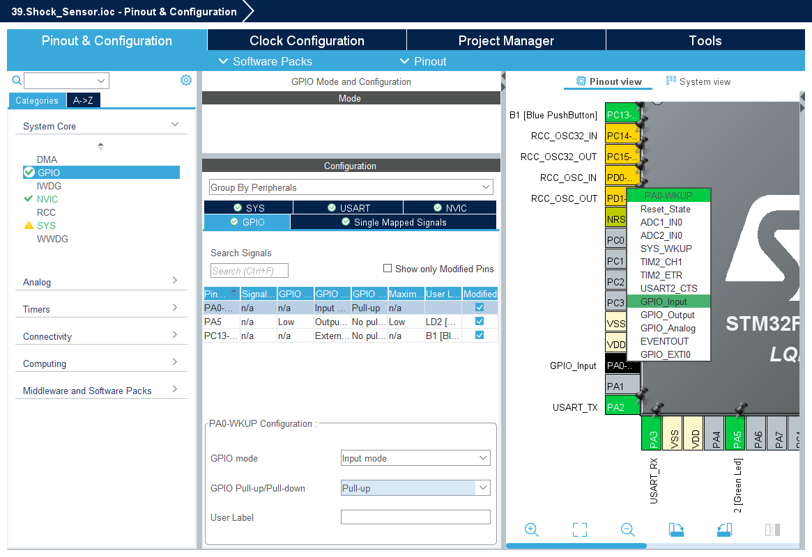

# Shock Sensor Projects for STM32F103



## 1. 하드웨어 연결
   * Shock Sensor DO (Digital Output): GPIOA의 PIN 0 (A0 포트)에 연결했다고 가정합니다.
   * VCC/GND: 각각 3.3V와 GND에 연결합니다.
   * UART2: NUCLEO 보드 기본 설정(USB 연결 시 시리얼 모니터 확인 가능)


<br>


## 2. 코드

```c
static void MX_GPIO_Init(void)
{
  GPIO_InitTypeDef GPIO_InitStruct = {0};

  __HAL_RCC_GPIOA_CLK_ENABLE(); // GPIOA 클럭 활성화
  __HAL_RCC_GPIOC_CLK_ENABLE();

  /* LD2 LED 핀 설정 (기존 코드 유지) */
  HAL_GPIO_WritePin(GPIOA, GPIO_PIN_5, GPIO_PIN_RESET);
  GPIO_InitStruct.Pin = GPIO_PIN_5;
  GPIO_InitStruct.Mode = GPIO_MODE_OUTPUT_PP;
  GPIO_InitStruct.Pull = GPIO_NOPULL;
  GPIO_InitStruct.Speed = GPIO_SPEED_FREQ_LOW;
  HAL_GPIO_Init(GPIOA, &GPIO_InitStruct);

  /* 충격 센서 입력 핀 설정 (PA0 가정) */
  GPIO_InitStruct.Pin = GPIO_PIN_0;
  GPIO_InitStruct.Mode = GPIO_MODE_INPUT;
  GPIO_InitStruct.Pull = GPIO_PULLUP; // 센서 특성에 따라 PULLUP 또는 NOPULL 선택
  HAL_GPIO_Init(GPIOA, &GPIO_InitStruct);
}
```


```c
/* USER CODE BEGIN Includes */
#include <stdio.h>
#include <string.h>
/* USER CODE END Includes */

/* USER CODE BEGIN PFP */
// printf 출력을 UART2로 리다이렉션하기 위한 함수
int __io_putchar(int ch) {
    HAL_UART_Transmit(&huart2, (uint8_t *)&ch, 1, 0xFFFF);
    return ch;
}
/* USER CODE END PFP */
```

```c
/* Infinite loop */
  /* USER CODE BEGIN WHILE */
  printf("Shock Sensor Test Start...\r\n");
  
  uint8_t last_state = GPIO_PIN_RESET;

  while (1)
  {
    // PA0 핀의 상태를 읽음 (센서가 충격을 받으면 LOW가 되는 경우가 많음)
    GPIO_PinState sensor_state = HAL_GPIO_ReadPin(GPIOA, GPIO_PIN_0);

    // 상태 변화 감지 (충격 발생 시)
    // 센서가 Active-Low 방식이라면 (GPIO_PIN_RESET일 때 충격 발생)
    if (sensor_state == GPIO_PIN_RESET && last_state == GPIO_PIN_SET)
    {
      printf("Shock Detected!\r\n");
      HAL_GPIO_WritePin(GPIOA, GPIO_PIN_5, GPIO_PIN_SET); // LD2 ON
      HAL_Delay(100); // 디바운싱 및 가시성 확보
    }
    else if (sensor_state == GPIO_PIN_SET)
    {
      HAL_GPIO_WritePin(GPIOA, GPIO_PIN_5, GPIO_PIN_RESET); // LD2 OFF
    }

    last_state = sensor_state;
    HAL_Delay(10); // CPU 부하 감소
    /* USER CODE END WHILE */

    /* USER CODE BEGIN 3 */
  }
  /* USER CODE END 3 */
```

```c

```

```c

```

```c

```
