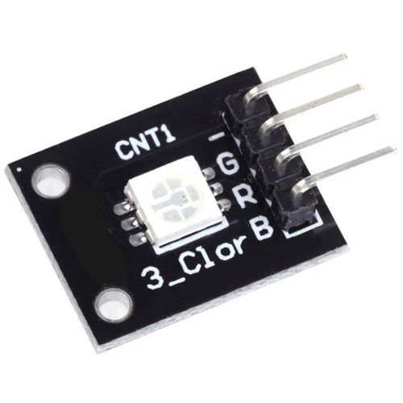

# 3 COLOR LED for STM32F103

<br>

<br>
<br>
<br>
<br>


```c
  /* Infinite loop */
  /* USER CODE BEGIN WHILE */
  while (1)
  {
	  HAL_GPIO_WritePin(LED_G_GPIO_Port, LED_G_Pin,0);
	  HAL_GPIO_WritePin(LED_R_GPIO_Port, LED_R_Pin,1);
	  HAL_GPIO_WritePin(LED_B_GPIO_Port, LED_B_Pin,0);

    /* USER CODE END WHILE */

    /* USER CODE BEGIN 3 */
  }
  /* USER CODE END 3 */
```


