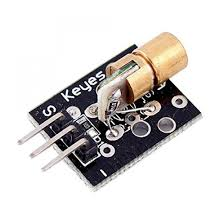
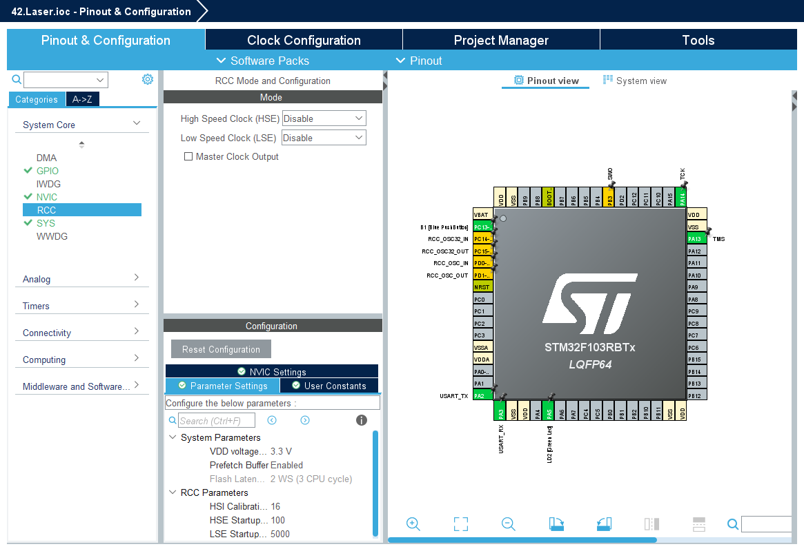
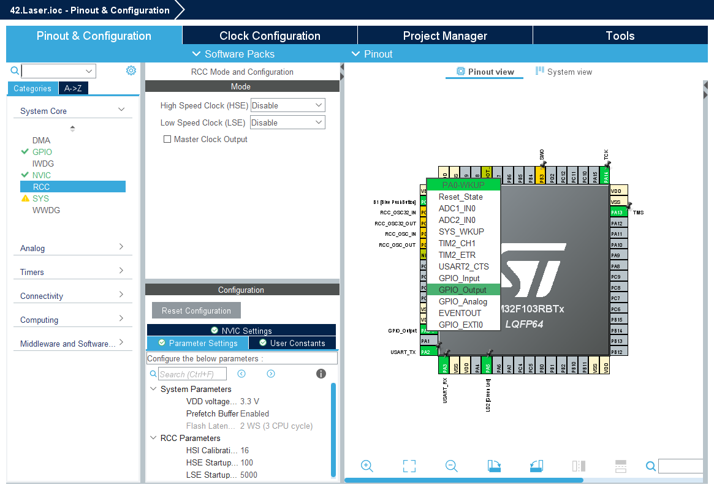
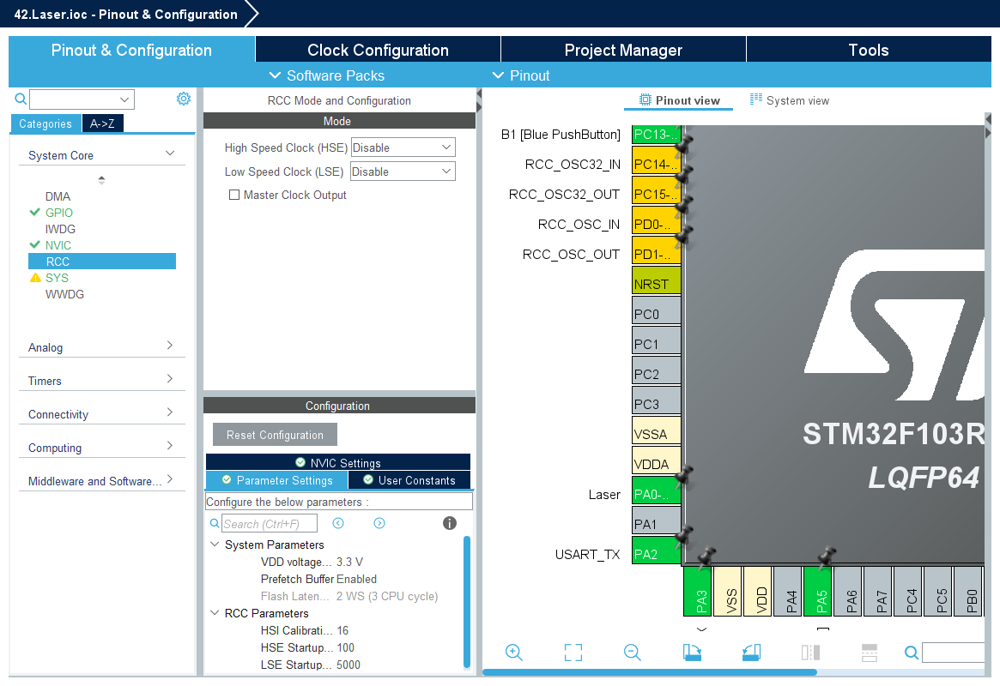

# Laser Projects for STM32F103

<br>

<br>
<br>
<br>

```c
  /* Infinite loop */
  /* USER CODE BEGIN WHILE */
  while (1)
  {
	  HAL_GPIO_WritePin(Laser_GPIO_Port, Laser_Pin, 1);
	  HAL_Delay(1000);
	  HAL_GPIO_WritePin(Laser_GPIO_Port, Laser_Pin, 1);
	  HAL_Delay(1000);
    /* USER CODE END WHILE */

    /* USER CODE BEGIN 3 */
  }
  /* USER CODE END 3 */
```

