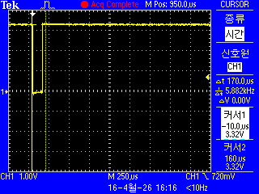

# Knock Sensor Projects for STM32F103




## 2. 소스코드

```c
/* USER CODE BEGIN Includes */
#include <stdio.h>
#include <string.h>
/* USER CODE END Includes */
```

```c
/* USER CODE BEGIN PV */
volatile uint8_t shock_detected_flag = 0; // 인터럽트 발생 플래그
/* USER CODE END PV */
```

```c
/**
  * @brief  The application entry point.
  */
int main(void)
{
  HAL_Init();
  SystemClock_Config();

  /* 주변장치 초기화 */
  MX_GPIO_Init();
  MX_USART2_UART_Init();

  /* USER CODE BEGIN 2 */
  printf("Shock Sensor Interrupt Test Start...\r\n");
  /* USER CODE END 2 */

  /* Infinite loop */
  while (1)
  {
    /* USER CODE BEGIN WHILE */
    if (shock_detected_flag) 
    {
      // 인터럽트 발생 후 처리할 로직
      printf("Shock Detected! (via Interrupt)\r\n");
      
      HAL_GPIO_WritePin(GPIOA, GPIO_PIN_5, GPIO_PIN_SET); // LD2 ON
      HAL_Delay(200);                                     // 가시성 확보
      HAL_GPIO_WritePin(GPIOA, GPIO_PIN_5, GPIO_PIN_RESET); // LD2 OFF
      
      shock_detected_flag = 0; // 플래그 초기화
    }
    
    // 이제 CPU는 여기서 다른 복잡한 연산을 하거나 슬립 모드에 들어갈 수 있습니다.
    /* USER CODE END WHILE */
  }
}
```

```c
/**
  * @brief GPIO Initialization Function
  */
static void MX_GPIO_Init(void)
{
  GPIO_InitTypeDef GPIO_InitStruct = {0};

  /* GPIO Ports Clock Enable */
  __HAL_RCC_GPIOA_CLK_ENABLE();
  __HAL_RCC_GPIOC_CLK_ENABLE(); // B1 버튼용

  /* LD2(PA5) 출력 설정 */
  HAL_GPIO_WritePin(GPIOA, GPIO_PIN_5, GPIO_PIN_RESET);
  GPIO_InitStruct.Pin = GPIO_PIN_5;
  GPIO_InitStruct.Mode = GPIO_MODE_OUTPUT_PP;
  GPIO_InitStruct.Pull = GPIO_NOPULL;
  GPIO_InitStruct.Speed = GPIO_SPEED_FREQ_LOW;
  HAL_GPIO_Init(GPIOA, &GPIO_InitStruct);

  /* PA0 Knock Sensor 인터럽트 설정 */
  GPIO_InitStruct.Pin = GPIO_PIN_0;
  // Falling Edge (High -> Low 전환 시 발생)
  GPIO_InitStruct.Mode = GPIO_MODE_IT_FALLING; 
  GPIO_InitStruct.Pull = GPIO_PULLUP;
  HAL_GPIO_Init(GPIOA, &GPIO_InitStruct);

  /* EXTI 인터럽트 우선순위 설정 및 활성화 */
  // PA0는 EXTI0 라인을 사용합니다.
  HAL_NVIC_SetPriority(EXTI0_IRQn, 0, 0);
  HAL_NVIC_EnableIRQ(EXTI0_IRQn);
}
```

```c
/* USER CODE BEGIN 4 */
/**
  * @brief EXTI 라인 인터럽트 콜백 함수
  * @param GPIO_Pin: 인터럽트가 발생한 핀 번호
  */
void HAL_GPIO_EXTI_Callback(uint16_t GPIO_Pin)
{
  if (GPIO_Pin == GPIO_PIN_0) 
  {
    // 인터럽트 안에서 printf를 쓰는 것은 권장되지 않으므로 플래그만 세웁니다.
    // (UART 전송 속도가 느려 인터럽트 지연 발생 가능성 때문)
    shock_detected_flag = 1;
  }
}
/* USER CODE END 4 */
```
