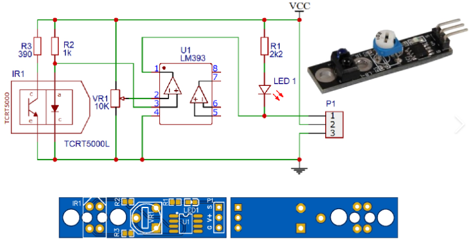

# Line Tracking Module (KY-033)

* 바닥면이 반사가 되면 '1'로 검정색으로 반사가 안되면 '0'

제시된 이미지("image_f429c8.png")는 **TCRT5000 적외선(IR) 반사형 센서**를 활용한 라인트레이서 및 장애물 감지 모듈의 회로도와 PCB 레이아웃입니다. 

이 회로는 주변의 빛이나 물체의 반사율(특히 검은색과 흰색)을 감지하여 디지털 신호(High/Low)를 출력하는 방식으로 동작합니다. 핵심 부품별로 나누어 동작 원리를 설명해 드리겠습니다.

---

## 1. 핵심 부품의 역할

* **TCRT5000L (IR1):** 적외선을 발사하는 **적외선 LED(우측)**와 반사된 적외선을 받아들이는 **포토트랜지스터(좌측)**가 하나의 패키지로 묶인 센서입니다.
* **LM393 (U1):** 두 전압의 크기를 비교하여 디지털 신호(0V 또는 VCC)를 만들어내는 **전압 비교기(Comparator)** IC입니다.
* **VR1 (10K 가변저항):** 센서가 작동하는 기준점(민감도)을 설정하는 전압 분배기 역할을 합니다.

---

## 2. 회로의 세부 동작 과정

### ① 적외선 발광 및 수신 (입력단)
* **발광부:** VCC에서 $R3(390\Omega)$을 거쳐 IR LED로 전류가 흐르며 눈에 보이지 않는 적외선을 지속적으로 방출합니다.
* **수신부 (포토트랜지스터):** 
    * 센서 앞에 **흰색 물체**가 있으면 적외선이 강하게 반사되어 포토트랜지스터가 켜집니다(On 상태, 도통). 이로 인해 전류가 $R2(1\text{k}\Omega)$를 지나 그라운드(GND)로 많이 흐르게 되면서, **비교기의 3번 핀(Inverting Input, -) 전압이 낮아집니다.**
    * 센서 앞에 **검은색 물체**(또는 아무것도 없는 허공)가 있으면 적외선이 흡수되어 반사되지 않습니다. 포토트랜지스터가 꺼지고(Off 상태), 전류가 흐르지 않아 **비교기의 3번 핀(-) 전압이 VCC에 가깝게 높아집니다.**

### ② 기준 전압 설정 (가변저항)
* 가변저항(VR1)은 VCC와 GND 사이에 연결되어 있어, 노브를 돌리는 것에 따라 **비교기의 2번 핀(Non-inverting Input, +)에 걸리는 기준 전압($V_{ref}$)**을 결정합니다. 이 값을 조절해 얼마나 가까이 가야 센서가 반응할지(민감도)를 세팅합니다.

### ③ 전압 비교 및 출력 (LM393)
LM393 비교기는 2번 핀(+)과 3번 핀(-)의 전압을 비교하여 출력을 결정합니다.

* **반사율이 높을 때 (흰색 바닥 / 장애물 감지):**
    * 3번 핀(-) 전압이 2번 핀(+) 전압보다 **낮아집니다.** ($V_+ > V_-$)
    * 비교기 내부 출력이 Open-drain 형태로 차단되거나 High 상태가 되어, 출력 핀(1번)과 연결된 **P1 포트의 1번 핀(디지털 출력)으로 High(VCC) 신호**가 나갑니다.
    * 이때 **LED1**은 VCC와 1번 핀 사이에 연결되어 있는데, 양단 전압차가 없어지므로 **꺼집니다.**

* **반사율이 낮을 때 (검은색 선 / 장애물 없음):**
    * 3번 핀(-) 전압이 2번 핀(+) 전압보다 **높아집니다.** ($V_+ < V_-$)
    * 비교기 내부 트랜지스터가 동작하여 출력 1번 핀을 **GND(Low)로 떨어뜨립니다.**
    * 따라서 **P1 포트의 1번 핀으로 Low(0V) 신호**가 출력됩니다.
    * 동시에 전류가 $R1(2.2\text{k}\Omega) \rightarrow \text{LED1} \rightarrow \text{비교기 1번 핀(GND)}$으로 흐르게 되면서 **LED1이 켜집니다.**

---

## 3. 요약 (커넥터 P1 기준 동작)

| 감지 상태 | 포토트랜지스터 | 비교기 3번(-) 전압 | P1 - 1번 핀 출력 (S) | LED1 상태 |
| :--- | :--- | :--- | :--- | :--- |
| **검은색 선 / 허공 (반사 X)** | Off | **High** ($V_+ < V_-$) | **Low (0V)** | **켜짐 (ON)** |
| **흰색 면 / 장애물 (반사 O)** | On | **Low** ($V_+ > V_-$) | **High (VCC)** | **꺼짐 (OFF)** |

> **💡 사용 팁 (P1 커넥터 핀 맵)**
> * 1번 = **S** (Signal, 출력) / 2번 = **V+** (VCC 전원) / 3번 = **G** (GND 그라운드)
> * 사용자는 이 모듈의 **S(Signal) 핀**을 아두이노나 MCU의 디지털 입력 핀에 연결하여, 값이 `0`인지 `1`인지에 따라 로봇의 방향을 바꾸거나 장애물을 회피하는 알고리즘을 구현할 수 있습니다.
