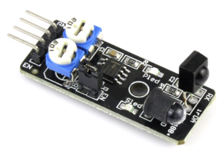

# KY032 Infrared Obstacle Avoidance Sensor Module

## 타입 A : NE555 타이머 기반
 

## 타입 B : SN74LS00 Logic IC 기반
  

* 장애물을 감지하면 한번의 트리거 신호만 발생함

  

## 타입 A: NE555 타이머 기반 (일반적인 KY-032 구성)
   * 발진단: ⁠NE555 타이머 IC가 비안정 멀티바이브레이터(Astable Multivibrator) 모드로 결선되어 38kHz의 사각파 신호를 만듭니다.
   * 송신단 (TX): 생성된 38kHz 신호가 전류 제한 저항을 거쳐 적외선 발광 다이오드(IR LED)를 구동합니다.
   * 수신단 (RX): 38kHz 주파수 성분만 걸러서 수신할 수 있는 적외선 수신 헤드(일반적으로 HS0038 또는 가려진 형태의 3핀 수신기)가 사용됩니다.
   * 신호 처리: 수신 헤드가 신호를 감지하여 로우(LOW) 플래그를 떨어뜨리면, 온보드 비교기 회로 및 인버터를 거쳐 최종 디지털 출력으로 전달됩니다.
http://irsensor.wizecode.com/

## 타입 B: SN74LS00 Logic IC 기반 (일부 오리지널 IR-08H 구성)
   * 발진단: 555 타이머 대신 **SN74LS00 (NAND 게이트 IC)**를 조합한 피드백 루프 오실레이터 회로를 활용해 38kHz 주파수를 동조시킵니다.
   * 주변 회로: 기본적인 IR LED 구동 회로와 가변저항을 통한 주파수 교정(Calibration) 방식은 동일합니다.
http://irsensor.wizecode.com/

## 온보드 가변저항 및 조절 요소
* 회로도를 직접 추적(Reverse Engineering)할 때 핵심이 되는 부품들입니다.
   * R5 (주파수 미세 조절 변수): 적외선 다이오드가 정확히 38kHz로 깜빡이도록 발진 주파수를 맞추는 역할을 합니다. 조율이 틀어지면 수신 센서가 인식을 하지 못하므로 가급적 공장 출하 상태를 유지하는 것이 좋습니다.
   * R6 (거리 감도 조절 변수): IR LED의 전류량을 제어하여 적외선의 도달 거리를 조절합니다. 시계 방향으로 돌리면 감지 거리가 늘어납니다 (스펙상 최대 2cm ~ 40cm 내외).
   * EN 점퍼: 인에이블 기능 변환용 2핀 헤더입니다. 점퍼 캡을 씌워두면 EN 핀이 GND와 쇼트되어 센서가 항상 켜진 상태가 되며, 점퍼를 제거하면 MCU의 GPIO 핀으로 직접 센서의 온/오프 상태를 제어할 수 있습니다.
