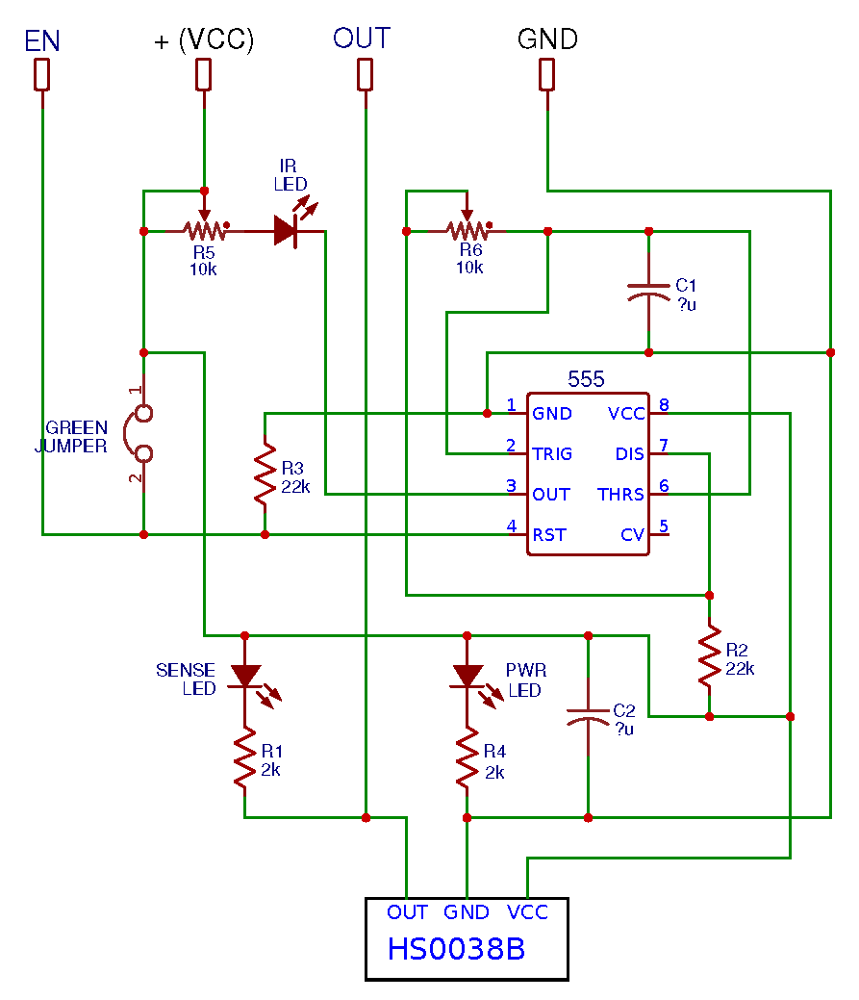

# Infrared Obstacle Avoidance Sensor Module (KY032)

## 타입 A : NE555 타이머 기반
 

## 타입 B : SN74LS00 Logic IC 기반
 <br>

* 장애물을 감지하면 한번의 트리거 신호만 발생함

 <br>

## 타입 A: NE555 타이머 기반 (일반적인 KY-032 구성)
   * 발진단: ⁠NE555 타이머 IC가 비안정 멀티바이브레이터(Astable Multivibrator) 모드로 결선되어 38kHz의 사각파 신호를 만듭니다.
   * 송신단 (TX): 생성된 38kHz 신호가 전류 제한 저항을 거쳐 적외선 발광 다이오드(IR LED)를 구동합니다.
   * 수신단 (RX): 38kHz 주파수 성분만 걸러서 수신할 수 있는 적외선 수신 헤드(일반적으로 HS0038 또는 가려진 형태의 3핀 수신기)가 사용됩니다.
   * 신호 처리: 수신 헤드가 신호를 감지하여 로우(LOW) 플래그를 떨어뜨리면, 온보드 비교기 회로 및 인버터를 거쳐 최종 디지털 출력으로 전달됩니다.
http://irsensor.wizecode.com/

## 타입 B: SN74LS00 Logic IC 기반 (일부 오리지널 IR-08H 구성)
   * 발진단: 555 타이머 대신 **SN74LS00 (NAND 게이트 IC)**를 조합한 피드백 루프 오실레이터 회로를 활용해 38kHz 주파수를 동조시킵니다.
   * 주변 회로: 기본적인 IR LED 구동 회로와 가변저항을 통한 주파수 교정(Calibration) 방식은 동일합니다.

NE555 타이머가 담당하던 핵심 역할은 38kHz 정방형파(Square Wave) 주파수를 생성하여 IR LED를 구동하는 것입니다. HS0038B와 같은 적외선 수신기는 주변의 태양광이나 전등 조명(노이즈)을 필터링하기 위해 오직 38kHz로 변조된 적외선 신호만 받아들이기 때문입니다.

이를 74LS00(Quad 2-Input NAND Gates) Logic IC로 대체하려면, NAND 게이트 2개를 조합하여 38kHz를 만들어내는 링 오실레이터(Astable Multivibrator) 회로를 설계해야 합니다. 남는 게이트로는 EN(Enable) 제어 및 수신단 버퍼(신호 반전) 역할을 맡길 수 있습니다.


1. 74LS00 기반 KY-032 대체 회로도74LS00 IC 1개(4개의 NAND 게이트 내장)를 완벽하게 활용한 회로 구성입니다.
```
                  +5V (VCC)
                   │
                  [ ] R_pullup (10k)
                   │
       ┌───────────┴───────────────┐
       │      74LS00 Logic IC      │
       │                           │
       │   NAND 1 (오실레이터 1)    │      [ ] R5 (가변저항 10k)
EN ────┤1A (Pin1)       (Pin3) 1Y ─┼─────[───]─────┐
    ┌──┤1B (Pin2)                  │     │         │
    │  └───────────────────────────┘     ▼ C1      ▼ IR LED
    │  ┌───────────────────────────┘    (수 nF)    │
    └──┤2A (Pin4)       (Pin6) 2Y ───────┴─────────┘
   ┌───┤2B (Pin5)                  │
   │   │   NAND 2 (오실레이터 2)    │
   │   └───────────────────────────┘
   └───────────────────────────────┐
                                   │
       ┌───────────────────────────┘
       │                              +5V (VCC)
       │                               │
       │   NAND 3 (수신 제어 버퍼)     [ ] R_pull (10k)
       │                               │
       ├──┤3A (Pin9)               ┌───┴────────── OUT (MCU 전송)
       └──┤3B (Pin10)   (Pin8) 3Y ─┤
       │                           ▼ SENSE LED
       │                           [ ] R1 (2k)
       └───────────────────────────┘   │
                                      GND

               HS0038B 적외선 수신모듈
               ┌───────────────┐
         OUT ──┤Pin1 (OUT)     │
         GND ──┤Pin2 (GND)     │
         VCC ──┤Pin3 (VCC)     │
               └───────────────┘
   ```
2. 회로 동작 원리 요약

* 38kHz 발진부 (NAND 1, NAND 2)
  * NAND 게이트 2개를 직렬로 연결하고, 피드백 경로에 가변저항 $R_5$와 커패시터 $C_1$을 배치하면 발진 회로가 됩니다.
  * 수식 $f \approx \frac{1}{2.2 \cdot R_5 \cdot C_1}$을 기준으로 가변저항(10kΩ)과 약 $1.2\text{nF} \sim 2.2\text{nF}$ 전후의 커패시터를 조합하여 주파수를 38kHz로 튜닝합니다.
  * 발진된 주파수 출력(Pin 6)이 IR LED를 구동합니다.

* EN (Enable) 제어 기능
   * NAND 1의 Pin 1을 EN 핀으로 뺍니다.
   * EN 핀이 HIGH(또는 Jumper 연결) 상태일 때만 오실레이터가 정상 동작하여 38kHz 적외선이 방출됩니다.
   * EN 핀이 LOW가 되면 발진이 멈추어 센서가 비활성화됩니다.

* 수신 및 출력단 (NAND 3)
   * HS0038B 수신기는 평소(장애물 없을 때) HIGH를 출력하다가, 38kHz 적외선이 반사되어 들어오면(장애물 감지) LOW 신호가 됩니다.
   * 기존 NE555 회로처럼 출력단을 맞추거나 LED를 구동하기 위해, NAND 3를 인버터(Not 게이트)나 버퍼 형태로 연결하여 최종 OUT 핀과 감지 표시용 SENSE LED를 제어합니다.

💡 설계 팁:
   * 정밀한 TTL 타이밍 특성상 74LS00 대신 **74HC00(CMOS)**을 사용하면 입력 임피던스가 높아 가변저항($R_5$)과 커패시터($C_1$)를 이용한 RC 시정수 주파수 매칭이 훨씬 깔끔하고 정밀하게 떨어집니다.
   * 반면 74LS00은 자체 입력 전류 바이어스가 있어 발진 시 주파수 왜곡을 막기 위해 시정수 저항 값을 약간 낮게 잡아 튜닝해야 합니다.

## 온보드 가변저항 및 조절 요소
* 회로도를 직접 추적(Reverse Engineering)할 때 핵심이 되는 부품들입니다.
   * R5 (주파수 미세 조절 변수): 적외선 다이오드가 정확히 38kHz로 깜빡이도록 발진 주파수를 맞추는 역할을 합니다. 조율이 틀어지면 수신 센서가 인식을 하지 못하므로 가급적 공장 출하 상태를 유지하는 것이 좋습니다.
   * R6 (거리 감도 조절 변수): IR LED의 전류량을 제어하여 적외선의 도달 거리를 조절합니다. 시계 방향으로 돌리면 감지 거리가 늘어납니다 (스펙상 최대 2cm ~ 40cm 내외).
   * EN 점퍼: 인에이블 기능 변환용 2핀 헤더입니다. 점퍼 캡을 씌워두면 EN 핀이 GND와 쇼트되어 센서가 항상 켜진 상태가 되며, 점퍼를 제거하면 MCU의 GPIO 핀으로 직접 센서의 온/오프 상태를 제어할 수 있습니다.
