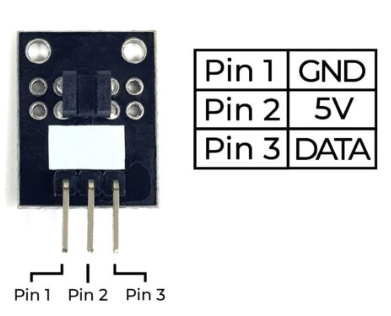
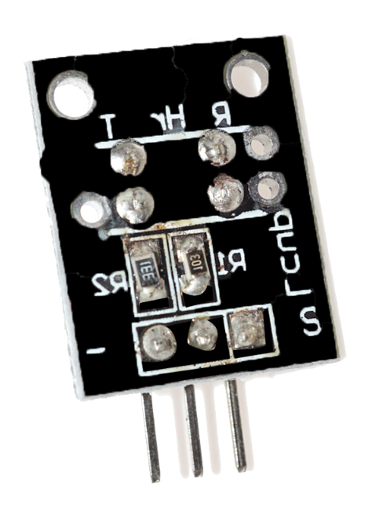
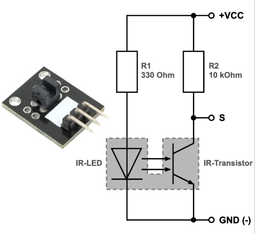
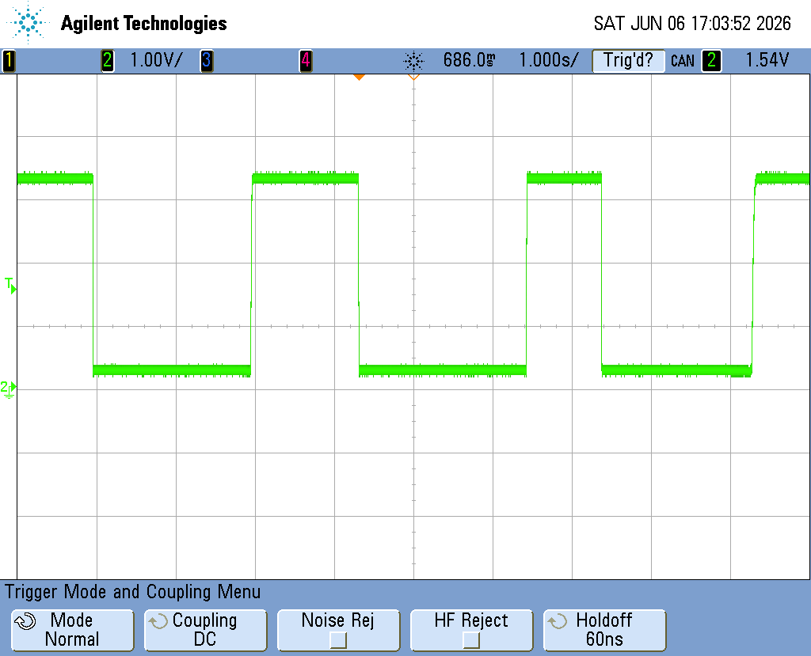

# Photo Interrupt Projects for STM32F103

 

 

* Photo Interrupt 사이를 가리면 '1'로 사이를 열어두면 '0'

## 설명(Description)
  * KY-010 포토 인터럽터(Photo Interrupter) 모듈은 센서의 슬롯(틈) 사이를 통과하는 빛이 차단되면 신호를 출력하는 스위치 모듈입니다.
  * The KY-010 Photo Interrupter module is a switch that will trigger a signal when the light between the sensor’s gap is blocked.
  * 이 모듈은 Arduino, Raspberry Pi, ESP32 등 다양한 전자 플랫폼에서 사용할 수 있습니다.
  * This module is suitable for various electronic platforms like Arduino, Raspberry Pi, ESP32, and others.

## 사양(Specifications) :
  * This module consists of an optical emitter/detector and 3 male header pins on the front. On the back, there are two resistors of 10kΩ and 33Ω.
  * 이 모듈은 광학식 발광부(Emitter), 수광부(Detector), 그리고 전면의 3개 핀 헤더로 구성되어 있습니다.
  * 후면에는 10kΩ 저항과 33Ω 저항이 각각 장착되어 있습니다.
  * The sensor uses a beam of light between the emitter and detector to check if the path between both is being blocked by an opaque object.
  * 센서는 발광부와 수광부 사이에 형성된 광선을 이용하여, 두 부품 사이의 경로가 불투명한 물체에 의해 차단되었는지를 감지합니다.

| 동작 전압(Operating Voltage)	| 보드 크기(Board Dimensions) | 
|:--------:|:--------:|
| 3.3V ~ 5V	|  18.5mm x 15mm | 

## 연결도(Connection Diagram)
   * 전원 핀(가운데)을 +5V에 연결하고, GND 핀(왼쪽)을 GND에 연결합니다.
   * 신호 핀(S, 오른쪽)은 Arduino의 3번 핀에 연결합니다.
   * Connect the power line (middle) and ground (left) to +5V and GND respectively. Connect signal (S) to pin 3 on the Arduino.

| KY-010	| Arduino | 
|:--------:|:--------:|
| – (left)	| GND | 
| middle	| +5V | 
| S (right)	| Pin 3 | 

## 동작 원리
* 발광부(Emitter)에서 적외선(IR) 빛을 송출합니다.
* 수광부(Detector)는 이 빛을 지속적으로 감지합니다.
* 슬롯 사이에 물체가 들어와 빛을 차단하면 수광부가 빛을 감지하지 못하게 되고, 출력 신호가 변화합니다.
* 이를 이용하여 회전 속도 측정, 위치 검출, 엔코더, 카운터 등의 다양한 응용이 가능합니다.
