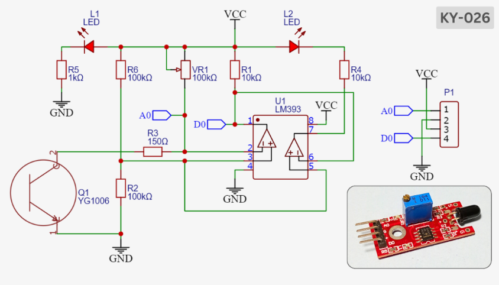
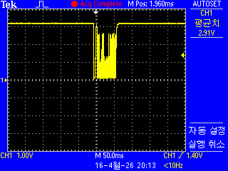
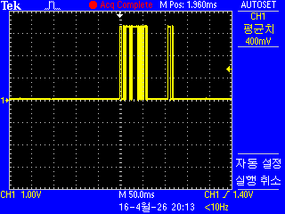
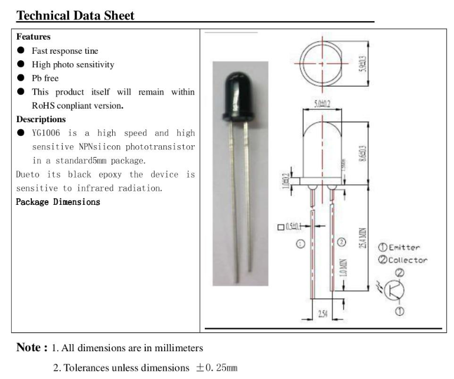
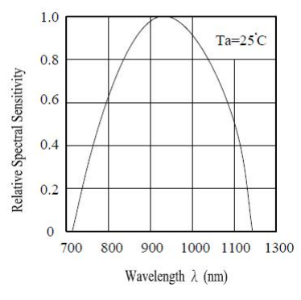
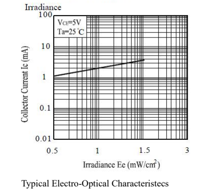
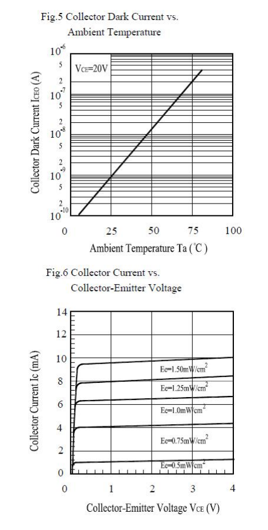

# Flame Detector (KY-026) Projects

## Analog : A0

## Digital : D0

---

Image 1 — 상대 분광 감도 (Relative Spectral Sensitivity)
피크 감도 파장: ~950nm (근적외선 영역)
유효 감도 범위: 700nm ~ 1100nm
핵심 의미:

YG1006은 가시광선(~700nm)보다 근적외선(NIR)에 최적화된 소자
950nm 부근에서 감도 100% → 940nm IR LED와 최적 매칭
가시광 영역(400~700nm)은 감도가 거의 없어 주변 가시광 노이즈에 강함
실용 설계 시 940nm IR LED를 광원으로 사용하는 것이 표준

Image 2 — 조도-컬렉터 전류 특성 (Electro-Optical Characteristics)
조건: VCE = 5V, Ta = 25°C
X축: 조도 Ee (mW/cm²) — 로그 스케일
Y축: 컬렉터 전류 Ic (mA) — 로그 스케일
핵심 의미:

조도와 출력 전류가 선형 비례 관계 (로그-로그 직선 → 멱함수 관계)
Ee ≈ 1 mW/cm² → Ic ≈ 1 mA
Ee ≈ 1.5 mW/cm² → Ic ≈ 3~4 mA
조도가 2배 증가 시 전류도 비례 증가 → 아날로그 광량 측정 가능
디지털 ON/OFF 감지뿐 아니라 선형 광센서로도 활용 가능

Image 3-상단 — 암전류 vs 온도 (Dark Current vs. Temperature)
조건: VCE = 20V
X축: 주변 온도 Ta (°C)
Y축: 암전류 ICEO (A) — 로그 스케일
핵심 의미:

빛이 없는 상태의 누설 전류 = 노이즈 플로어
25°C에서 약 10⁻⁸ A (10 nA) 수준으로 매우 낮음
온도 상승 시 암전류가 지수적으로 급증 → 고온 환경에서 오감지 위험
실외/산업 환경 설계 시 온도 보상 회로 고려 필요

Image 3-하단 — Ic vs. VCE 출력 특성 (Output Characteristics)
X축: 컬렉터-이미터 전압 VCE (V)
Y축: 컬렉터 전류 Ic (mA)
파라미터: 조도 Ee = 0.5 ~ 1.5 mW/cm²
핵심 의미:

전형적인 BJT 출력 특성 곡선과 동일한 형태
VCE > 1V 이상에서 Ic가 포화 (전류 일정)
조도별 전류 레벨:

조도 (mW/cm²)포화 전류 Ic0.5~1 mA0.75~2.5 mA1.0~5 mA1.25~7.5 mA1.5~9 mA

VCE = 2V 이상이면 안정적인 선형 동작 영역 확보
부하 저항 설계 시 동작점을 포화 영역에 두면 안정적 출력

* 실무 설계 요약
  * 광원     : 940nm IR LED (최적 매칭)
  * 공급전압  : VCE ≥ 2V (안정 동작)
  * 부하저항  : Ee 1mW/cm² → Ic ~1mA 기준으로 설계
  * 온도 주의 : 고온에서 암전류 급증 → 임계값 마진 확보
  * 활용     : 근접 센서, 물체 감지, 라인트레이서, 인코더
