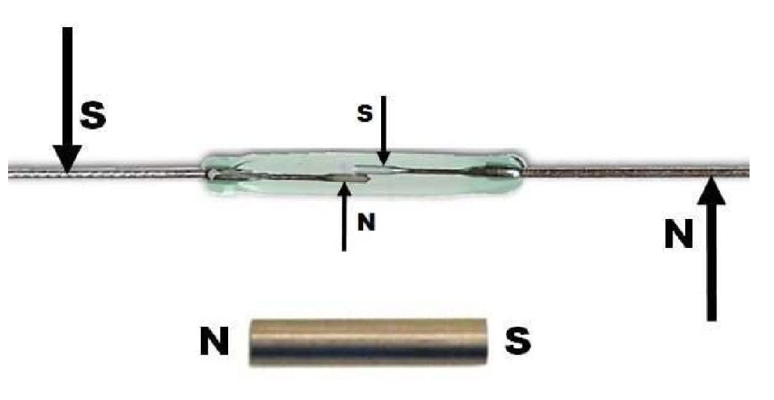
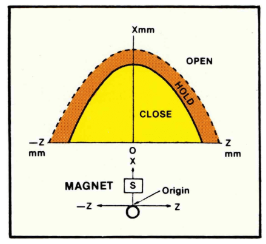
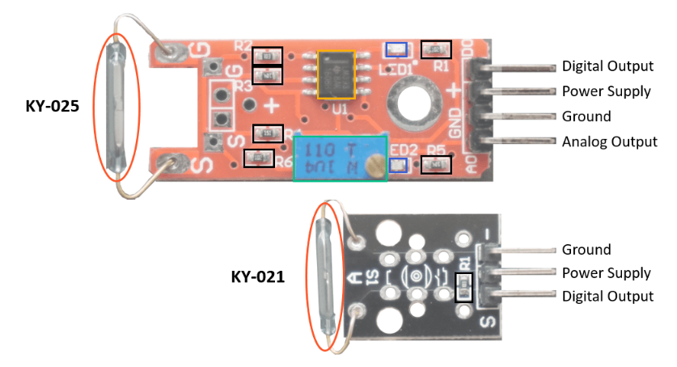
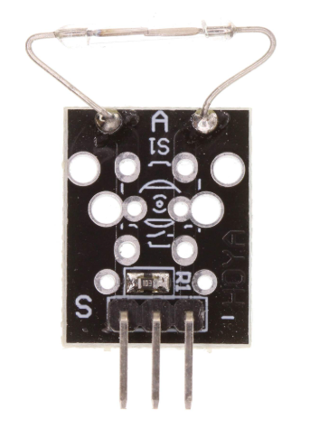
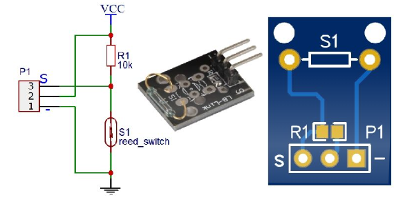
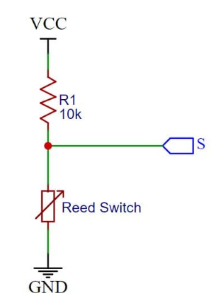
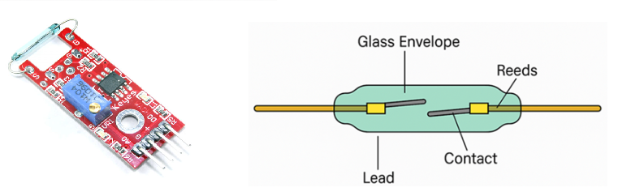
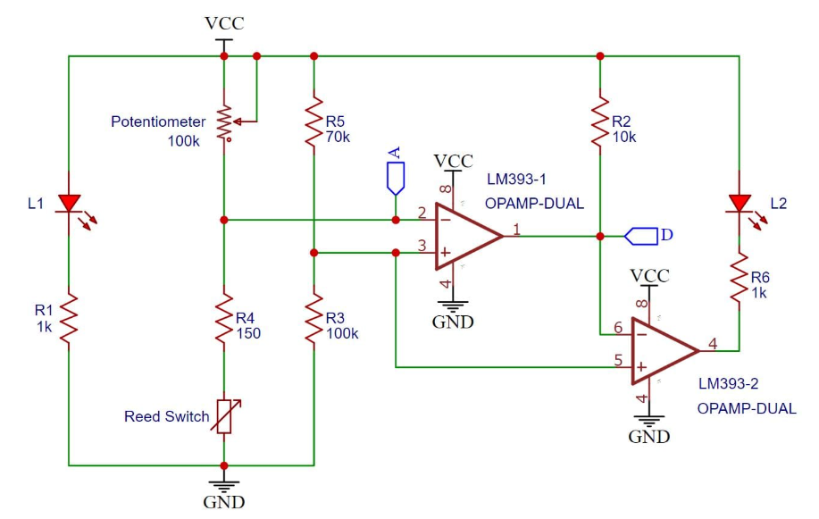
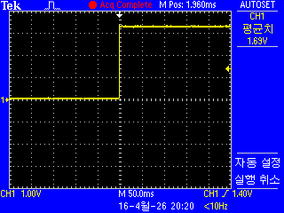
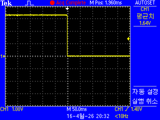

# Read Switch

## 리드 스위치(Reed Switch)란? 

* 리드 스위치는 자기장에 기반하여 접점을 열고 닫는 전기 스위치이다.
* 충분히 강한 자기장이 존재하면 리드 스위치 내부의 연결이 닫힌다.
* 그렇지 않으면 스위치는 열린 상태를 유지한다.
* 이 자기장의 원천은 자석이나 강한 전류일 수 있다.

* 다음 이미지는 리드 스위치의 접점을 상세히 보여준다.
* 이미지는 리드 스위치가 **리드(reed)**라고 불리는 두 개의 자화 가능한 금속 접점으로 구성되어 있음을 보여준다.
* 이 접점들은 상대적으로 얇고 넓어서 유연하다. 두 접점 사이에는 자기장이 없을 때 일반적으로 열려 있는 리드 스위치의 작은 간격이 존재한다.

* 전자석이나 영구 자석의 자기장은 리드들이 서로 끌어당겨 회로를 닫게 만든다.
* 다음 장에서는 이 자기장의 방향이 리드 스위치에 어떤 영향을 미치는지 배울 것이다.
* 자기장이 제거되면 접점은 초기 위치로 돌아가므로 스위치 접점이 열린다.

* 리드 스위치의 매우 일반적인 응용 분야는 문이나 창문이 열렸는지 닫혔는지 감지하는 것이다.
* 따라서 센서의 한쪽에는 리드 스위치가 있고 다른 쪽에는 자석이 있다.

* 자기장 방향이 리드 센서에 미치는 영향 자기장은 방향성이 있으므로 방향을 가지기 때문에, 리드 스위치와 외부 자석 사이의 위치와 각도가 중요하다.
* 다음 두 이미지에서 볼 수 있는 두 가지 반대되는 시나리오가 있다.
* 왼쪽 이미지에서는 자석이 리드 스위치와 평행하고, 오른쪽 이미지에서는 자석이 리드 스위치와 수직이다.

* 자석이 리드 스위치와 평행한 경우 이것이 리드 스위치와 자석 사이의 완벽한 구성이다.
* 축적된 자기장이 포물선 형태이기 때문이다. 문이나 창문용 리드 스위치에서도 이 구성을 찾을 수 있다.

* 자석이 리드 스위치와 수직인 경우 이 구성에서는 자기장이 리드 스위치 중간에 사각지대(데드 존)를 갖게 된다.
* 따라서 자석과 리드 스위치를 수직 구성으로 사용하지 않는 것이 좋다.

# Read Switch (KY-021)

  

# Read Switch (KY-025) Projects for STM32F103

| Digital  | Analog |
|:------------------:|:------------------:|
|   |  |

* Reed Switch(리드 스위치)는 자기장의 원리를 이용한 기계적 스위치입니다.
* Reed(갈대)'라고 불리는 이유는 스위치 내부의 금속 접점이 갈대처럼 얇고 유연하기 때문입니다.

* 이 장치의 핵심 원리부터 실무 지침까지 체계적으로 정리해 드립니다.

## 1. 리드 스위치의 원리 (Working Principle)
   * 리드 스위치는 외부의 **자기장(자석)**에 반응하여 회로를 연결하거나 차단하는 방식입니다.
   * 구조: 불활성 가스(질소 등)가 채워진 유리관 안에 두 개의 강자성체 금속 조각(리드)이 미세한 간격을 두고 배치되어 있습니다.
   * 작동 과정: 자석이 스위치 근처로 다가오면, 유리관 내부의 두 리드가 서로 반대 극성으로 자화됩니다. 이로 인해 발생하는 자기적 인력이 리드를 서로 달라붙게 하여 회로가 닫힙니다(ON). 자석이 멀어지면 탄성에 의해 원래 위치로 돌아가며 회로가 열립니다(OFF).

## 2. 주요 응용 분야 (Applications)
   * 비접촉 방식으로 동작하기 때문에 내구성이 필요한 곳에 널리 쓰입니다.
   * 보안 시스템: 창문이나 문이 열렸을 때 자석과 스위치가 떨어지는 것을 감지하는 방범 센서.
   * 가전 제품: 냉장고 문 개폐 감지, 세탁기 뚜껑 잠금 확인, 노트북 덮개 센서(Sleep mode 전환).
   * 액체 레벨 센서: 부표(Float) 안에 자석을 넣어 액체 높이에 따라 스위치가 작동하게 하여 수위를 측정.
   * 자동차: 안전벨트 체결 확인, 브레이크 오일 레벨 감지.
   * 의료 기기: 심박 조율기(Pacemaker) 외부 프로그래밍 및 제어.

## 3. 사용상의 장점 (Advantages)
   * 높은 신뢰성과 긴 수명: 외부와 완전히 차단된 유리관 내부에 접점이 있어 먼지, 습기, 부식으로부터 자유롭습니다. 수백만 번 이상의 작동 수명을 가집니다.
   * 무전원 작동: 센서 자체를 구동하기 위한 대기 전력이 필요 없습니다. 오직 자기장만 있으면 작동합니다.
   * 비접촉 구동: 직접적인 물리적 마찰이 없어 마모가 적습니다.
   * 저렴한 비용: 구조가 단순하여 대량 생산 시 단가가 매우 낮습니다.

## 4. 단점 및 한계 (Disadvantages)
   * 충격에 취약: 외관이 유리로 되어 있어 물리적 충격이나 진동에 깨지기 쉽습니다.
   * 채터링(Chattering) 현상: 기계적 접점이 붙을 때 미세하게 튕기는 현상이 발생하여 노이즈가 생길 수 있습니다. (디지털 회로 설계 시 디바운싱 처리가 필요합니다.)
   * 자계 간섭: 주변에 강한 전동기나 다른 자석이 있을 경우 오작동할 확률이 있습니다.
   * 제한된 용량: 고전압이나 고전류를 직접 제어하기에는 접점이 얇아 소손될 위험이 큽니다.

## 5. 설계 및 사용 시 주의사항 (Safety & Design Tips)
   * 교육 시 특히 강조해야 할 실무적 주의점입니다.
   * 유리관 파손 주의: 리드 스위치의 다리(Lead wire)를 구부릴 때 유리 접합부에 무리가 가지 않도록 롱노즈 플라이어 등으로 고정하고 구부려야 합니다. 유리에 금이 가면 불활성 가스가 새어 나가 수명이 급감합니다.
   * 접점 용량 준수: 허용 전류를 초과하는 부하를 연결할 때는 반드시 릴레이(Relay)나 트랜지스터를 함께 사용하여 스위치를 보호해야 합니다.
   * 자석의 방향성: 자석이 다가오는 방향(평행, 수직)에 따라 감도와 작동 지점이 달라지므로 설계 시 충분한 테스트가 필요합니다.
   * 히스테리시스(Hysteresis): 스위치가 붙는 거리(Pull-in)와 떨어지는 거리(Drop-out)가 다릅니다. 이 간격을 고려하여 자석의 이동 범위를 설정해야 합니다.

   * Tip: "Lead Switch"라고 검색하면 정보가 제한적일 수 있으니, 전문적인 자료를 찾으실 때는 **"Reed Switch"**라는 용어를 사용하시길 권장합니다.

## 6. 리드 스위치의 산업별 활용 사례

### 1. 자동차 산업 (Automotive Industry)
- 차량 도어 개폐 감지
- 트렁크 개폐 감지
- 후드(엔진룸) 개폐 감지
- 안전벨트 체결 상태 감지
- 전기차 충전 커넥터 연결 감지
- 브레이크 및 기어 위치 검출
- 예시
자석을 도어에 부착하고 차체에 리드 스위치를 설치하여 문이 열리면 경고등을 점등합니다.

### 2. 산업 자동화 (Industrial Automation)
- 실린더 위치 검출
- 공압/유압 액추에이터 위치 감지
- 생산라인 제품 통과 감지
- 컨베이어 위치 확인
- 로봇 암 리미트 스위치
- 예시
공압 실린더 내부 피스톤에 자석을 넣고 외부에 리드 스위치를 설치하여 실린더의 전진/후진 위치를 감지합니다.

### 3. 보안 및 출입 통제 (Security Systems)
- 문 열림 감지
- 창문 침입 감지
- 금고 개폐 감지
- 출입문 상태 모니터링
- 예시
가정용 및 산업용 방범 시스템에서 가장 널리 사용되는 센서 중 하나입니다.

### 4. 소비자 전자기기 (Consumer Electronics)
- 노트북 덮개 감지
- 태블릿 커버 감지
- 스마트폰 플립 케이스 감지
- 전자책(E-Book) 자동 절전 기능
- 예시
커버를 닫으면 자석이 리드 스위치를 작동시켜 화면을 자동으로 끕니다.

### 5. 의료기기 (Medical Devices)
- 의료 장비 도어 감지
- 환자 모니터링 장비 상태 감지
- 휴대용 진단기기 전원 제어
- MRI 주변 비접촉 스위치
- 예시
강한 전자파 환경에서도 비교적 안정적으로 사용할 수 있습니다.

### 6. 가전제품 (Home Appliances)
- 냉장고 문 열림 감지
- 세탁기 도어 잠금 상태 감지
- 정수기 커버 감지
- 에어컨 필터 도어 감지
- 예시
냉장고 문이 열리면 내부 조명을 켜고 일정 시간 이상 열려 있으면 경고음을 발생시킵니다.

### 7. IoT 및 스마트홈 (IoT & Smart Home)
- 스마트 도어 센서
- 스마트 창문 센서
- 스마트 캐비닛 감지
- 홈 자동화 트리거
- 예시
문이 열리면 스마트폰 알림 전송 또는 CCTV 녹화를 시작합니다.

### 8. 물류 및 창고 자동화 (Logistics)
- 랙(Rack) 도어 상태 감지
- 자동창고 셔틀 위치 확인
- 물류 컨테이너 개폐 감시
- 무인 창고 출입 감지

### 9. 항공우주 및 국방 (Aerospace & Defense)
- 항공기 패널 상태 감지
- 랜딩기어 위치 검출
- 미사일 발사 장치 인터록
- 군용 장비 도어 상태 확인
- 예시
진동과 먼지가 많은 환경에서도 높은 신뢰성을 제공합니다.

### 10. 에너지 및 전력 산업 (Energy & Utilities)
- 스마트 미터 검침
- 변전소 도어 감지
- 배터리 팩 커버 감지
- 태양광 설비 점검 센서

## 리드 스위치와 홀 센서 비교

| 항목	| 리드 스위치	| 홀 센서 |
|:-------:|:-------:|:-------:|
| 동작 방식	| 기계식 접점	| 반도체 | 
| 전원 필요	| 불필요	| 필요 | 
| 수명	| 수백만 회	| 매우 김 | 
| 응답 속도	| 보통	| 빠름| 
| 비용	| 저렴	| 다소 높음| 
| 출력	| ON/OFF	| ON/OFF 또는 아날로그 | 
| 소비 전력	| 0W	수 | mW 수준 | 

## 대표적인 교육용/산업용 프로젝트 예제

* 초급
   - 문 열림 경보 장치
   - 창문 보안 센서
   - 자전거 속도계

* 중급
    - 공압 실린더 위치 검출기
    - 컨베이어 카운터
    - 스마트 우편함 알림 시스템

* 고급
    - AGV 위치 검출
    - 로봇 리미트 스위치
    - 스마트 팩토리 설비 모니터링
    - 무인창고 위치 센서 네트워크
 
