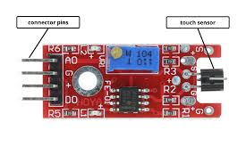
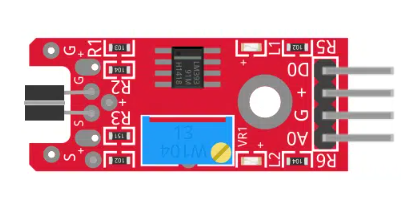
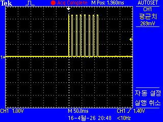
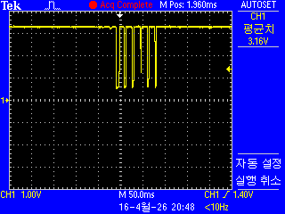
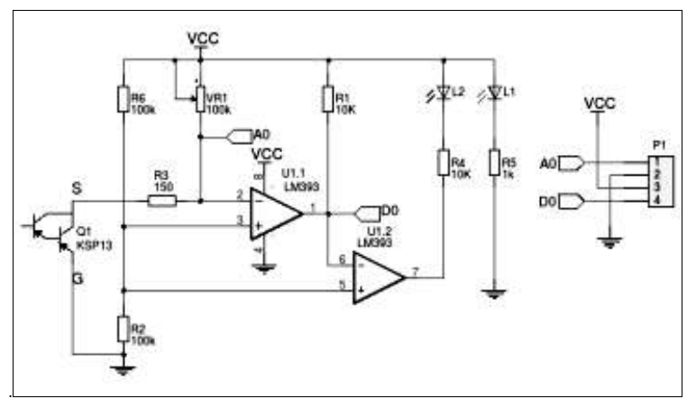

   # Touch Sensor Projects for STM32F103

 <br>

* Digital / Analog <br>
 

<br>


* KY-036 금속 터치 센서 모듈의 내부 구성을 보여주고 있습니다. 
이 회로의 핵심은 아주 미세한 전기 신호를 증폭하여 디지털(D0) 및 아날로그(A0) 신호로 변환하는 것입니다.

## 1. 주요 부품 및 역할
* Q1 (KSP13 Darlington Transistor): 이 센서의 심장부입니다. 달링턴 트랜지스터는 전류 증폭률($\beta$)이 매우 높아, 사람이 금속 핀을 만졌을 때 발생하는 극미량의 미세 전류를 포착하여 증폭합니다.
* U1 (LM393): 듀얼 전압 비교기(Comparator)입니다.
   * U1.1: 증폭된 신호를 우리가 설정한 기준 전압과 비교합니다.v
   * U1.2: LED 인디케이터 구동 등을 위해 신호를 처리합니다.
* VR1 (100k 가변저항/포텐셔미터): 터치 감도를 조절하는 데 쓰입니다. 기준 전압을 변경하여 어느 정도의 접촉이 있어야 신호를 발생시킬지 결정합니다.
* L1 & L2 (LED): L1은 전원 표시등(Power), L2는 터치 감지 시 점등되는 동작 표시등(Switch)입니다.

## 2. 회로 동작 원리
* 아날로그 출력 (A0)
   * 사용자가 금속 전극(S)에 손을 대면, 인체의 미세한 전기적 신호가 **Q1(KSP13)**의 베이스로 들어갑니다.
   * 증폭된 신호가 노드 A0로 전달됩니다.
   * 이 지점의 전압은 터치 강도나 접촉 면적에 따라 변하며, 아두이노 등의 ADC(Analog to Digital Converter) 핀으로 읽을 수 있습니다.
* 디지털 출력 (D0)
   * U1.1(LM393) 비교기는 **2번 핀(반전 입력)**의 터치 신호와 **3번 핀(비반전 입력)**의 기준 전압을 비교합니다.
   * 비반전 입력(3번 핀)은 저항 분배기($R6, R2$)를 통해 고정된 전압이 인가됩니다. (회로상 $R6, R2$가 모두 $100k\Omega$이므로 대략 $1/2 \ V_{CC}$)
   * 터치로 인해 2번 핀의 전압이 기준 전압보다 낮아지면(또는 높아지는 설계에 따라), 비교기의 출력인 **1번 핀(D0)**의 상태가 바뀝니다 (High $\leftrightarrow$ Low).

## 3. 출력 핀 설명 (P1 커넥터)
| 핀 번호 | 이름 | 설명 | 
|:----:|:----:|:----:|
| 1 | A0 | Analog Output: 터치 강도에 따른 전압 변화량 출력 | 
| 2 | GND |  그라운드 (0V) | 
| 3 | VCC | 전원 입력 (보통 3.3V ~ 5V) | 
| 4 | D0 | Digital Output: 설정된 감도(Threshold)를 넘기면 신호 발생 | 

## 4. 요약 및 팁
   * 감도 조절: 만약 터치를 안 했는데도 LED가 켜져 있거나, 세게 눌러도 반응이 없다면 **VR1(파란색 가변저항)**을 드라이버로 돌려 조절해야 합니다.
   * 주의사항: 이 센서는 정전식 터치 센서(TTP223 등)와 달리 금속 전극에 직접적인 접촉이 일어날 때 더 민감하게 반응하며, 주변의 전자기 노이즈에 영향을 받을 수 있습니다.

## 5. 채터링

* 이 코드는 KY-036 터치 센서의 신호 패턴을 인식하는 비블로킹(non-blocking) 구현입니다.

* __io_putchar – printf 표준 출력을 USART2(UART)로 리다이렉션하여 시리얼 터미널에 문자열을 출력할 수 있게 합니다.

* 상수:
   * TICK_MS 1 – 1ms마다 한 번씩 GPIO를 샘플링
   * WINDOW_MS 150 – rising edge를 카운트할 시간 창(150ms)
   * EDGE_THRESHOLD 6 – 터치로 판단할 최소 rising edge 개수

* ProcessTouch() 동작 흐름:
   * HAL_GetTick() 기반 1ms 주기로 GPIO를 읽어 rising edge(0→1)를 감지하고 카운트
   * 150ms가 지날 때마다 윈도우 내의 rising edge 개수를 확인
   * 6개 이상이면 터치 패턴(120ms 동안 23ms HIGH + 78ms LOW × 8회)이 발생했다고 판단하고 touchState 갱신
   * touchState가 0→1로 변한 순간에만 HAL_GPIO_TogglePin()으로 LD2를 토글하고, 시리얼로 상태와 시각을 출력
   * 패턴이 없으면 touchState를 0으로 리셋 (터치 해제)

* 장점:
   * HAL_Delay()를 사용하지 않아 비블로킹 → 다른 작업을 방해하지 않음
   * 단순한 채터링(1~2회 edge)은 임계값 미달로 자연스럽게 필터링됨
   * 터치 시마다 LED가 토글되어 on/off 상태 전환에 적합

```c
/* USER CODE BEGIN 0 */
int __io_putchar(int ch)
{
    HAL_UART_Transmit(&huart2, (uint8_t *)&ch, 1, HAL_MAX_DELAY);
    return ch;
}

#define TICK_MS         1
#define WINDOW_MS       150
#define EDGE_THRESHOLD  6

static void ProcessTouch(void)
{
    static uint32_t nextTick;
    static uint8_t  lastPin;
    static uint16_t risingEdges;
    static uint32_t windowStart;
    static uint8_t  touchState;

    uint32_t now = HAL_GetTick();
    if (now < nextTick) return;
    nextTick = now + TICK_MS;

    uint8_t pin = (HAL_GPIO_ReadPin(TOUCH_GPIO_Port, TOUCH_Pin) == GPIO_PIN_SET);

    if (pin && !lastPin) risingEdges++;

    if ((now - windowStart) >= WINDOW_MS) {
        uint8_t detected = (risingEdges >= EDGE_THRESHOLD);
        if (detected != touchState) {
            touchState = detected;
            printf("%s at %lu ms\r\n",
                   touchState ? "TOUCH DETECTED" : "TOUCH RELEASED",
                   HAL_GetTick());
            if (touchState) {
                HAL_GPIO_TogglePin(LD2_GPIO_Port, LD2_Pin);
            }
        }
        risingEdges = 0;
        windowStart = now;
    }

    lastPin = pin;
}
/* USER CODE END 0 */
```

```c
  /* USER CODE BEGIN 2 */
  printf("========================\r\n");
  printf("KY-036 Touch Sensor Test\r\n");
  printf("========================\r\n");
  /* USER CODE END 2 */
```

```c
  /* Infinite loop */
  /* USER CODE BEGIN WHILE */
  while (1)
  {
	  ProcessTouch();
    /* USER CODE END WHILE */

    /* USER CODE BEGIN 3 */
  }
  /* USER CODE END 3 */
}
```
