# KY-024 선형 홀 센서 모듈 (Linear Hall Sensor Module)

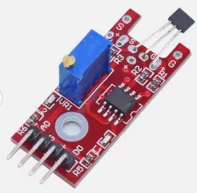 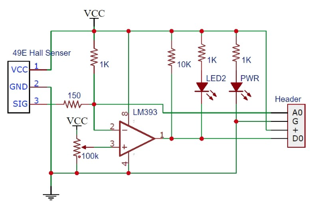

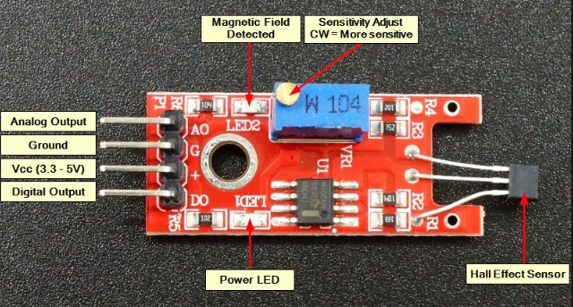

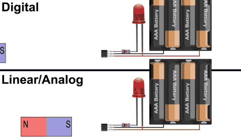

| 디지털 출력 | 선형/아날로그 출력 |
|:--------------------:|:--------------------:|
| 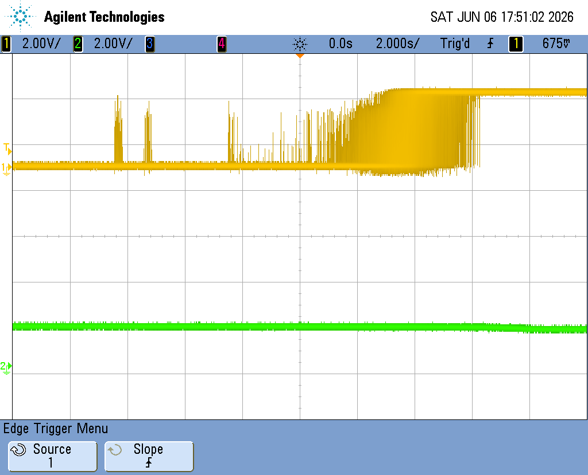 | 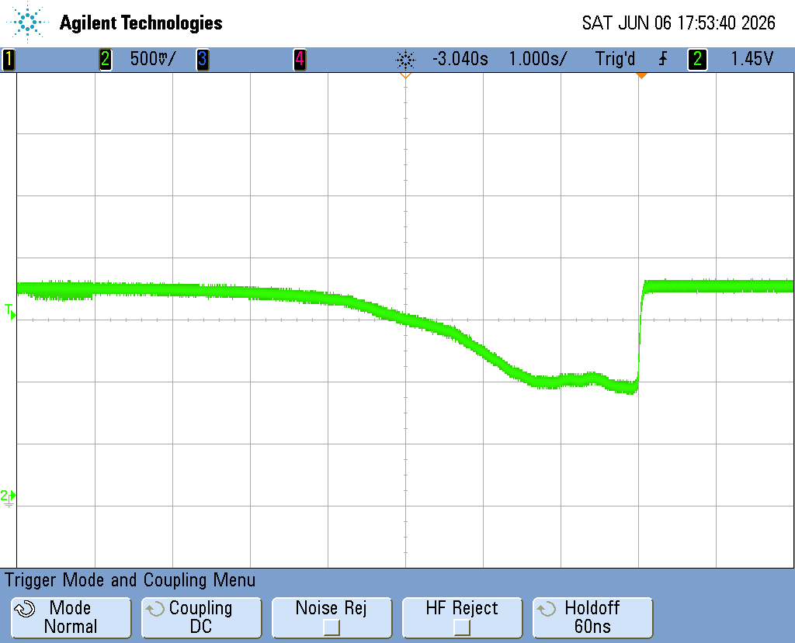 |

> **측정 시 주의:** 센서를 옆으로 뉘인 상태에서 윗면에 자성을 인가해야 합니다.

---

## 1. 핵심 원리: 홀 효과 (Hall Effect)

- 도체나 반도체에 전류가 흐르고 있는 상태에서, 수직 방향으로 자기장($B$)이 가해지면 전하(전자)가 한쪽으로 쏠리는 현상이 발생합니다.
- 이때 양단에 발생하는 전압차를 **'홀 전압($V_H$)'** 이라고 하며, 선형 홀 센서는 이 전압을 측정합니다.

## 2. 주요 특징 및 출력 방식

선형 홀 센서(예: AH3503, SS49E 등)는 일반적인 '홀 스위치'와 출력이 다릅니다.

- **선형 출력 (Linear Output)**: 자석이 가까워질수록 출력 전압이 매끄럽게 변합니다. 자석의 N극이 오는지 S극이 오는지에 따라 전압이 기준치보다 높아지거나 낮아집니다.
- **정지 전압 (Null Voltage)**: 자기장이 없을 때 대략 전원의 절반(예: 5V 입력 시 2.5V) 정도의 전압을 유지합니다.
- **비접촉 측정**: 물리적 마찰 없이 위치나 속도를 측정할 수 있어 수명이 매우 깁니다.

## 3. 회로 구성 (주요 포인트)

보통 KY-024(선형 홀 모듈) 같은 형태의 회로로 많이 사용되며, 구성은 터치 센서와 유사합니다.

1. **Hall Element**: 자기장을 감지하는 소자
2. **Op-Amp (LM393)**:
   - **아날로그 출력 (A0)**: 홀 소자에서 나온 증폭된 전압을 그대로 보냅니다. 자석과의 거리를 측정할 때 사용합니다.
   - **디지털 출력 (D0)**: 특정 자계 강도를 넘었을 때 'On/Off' 신호만 보냅니다. (가변저항으로 기준치 설정 가능)

## 4. 활용 사례

- **거리 측정**: 자석과의 거리에 따른 전압 변화를 이용해 정밀한 위치 파악
- **전류 측정**: 전선 주위에 발생하는 자기장을 측정하여 비접촉식으로 전류량을 계산 (ACS712 등)
- **속도 제어**: 전동 킥보드나 전기 자전거의 스로틀(가속 손잡이) 내부에 자석과 함께 위치하여 가속도 조절
- **진동 및 기울기**: 미세한 자기 변화를 포착하여 기기의 떨림 감지

## 5. 홀 효과(Hall Effect) 센서의 응용 분야

### 5.1 자동차 산업 (Automotive Industry)

- 휠 속도 센서 (ABS 제동 시스템)
- 스로틀 위치 센서 (Throttle Position Sensor)
- 엔진 타이밍 센서 (Engine Timing Sensor)

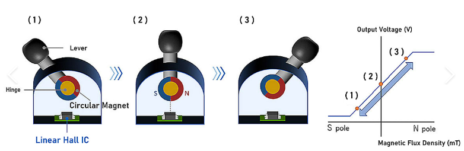

### 5.2 산업용 응용 분야 (Industrial Applications)

- 근접 감지 (Proximity Sensing)
- 컨베이어 벨트 속도 측정
- 비접촉식 전류 측정 (Contactless Current Measurement)

### 5.3 소비자 전자기기 (Consumer Electronics)

- 스마트폰 (플립 커버 감지)
- 키보드 (기계식 키보드의 키 입력 감지)
- 게임 컨트롤러

### 5.4 의료 기기 (Medical Devices)

- 자기공명영상장치 (MRI, Magnetic Resonance Imaging)
- 생체의료 센서 (근접 기반 의료 도구)

### 5.5 항공우주 및 방위 산업 (Aerospace and Defense)

- 자기장 측정 (Magnetic Field Measurement)
- 우주선 자세 제어 (Spacecraft Attitude Control)
- 정밀 항법 시스템 (Precision Navigation)

---

# KY-035 아날로그 홀 센서 모듈 (Analog Hall Sensor Module)

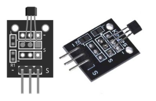

| 센서 확대사진 | 테스트 파형 |
|:-----------------:|:-----------------:|
| 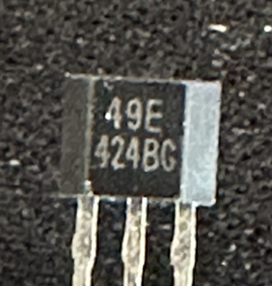 | 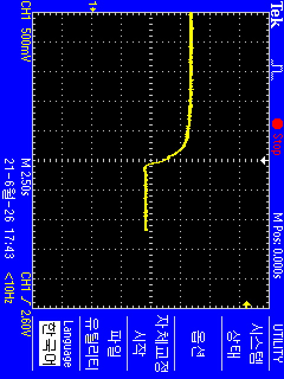 | 

* KY-035는 49E 선형 홀 효과 센서를 사용하여 자기장을 감지하고 극성과 상대적 세기를 측정하는 Arduino용 아날로그 홀 센서입니다.
* KY-024와 달리 단일 아날로그 출력만 있으며 가변 저항이 없습니다 — 아날로그 자기장 판독만 필요한 애플리케이션을 위한 더 간단한 배선 구조입니다.

* 자기장이 감지되지 않으면 출력 신호는 입력 전압의 약 절반입니다.
* 자기장이 감지되면 자석의 극성과 근접도에 따라 출력 신호가 올라가거나 내려갑니다.

* 이 모듈은 이 모듈과 매우 유사하게 보이는 디지털 자기 센서인 KY-003보다 더 상세한 근접 판독을 제공합니다.
* 또한 디지털/아날로그 자기 센서인 KY-024와 기능적으로 유사합니다.

* Arduino, ESP32, ESP8266과 같은 널리 사용되는 마이크로컨트롤러 보드와 호환됩니다.
* Raspberry Pi 사용자는 이 모듈을 사용하려면 외부 아날로그-디지털 변환 보드가 필요합니다.

## KY-035 사양

* 이 모듈은 매우 간단하며, 49E 선형 홀 효과 센서와 3개의 수 핀 헤더로 구성됩니다.

| 항목 | 값 |
|:---:|:---:|
| 동작 전압 | 2.7V ~ 6V |
| 전력 소비 | ~ 6mA |
| 감도 | 1.4 ~ 2.0mV/GS |
| 동작 온도 | -40°C ~ 85°C [-40°F ~ 185°F] |
| 보드 크기 | 18.5mm x 15mm [0.728in x 0.591in] |

## 연결 다이어그램

* KY-035의 전원 라인(중간)과 접지(-)를 Arduino의 +5V와 GND에 각각 연결합니다. 신호(S)를 Arduino의 A0 핀에 연결합니다.

| KY-035 | Arduino |
|:------:|:-------:|
| S | Pin A0 |
| 중간 | 5V |
| – | GND |

## KY-035 Arduino 코드

* 다음 Arduino 스케치는 모듈에서 값을 읽습니다. 출력 신호는 입력 전압에 의해 결정되는 초기값에서 시작합니다.

* 동일한 극성의 자기장이 감지되면 값이 감소하고, 극성이 반전되면 값이 증가합니다.

```cpp
int sensorPin = A0;   // interface pin with magnetic sensor
int val;              // variable to store read values

void setup() {
  pinMode(A0, INPUT);   // set analog pin as input
  Serial.begin(9600);   // initialize serial interface
}

void loop() {
  val = analogRead(sensorPin);  // read sensor value
  Serial.println(val);          // print value to serial

  delay(100);
}
```

* Arduino IDE의 **도구 > 시리얼 플로터 (Tools > Serial Plotter)** 를 사용하면 자기장의 세기와 극성 변화를 시각화할 수 있습니다.

---

# KY-003 홀 자기 센서 모듈 (Hall Magnetic Sensor Module)

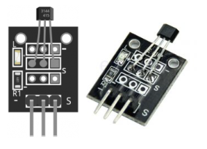

* KY-003은 A3144 단극 홀 스위치(unipolar hall switch)를 기반으로 한 Arduino용 홀 효과 자기 센서 모듈입니다.
* 자석의 남극이 칩의 표시된 면을 향하면 신호 핀이 LOW가 되는 깨끗한 디지털 출력을 제공하므로, 근접 감지, RPM/속도 측정 및 위치 감지에 이상적입니다.
* KY-003은 Elegoo 및 Keyestudio와 같은 브랜드의 인기 있는 37-in-1 Arduino 센서 키트에도 포함되어 있습니다.

* 4.5~24V에서 작동하며(Arduino에서는 일반적으로 5V), Arduino Uno, Mega, Nano 및 ESP32/ESP8266과 함께 사용할 수 있습니다 — 단, 3.3V는 A3144의 정격 최소 전압보다 낮습니다(작동 방식 참조).
* KY-003(KY003으로도 표기)은 단순한 On/Off 판독값을 제공합니다.
* 아날로그 자기장 세기 판독을 위해서는 KY-035를, 디지털/아날로그 콤보를 위해서는 KY-024를 사용하세요.

## KY-003 사양

KY-003 모듈은 A3144(A3144E / AH3144 / OH3144 / 3144EUA-S) 단극 홀 효과 스위치, 680Ω 저항, 전원 LED 및 3개의 수 핀 헤더로 구성됩니다. 보드 크기: 18.5 × 15mm.

| 항목 | 값 |
|:---:|:---:|
| 센서 IC | A3144 (A3144E / AH3144 / OH3144 / 3144EUA-S) |
| 센서 유형 | 단극 홀 효과 스위치 (Unipolar hall-effect switch) |
| 출력 | 오픈 컬렉터 NPN, 액티브 LOW, 비래칭 (non-latching) |
| 동작 전압 | 4.5~24V (5V 일반; 3.3V는 정격 미만) |
| 트리거 | IC의 브랜드/표시 면에 자석의 **남극(South pole)** |
| 온보드 부품 | A3144 + 680Ω 저항 + LED |
| 동작 온도 | -40 ~ 85°C |
| 보드 크기 | 18.5 × 15mm |

## KY-003 핀 배치

KY-003에는 3개의 2.54mm 핀 헤더가 있습니다. 신호 핀은 S로 표시되어 있으며, 중간 핀은 VCC, – 핀은 접지입니다.

| 라벨 | 기능 | Arduino 연결 |
|:---:|:---:|:-----------:|
| – (왼쪽) | 접지 (GND) | GND |
| 중간 | VCC | +5V |
| S (오른쪽) | 신호 — 오픈 컬렉터, 자석 감지 시 LOW | 디지털 핀 (Uno 핀 3) |

## 연결 다이어그램

보드의 전원 라인(중간)과 접지(-)를 Arduino의 +5V와 GND에 각각 연결합니다. 신호(S)를 Arduino의 핀 3에 연결합니다.

| KY-003 | Arduino |
|:------:|:-------:|
| S | Pin 3 |
| 중간 | +5V |
| – | GND |

## KY-003 동작 원리

* KY-003 내부에는 A3144, 단극(unipolar) 홀 효과 스위치가 있습니다. IC의 자기장이 임계값을 초과하면 내부 트랜지스터가 켜지고 신호 핀을 LOW로 풀다운(pull)합니다.
* **단극(unipolar)** 이란 칩의 표시된 면에 한 극성만 반응한다는 의미입니다 — 구체적으로 **남극(South pole)** 에 반응합니다.
* 북극(North pole)을 가져가거나 뒷면에서 접근하면 출력은 HIGH를 유지합니다. 이것이 KY-003이 작동하지 않는 것처럼 보이는 가장 흔한 원인입니다.

* 출력은 **오픈 컬렉터(open-collector)** 입니다: A3144는 핀을 LOW로만 풀다운할 수 있고, 스스로 HIGH로 구동할 수 없습니다.
* 이것이 코드에서 `INPUT_PULLUP`을 사용하는 이유입니다 — Arduino의 내부 풀업 저항이 자석이 없을 때 핀을 HIGH로 유지하여 두 상태 모두에서 깨끗한 판독을 제공합니다.
* A3144에는 히스테리시스가 내장된 슈미트 트리거도 포함되어 있어, 자석이 감지 필드 가장자리를 천천히 통과할 때 출력이 채터링(chattering)하지 않습니다.

* KY-003은 **비래칭(non-latching)** 입니다: 자기장이 해제 임계값 아래로 떨어지면 즉시 출력이 HIGH로 돌아갑니다.
* 감지 범위는 자석의 세기에 따라 다릅니다. 일반적인 소형 자석은 수 밀리미터에서 ~10mm 이내에서 센서를 트리거합니다.

## KY-003 Arduino 코드

* 아래 예제는 간단한 On/Off 감지기에서 인터럽트 기반 자석 카운팅 및 RPM 측정까지 다양합니다. 모두 A3144의 오픈 컬렉터 출력을 위한 안정적인 신호를 위해 `INPUT_PULLUP`을 사용합니다.

### 기본 — 자석 감지 (Basic — Detect a Magnet)

* 자석의 남극이 센서 근처에 있을 때 핀 13의 내장 LED를 켭니다. 자석이 감지되면 신호 핀이 LOW가 됩니다 — `INPUT_PULLUP`은 자석이 없을 때 깨끗한 HIGH를 보장합니다.

```cpp
const int sensor = 3;
const int led = 13;

void setup() {
  // A3144 output is open-collector — INPUT_PULLUP gives a clean HIGH when no magnet is present
  pinMode(sensor, INPUT_PULLUP);
  pinMode(led, OUTPUT);
}

void loop() {
  int val = digitalRead(sensor);
  if (val == LOW) { // south pole of magnet near A3144 marked face → output LOW
    digitalWrite(led, HIGH);
  } else {
    digitalWrite(led, LOW);
  }
}
```

### 자석 통과 횟수 카운트 (Count Magnet Passes)

* 핀 3에서 인터럽트를 사용하여 바쁜 루프에서도 자석 통과를 놓치지 않습니다.
* 9600 보드레이트에서 시리얼 모니터를 열면 실시간 카운트를 확인할 수 있습니다.

```cpp
const int sensor = 3;
volatile int count = 0; // volatile: modified inside the ISR, read in the main loop

void onMagnet() {
  count++; // called instantly each time the signal falls LOW (magnet detected)
}

void setup() {
  Serial.begin(9600);
  pinMode(sensor, INPUT_PULLUP);
  // Pin 3 = interrupt 1 on Uno/Nano
  // FALLING triggers when the pin goes HIGH→LOW, i.e. when the magnet arrives
  attachInterrupt(digitalPinToInterrupt(sensor), onMagnet, FALLING);
}

void loop() {
  // Print the running total every 500 ms
  // The interrupt keeps counting in the background regardless of this delay
  Serial.print("Magnet passes: ");
  Serial.println(count);
  delay(500);
}
```

### RPM 측정 (Measure RPM)

* 1초 윈도우 동안 펄스를 카운트하고 RPM으로 변환합니다. 회전 휠에 자석 하나를 장착하고, 자석을 더 추가하면 `magnetsPerRev` 값을 증가시키세요.
* 펄스 카운트는 ISR과의 경합 조건을 피하기 위해 `noInterrupts()`로 원자적으로 읽힙니다.

```cpp
const int sensor = 3;
const int magnetsPerRev = 1; // increase if you mount multiple magnets on the wheel
volatile int pulses = 0;

void onPulse() {
  pulses++;
}

void setup() {
  Serial.begin(9600);
  pinMode(sensor, INPUT_PULLUP);
  attachInterrupt(digitalPinToInterrupt(sensor), onPulse, FALLING);
}

void loop() {
  // Snapshot and reset the pulse count atomically
  noInterrupts();
  int count = pulses;
  pulses = 0;
  interrupts();

  // RPM = pulses-per-second × 60 ÷ magnets-per-revolution
  float rpm = (count / (float)magnetsPerRev) * 60.0;
  Serial.print("RPM: ");
  Serial.println(rpm);
  delay(1000); // 1-second measurement window
}
```

## KY-003 응용 분야

- **근접 및 존재 감지 (Proximity and Presence Detection)** — 컨베이어 물체 감지나 닫힌 뚜껑 감지 등 비접촉 방식으로 자석이 범위 내에 들어오는지 감지
- **RPM 및 속도 측정 (RPM and Speed Measurement)** — 회전축이나 휠에 하나 이상의 자석을 장착하고 초당 펄스를 카운트하여 속도 계산 (위 RPM 예제 참조)
- **위치 및 엔드스톱 감지 (Position and End-stop Sensing)** — 3D 프린터나 CNC 기계의 축 리미트 스위치와 같이 이동 부품이 설정 지점에 도달했는지 감지
- **도어 및 뚜껑 보안 (Door and Lid Security)** — 도어에 자석, 프레임에 센서를配对하여 열림/닫힘 상태 감지 및 알람 또는 이벤트 기록
- **유량계 펄스 카운팅 (Flow-meter Pulse Counting)** — 터빈 블레이드의 자석이 회전할 때마다 센서를 트리거하여 유량에 비례하는 펄스 카운트 제공
- **브러시리스 모터 정류 (Brushless Motor Commutation)** — BLDC 모터 컨트롤러에서 회전자 위치를 감지하고 스위칭 시퀀스 타이밍을 결정하는 데 홀 효과 센서 사용

## 문제 해결 및 FAQ

Q1. **KY-003은 어떻게 자석을 감지하나요?**
   * KY-003은 A3144 단극 홀 효과 스위치를 사용합니다.
   * IC 임계값을 초과하는 자기장이 존재하면 내부 트랜지스터가 신호 핀을 LOW로 풀다운합니다.
   * 단극(unipolar)이란 한 극성에만 반응한다는 의미입니다 — 칩의 표시된 면에 **남극(South pole)** 이 와야 합니다.
   * 센서가 전혀 트리거되지 않으면 자석을 뒤집어보세요: 잘못된 극성을 제시하면 아무 효과가 없습니다.

Q2. **A3144는 어떤 유형의 출력을 가지나요?**
   * A3144는 오픈 컬렉터(open-collector) 출력을 가집니다 — 신호 핀을 LOW로 풀다운할 수는 있지만 스스로 HIGH로 구동할 수는 없습니다.
   * 이것이 스케치에서 `INPUT_PULLUP`이 필요한 이유입니다: Arduino 내부 풀업이 자석이 없을 때 핀을 HIGH로 유지하여 두 상태 모두에서 깨끗한 판독을 제공합니다.
   * 자석이 근처에 없는데 출력이 LOW에 고정되거나 불규칙하게 읽히면 풀업이 누락된 것입니다 — `pinMode(sensor, INPUT_PULLUP)`을 설정하세요.

Q3. **KY-003에 필요한 전압은 얼마인가요?**
   * A3144는 4.5~24V 정격이며, Arduino에서는 일반적으로 5V가 사용됩니다.
   * 모듈을 3.3V(ESP32/ESP8266)에서 실행하는 것은 정격 최소 전압 미만이므로 작동이 보장되지 않습니다 <br>
   — 3.3V 보드에서 아무 반응이 없으면 모듈을 5V 레일에서 전원을 공급하고 MCU GPIO가 5V 내성이 아닌 경우 신호 라인을 레벨 시프트하세요.

Q4. **KY-003, KY-035, KY-024의 차이점은 무엇인가요?**
   * KY-003은 단순한 디지털 On/Off 출력을 제공합니다 — 자석 감지 시 LOW, 그렇지 않으면 HIGH입니다.
   * KY-035는 자기장 세기에 비례하는 아날로그 출력을 제공하여 자기장의 강도를 측정해야 할 때 사용합니다.
   * KY-024는 동일한 보드에 디지털 출력과 아날로그 출력을 모두 제공합니다.

Q5. **KY-003으로 RPM이나 속도를 측정할 수 있나요?**
   * 네. 회전축이나 휠에 하나 이상의 자석을 장착하고 `attachInterrupt(FALLING)`을 사용하여 초당 펄스를 카운트합니다.
   * RPM = (초당 펄스 수 × 60) ÷ 회전당 자석 수. 폴링된 `digitalRead` 루프 대신 인터럽트를 사용하세요 — 폴링 루프는 자석이 빠르게 지나갈 때 펄스를 놓칠 수 있습니다.
   * 작동 코드는 위의 RPM 측정 예제를 참조하세요.

Q6. **KY-003 출력은 디지털인가요 아날로그인가요?**
   * 디지털 전용입니다. A3144는 슈미트 트리거 스위치입니다 — 출력은 HIGH 또는 LOW이며, 중간 값은 없습니다.
   * 자기장 세기에 비례하는 연속적인 아날로그 판독이 필요하면 KY-035를 대신 사용하세요.

Q7. **감지 범위가 너무 짧습니다**
   * 트리거 거리는 전적으로 자석의 세기에 따라 달라집니다. 약하거나 작은 자석은 1~2mm에서만 센서를 트리거할 수 있습니다.
   * 더 강한 자석을 사용하거나 IC의 표시된 면에 더 가까이 가져오세요.

---

*출처: https://arduinomodules.info/*
