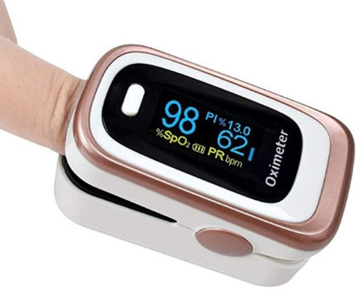
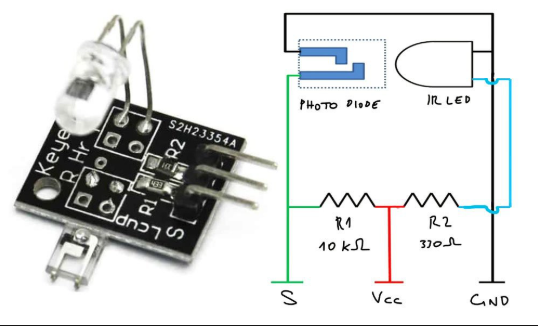
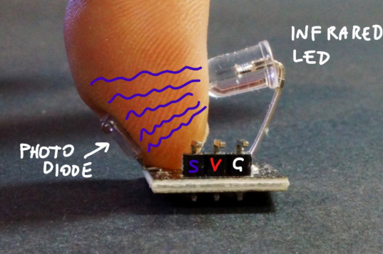
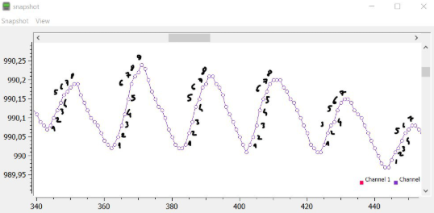

# Heartbeat Sensor Module (심박수 측정 센서)

* 이 프로젝트는 광학식 심박수 측정 센서(Pulse Sensor)의 하드웨어 구성 소자와 동작 원리를 정리한 문서입니다. 
* 아두이노, 라즈베리 파이 등 다양한 MCU와 연동하여 실시간 심박수(BPM) 데이터를 얻는 데 활용됩니다.


  

---

## 1. 개요 (Overview)
심박수 센서 모듈은 **광혈류 측정(Photoplethysmogram, PPG)** 방식을 사용합니다. 피부 표면에 빛을 조사하여 혈류량의 변화를 감지하고, 이를 전기적 신호로 변환하여 심박수를 계산합니다.

## 2. 주요 구성 소자 (Hardware Components)

| 소자명 | 역할 및 특징 |
| :--- | :--- |
| **High-Brightness Green LED** | 혈관을 향해 특정 파장의 빛(약 550nm)을 조사합니다. <br> 녹색광은 혈액 내 헤모글로빈에 대한 흡수율이 높아 심박 측정에 유리합니다. |
| **APD (Ambient Light Photosensor)** | 반사된 빛을 감지하는 소자입니다.  <br> 주변 광원 노이즈를 걸러내는 필터가 포함되어 있어 정확도를 높입니다. |
| **Op-Amp (Operational Amplifier)** | 포토 센서에서 발생한 미세한 아날로그 신호를 MCU가  <br> 인식할 수 있는 전압 크기로 증폭합니다. (예: MCP6001) |
| **Noise Filters (RC Filter)** | 저항(R)과 커패시터(C)를 조합하여 고주파 노이즈를 제거하고 깨끗한 맥박 파형을 만듭니다. |
| **Voltage Regulator / Diode** | 전원을 안정적으로 공급하고 역전압으로부터 회로를 보호합니다. |

---

## 3. 동작 원리 (How It Works)

### 1) 광원 조사 및 흡수
녹색 LED가 손가락이나 귓볼 등의 피부 조직에 빛을 쏩니다. 이때 혈관 속의 **헤모글로빈**은 녹색광을 흡수하는 성질이 있습니다.

### 2) 맥동에 따른 광량 변화
* **심장 수축 (Systole):** 혈관에 혈액이 가득 차면서 헤모글로빈이 많아집니다. 결과적으로 **빛의 흡수량이 최대**가 되고 반사량은 줄어듭니다.
* **심장 이완 (Diastole):** 혈관 내 혈액량이 줄어들며 **빛의 흡수량이 최소**가 되고 반사량은 늘어납니다.

### 3) 신호 증폭 및 데이터화
포토 센서는 반사된 빛의 양에 따라 변하는 미세 전류를 감지합니다. 이 신호는 증폭기(Op-Amp)를 거쳐 **0 ~ VCC 사이의 아날로그 전압**으로 변환되어 출력됩니다.

### 4) BPM 계산
마이크로컨트롤러(MCU)는 아날로그 입력 핀(ADC)으로 파형을 읽어들여, 연속된 피크(Peak) 사이의 시간 간격을 측정함으로써 분당 심박수(BPM)를 산출합니다.

---

## 심박수 센서(Heartbeat Sensor)의 작동 원리
   * 산소 포화도(Oxygen Saturation)를 측정하기에 앞서, 먼저 심박수 센서가 어떻게 작동하는지 이해해야 합니다. 
   * 여기서 사용할 심박수 센서는 **KY-039** 모듈로, 적외선 LED(Infrared LED)와 포토다이오드(Photodiode)로 구성되어 있습니다. 이 포토다이오드는 940nm 파장의 적외선을 수신할 수 있어야 합니다. 
   * 다음 단계에서 산소 포화도를 측정하기 위해 센서를 처음부터 직접 제작(From scratch)하려는 경우, 적색광(약 600nm)과 적외선(약 940nm)을 모두 수신할 수 있도록 **넓은 분광 감도 범위(Wide spectral range)**를 가진 포토다이오드가 필요합니다. 
   * (예를 들어 `LPT 80A` 같은 부품이 적합할 수 있지만, KY-039 모듈에 정확히 이 부품이 사용되었는지는 확실하지 않습니다.)

   * 아래 이미지는 인터넷에서 찾은 다양한 센서 키트에 포함된 KY-039 모듈의 모습입니다.



   * 회로도를 보면 알 수 있듯이, 이 센서는 단순히 적외선 LED가 포토다이오드를 향해 빛을 비추는 구조입니다. LED를 보호하고 센서로부터 오는 미세한 신호를 읽기 위해 두 개의 저항이 함께 구성되어 있습니다.
   * 측정할 때는 아래 사진과 같이 적외선 LED와 포토다이오드 사이에 손가락을 위치시킵니다.

 

   * 적외선 LED에서 방출된 빛은 손톱, 피부 및 손가락의 여러 조직에 의해 일부 흡수됩니다.
   * 이때 흡수되는 빛의 양은 일정하지 않고, **혈관을 통과하는 혈류량의 변화에 따라 계속해서 바뀝니다.
   * ** 심장이 뛸 때마다 혈액이 혈관으로 밀려 들어오며, 이로 인해 빛 흡수율이 달라지게 됩니다.
   * 우리는 KY-039 모듈의 `S` 핀을 통해 포토다이오드가 흡수한 빛에 의해 생성되는 전류(신호)를 측정할 수 있습니다.

---

## 신호의 피크(Peak) 검출을 통한 심박수 측정

   * 변화하는 아날로그 신호로부터 정확한 값을 읽어내는 것은 생각보다 쉽지 않습니다. 신호 자체가 매우 미세할 뿐만 아니라 많은 노이즈(Noise)가 섞여 있기 때문에, 의미 있는 데이터를 얻으려면 약간의 수학적 처리가 필요합니다.
   * 이와 관련하여 Johan Ha의 유용한 포스팅이 큰 도움이 되었습니다. 그의 글에서는 적은 수의 샘플 데이터들의 평균을 계산하여 그래프로 플로팅(Plot)하는 방법과, 실내 조명(전등) 등으로 인해 발생하는 미세한 노이즈를 제거하는 방법을 설명하고 있습니다. 
   * 실험을 통해 알아낸 흥미로운 점은, 이 심박수 센서는 적절한 주변광(Ambient light)이 있을 때 오히려 좋은 신호를 기록한다는 것입니다. 센서를 검은 천으로 완전히 덮어버리면 신호에 노이즈가 너무 많이 발생했습니다.
   * Johan Ha는 코드에서 배열(Array)을 활용하여, 새로운 값을 배열에 집어넣고(Push) 가장 오래된 값을 버리는(Drop) 방식으로 **최근 X개 데이터의 이동 평균(Moving Average)**을 유지하는 방식을 사용했습니다.
   * 또한 그는 신호가 상승하는 타이밍을 찾는 알고리즘도 기술했습니다. 데이터 값이 직전 값보다 연속으로 증가하는 횟수가 `N`번 이상 지속될 때를 하나의 **피크(Peak, 정점)**로 인식하는 방식입니다.
   * SerialPlot 프로그램을 사용하면 적절한 `N`값(코드 내 `rise_threshold` 상수)을 더 정확하게 정의할 수 있습니다. 아래 차트를 예로 들면, 만약 임계값(Threshold)을 7보다 큰 값으로 설정하게 되면 몇몇 심박(Beat)을 놓치게 됩니다.



   * 일단 신호의 피크들을 올바르게 찾아내기만 하면, 피크의 개수를 세거나 연속된 심박 사이의 시간 간격을 계산하여 **BPM(Beats Per Minute, 분당 심박수)**을 아주 쉽게 구해낼 수 있습니다.

---

 <br>


## 4. 핀 맵 (Pin Connection)

| Pin | Name | Description |
| :---: | :--- | :--- |
| **S** | Signal | 아날로그 신호 출력 (MCU의 Analog In 핀 연결) |
| **+** | VCC | 전원 공급 (보통 3.3V ~ 5V) |
| **-** | GND | 그라운드 연결 |

---

* TM32F103(NUCLEO-F103RB)에서 KY-039 심박 센서의 아날로그 신호를 읽어 피크를 검출하고, 이를 파이썬으로 시각화하는 전체 시스템 가이드를 작성해 드립니다.

## 1. STM32F103 (MCU) 코드 구성
   * 이 코드는 ADC(Analog-to-Digital Converter)를 사용하여 센서 값을 읽고, 간단한 이동 평균 필터(Moving Average Filter)를 통해 노이즈를 제거한 뒤 피크를 검출합니다.

* 회로 연결
   * KY-039 VCC: 5V (또는 3.3V)
   * KY-039 GND: GND
   * KY-039 Signal (S): PA0 (ADC1_IN0)

* STM32 C 코드 (Main 루프 핵심 부분)
* ADC1을 10ms(100Hz) 주기로 샘플링한다고 가정합니다.

```C
#include "main.h"
#include <stdio.h>

#define SAMPLE_SIZE 10
#define RISE_THRESHOLD 5  // 연속 상승 횟수 임계값

ADC_HandleTypeDef hadc1;
UART_HandleTypeDef huart2;

// 시리얼 출력을 위한 printf 설정
int __io_putchar(int ch) {
    HAL_UART_Transmit(&huart2, (uint8_t *)&ch, 1, 0xFFFF);
    return ch;
}

void SystemClock_Config(void);

int main(void) {
    HAL_Init();
    SystemClock_Config();
    MX_ADC1_Init();
    MX_USART2_UART_Init();

    uint32_t adc_val = 0;
    uint32_t samples[SAMPLE_SIZE] = {0};
    uint8_t index = 0;
    uint32_t last_avg = 0;
    uint8_t rise_count = 0;
    uint32_t last_beat_time = 0;

    while (1) {
        // 1. ADC 샘플링
        HAL_ADC_Start(&hadc1);
        if (HAL_ADC_PollForConversion(&hadc1, 10) == HAL_OK) {
            adc_val = HAL_ADC_GetValue(&hadc1);
        }
        HAL_ADC_Stop(&hadc1);

        // 2. 이동 평균 필터 (노이즈 제거)
        samples[index] = adc_val;
        index = (index + 1) % SAMPLE_SIZE;
        
        uint32_t sum = 0;
        for(int i=0; i<SAMPLE_SIZE; i++) sum += samples[i];
        uint32_t avg = sum / SAMPLE_SIZE;

        // 3. 피크 검출 (연속 상승 로직)
        if (avg > last_avg) {
            rise_count++;
            if (rise_count == RISE_THRESHOLD) {
                // 비트 발생! 현재 시간 기록 및 BPM 계산 가능
                uint32_t current_time = HAL_GetTick();
                uint32_t interval = current_time - last_beat_time;
                if (interval > 400) { // 최소 400ms 간격 (최대 150BPM 제한)
                    int bpm = 60000 / interval;
                    // 파이썬 전송용 데이터 포맷: "ADC값,BPM"
                    printf("%ld,%d\n", avg, bpm);
                    last_beat_time = current_time;
                }
            }
        } else {
            rise_count = 0;
        }
        
        // 피크가 아닐 때도 그래프를 위해 ADC 값 전송
        if(rise_count != RISE_THRESHOLD) {
             printf("%ld,0\n", avg); 
        }

        last_avg = avg;
        HAL_Delay(10); // 100Hz 샘플링
    }
}
```

## 2. PC용 파이썬 시각화 코드
   * 파이썬의 PyQtGraph 라이브러리를 사용하여 실시간으로 심박 그래프를 그리고 BPM을 표시합니다. 이 라이브러리는 matplotlib보다 실시간 성능이 훨씬 뛰어납니다.

* 사전 준비
   * 터미널에서 아래 라이브러리를 설치하세요.

```Bash
pip install pyserial pyqtgraph PyQt5
```

* 파이썬 코드 (heart_rate_monitor.py)
* 이 코드는 시리얼 포트(COMx 등)에서 데이터를 읽어 실시간으로 렌더링합니다.

```Python
import sys
import serial
import serial.tools.list_ports
import pyqtgraph as pg
from PyQt5 import QtWidgets, QtCore

class HeartRateMonitor(QtWidgets.QMainWindow):
    def __init__(self):
        super().__init__()

        # UI 설정
        self.setWindowTitle("STM32 Heartbeat Monitor")
        self.central_widget = QtWidgets.QWidget()
        self.setCentralWidget(self.central_widget)
        self.layout = QtWidgets.QVBoxLayout(self.central_widget)

        # BPM 표시 라벨
        self.label = QtWidgets.QLabel("BPM: --")
        self.label.setStyleSheet("font-size: 30px; font-weight: bold; color: red;")
        self.layout.addWidget(self.label)

        # 그래프 설정
        self.plot_widget = pg.PlotWidget()
        self.layout.addWidget(self.plot_widget)
        self.curve = self.plot_widget.plot(pen=pg.mkPen('g', width=2))
        self.data = []
        self.max_points = 200 # 화면에 보일 데이터 개수

        # 시리얼 설정 (포트는 본인의 환경에 맞춰 수정 필요)
        self.serial_port = serial.Serial('COM3', 115200, timeout=0.1) 
        
        # 타이머 설정 (20ms 마다 그래프 업데이트)
        self.timer = QtCore.QTimer()
        self.timer.timeout.connect(self.update)
        self.timer.start(20)

    def update(self):
        if self.serial_port.in_waiting > 0:
            try:
                line = self.serial_port.readline().decode('utf-8').strip()
                if line:
                    # 데이터 분리 (ADC값, BPM)
                    raw_val, bpm = map(int, line.split(','))
                    
                    # 그래프 데이터 업데이트
                    self.data.append(raw_val)
                    if len(self.data) > self.max_points:
                        self.data.pop(0)
                    self.curve.setData(self.data)

                    # BPM 업데이트 (0이 아닐 때만)
                    if bpm > 0:
                        self.label.setText(f"BPM: {bpm}")
            except Exception as e:
                print(f"Error: {e}")

    def closeEvent(self, event):
        self.serial_port.close()
        event.accept()

if __name__ == "__main__":
    app = QtWidgets.QApplication(sys.argv)
    window = HeartRateMonitor()
    window.show()
    sys.exit(app.exec_())
```

## 3. 작동 원리 요약

   * MCU 필터링: KY-039 센서는 노이즈에 매우 취약합니다. SAMPLE_SIZE를 조절하여 이동 평균을 내면 그래프가 부드러워집니다.
   * 피크 검출: RISE_THRESHOLD는 데이터가 연속으로 몇 번 상승했을 때 "심박의 시작"으로 볼 것인지 결정합니다. 주변 밝기에 따라 ADC 값이 변하므로 절대값이 아닌 변화량을 기준으로 합니다.
   * 데이터 전송: printf를 통해 ADC값,BPM\n 형태의 문자열을 보냅니다. 파이썬은 이 쉼표(,)를 기준으로 데이터를 파싱합니다.
   * PC 시각화: PyQtGraph는 수신된 ADC 값을 실시간 선 그래프로 그리고, 계산된 BPM을 화면 상단에 큰 텍스트로 보여줍니다.

* 주의사항
   * 시리얼 포트: 파이썬 코드의 COM3 부분은 장치 관리자에서 확인한 STM32의 실제 포트 번호로 수정해야 합니다 (리눅스/맥은 /dev/ttyACM0 등).
   * 밀착도: KY-039 센서는 손가락을 너무 세게 누르면 혈류가 차단되어 측정이 안 되고, 너무 떼면 노이즈가 심해집니다. 적당한 압력을 유지하세요.

---

## 5. 사용 팁 및 주의사항
* **적정 압력:** 센서를 너무 세게 누르면 혈류가 차단되어 측정이 불가능하고, 너무 살살 대면 빛이 새어 들어와 노이즈가 발생합니다.
* **절연 유지:** 손가락의 땀이나 유분으로 인한 회로 쇼트를 방지하기 위해 센서 전면부에 투명 필름이나 절연 처리가 되어 있는지 확인하세요.
* **노이즈 환경:** 직사광선이 강한 곳에서는 포토 센서가 간섭을 받을 수 있으므로 차광 환경에서 측정하는 것이 좋습니다.

* https://www.youtube.com/watch?v=ssMag56u1q0
* https://hackaday.io/project/170752-oximeter-do-it-yourself


