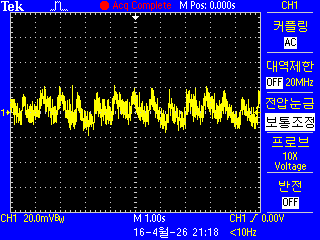
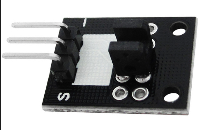
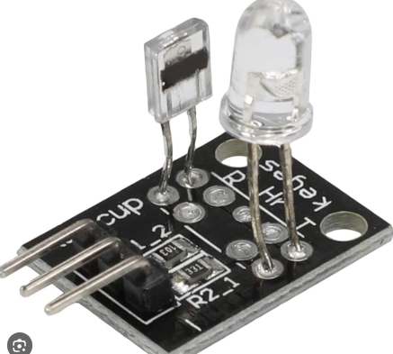
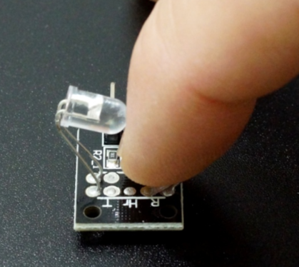

# Heart Beat Sensor Projects for STM32F103

  
  
  
  

# Heartbeat Sensor Module (심박수 측정 센서)

이 프로젝트는 광학식 심박수 측정 센서(Pulse Sensor)의 하드웨어 구성 소자와 동작 원리를 정리한 문서입니다. 아두이노, 라즈베리 파이 등 다양한 MCU와 연동하여 실시간 심박수(BPM) 데이터를 얻는 데 활용됩니다.

---

## 1. 개요 (Overview)
심박수 센서 모듈은 **광혈류 측정(Photoplethysmogram, PPG)** 방식을 사용합니다. 피부 표면에 빛을 조사하여 혈류량의 변화를 감지하고, 이를 전기적 신호로 변환하여 심박수를 계산합니다.

## 2. 주요 구성 소자 (Hardware Components)

| 소자명 | 역할 및 특징 |
| :--- | :--- |
| **High-Brightness Green LED** | 혈관을 향해 특정 파장의 빛(약 550nm)을 조사합니다. 녹색광은 혈액 내 헤모글로빈에 대한 흡수율이 높아 심박 측정에 유리합니다. |
| **APD (Ambient Light Photosensor)** | 반사된 빛을 감지하는 소자입니다. 주변 광원 노이즈를 걸러내는 필터가 포함되어 있어 정확도를 높입니다. |
| **Op-Amp (Operational Amplifier)** | 포토 센서에서 발생한 미세한 아날로그 신호를 MCU가 인식할 수 있는 전압 크기로 증폭합니다. (예: MCP6001) |
| **Noise Filters (RC Filter)** | 저항(R)과 커패시터(C)를 조합하여 고주파 노이즈를 제거하고 깨끗한 맥박 파형을 만듭니다. |
| **Voltage Regulator / Diode** | 전원을 안정적으로 공급하고 역전압으로부터 회로를 보호합니다. |

---

## 3. 동작 원리 (How It Works)

### 1) 광원 조사 및 흡수
녹색 LED가 손가락이나 귓볼 등의 피부 조직에 빛을 쏩니다. 이때 혈관 속의 **헤모글로빈**은 녹색광을 흡수하는 성질이 있습니다.

### 2) 맥동에 따른 광량 변화
* **심장 수축 (Systole):** 혈관에 혈액이 가득 차면서 헤모글로빈이 많아집니다. 결과적으로 **빛의 흡수량이 최대**가 되고 반사량은 줄어듭니다.
* **심장 이완 (Diastole):** 혈관 내 혈액량이 줄어들며 **빛의 흡수량이 최소**가 되고 반사량은 늘어납니다.

### 3) 신호 증폭 및 데이터화
포토 센서는 반사된 빛의 양에 따라 변하는 미세 전류를 감지합니다. 이 신호는 증폭기(Op-Amp)를 거쳐 **0 ~ VCC 사이의 아날로그 전압**으로 변환되어 출력됩니다.

### 4) BPM 계산
마이크로컨트롤러(MCU)는 아날로그 입력 핀(ADC)으로 파형을 읽어들여, 연속된 피크(Peak) 사이의 시간 간격을 측정함으로써 분당 심박수(BPM)를 산출합니다.

---

## 4. 핀 맵 (Pin Connection)

| Pin | Name | Description |
| :---: | :--- | :--- |
| **S** | Signal | 아날로그 신호 출력 (MCU의 Analog In 핀 연결) |
| **+** | VCC | 전원 공급 (보통 3.3V ~ 5V) |
| **-** | GND | 그라운드 연결 |

---

## 5. 사용 팁 및 주의사항
* **적정 압력:** 센서를 너무 세게 누르면 혈류가 차단되어 측정이 불가능하고, 너무 살살 대면 빛이 새어 들어와 노이즈가 발생합니다.
* **절연 유지:** 손가락의 땀이나 유분으로 인한 회로 쇼트를 방지하기 위해 센서 전면부에 투명 필름이나 절연 처리가 되어 있는지 확인하세요.
* **노이즈 환경:** 직사광선이 강한 곳에서는 포토 센서가 간섭을 받을 수 있으므로 차광 환경에서 측정하는 것이 좋습니다.

