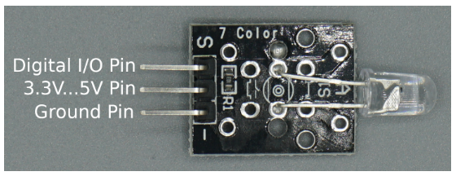

# 7 Color Flash LED (KY-034)

* 7색 플래시 LED는 약 2~3초 주기로 7가지 색상이 자동 전환되는 모듈입니다. 
* 색상 제어 로직이 LED 내부에 내장되어 있어,  
   제어를 위한 디지털 I/O 핀 1개와  
   전원(5V 또는 3.3V) 및  
   그라운드(GND)를 연결하는 기본 회로만으로 간단히 구동할 수 있습니다.

## S 신호 제어

* 1. HIGH 일 때 켜짐
   * 코드가 실행되면 핀으로 전원(3.3V 또는 5V)이 공급됩니다.
   * 이때 LED 내부에 탑재된 내장 칩(IC)에 전원이 들어오면서,  
     외부에서 별도의 제어 신호를 주지 않아도 스스로 7가지 색상을 순서대로 바꾸며 빛나게 됩니다. 

* 2. LOW 일 때 꺼짐
   * 핀으로 공급되던 전원이 차단(0V)됩니다. 전원이 완전히 끊기기 때문에 LED 불빛이 꺼질 뿐만 아니라,  
     내부에 있는 색상 전환 제어 로직도 함께 멈추게 됩니다.

3. 색상이 바뀌는 주기 (전환 속도)
   * 색상이 바뀌는 주기는 약 2~3초입니다.
   * 하지만 이 주기가 모든 색상마다 똑같이 '빨강 2초, 초록 2초...' 형태로 딱딱 끊어지는 것은 아닙니다.  
     KY-034 같은 자동 플래시 LED 모듈은 보통 내장된 시퀀스에 따라 다음과 같이 부드럽고 다채롭게 움직입니다.
   * 페이드 인/아웃(Fade): 색상이 서서히 밝아졌다가 어두워지며 다음 색상으로 전환됨 (약 2~3초 소요)
   * 빠른 플래시(Flash): 가끔은 반짝반짝하며 빠르게 색상이 교차됨
