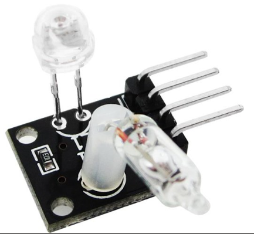
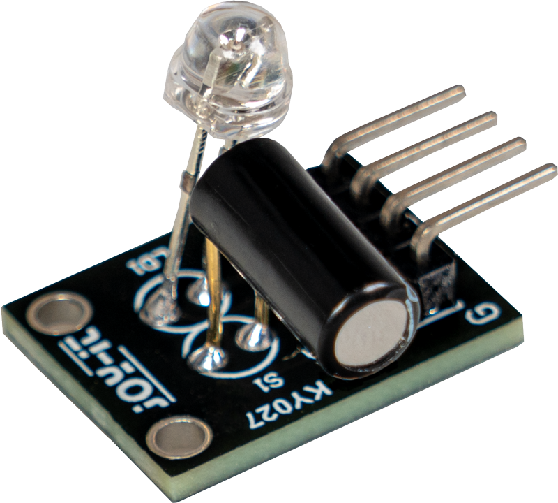
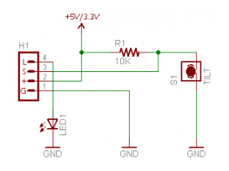

# 매직 라이트 컵(Magic Light Cup) 

 




   * 매직 라이트 컵(Magic Light Cup) 모듈은 대개 2개가 한 쌍으로 구성되어, <br>
     "한쪽 컵을 기울이면 그 안의 불빛이 다른 쪽 컵으로 쏟아져 이동하는 듯한 효과"를 내는 재미있는 인터랙티브 모듈입니다.<br>
     (센서 3~4개가 묶인 세트 부품 중 KY-027이라는 모델명으로 잘 알려져 있습니다.)
   * 이 모듈의 핵심은 내부에 수은 스위치(Tilt Switch) 또는 볼 스위치와 LED가 함께 들어있다는 점입니다. <br>
     기울임을 감지하는 동시에 불빛을 내뿜을 수 있죠.
   * 이 모듈을 활용하면 다음과 같은 재미있는 프로젝트들을 만들 수 있습니다.

---

* Input (기울기 센서): PA0 (또는 원하는 핀)을 GPIO_Input으로 설정하고, 모듈 내부에 저항이 없다면 Pull-up/down 설정을 확인하세요.
* Output (LED): PA1 또는 보드 내장 LED인 LD2_Pin (PA5)을 GPIO_Output으로 설정하세요.
* VCC/GND: 보드의 5V(또는 3.3V)와 GND 핀에 연결하세요.

---

## 1. 매직 라이트 컵 기본 효과 (빛 주고받기)
  * 가장 대표적인 활용법입니다. <br>
    2개의 모듈을 MCU에 연결하고, 한쪽 모듈을 기울이면 그쪽 LED는 서서히 꺼지고, 반대편 모듈의 LED는 서서히 켜지게 프로그래밍합니다.
  * 마치 컵에 담긴 빛을 다른 컵으로 쏟아서 옮기는 듯한 마술 같은 시각 효과를 연출할 수 있어 교육용 코딩 예제나 전시용 아이템으로 인기가 높습니다.

```
/* USER CODE BEGIN 3 */
// 모듈 1: PA0(기울기), PA1(LED) / 모듈 2: PB0(기울기), PB1(LED) 가정
GPIO_PinState tilt1 = HAL_GPIO_ReadPin(GPIOA, GPIO_PIN_0);

if (tilt1 == GPIO_PIN_SET) { // 1번 컵이 기울어짐
    HAL_GPIO_WritePin(GPIOA, GPIO_PIN_1, GPIO_PIN_RESET); // 1번 LED 끄기
    HAL_GPIO_WritePin(GPIOB, GPIO_PIN_1, GPIO_PIN_SET);   // 2번 LED 켜기
} else {                     // 1번 컵이 바로 서 있음
    HAL_GPIO_WritePin(GPIOA, GPIO_PIN_1, GPIO_PIN_SET);   // 1번 LED 켜기
    HAL_GPIO_WritePin(GPIOB, GPIO_PIN_1, GPIO_PIN_RESET); // 2번 LED 끄기
}
/* USER CODE END 3 */
```

## 2. 스마트 무드등 및 취침등
  * 기울기에 따라 반응하는 특성을 이용해 가구에 접목할 수 있습니다.
  * 뒤집으면 켜지는 스탠드: <br>
     - 컵이나 조명을 똑바로 세워두면 꺼져 있다가, 거꾸로 뒤집거나 특정 각도로 기울이면 LED가 부드럽게 켜지는 감성 무드등을 만들 수 있습니다.
  * 타이머 취침등: <br>
     - 컵을 기울여 빛을 '충전'하듯 켜두면, 시간이 지나면서 빛이 서서히 흐려지다가 꺼지는 수면 유도등을 구현합니다.

```
/* USER CODE BEGIN 3 */
// PA0: 기울기 센서, LD2_Pin: 내장 LED 사용
if (HAL_GPIO_ReadPin(GPIOA, GPIO_PIN_0) == GPIO_PIN_SET) {
    // 서서히 밝아지는 효과를 주려면 PWM 제어가 필요하지만, 
    // 여기서는 단순 On/Off로 구현합니다.
    HAL_GPIO_WritePin(GPIOA, LD2_Pin, GPIO_PIN_SET); 
} else {
    HAL_GPIO_WritePin(GPIOA, LD2_Pin, GPIO_PIN_RESET);
}
/* USER CODE END 3 */
```

## 3. 디지털 수평계 및 각도 경보기
  * 안에 들어있는 기울기 센서의 특성을 순수하게 활용하는 방법입니다.
  * 안전 수평계: <br>
     - 특정 장비나 물체가 허용 범위를 벗어나 기울어지면, 내장된 LED가 깜빡이거나 색이 변하며 위험을 알리는 경보 장치를 만들 수 있습니다.
  * 지진/진동 감지기: <br>
     - 평소에는 가만히 있다가 외부 충격이나 흔들림으로 인해 모듈이 기울어지면 즉각적으로 불이 들어오는 시스템을 시뮬레이션할 수 있습니다.

```
/* USER CODE BEGIN 3 */
if (HAL_GPIO_ReadPin(GPIOA, GPIO_PIN_0) == GPIO_PIN_SET) {
    // 감지 시 5번 빠르게 깜빡임
    for(int i=0; i<5; i++) {
        HAL_GPIO_TogglePin(GPIOA, LD2_Pin);
        HAL_Delay(100);
    }
    // 시리얼 터미널로 경고 전송
    char msg[] = "Warning: Tilt Detected!\r\n";
    HAL_UART_Transmit(&huart2, (uint8_t*)msg, sizeof(msg), 10);
}
/* USER CODE END 3 */
```

## 4. 완구 및 게임 인터랙티브 요소
  * ‘물 채우기’ 미니게임: <br>
     - 센서를 기울이고 있는 시간에 비례해서 LED의 밝기를 밝혀, 마치 컵에 물(빛)을 게이지처럼 채우는 게임 인터페이스를 만들 수 있습니다.
  
```
/* USER CODE BEGIN PV */
uint16_t energy_level = 0;
/* USER CODE END PV */

/* USER CODE BEGIN 3 */
if (HAL_GPIO_ReadPin(GPIOA, GPIO_PIN_0) == GPIO_PIN_SET) {
    if (energy_level < 1000) energy_level += 10; // 기울이는 동안 에너지 충전
} else {
    if (energy_level > 0) energy_level--;        // 세워두면 에너지 방전
}

if (energy_level > 500) {
    HAL_GPIO_TogglePin(GPIOA, LD2_Pin);
    HAL_Delay(1000 - energy_level); // 에너지 수치에 따라 깜빡임 속도 가변
} else {
    HAL_GPIO_WritePin(GPIOA, LD2_Pin, GPIO_PIN_RESET);
}
/* USER CODE END 3 */
```
  
  * 중력 반응형 롤플레잉 소품: <br>
     - 아이들이 가지고 노는 요술봉이나 칼 같은 장난감에 넣어, 휘두르거나 기울이는 각도에 따라 마법 효과음(부저 추가 시)과 함께 불빛이 바뀌는 효과를 낼 수 있습니다.

💡 모듈의 하드웨어적 특징 (KY-027 기준)
* 이 모듈은 핀이 4개로 구성되어 있습니다.
```
G (GND): 그라운드
+ (VCC): 5V 또는 3.3V 전원
S (Signal / Digital Out): 기울기 센서 출력 (기울어지면 High 또는 Low 신호 발생)
L (LED / Digital In): LED 제어 핀 (아두이노의 PWM 핀에 연결하면 analogWrite()를 통해 빛을 서서히 밝히거나 어둡게 조절 가능)
```

기울기를 감지하는 '센서' 역할과 빛을 내는 '액추에이터' 역할이 직관적으로 합쳐져 있어서, 아두이노의 입력(Input)과 출력(Output) 관계를 배우는 학습용으로 매우 훌륭한 교구입니다.
