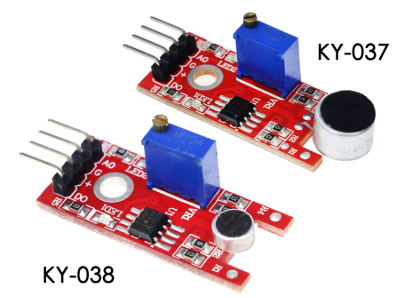

# 고강도 소리 센서 모듈(High-Sensitivity Sound Sensor)과 소형 소리 센서 모듈(Microphone/Small Sound Sensor)

  * 소리 센서 모듈은 주변에서 발생하는 음파(Sound Wave)를 감지하여 전기적 신호로 변환하는 센서입니다.
  * 주로 마이크로폰(Microphone)과 신호 증폭을 위한 비교기(LM393 등)로 구성되며, <br>
    크기와 감도에 따라 크게 **고강도(고감도) 소리 센서**와 **소형 소리 센서**로 나뉩니다.



---

## 1. 고강도 소리 센서 모듈 (High-Sensitivity Sound Sensor)

### 📌 특징
* **높은 감도 (High Sensitivity):** <br>
  상대적으로 크고 정밀한 마이크 전자기판과 증폭 회로가 포함되어 있어, 아주 미세한 소리나 멀리서 나는 소리까지 감지할 수 있습니다.
* **이중 출력 (Digital & Analog):**  <br>
  * `AO (Analog Output)`: 실시간 소리의 크기(전압 변화)를 연속적인 값으로 출력합니다.
  * `DO (Digital Output)`: 가변저항(포텐셔미터)으로 설정한 기준치(Threshold)보다 큰 소리가 나면 High(1) 또는 Low(0) 신호를 출력합니다.
* **감도 조절 가능:**  <br>
  모듈에 내장된 정밀 가변저항을 드라이버로 돌려 소리 감지 임계값을 세밀하게 튜닝할 수 있습니다.

### 🛠 주요 활용 분야
* **보안 및 침입 감지 시스템:**  <br>
  유리창 깨지는 소리, 문 열리는 소리, 발자국 소리 등 미세한 침입 징후를 감지하는 보안 장비.
* **스마트 홈 음성/박수 스위치:**  <br>
  방 안 어디서든 손뼉을 치거나 큰 소리를 내어 전등을 켜고 끄는 제어 시스템.
* **소음 공해 모니터링 시스템:**  <br>
  특정 지역이나 작업장의 데시벨(dB) 변화를 실시간으로 추적하고 기록하는 환경 장치.

---

## 2. 소형 소리 센서 모듈 (Small Sound Sensor / Mini Mic)

### 📌 특징
* **소형화 및 경량화:**  <br>
  크기가 매우 작고 가벼워 웨어러블 기기나 공간이 협소한 소형 로봇, 임베디드 시스템에 내장하기 유리합니다.
* **근접 소음 감지:**  <br>
  고강도 센서에 비해 감도의 범위가 좁고 가깝기 때문에, 주변의 거대한 소음보다는 **센서 바로 근처에서 발생하는 명확한 소리**를 잡아내는 데 유리합니다.
* **단순한 구조:**  <br>
  주로 디지털 출력(DO)만 지원하거나 가변저항 없이 고정된 감도를 제공하는 저가형 제품이 많아 회로가 단순합니다.

### 🛠 주요 활용 분야
* **소형 로봇 및 스마트 장난감:**  <br>
  로봇 바로 앞에서 "탁" 치는 소리를 감지하여 방향을 바꾸거나 멈추는 리액션 완구.
* **웨어러블 기기 (Wearables):**  <br>
  스마트 워치나 헬스케어 기기에 장착되어 착용자의 밀접한 생체 음향(예: 기침 횟수 감지)을 모니터링하는 장치.
* **드론 및 이동형 소형 디바이스:**  <br>
  무게에 민감한 비행체나 소형 디바이스에 탑재되어 충돌음이나 근접 신호음을 감지하는 용도.

---

## 3. 한눈에 보는 비교 요약

| 항목 | 고강도 소리 센서 모듈 | 소형 소리 센서 모듈 |
| :--- | :--- | :--- |
| **크기 및 무게** | 상대적으로 크고 무거움 | 매우 작고 가벼움 |
| **감도 범위** | 광범위 (미세한 소리, 원거리 소리 감지) | 근접 구역 (가까운 소리, 명확한 소리 감지) |
| **출력 방식** | 대개 아날로그(AO) 및 디지털(DO) 모두 지원 | 주로 디지털(DO) 위주 또는 단일 출력 |
| **주요 부품** | 대형 콘덴서 마이크, 가변저항, LM393 등 | 소형 마이크, 최소한의 인터페이스 소자 |
| **적합한 프로젝트** | 데시벨 측정기, 스마트 홈 스위치, 방범 장치 | 소형 장난감 로봇, 웨어러블 디바이스 |

---

## 💡 개발자 팁 (MCU 연동 시 주의사항)
1. **아날로그 전압 변동:** <br> 
  `AO` 핀을 MCU의 ADC 포트에 연결하여 소리 크기를 정밀 측정할 때, 전원(VCC)에 노이즈가 섞이면 소리 데이터가 튈 수 있습니다. <br>
  바이패스 커패시터나 안정적인 전원 공급이 필수적입니다.
3. **주파수 분석의 한계:** <br> 
  이 모듈들은 대개 **소리의 세기(Amplitude)**를 측정하는 용도입니다. <br>
  목소리의 피치(Pitch)나 특정 주파수를 분석하여 음성을 인식하려면, 이 센서가 아닌 <br>
  **MAX9814, MAX4466** 같은 증폭기 내장형 마이크 모듈을 사용하고 FFT(고속 푸리에 변환) 알고리즘을 적용해야 합니다.

---

* 고강도 또는 소형 소리 센서 모듈(디지털 출력 DO 및 아날로그 출력 AO 지원 기준)을 활용하여 구현할 수 있는 실용적인 예제 3가지와, <br>
  이를 STM32F103(NUCLEO-F103RB) 보드에서 구동하기 위한 통합 펌웨어 코드를 작성해 드립니다.

## 1. 소리 센서 활용 예제 3가지

* 예제 ①: 손뼉 소리로 전등 켜고 끄기 (Clap Switch)
   * 개념: 센서의 디지털 출력(DO)을 활용합니다. <br>
     손뼉을 "탁" 칠 때 발생하는 순간적인 대음량 신호를 외부 인터럽트(EXTI)로 감지하여 LED나 릴레이(Relay)의 상태를 토글(Toggle)합니다.
   * 활용: 스마트 홈 조명 제어, 박수 소리로 구동하는 장난감.

* 예제 ②: 일정 소음 이상 시 경보 알림 (Noise Barrier / Alarm)
   * 개념: 센서의 아날로그 출력(AO)을 ADC로 주기적으로 샘플링합니다. <br>
     데시벨 값에 대응하는 아날로그 전압이 지정된 임계값(Threshold)을 연속으로 초과하면 부저(Buzzer)나 경고 LED를 작동시킵니다.
   * 활용: 도서관 및 자습실 소음 경고 장치, 공장 내 작업자 청각 보호 알림.

* 예제 ③: 소리 크기에 반응하는 LED 이퀄라이저 (Sound Reactive LED)
   * 개념: 아날로그 출력(AO) 값을 읽어 소리의 크기에 비례하여 여러 개의 LED를 차례로 점등하거나, <br>
     타이머 PWM 기능을 이용해 소리가 클수록 LED가 더 밝게 빛나도록 제어합니다.
   * 활용: 인테리어 무드등, 무대 조명 효과 장치.

## 2. STM32F103 통합 펌웨어 구현
* 아래 코드는 위의 3가지 예제를 모두 테스트할 수 있도록 통합된 구조입니다.
   * 디지털 입력 (Clap 입력): PA4핀을 외부 인터럽트(EXTI4)로 설정하여 박수 소리를 감지합니다. (감지 시 보드 내장 LED PA5 토글)
   * 아날로그 입력 (소리 크기): PA0핀을 ADC1_IN0으로 설정하여 실시간 소리 크기를 읽고 시리얼 포트로 전송합니다.

### 핀 맵핑 (Pin Mapping)
   * 소리 센서 DO: PA4 (External Interrupt, Falling/Rising Edge)
   * 소리 센서 AO: PA0 (ADC1_Channel 0)
   * 보드 내장 LED: PA5 (NUCLEO-F103RB Green LED)
   * 시리얼 디버깅: PA2(TX), PA3(RX) (USART2)

### STM32 C 소스 코드 (main.c)

```C
#include "main.h"
#include <stdio.h>

ADC_HandleTypeDef hadc1;
UART_HandleTypeDef huart2;

/* printf 기능 활성화 */
int __io_putchar(int ch) {
    HAL_UART_Transmit(&huart2, (uint8_t *)&ch, 1, 0xFFFF);
    return ch;
}

void SystemClock_Config(void);
static void MX_GPIO_Init(void);
static void MX_ADC1_Init(void);
static void MX_USART2_UART_Init(void);

/* 예제 ①: 손뼉 소리 감지 시 호출되는 콜백 함수 (외부 인터럽트) */
void HAL_GPIO_EXTI_Callback(uint16_t GPIO_Pin) {
    if (GPIO_Pin == GPIO_PIN_4) {
        // 손뼉 소리가 감지되면 내장 LED(PA5) 상태를 토글
        HAL_GPIO_TogglePin(GPIOA, GPIO_PIN_5);
        
        // 디버깅 메시지 출력 (인터럽트 내 printf는 짧게 유지해야 합니다)
        printf("[EVENT] Clap Detected! LED Toggled.\r\n");
    }
}

int main(void) {
    HAL_Init();
    SystemClock_Config();

    /* 주변장치 초기화 */
    MX_GPIO_Init();
    MX_ADC1_Init();
    MX_USART2_UART_Init();

    uint32_t sound_level = 0;
    const uint32_t NOISE_THRESHOLD = 2500; // 예제 ②용 임계값 (12비트 ADC: 0 ~ 4095)

    printf("Sound Sensor Program Started.\r\n");

    while (1) {
        /* 예제 ② & ③: 아날로그 소리 신호 읽기 */
        HAL_ADC_Start(&hadc1);
        if (HAL_ADC_PollForConversion(&hadc1, 10) == HAL_OK) {
            sound_level = HAL_ADC_GetValue(&hadc1);
        }
        HAL_ADC_Stop(&hadc1);

        /* PC 시리얼 플로터로 데이터 전송 (그래프 시각화용) */
        printf("%ld\r\n", sound_level);

        /* 예제 ②: 소음 공해/경보 모니터링 로직 */
        if (sound_level > NOISE_THRESHOLD) {
            // 소음 기준치 초과 시 경고 메시지 출력 
            // (필요 시 이곳에 부저 구동용 GPIO 설정을 추가할 수 있습니다)
            printf("[WARNING] High Noise Level Detected: %ld\r\n", sound_level);
            HAL_Delay(100); // 연속적인 경보 중복 발생 방지
        }

        HAL_Delay(10); // 100Hz 주기로 ADC 샘플링 및 모니터링
    }
}

/* ================= 주변장치 설정 함수 (HAL) ================= */

static void MX_ADC1_Init(void) {
    ADC_ChannelConfTypeDef sConfig = {0};

    hadc1.Instance = ADC1;
    hadc1.Init.ScanConvMode = ADC_SCAN_DISABLE;
    hadc1.Init.ContinuousConvMode = DISABLE;
    hadc1.Init.DiscontinuousConvMode = DISABLE;
    hadc1.Init.ExternalTrigConv = ADC_SOFTWARE_START;
    hadc1.Init.DataAlign = ADC_DATAALIGN_RIGHT;
    hadc1.Init.NbrOfConversion = 1;
    if (HAL_ADC_Init(&hadc1) != HAL_OK) {
        Error_Handler();
    }

    /** Configure Regular Channel */
    sConfig.Channel = ADC_CHANNEL_0; // PA0
    sConfig.Rank = ADC_REGULAR_RANK_1;
    sConfig.SampleTime = ADC_SAMPLETIME_1CYCLE_5;
    if (HAL_ADC_ConfigChannel(&hadc1, &sConfig) != HAL_OK) {
        Error_Handler();
    }
}

static void MX_USART2_UART_Init(void) {
    huart2.Instance = USART2;
    huart2.Init.BaudRate = 115200;
    huart2.Init.WordLength = UART_WORDLENGTH_8B;
    huart2.Init.StopBits = UART_STOPBITS_1;
    huart2.Init.Parity = UART_PARITY_NONE;
    huart2.Init.Mode = UART_MODE_TX_RX;
    huart2.Init.HwFlowCtl = UART_HWCONTROL_NONE;
    huart2.Init.OverSampling = UART_OVERSAMPLING_16;
    if (HAL_UART_Init(&huart2) != HAL_OK) {
        Error_Handler();
    }
}

static void MX_GPIO_Init(void) {
    GPIO_InitTypeDef GPIO_InitStruct = {0};

    /* GPIO Ports Clock Enable */
    __HAL_RCC_GPIOA_CLK_ENABLE();

    /* PA5: 내장 LED 출력 핀 설정 */
    HAL_GPIO_WritePin(GPIOA, GPIO_PIN_5, GPIO_PIN_RESET);
    GPIO_InitStruct.Pin = GPIO_PIN_5;
    GPIO_InitStruct.Mode = GPIO_GPIO_MODE_OUTPUT_PP;
    GPIO_InitStruct.Pull = GPIO_NOPULL;
    GPIO_InitStruct.Speed = GPIO_SPEED_FREQ_LOW;
    HAL_GPIO_Init(GPIOA, &GPIO_InitStruct);

    /* PA4: 소리 센서 DO 입력 및 외부 인터럽트(EXTI) 설정 */
    GPIO_InitStruct.Pin = GPIO_PIN_4;
    GPIO_InitStruct.Mode = GPIO_MODE_IT_FALLING; // 센서 특성에 따라 RISING/FALLING 선택
    GPIO_InitStruct.Pull = GPIO_PULLUP;
    HAL_GPIO_Init(GPIOA, &GPIO_InitStruct);

    /* EXTI 인터럽트 우선순위 설정 및 활성화 */
    HAL_NVIC_SetPriority(EXTI4_IRQn, 2, 0);
    HAL_NVIC_EnableIRQ(EXTI4_IRQn);
}

void SystemClock_Config(void) {
    // NUCLEO-F103RB 기본 클럭 설정 코드 (CubeMX 자동 생성 구문 사용)
}

void Error_Handler(void) {
    __disable_irq();
    while (1) {}
}
```

💡 개발 가이드 및 팁
1. 디지털 감도 튜닝(박수 소리 인식):
   * 박수를 쳤을 때 PA5 LED가 정상적으로 토글되려면, 소리 센서 모듈에 있는 가변저항을 십자 드라이버로 미세하게 돌려주어야 합니다.
   * 평소(조용할 때)에는 모듈의 DO-LED가 꺼져 있다가, 큰 소리가 날 때만 순간적으로 깜빡이도록 튜닝하는 것이 핵심입니다.
2. 아날로그 피크 확인:
   * 코드 내 NOISE_THRESHOLD 값(현재 2500)은 주변 환경 소음에 맞춰 수정해야 합니다.
   * 이전 답변에서 구현한 파이썬 시리얼 모니터 프로그램이나 아두이노 IDE의 시리얼 플로터를 켜두고 실시간으로 올라오는 값을 모니터링하면서 최적의 임계값을 설정하세요.

   
