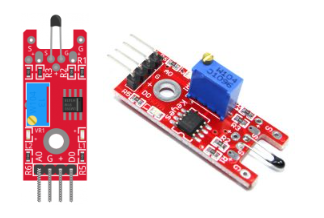
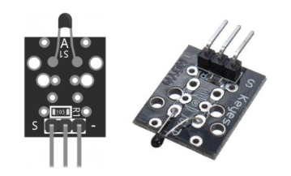
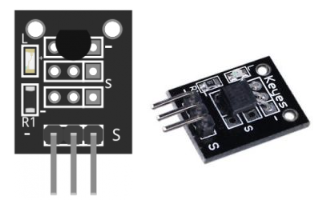

# 디지털 온도 센서 KY-028



- KY-028은 NTC 서미스터 기반 Arduino용 디지털 온도 센서입니다.
- -55°C ~ 125°C 범위에서 ±0.5°C 정확도로 측정하며, 디지털 출력(임계값 트리거)과 아날로그 출력(상대 온도 판독)을 모두 제공하고, 감지 임계값을 설정하는 가변 저항이 장착되어 있습니다.
- Arduino, Raspberry Pi, ESP32 및 기타 마이크로컨트롤러와 호환됩니다.

## KY-028 사양

- 이 모듈은 NTC 서미스터, LM393 이중 차동 비교기, 3296W 트리머 가변 저항, 6개의 저항, 2개의 LED 및 4개의 수 핀 헤더로 구성됩니다. 아날로그 및 디지털 출력을 지원합니다.

| 항목 | 값 |
|:---:|:---:|
| 동작 전압 | 3.3V ~ 5.5V |
| 온도 측정 범위 | -55°C ~ 125°C [-67°F ~ 257°F] |
| 측정 정확도 | ±0.5°C |
| 보드 크기 | 15mm x 36mm [0.6in x 1.4in] |

## 연결 다이어그램

- 보드의 아날로그 출력(A0)을 Arduino의 A0 핀에 연결하고 디지털 출력(D0)을 핀 3에 연결합니다.
- 전원 라인(+)과 접지(G)를 각각 5V와 GND에 연결합니다.

| KY-028 | STM32F103 |
|:------:|:---------:|
| A0 | Pin A0 |
| G | GND |
| + | +5V |
| D0 | Pin 2 |

## KY-028 Arduino 코드

온도 임계값에 도달하면 디지털 인터페이스가 HIGH 신호를 보내 Arduino의 LED(핀 13)를 켭니다. 가변 저항을 시계 방향으로 돌리면 감지 임계값이 증가하고 반시계 방향으로 돌리면 감소합니다.

아날로그 인터페이스는 온도와 가변 저항 위치에 따라 달라지는 숫자 값을 반환합니다. 아날로그 출력 핀이 가변 저항에 직접 연결되어 있으므로 KY-013에서와 같이 Steinhart-Hart 방정식을 사용하여 온도를 계산할 수 없으며, 이 값을 사용하여 온도의 상대적 변화만 측정할 수 있습니다.

```cpp
int led = 13; // define the LED pin
int digitalPin = 2; // KY-028 digital interface
int analogPin = A0; // KY-028 analog interface
int digitalVal; // digital readings
int analogVal; //analog readings

void setup()
{
  pinMode(led, OUTPUT);
  pinMode(digitalPin, INPUT);
  //pinMode(analogPin, OUTPUT);
  Serial.begin(9600);
}

void loop()
{
  // Read the digital interface
  digitalVal = digitalRead(digitalPin); 
  if(digitalVal == HIGH) // if temperature threshold reached
  {
    digitalWrite(led, HIGH); // turn ON Arduino's LED
  }
  else
  {
    digitalWrite(led, LOW); // turn OFF Arduino's LED
  }

  // Read the analog interface
  analogVal = analogRead(analogPin); 
  Serial.println(analogVal); // print analog value to serial

  delay(100);
}
```

---

# 아날로그 온도 센서 KY-013 (HW-498)



KY-013(HW-498이라고도 함)은 NTC 서미스터를 기반으로 한 Arduino용 아날로그 온도 센서입니다. 많은 Arduino 스타터 키트에서 흔히 볼 수 있는 부품입니다.

주변 온도를 연속적인 전압으로 변환하여 Arduino가 아날로그(ADC) 핀에서 읽은 다음 Steinhart-Hart 방정식을 사용하여 정밀한 값으로 변환합니다. 단순한 임계값 기반 센서와 달리 -55°C ~ 125°C 범위에서 ±0.5°C 정확도로 측정합니다.

Arduino, ESP32 등 널리 사용되는 전자 플랫폼과 호환됩니다.

## KY-013 사양

이 모듈은 10kΩ NTC 서미스터, 이에 대응하는 10kΩ 고정 저항(함께 전압 분배기를 형성), 3핀 수 헤더로 구성됩니다. NTC 유형이므로 온도가 상승하면 서미스터의 저항이 감소합니다. Arduino는 분배기의 출력 전압을 아날로그 핀에서 읽고 Steinhart-Hart 방정식(또는 아래 나열된 B-값을 사용하는 더 간단한 Beta 방정식)을 사용하여 온도로 변환합니다.

| 항목 | 값 |
|:---:|:---:|
| 센서 유형 | NTC 서미스터 (MF52), 아날로그 출력 |
| 동작 전압 | 3.3V ~ 5V |
| 측정 범위 | -55°C ~ +125°C (-67°F ~ 257°F) |
| 정확도 | ±0.5°C |
| 서미스터 공칭 저항 | 25°C에서 10kΩ |
| B-값 (B25/50) | 3950K |
| 직렬 (분배) 저항 | 10kΩ |
| 인터페이스 | 3핀 — S(신호), 중간(+V), –(GND) |
| 보드 크기 | ~19 × 15mm |

## KY-013 핀 배치

KY-013에는 3개의 핀이 있습니다. 기억해야 할 한 가지는 중간 핀이 신호가 아닌 전원(VCC)이라는 점입니다 — 흔한 배선 실수입니다. 신호 핀(S)은 NTC 서미스터 분배기의 아날로그 전압을 전달하고, – 핀은 접지입니다. 아래 연결 다이어그램을 참조하여 Arduino에 배선하는 방법을 확인하세요.

| 라벨 | 기능 |
|:---:|:---:|
| S (Signal) | 아날로그 출력 — NTC 분배기의 전압 |
| 중간 | 전원 (VCC), 3.3~5V |
| – | 접지 |

**참고:** 핀 라벨과 순서는 제조사와 클론 보드에 따라 다릅니다(KY-013은 HW-498로도 판매됨) — 배선 전에 항상 모듈의 실크스크린을 확인하세요. 중간 핀은 모든 버전에서 전원이지만, 외부 S와 – 핀은 가끔 바뀔 수 있습니다; 판독값이 온도가 올라갈 때 반대로 움직이면(내려가면) 두 연결을 바꾸세요.

## 연결 다이어그램

모듈의 전원 라인(중간)과 접지(-)를 Arduino의 5V와 GND에 각각 연결합니다. 모듈의 신호 핀(S)을 Arduino의 A0 핀에 연결합니다.

일부 KY-013은 다른 핀 배열을 가지고 있습니다. 연결하기 전에 보드를 확인하세요.

| KY-013 | Arduino |
|:------:|:-------:|
| S | A0 |
| 중간 | 5V |
| – | GND |

KY-013과 같은 아날로그 온도 센서는 주변 온도를 Arduino가 읽을 수 있는 연속적인 전압으로 변환합니다. 모듈의 핵심은 NTC(부온도계수) 서미스터로, 온도가 올라가면 저항이 감소하는 저항기입니다. 모듈은 이 서미스터를 고정 10kΩ 저항과 직렬로 연결하여 전압 분배기를 형성하므로 신호 핀의 전압이 온도에 따라 부드럽게 변화합니다.

전체 신호 체인은 다음과 같이 작동합니다:

1. 온도 변화가 NTC 서미스터의 저항을 변화시킵니다(더 따뜻하면 저항 감소).
2. 서미스터와 고정 10kΩ 저항이 전압 분배기를 형성하여 저항을 전압으로 변환합니다.
3. Arduino의 아날로그-디지털 변환기(ADC)가 전압을 0~1023 값(12비트 ESP32 ADC에서는 0~4095)으로 읽습니다.
4. Steinhart-Hart 방정식이 그 값을 °C 단위의 온도로 변환합니다.

저항-온도 관계가 비선형이므로, ADC 값에서 직접 온도를 읽을 수 없습니다 — 공식을 적용해야 합니다. 아래 스케치는 KY-013의 B25/50 = 3950K 사양에서 파생된 Steinhart-Hart 계수를 사용하며, 전체 -55°C ~ 125°C 범위에서 정확한 판독을 위해 조정되었습니다.

## KY-013 Arduino 코드

```cpp
int ThermistorPin = A0;
int Vo;
float R1 = 10000; // value of R1 on board
float logR2, R2, T;
float c1 = 0.0010222847, c2 = 0.0002531646, c3 = 0.0; // S-H coefficients derived from MF52 B=3950 K spec
void setup() {
  Serial.begin(9600);
}
void loop() {
  Vo = analogRead(ThermistorPin);
  R2 = R1 * (1023.0 / (float)Vo - 1.0); //calculate resistance on thermistor
  logR2 = log(R2);
  T = (1.0 / (c1 + c2*logR2 + c3*logR2*logR2*logR2)); // temperature in Kelvin
  T = T - 273.15; //convert Kelvin to Celsius
 // T = (T * 9.0)/ 5.0 + 32.0; //convert Celsius to Fahrenheit
  Serial.print("Temperature: ");
  Serial.print(T);
  Serial.println(" C");
  delay(500);
}
```

## KY-013 ESP32 코드

ESP32 스케치는 두 가지 조정을 제외하고 Arduino 버전과 동일하게 작동합니다: 신호 핀을 GPIO34(또는 ADC1 핀, 32~39)에 연결하고 모듈을 3.3V로 전원 공급합니다 — ESP32의 ADC 기준 전압은 3.3V이므로 5V를 사용하면 핀이 손상됩니다. 12비트 ADC는 0~1023 대신 0~4095를 읽으므로 저항 공식에 4095.0을 제수로 사용합니다.

```cpp
int ThermistorPin = 34;
int Vo;
float R1 = 10000; // value of R1 on board
float logR2, R2, T;
float c1 = 0.0010222847, c2 = 0.0002531646, c3 = 0.0; // S-H coefficients derived from MF52 B=3950 K spec

void setup() {
  Serial.begin(115200);
}

void loop() {
  Vo = analogRead(ThermistorPin);
  R2 = R1 * (4095.0 / (float)Vo - 1.0); // 12-bit ADC (0-4095)
  logR2 = log(R2);
  T = (1.0 / (c1 + c2*logR2 + c3*logR2*logR2*logR2)); // temperature in Kelvin
  T = T - 273.15; // convert Kelvin to Celsius
 // T = (T * 9.0)/ 5.0 + 32.0; // convert Celsius to Fahrenheit
  Serial.print("Temperature: ");
  Serial.print(T);
  Serial.println(" C");
  delay(500);
}
```

## 응용 분야

연속적인 아날로그 온도 판독이 필요한 모든 프로젝트에 KY-013(HW-498) NTC 서미스터 모듈이 적합합니다. 일반적인 사용 사례는 다음과 같습니다:

- **주변 온도 모니터링** — 실시간으로 Serial, LCD 또는 클라우드 대시보드에 기록
- **기상 관측소** — 습도 및 압력 센서(DHT22, BMP280)와 결합하여 완전한 기후 관측소 구축
- **식물 및 온실 제어** — 온도가 임계값을 넘으면 환기 팬이나 난방 매트 작동
- **수족관 관리** — 수온이 안전 범위를 벗어날 때 경고
- **팬 및 냉각 제어** — 온도에 비례하여 릴레이 전환 또는 PWM 팬 속도 조정
- **콜드체인 및 냉동고 로깅** — 보관 조건 확인을 위해 시간별 온도 샘플링 및 저장
- **Arduino 스타터 키트 프로젝트** — 대부분의 키트에 포함된 쉬운 첫 센서; 부저 또는 LED 표시기와 함께 사용

## 문제 해결 및 FAQ

Q1. **아날로그 온도 센서란 무엇인가요?**
 - 아날로그 온도 센서는 주변 온도를 연속적인 전압으로 변환합니다.
 - 데이터 프로토콜을 통해 전처리된 값을 출력하는 디지털 센서와 달리, 아날로그 센서는 마이크로컨트롤러가 ADC 핀에서 읽고 공식을 사용하여 변환하는 원시 전압을 출력합니다.
 - KY-013은 NTC 서미스터를 사용합니다 — 온도가 상승하면 저항이 감소하여 전압 분배기를 통해 변화하는 전압을 생성합니다.

Q2. **KY-013과 HW-498은 동일한가요?**
 - 네, KY-013과 HW-498은 다른 이름으로 판매되는 동일한 모듈입니다.
 - 둘 다 10kΩ NTC 서미스터(MF52), 10kΩ 직렬 저항 및 3핀 인터페이스를 사용합니다. 핀 배치와 코드는 동일합니다.

Q3. **KY-013과 DS18B20(KY-001)의 차이점은 무엇인가요?**
 - DS18B20은 디지털 온도 센서로, 단독으로 또는 KY-001 모듈로 판매됩니다.
 -  1-Wire 프로토콜을 통해 통신하며 공식 없이 바로 사용 가능한 미리 계산된 온도 값을 제공합니다.
 -  KY-013은 아날로그입니다: Steinhart-Hart 방정식을 사용하여 직접 변환해야 하는 원시 전압을 출력합니다.
 -  DS18B20은 IC에서 보장된 ±0.5°C 정확도를 제공하고, 단일 핀에서 여러 센서를 지원하며, 더 긴 케이블에 적합합니다;
 -  KY-013은 배선이 더 간단하고 ADC 및 서미스터 계산을 배우기에 더 좋은 도구입니다.

Q4. **KY-013과 LM35의 차이점은 무엇인가요?**
 - LM35는 °C당 10mV를 출력하는 정밀 아날로그 IC입니다 — 간단한 선형 공식으로 전압을 온도로 변환합니다.
 - KY-013은 저항이 비선형적으로 변화하는 NTC 서미스터를 사용하여 Steinhart-Hart 방정식이 필요합니다.
 - LM35는 변환이 더 정확하고 간단하지만, KY-013은 더 넓은 범위(-55°C ~ 125°C, 표준 LM35의 0~100°C)를覆盖하고 더 저렴하며 Arduino 스타터 키트에서 더 흔합니다.

Q5. **KY-013 온도 판독값이 반전되거나 거꾸로 나오는 이유는 무엇인가요?**
 - 온도가 센서를 식힐 때 상승하면 S(신호)와 –(GND) 핀이 바뀐 것입니다.
 - 전원을 끄고 두 외부 전선을 교체한 후 다시 테스트하세요. 일부 클론 보드는 핀 라벨을 잘못된 순서로 인쇄합니다.

Q6. **KY-013 판독값이 일관되게 1~2°C 차이가 나는 이유는 무엇인가요?**
 - 스케치의 R1이 보드의 직렬 저항과 일치하는지 확인하세요 — 표준 KY-013 보드는 10kΩ을 사용하지만 일부 클론은 다릅니다.
 - 또한 올바른 ADC 분해능을 사용하는지 확인하세요: Arduino Uno는 1023.0, ESP32는 4095.0입니다.
 - Arduino에서 더 정확한 측정을 위해 5V 레일이 ±5% 변할 수 있으므로 정밀도가 중요하다면 `analogReference(EXTERNAL)`을 사용하여 안정적인 기준 전압을 사용하세요.

Q7. **KY-013 판독값이 노이즈가 심하거나 불규칙한 이유는 무엇인가요?**
 - ADC 노이즈는 아날로그 핀에서 정상입니다. 공식을 적용하기 전에 루프에서 5~10회 판독을 평균하여 출력을 부드럽게 하세요.
 - 센서 리드를 짧게 유지하고 고전류 장치에서 멀리 떨어뜨리세요.

Q8. **ESP32에서 판독값이 0 부근에 고정되거나 최대값을 나타내는 이유는 무엇인가요?**
 - ESP32의 ADC 기준 전압은 3.3V입니다. KY-013을 5V로 전원 공급하면 신호 핀이 3.3V 이상으로 올라가 ADC가 포화되고 GPIO가 손상될 위험이 있습니다.
 - 항상 VCC를 ESP32의 3.3V 핀에 연결하세요.

Q9. **스케치 계수가 다른 KY-013 예제와 다른 이유는 무엇인가요?**
 - 대부분의 온라인 예제는 MF52 서미스터에 보정되지 않은 일반 Steinhart-Hart 상수를 사용합니다.
 - 여기의 계수는 KY-013의 B25/50 = 3950K 사양에서 파생되었습니다: Beta 방정식을 사용하여 세 온도(0°C, 25°C, 85°C)에서 저항을 계산한 후 Steinhart-Hart 3×3 시스템을 풀었습니다.
 - 이는 일반 값과 비교하여 온도 극한에서 정확도를 최대 0.5°C 향상시킵니다.

## 관련 온도 센서 모듈

KY-013은 37-in-1 Arduino 센서 키트에 포함된 여러 온도 센서 중 하나입니다. 주요 옵션 비교:

| 특징 | KY-013 (HW-498) | KY-001 DS18B20 | KY-015 DHT11 |
|:---:|:---:|:---:|:---:|
| 출력 | 아날로그 전압 | 디지털 (1-Wire) | 디지털 (단일 와이어) |
| 센서 소자 | NTC 서미스터 (MF52) | 실리콘 밴드갭 IC | 정전식 습도 + 서미스터 |
| 판독 방법 | ADC + Steinhart-Hart | 1-Wire 라이브러리, 공식 불필요 | DHT 라이브러리, 공식 불필요 |
| 습도 측정 | 아니요 | 아니요 | 예 (±5% RH) |
| 정확도 | ±0.5°C | ±0.5°C | ±2°C |
| 범위 | -55 ~ 125°C | -55 ~ 125°C | 0 ~ 50°C |
| 단일 핀에 여러 개 연결 | 아니요 | 예 | 아니요 |
| 동작 전압 | 3.3~5V | 3.0~5.5V | 3.3~5V |

정확한 온도 판독이 필요 없는 단순한 온도 임계값 스위치 용도로는 KY-028 디지털 온도 센서를 참조하세요.

---

# DS18B20 온도 센서 KY-001



* KY-001은 37-in-1 및 유사한 Arduino 센서 키트(Keyes, ELEGOO, SunFounder, Joy-IT 등)에서 볼 수 있는 DS18B20 디지털 온도 센서 모듈입니다.
* Maxim/Dallas DS18B20 1-Wire 센서를 풀업 저항 및 표시 LED와 함께 소형 브레이크아웃 보드에 장착하여, 단일 데이터 라인을 통해 보정된 디지털 온도 판독값을 제공합니다 — 아날로그 배선이나 교정이 필요 없습니다.

* DS18B20은 -55°C ~ +125°C 범위에서 대부분의 범위에서 ±0.5°C 정확도로 측정하며, 9~12비트 분해능의 디지털 값으로 마이크로컨트롤러에 직접 온도를 보고합니다.
* 모듈은 3.0~5.5V에서 작동하므로 Arduino Uno 및 Mega와 같은 5V 보드뿐만 아니라 ESP32, ESP8266, Raspberry Pi와 같은 3.3V 보드에서도 작동합니다. "KY-01"로 표시되기도 합니다.

* DS18B20은 1-Wire 프로토콜을 사용하므로 모든 센서가 고유한 64비트 주소를 가지며, 여러 KY-001 모듈이 동일한 데이터 핀을 공유하여 개별적으로 읽힐 수 있어 다중 영역 온도 모니터링에 이상적입니다.

* KY-001에는 1-Wire 데이터 라인에 온보드 풀업 저항(일반적으로 4.7kΩ)이 포함되어 있어, 짧은 리드의 단일 모듈은 별도의 풀업 저항이 필요 없습니다 — 베어 DS18B20과 달리 말입니다.
* 긴 케이블이나 여러 모듈을 하나의 버스에 연결할 때만 풀업을 추가하거나 조정하면 됩니다(이 경우 온보드 저항이 병렬로 겹쳐집니다).

## KY-001 사양

| 항목 | 값 |
|:---:|:---:|
| 센서 소자 | Dallas / Maxim DS18B20 |
| 동작 전압 | 3.0V ~ 5.5V |
| 온도 범위 | -55°C ~ +125°C (-57°F ~ +257°F) |
| 정확도 | ±0.5°C (-10°C ~ +85°C) |
| 분해능 | 9 ~ 12비트, 사용자 설정 가능 (기본값: 12비트) |
| 변환 시간 | 최대 750ms (12비트 분해능) |
| 동작 전류 | 1mA 일반 / 1.5mA 최대 (온도 변환 중) |
| 온보드 부품 | 풀업 저항 (일반적으로 4.7kΩ) + 표시 LED |
| 보드 크기 | 18.5 × 15mm (0.73 × 0.59 in) |
| 다른 이름 | DS18B20 모듈, KY-01 |

## KY-001 핀 배치

| 핀 | 라벨 | 설명 |
|:---:|:---:|:---:|
| 1 | S | 1-Wire 신호 / 데이터 |
| 2 | + | VCC — 3.0 ~ 5.5V |
| 3 | – | GND |

## KY-001 배선도

* 모듈의 전원 라인(중간)과 접지(-)를 Arduino의 +5V와 GND에 각각 연결합니다. 신호 핀(S)을 Arduino의 핀 2에 연결합니다.

| KY-001 | Arduino |
|:------:|:-------:|
| S | Pin 2 |
| 중간 | +5V |
| – | GND |

## KY-001 Arduino 코드

* KY-001은 1-Wire 버스를 통해 Arduino와 통신하므로 아래 스케치는 OneWire 및 DallasTemperature 라이브러리를 사용합니다. 모듈의 S 핀을 Arduino 디지털 핀 2에, +를 5V에, –를 GND에 연결하세요.

* 필요한 라이브러리 링크는 아래 다운로드 섹션에서 찾을 수 있습니다.

### 기본 온도 읽기

* 이 스케치는 초당 한 번씩 단일 DS18B20을 읽고 섭씨와 화씨로 온도를 출력합니다. `delay(1000)`은 1-Wire 버스가 지속적으로 폴링되는 것을 방지하며, 연결 끊김 검사는 센서를 찾을 수 없을 때 반환되는 -127°C 값을 포착합니다.

```cpp
#include <OneWire.h>
#include <DallasTemperature.h>

// DS18B20 data line (KY-001 "S" pin) on Arduino digital pin 2
#define ONE_WIRE_BUS 2

OneWire oneWire(ONE_WIRE_BUS);
DallasTemperature sensors(&oneWire);

void setup() {
  Serial.begin(9600);
  sensors.begin();
}

void loop() {
  // Ask every sensor on the bus for a fresh reading
  sensors.requestTemperatures();

  float tempC = sensors.getTempCByIndex(0);

  if (tempC == DEVICE_DISCONNECTED_C) {
    Serial.println("Error: no DS18B20 found (check wiring and pull-up).");
  } else {
    Serial.print("Temperature: ");
    Serial.print(tempC);
    Serial.print(" C  |  ");
    Serial.print(DallasTemperature::toFahrenheit(tempC));
    Serial.println(" F");
  }

  delay(1000); // one read per second
}
```

### 여러 DS18B20 센서 읽기

* 모든 DS18B20은 고유한 64비트 주소를 가지므로 여러 개를 동일한 데이터 핀에 연결하여 개별적으로 읽을 수 있습니다 — 다중 영역 모니터링에 이상적입니다.
* KY-001 모듈의 한 가지 주의사항: 각 보드에는 자체 온보드 풀업이 있으므로 여러 개를 병렬로 연결하면 해당 저항이 병렬로 겹쳐집니다(4.7kΩ 두 개를 병렬 연결하면 약 2.35kΩ).
* 2~3개 이상의 센서는 단일 공유 4.7kΩ 풀업이 있는 베어 DS18B20을 대신 사용하세요.

* 가장 간단한 방법은 버스에서 각 센서를 인덱스로 읽는 것입니다:

```cpp
#include <OneWire.h>
#include <DallasTemperature.h>

#define ONE_WIRE_BUS 2

OneWire oneWire(ONE_WIRE_BUS);
DallasTemperature sensors(&oneWire);

int deviceCount = 0;

void setup() {
  Serial.begin(9600);
  sensors.begin();

  deviceCount = sensors.getDeviceCount();
  Serial.print("Found ");
  Serial.print(deviceCount);
  Serial.println(" sensor(s) on the bus.");
}

void loop() {
  sensors.requestTemperatures();

  for (int i = 0; i < deviceCount; i++) {
    float tempC = sensors.getTempCByIndex(i);
    Serial.print("Sensor ");
    Serial.print(i);
    Serial.print(": ");
    Serial.print(tempC);
    Serial.print(" C  |  ");
    Serial.print(DallasTemperature::toFahrenheit(tempC));
    Serial.println(" F");
  }

  delay(1000);
}
```

* 인덱스 순서는 전원 재시작 간에 보장되지 않으므로 특정 센서를 안정적으로 추적하려면 ROM 코드로 주소를 지정하세요.
* 다음 발견 스케치를 한 번 실행하여 각 센서의 주소를 출력합니다:

```cpp
#include <OneWire.h>
#include <DallasTemperature.h>

#define ONE_WIRE_BUS 2

OneWire oneWire(ONE_WIRE_BUS);
DallasTemperature sensors(&oneWire);

void setup() {
  Serial.begin(9600);
  sensors.begin();

  int count = sensors.getDeviceCount();
  Serial.print("Found ");
  Serial.print(count);
  Serial.println(" device(s):");

  DeviceAddress addr;
  for (int i = 0; i < count; i++) {
    if (sensors.getAddress(addr, i)) {
      Serial.print("Sensor ");
      Serial.print(i);
      Serial.print(" address = { ");
      for (uint8_t b = 0; b < 8; b++) {
        Serial.print("0x");
        if (addr[b] < 16) Serial.print("0");
        Serial.print(addr[b], HEX);
        if (b < 7) Serial.print(", ");
      }
      Serial.println(" }");
    }
  }
}

void loop() {}
```

* 그런 다음 주소를 스케치에 붙여넣고 각 센서를 직접 읽습니다:

```cpp
#include <OneWire.h>
#include <DallasTemperature.h>

#define ONE_WIRE_BUS 2

OneWire oneWire(ONE_WIRE_BUS);
DallasTemperature sensors(&oneWire);

// Replace these with the addresses printed by the discovery sketch
DeviceAddress sensor1 = { 0x28, 0xFF, 0x64, 0x1E, 0x8C, 0x16, 0x03, 0xAA };
DeviceAddress sensor2 = { 0x28, 0xFF, 0x52, 0x1C, 0x7A, 0x11, 0x02, 0xBB };

void setup() {
  Serial.begin(9600);
  sensors.begin();
}

void loop() {
  sensors.requestTemperatures();

  Serial.print("Sensor 1: ");
  Serial.print(sensors.getTempC(sensor1));
  Serial.println(" C");

  Serial.print("Sensor 2: ");
  Serial.print(sensors.getTempC(sensor2));
  Serial.println(" C");

  delay(1000);
}
```

### 분해능 설정

* DS18B20은 9~12비트 분해능을 지원합니다. 낮은 분해능은 변환이 더 빠르지만 더 거칠습니다.
* 12비트(기본값)는 0.0625°C까지 분해하지만 판독당 최대 750ms가 소요됩니다. `setup()`에서 `sensors.begin()` 후에 설정하세요:

```cpp
sensors.setResolution(12); // 9, 10, 11, or 12 bits
```

| 분해능 | 스텝 | 최대 변환 시간 |
|:------:|:----:|:--------------:|
| 9-bit | 0.5°C | 93.75ms |
| 10-bit | 0.25°C | 187.5ms |
| 11-bit | 0.125°C | 375ms |
| 12-bit (기본값) | 0.0625°C | 750ms |

## 문제 해결 및 FAQ

1. **DS18B20이 -127°C를 읽습니다**
  * -127°C는 DallasTemperature 라이브러리의 `DEVICE_DISCONNECTED_C` 센티널 값입니다 — Arduino가 센서로부터 유효한 응답을 받지 못했습니다.
  * 데이터 라인이 스케치에서 선언한 핀에 연결되어 있는지 확인하고(`#define ONE_WIRE_BUS 2`), VCC와 GND가 바뀌지 않았는지 확인하고,
  * 풀업 저항이 있는지 확인하며(KY-001의 온보드 ~4.7kΩ은 단일 모듈에 충분함), 납땜 불량이나 느슨한 점퍼를 확인하고, 긴 케이블의 경우 풀업이 라인이 유효한 논리 HIGH에 도달할 만큼 충분히 낮은지 확인하세요.

2. **DS18B20이 일정하게 85°C를 읽습니다**
  * 85°C는 DS18B20의 전원 켜짐 리셋 기본값입니다 — 온도 레지스터는 첫 번째 변환이 완료될 때까지 +85°C를 유지합니다.
  * 지속적인 85°C는 거의 항상 전원 문제를 의미합니다: 공급 용량 부족, 브라운아웃, 또는 변환 전류를 공급할 수 없는 기생 전원입니다.
  * 전원이 안정적인지 확인하고, `requestTemperatures()`를 호출하고 읽기 전에 완료될 때까지 기다리세요(논블로킹 모드에서 12비트의 경우 최대 750ms 지연 추가), 기생 모드를 사용하지 말고 모듈의 + 핀에서 전원을 공급하세요.

3. **불규칙하거나 튀는 판독값 / CRC 오류**
  * 급격하게 변하는 값이나 CRC 오류는 신호 무결성 문제이지 센서 결함이 아닙니다.
  * 길거나 차폐되지 않은 케이블은 노이즈를 포착하고 풀업이 극복해야 할 커패시턴스를 추가합니다.
  * 약 1m 이상의 거리에는 차폐 또는 연선 케이블을 사용하고, 풀업을 3.3kΩ 또는 2.2kΩ으로 낮추고, 데이터 라인을 모터, 릴레이 및 전원선에서 멀리 유지하세요.

4. **하나의 데이터 라인에 몇 개의 DS18B20 센서를 공유할 수 있나요?**
  * 많이 사용할 수 있습니다 — DS18B20은 고유한 64비트 ROM 코드로 각각 주소가 지정되는 단일 핀에 여러 센서가 있는 1-Wire 버스를 지원합니다(위의 여러 DS18B20 센서 읽기 섹션 참조).
  * KY-001 모듈의 경우 버스당 2~3개로 유지하세요: 각 모듈에는 자체 온보드 풀업이 있으며, 병렬로 연결하면 총 저항이 낮아져 버스가 안정적으로 작동하지 않게 됩니다.
  * 더 큰 배열의 경우 단일 공유 4.7kΩ 풀업이 있는 베어 DS18B20을 사용하세요. 하나의 센서는 읽히지만 다른 센서가 읽히지 않으면 인덱스가 아닌 ROM 코드로 주소를 지정하세요 — 인덱스 순서는 전원 재시작 간에 보장되지 않습니다.

5. **DS18B20 판독값을 화씨로 변환하는 방법은 무엇인가요?**
  * DallasTemperature 라이브러리에는 정적 헬퍼인 `DallasTemperature::toFahrenheit(tempC)`가 포함되어 있습니다.
  * 섭씨 float 값을 전달하면 해당 화씨 값을 반환합니다. 위 코드 섹션의 기본 스케치에서 이미 이것을 사용하고 있습니다.

6. **DS18B20의 기본 분해능은 무엇이며 어떻게 변경하나요?**
  * 기본값은 12비트(0.0625°C 스텝, 최대 750ms 변환 시간)입니다.
  * 위의 분해능 설정 섹션에서 전체 단계별 설명과 9비트에서 12비트까지의 변환 시간 표를 참조하세요.

7. **어떤 Arduino 센서 키트에 KY-001이 포함되어 있나요?**
  * KY-001은 인기 있는 37-in-1 Arduino 센서 키트에 포함되어 있으며, Keyes, ELEGOO, SunFounder, Joy-IT 등 여러 제조사에서 구매할 수 있습니다.
  * 각 키트의 정확한 모듈은 판매자와 에디션에 따라 다를 수 있으므로 구매 전에 구성품 목록을 확인하세요.

8. **KY-001이 ESP32, ESP8266, Raspberry Pi에서 작동하나요?**
  * 네 — 레벨 시프팅이 필요하지 않습니다. 모듈은 3.0~5.5V에서 작동하므로 5V Arduino 보드뿐만 아니라 ESP32 및 ESP8266과 같은 3.3V 보드에서도 작동합니다.
  * S를 GPIO에, +를 3.3V 또는 5V에, –를 GND에 연결하세요. 동일한 OneWire 및 DallasTemperature 라이브러리가 ESP32 및 ESP8266에서 실행됩니다.
  * Raspberry Pi에서는 `/boot/config.txt`에서 w1-gpio 오버레이를 활성화하거나 `w1thermsensor`와 같은 Python 라이브러리를 사용하세요.

9. **DS18B20(KY-001)과 DHT22 또는 LM35의 차이점은 무엇인가요?**
  * DS18B20은 온도만 측정하며(-55 ~ +125°C, ±0.5°C 정확도), 1-Wire 디지털 출력을 사용하고, 하나의 핀에서 여러 센서를 지원하므로 장거리 또는 여러 지점에서 온도 전용 판독에 가장 적합합니다.
  * DHT22는 습도도 읽지만 하나의 핀에 여러 개를 연결할 수 없습니다. LM35는 온도에 비례하는 아날로그 전압을 출력합니다: 배선은 더 간단하지만 긴 케이블에서 정밀도가 떨어지고 ADC 핀을 사용합니다.

## KY-001 응용 분야

DS18B20의 디지털 출력과 다중 센서 기능은 KY-001을 단일 와이어로 정확하고 안정적인 온도 판독이 필요한 프로젝트에 적합하게 만듭니다.

- **온도 조절기 및 HVAC 제어** — 주변 온도를 모니터링하고 설정 지점을 유지하기 위해 릴레이 또는 팬 작동
- **3D 프린터 온도 모니터링** — 긴 작업에서 일관된 출력을 위해 인클로저 또는 베드 온도 기록
- **수족관 및 테라리움 관리** — 수온 또는 공기 온도를 추적하고 자동으로 히터 또는 쿨러 작동
- **홈 브루잉 및 수비드** — ±0.5°C 정확도가 중요한 정밀 발효 또는 조리 온도 유지
- **다중 영역 온도 로깅** — 단일 Arduino 핀에서 여러 DS18B20 센서를 연결하여 여러 방, 파이프 또는 인클로저 모니터링
- **기상 관측소 및 데이터 로깅** — 다른 환경 센서와 함께 외부 온도를 SD 카드 또는 IoT 플랫폼에 기록

## 관련 온도 센서 모듈

KY-001이 프로젝트에 적합하지 않은 경우, KY 시리즈의 다른 온도 센서 모듈은 다음과 같습니다:

| 모듈 | 센서 | 출력 | 범위 | 정확도 |
|:---:|:---:|:---:|:---:|:---:|
| KY-001 | DS18B20 | 디지털 온도 값 (1-Wire) | -55 ~ +125°C | ±0.5°C |
| KY-013 | NTC 서미스터 | 아날로그 전압 | -55 ~ +125°C | ±0.5°C |
| KY-028 | NTC + LM393 | 디지털 임계값 트리거 (온도 값 아님) | — | — |
| KY-015 | DHT11 | 디지털 온도 + 습도 | 0 ~ +50°C | ±2°C |

참고: [KY-013 아날로그 온도 센서](./README_kr.md#아날로그-온도-센서-ky-013-hw-498), [KY-028 디지털 온도 센서](./README_kr.md#디지털-온도-센서-ky-028), [KY-015 DHT11 온도 및 습도 센서](https://arduinomodules.info/)

---

*출처: https://arduinomodules.info/*
