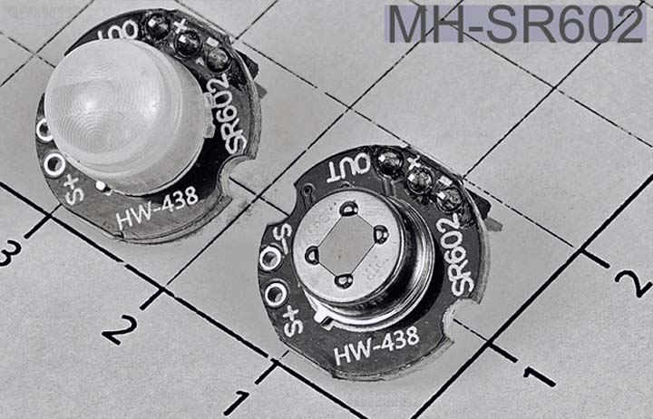
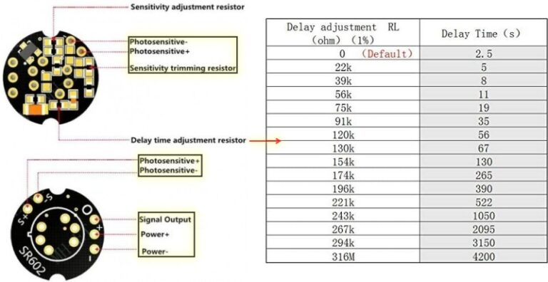
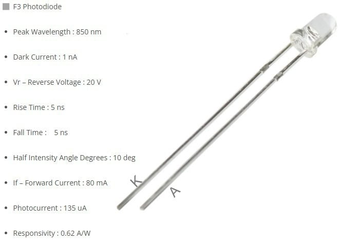
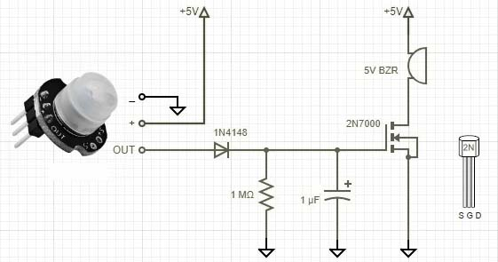
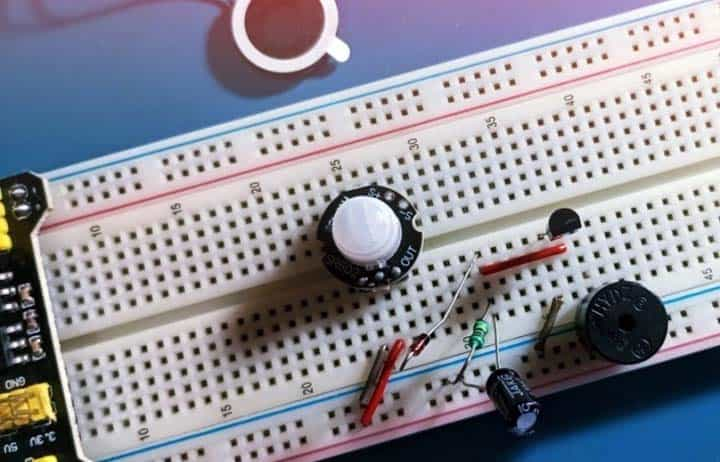
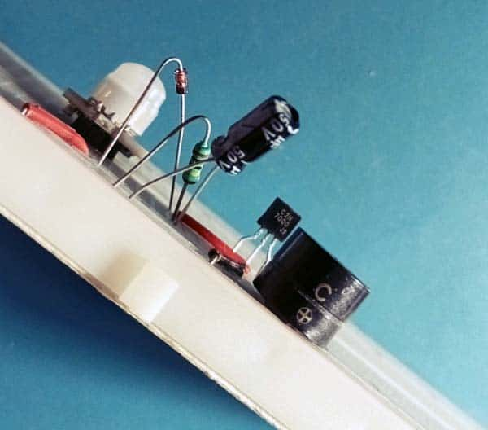

# MH-SR602 PIR 모션 센서 가이드

- PIR(Passive Infrared, 수동 적외선) 모션 센서는 움직임을 감지할 수 있으며, 사람이 감지 범위 안으로 들어오거나 나가는 것을 거의 항상 감지하는 데 사용됩니다.
- 사람이 특정 영역에 들어오거나 나갔는지, 또는 접근했는지를 감지해야 하는 많은 DIY 프로젝트나 장치에 PIR 센서는 훌륭한 선택입니다.
- 요즘에는 매우 컴팩트하고 저렴하며 저전력이고 사용하기 쉬운 디지털 PIR 센서를 구입할 수 있습니다.
- 훌륭한 예가 **MH-SR602 PIR 모션 센서 모듈**입니다.
- 0 ~ 3.5미터 거리의 움직임 감지에 이상적입니다.
- 이 모듈은 높은 감도, 빠른 응답, 낮은 정적 에너지 소비 및 작은 크기로 설치가 쉽습니다.

## 주요 사양 (Quick Specifications)

| 항목 | 값 |
|:---:|:---:|
| 모델 번호 | SR602 |
| 감지 거리 | 최대 5미터 (0~3.5미터 권장) |
| 출력 | High Level (H=3.3V / L=0V) |
| 전원 공급 | 3.3V ~ 15V DC |
| 대기 전류 | 20μA |

### 핀 정보 (Pin Data)

| 핀 | 설명 |
|:---:|:---:|
| – | 0V / GND |
| + | 3.3V ~ 15V DC 입력 |
| OUT | 논리 H/L 출력 (3.3V / 0V) |

### 주요 포인트 (Key Points)

- 이 센서의 **High-Level(H) 출력 시간**은 2.5초에서 1시간까지 조정 가능하지만, **기본값은 2.5초**입니다.
- 출력 신호 지속 시간을 변경해야 하는 경우 칩 저항 하나를 교체할 수 있습니다 (아래 그림 참조).
- 기본 지연 시간을 수정하면 초기 전원 켜짐 후 센서 모듈이 High-Level 신호를 출력하는 시간도 그에 따라 증가합니다.
- 마찬가지로, 이 센서의 **감도**도 조정 가능하며, 칩 저항을 교체해야 합니다.
- 또한 **외부 포토센서(광센서)를 추가**할 수 있는 옵션이 있어, 포토센서를 설치하면 모션 센서 메커니즘이 낮에는 작동하지 않고 밤에만 작동합니다 (포토센서의 감지 감도도 칩 저항 교체로 변경 가능).

## 주간/야간 감지 (Day/Night Detection)

- 데이터시트에 따르면, 주간/야간 감지를 위한 권장 포토센서는 **F3 포토다이오드**입니다.
- F3은 고속 및 고감도 PIN 포토다이오드로, 표준 3mm 플라스틱 패키지로 제공됩니다 (아래는 판매자 페이지에서 가져온 간략한 사양입니다).

## 핵심 부품 (Core Part)

- 이 모듈에 사용된 실제 PIR(수동 적외선) 모션 센서는 **6개의 핀**을 가지고 있지만, 부품 번호를 식별할 수 있는 라벨이 없습니다.
- 육안 검사 결과, 널리 사용되는 **BM612 스마트 디지털 모션 감지기**와 다소 유사해 보입니다.
- **BM612**는 모든 전자 회로가 감지기 하우징에 내장된 완전한 모션 감지기 솔루션을 제공합니다.
- 전체 모션 스위치를 만들기 위해 전원 공급 장치와 전원 스위칭 구성 요소만 추가하면 되며, 타이머가 포함되어 있습니다.
- 또한 주변 조도 레벨 및 감도 조정 옵션도 제공합니다.

### 테스트 설정 (Test Setup)

- 여기서 소개하는 것과 같은 디지털 PIR 모션 센서 모듈을 빠르게 테스트하는 데 반드시 고급 마이크로컨트롤러가 필요하지는 않습니다.
- **MH-SR602 모듈에는 보드에 3.3V LDO 선형 전압 레귤레이터 칩이 탑재**되어 있으므로, 아래 회로도를 따라 빠른 테스트를 시작할 수 있습니다.

- 이것은 PIR 센서가 트리거될 때 액티브 부저를 미리 결정된 최소 시간 동안 구동하기 위해 논리 레벨 MOSFET과 결합된 매우 간단한 **펄스 스트레칭(pulse-stretching) 회로**입니다.

- 관심 있는 분은 원하는 대로 회로를 조정할 수 있습니다. 즉, 기본 회로의 기본 펄스 길이가 마음에 들지 않으면 저항 및/또는 커패시터를 조정하여 테스트 설정의 동작을 변경할 수 있습니다.

---

## MH-SR602 요약

| 항목 | 내용 |
|:---|:---|
| **모델** | SR602 |
| **감지 방식** | PIR (수동 적외선) |
| **감지 거리** | 최대 5m (0~3.5m 권장) |
| **출력 신호** | High (3.3V) / Low (0V) |
| **전원 범위** | 3.3V ~ 15V DC |
| **대기 전류** | 20μA |
| **출력 시간 (기본)** | 2.5초 (조정 가능, 최대 1시간) |
| **추가 기능** | 감도 조절, 주간/야간 감지 (외부 포토다이오드) |
| **온보드 레귤레이터** | 3.3V LDO |

*출처: https://arduinomodules.info/*
