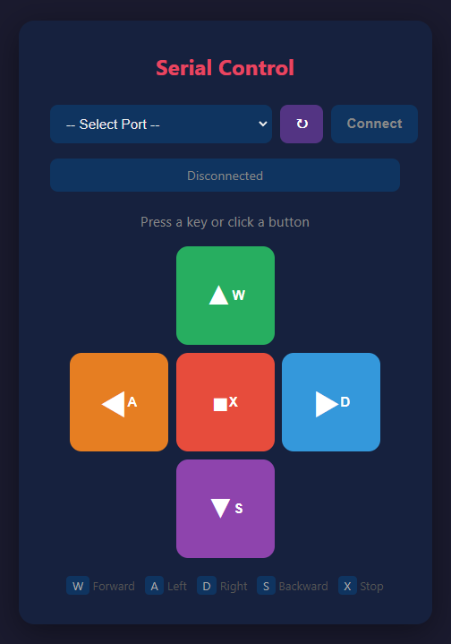

# Control Server (node.js)



---

```
Service/
├── package.json          # 의존성 정보
├── package-lock.json     # 의존성 잠금 파일
├── server.js             # 서버 메인
└── public/
    └── index.html        # 웹 UI
```

* 설치가 되어있지 않았다면 https://nodejs.org (LTS 권장) 
* 위 4개 파일을 대상 PC에 복사

```
cd Desktop\Service3/step1
npm install --production
npm start 
```

* http://localhost:3000

## 대소문자 수정 방법


C:\Users\user\Desktop\Service\public\index.html

**대문자**

```
    <div class="dpad">
      <button class="btn-fwd" data-cmd="W">▲<br><span style="font-size:14px">W</span></button>
      <button class="btn-left" data-cmd="A">◀<br><span style="font-size:14px">A</span></button>
      <button class="btn-stop" data-cmd="X">■<br><span style="font-size:14px">X</span></button>
      <button class="btn-right" data-cmd="D">▶<br><span style="font-size:14px">D</span></button>
      <button class="btn-bwd" data-cmd="S">▼<br><span style="font-size:14px">S</span></button>
    </div>
```

**소문자**

```
    <div class="dpad">
      <button class="btn-fwd" data-cmd="w">▲<br><span style="font-size:14px">W</span></button>
      <button class="btn-left" data-cmd="a">◀<br><span style="font-size:14px">A</span></button>
      <button class="btn-stop" data-cmd="x">■<br><span style="font-size:14px">X</span></button>
      <button class="btn-right" data-cmd="d">▶<br><span style="font-size:14px">D</span></button>
      <button class="btn-bwd" data-cmd="s">▼<br><span style="font-size:14px">S</span></button>
    </div>
```
