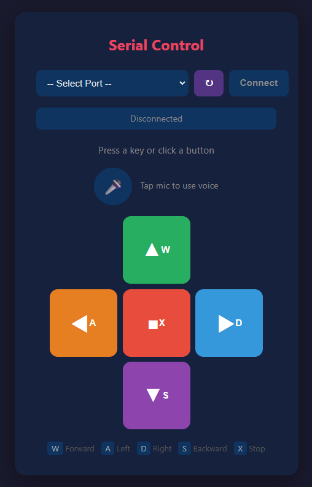

# 음성 제어 기능 (Voice Control)

Web Speech API를 사용하여 브라우저에서 음성 명령으로 자동차를 제어합니다.



---

## 시스템 구성

```
스마트폰/PC 브라우저 (Web Speech API)
        ↓ HTTP/HTTPS (REST API)
    Node.js 서버 (Express)
        ↓ Serial (USB)
    Arduino (HC-05/Serial)
        ↓
    자동차 (모터 드라이버)
```

## 지원 명령어

| 기능 | 키보드 | 음성 명령 (한국어) | 음성 명령 (영어) |
|------|--------|-------------------|-----------------|
| 전진 | W | "전진", "앞으로", "포워드" | "forward", "front" |
| 좌회전 | A | "좌회전", "왼쪽", "레프트" | "left", "turn left" |
| 후진 | S | "후진", "뒤로", "백워드" | "backward", "back" |
| 우회전 | D | "우회전", "오른쪽", "라이트" | "right", "turn right" |
| 정지 | X | "정지", "멈춰", "스톱", "브레이크" | "stop", "halt", "brake" |

---

## 개발 내용

### 사용 기술

- **Web Speech API** (`SpeechRecognition`) — 브라우저 내장 음성인식
- **Express** — REST API 서버
- **SerialPort** — Arduino와 시리얼 통신

### 음성인식 동작 흐름

1. 🎤 마이크 버튼 클릭 → `SpeechRecognition.start()`
2. 사용자가 말하면 브라우저가 음성을 텍스트로 변환
3. 텍스트를 `voiceMap`에 매핑하여 명령어(w/a/s/d/x) 추출
4. `POST /api/command` 로 명령 전송
5. 서버가 Serial 포트를 통해 Arduino로 전달

### iOS 대응

iPhone Safari/Chrome(iOS)는 WebKit 기반이며 `webkitSpeechRecognition` 접두사가 필요합니다.

적용된 대책:
- `window.SpeechRecognition || window.webkitSpeechRecognition` — 접두사 자동 감지
- `warmupMic()` — `getUserMedia`로 마이크 권한을 미리 획득하여 첫 인식 실패 방지
- iOS `no-speech` 에러 무시 — 첫 터치 시 정상 발생하는 오류를 조용히 처리
- `lang: 'ko-KR'` — 한국어 음성인식 설정

### HTTPS 지원

Web Speech API는 **HTTPS(또는 localhost)** 환경에서만 동작합니다.
- PC: `http://localhost:3000` — localhost는 secure context로 인정됨
- iPhone: `https://192.168.x.x:3443` — 자체서명 인증서로 HTTPS 제공

---

## 사용 방법

### 1. 서버 실행

```bash
cd C:\Users\Administrator\Desktop\Service3
npm install --production
npm start
```

최초 실행 시 `.cert/` 폴더에 자체서명 인증서가 자동 생성됩니다.

### 2. 접속

| 기기 | 주소 | 비고 |
|------|------|------|
| PC | `http://localhost:3000` | Chrome 권장 |
| iPhone | `https://192.168.x.x:3443` | 자체서명 인증서 주의 |

> 서버 실행 시 콘솔에 표시되는 HTTPS 주소를 iPhone에서 입력하세요.

### 3. 포트 연결

1. 포트 선택 드롭다운에서 Arduino가 연결된 COM 포트 선택
2. **Connect** 버튼 클릭
3. 상태가 `Connected: COMx` 로 변경 확인

### 4. 음성 제어

1. 🎤 마이크 버튼 탭 (빨간색 펄스 애니메이션 = 듣는 중)
2. 명령어를 말합니다 (예: "전진", "정지", "좌회전")
3. 인식 결과가 화면에 표시되고 자동차가 동작합니다
4. 다시 🎤 버튼을 탭하면 종료

iPhone 첫 접속 시:
- Safari: "고급" → "[IP]로 이동"
- Chrome: "고급" → "계속 진행"
- 마이크 권한 허용

### 5. 키보드 제어 (대체 방법)

음성 대신 키보드로도 제어 가능합니다:
- **W** - 전진
- **A** - 좌회전
- **S** - 후진
- **D** - 우회전
- **X** - 정지

---

## 의존성

- express
- serialport
- selfsigned

---

## 주의사항

- Chrome/Edge/Safari(iOS 14.5+)에서만 음성인식 지원
- Firefox는 `about:config`에서 `dom.webspeech.recognition.enable` 활성화 필요
- iPhone에서는 반드시 **HTTPS** 주소로 접속해야 음성인식 동작
- 자체서명 인증서 사용 시 브라우저에서 보안 경고가 표시되지만 정상 사용 가능
