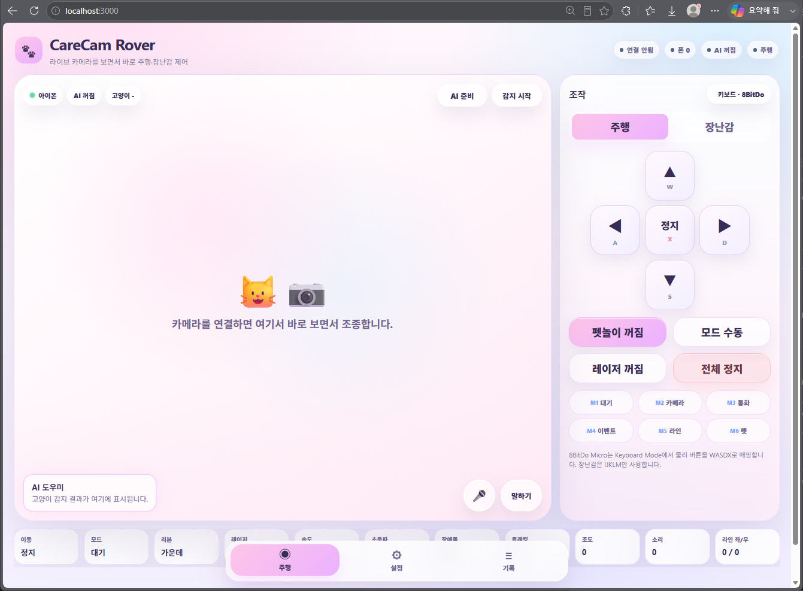
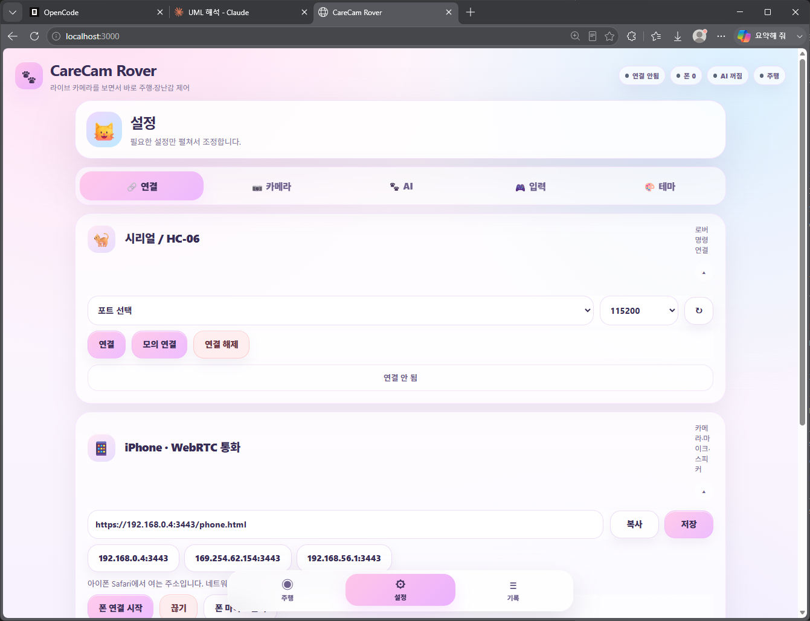
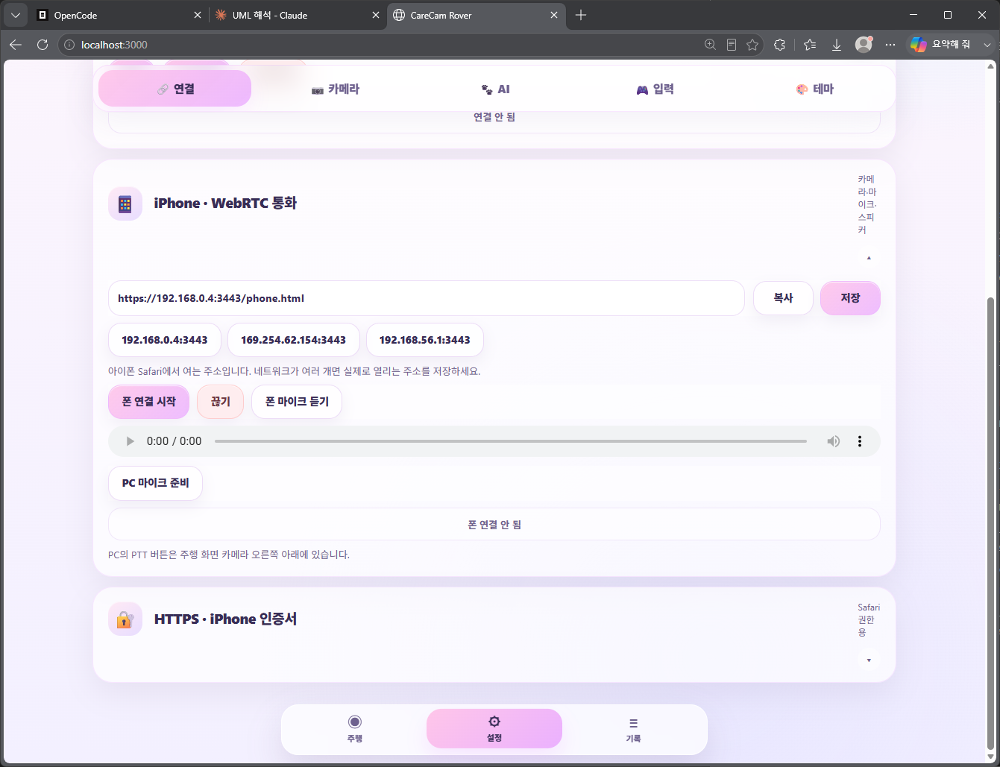
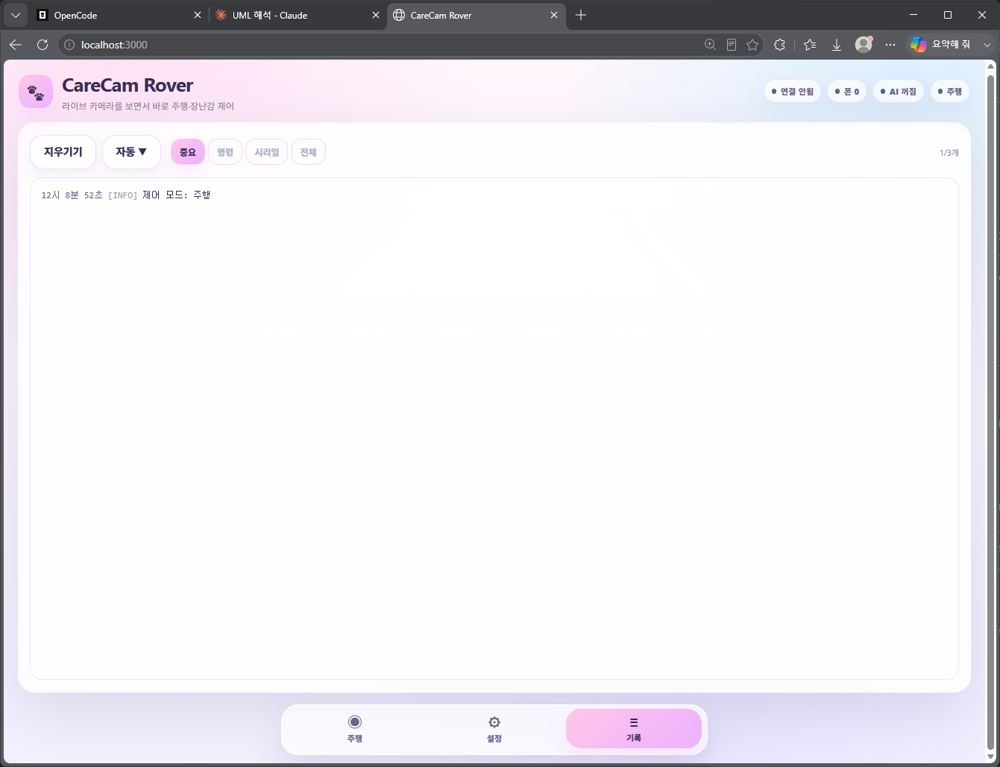

# 3조 Care_bot 프로젝트 분석 리포트

## 1. 프로젝트 개요

| 항목 | 내용 |
|---|---|
| **MCU** | STM32F103RBT6 (NUCLEO-F103RB, LQFP64) |
| **Clock** | 64 MHz (HSI 8MHz ÷2 → PLL x16) |
| **IDE** | STM32CubeIDE, HAL FW_F1 V1.8.7 |
| **.ioc** | `Care bot.ioc` (CubeMX 6.14.1) |
| **주제** | **고양이 케어 로봇 (Care Bot)** — 레이저 포인터로 고양이와 놀아주고, 장애물/라인트레이싱 센서로 자율주행 |

### 프로젝트 구조

```
STM32_Care_bot/
├── Care bot.ioc
├── Core/
│   ├── Inc/
│   │   ├── main.h
│   │   ├── motor.h, laser.h, laser_aim.h
│   │   ├── supersonic.h
│   │   ├── buzzer.h
│   │   ├── KY-032.h, KY-033.h
│   │   ├── servo motor 90.h
│   │   ├── clcd.h          ← 전체 주석처리 (미사용)
│   │   ├── stm32f1xx_hal_conf.h
│   │   └── stm32f1xx_it.h
│   └── Src/
│       ├── main.c          (759줄)
│       ├── motor.c, laser.c, laser_aim.c
│       ├── supersonic.c
│       ├── buzzer.c
│       ├── KY-032.c, KY-033.c
│       ├── servo motor 90.c
│       ├── clcd.c          ← 전체 주석처리 (미사용)
│       ├── stm32f1xx_hal_msp.c
│       ├── stm32f1xx_it.c
│       └── syscalls.c, sysmem.c, system_stm32f1xx.c
```

---

## 2. 사용 주변장치 및 설정

### 타이머

| 타이머 | Mode | Prescaler | Period | 실제 주파수 | 용도 |
|--------|------|-----------|--------|------------|------|
| TIM1 | Base | 63 | 65535 | 1 MHz (1μs 해상도) | 초음파 delay/echo 계측 |
| TIM2 | PWM CH1 (PA0) | 1279 | 999 | 50 Hz | 서보 리프트 (90° up/down) |
| TIM3 | PWM CH1 (PA6), CH4 (PB1) | 1279 | 999 | 50 Hz | Pan/Tilt 레이저 조준 |
| TIM4 | PWM CH1 (PB6) | 63 | 999 | 1 kHz | 부저 (가변 주파수) |

### 시리얼 통신

| USART | Baud | 핀 | 용도 |
|-------|------|-----|------|
| USART2 | 115200 | PA2(TX), PA3(RX) | ST-Link VCP (printf) |
| USART3 | 115200 | PC10(TX), PC11(RX) | 블루투스 모듈 (RC 제어) |

### GPIO

| 핀 | 방향 | 라벨 | 용도 |
|----|------|------|------|
| PA0 | TIM2_CH1 | — | 서보 리프트 PWM |
| PA1 | Input | — | KY-032 IR 장애물 센서 |
| PA6 | TIM3_CH1 | — | Pan 서보 PWM |
| PA7 | Input | — | KY-033 라인트레이싱 |
| PA8 | Output | TRIG2 | 초음파 TRIG #2 |
| PA9 | Output | LB1 | 모터 왼쪽 후방 1 |
| PA10 | Output | LF2 | 모터 왼쪽 전방 2 |
| PB0 | Input | ECHO1 | 초음파 ECHO #1 |
| PB1 | TIM3_CH4 | — | Tilt 서보 PWM |
| PB3 | Output | LF1 | 모터 왼쪽 전방 1 |
| PB4 | Output | RF1 | 모터 오른쪽 전방 1 |
| PB5 | Output | RF2 | 모터 오른쪽 전방 2 |
| PB6 | TIM4_CH1 | — | 부저 PWM |
| PB8 | Output | RB1 | 모터 오른쪽 후방 1 |
| PB9 | Output | RB2 | 모터 오른쪽 후방 2 |
| PB10 | Output | LB2 | 모터 왼쪽 후방 2 |
| PB15 | Output | LASER | 레이저 포인터 |
| PC7 | Output | TRIG1 | 초음파 TRIG #1 |
| PC13 | EXTI | B1 | 푸시버튼 (EXTI15_10) |

---

## 3. 모듈별 상세 분석

### 3.1 main.c — 메인 루틴 및 블루투스 RC

**초기화 순서** (CubeMX 생성 → 사용자 코드):
1. HAL_Init() → SystemClock_Config()
2. MX_GPIO_Init() → MX_USART2/USART3/TIM1~4_Init()
3. Laser_Init, KY032_Init, SuperSonic_Init, KY033_Init, Servo90_Init, Motor_Init, Buzzer_Init
4. printf("Care Bot Start")
5. HAL_UART_Receive_IT(&huart3, &btData, 1) — 블루투스 RX IT 시작
6. TIM3 CH1/CH4 PWM 시작, 서보 중앙(90°) 설정

**메인 루프** (≈ 350ms + 5초 주기):
```
loop:
  d1 = SuperSonic_Read1_mm()  // ~15ms (blocking)
  HAL_Delay(120)
  d2 = SuperSonic_Read2_mm()  // ~15ms (blocking)
  HAL_Delay(120)

  // 센서 데이터 printf + CSV 로그
  //   "S,DIST_MM,%d,US1,%d,US2,%d,OBS,%d,KY033_RAW,%d,TRACK,%s"

  if d1 < 200 or d2 < 200 → Servo90_Up()    // 장애물 가까움 → 바리케이드 올림
  else if min(d1,d2) >= 220 → Servo90_Down() // 충분히 멂 → 바리케이드 내림

  KY032_IsDetected()  // IR 장애물 감지
  KY033_ReadRaw(), KY033_IsBlack()  // 라인 감지

  if d1 <= 150 or d2 <= 150 → Buzzer_Meow() + HAL_Delay(5000)  // 고양이 발견!
  HAL_Delay(100)
```

**블루투스 RX 콜백** (`HAL_UART_RxCpltCallback`):

| 명령 | 동작 |
|------|------|
| W/w | 전진 |
| S/s | 후진 |
| A/a | 좌회전 |
| D/d | 우회전 |
| X/x | 정지 |
| V/v | 레이저 토글 |
| I/i | 서보1 각도 -10° (Pan ↑) |
| K/k | 서보1 각도 +10° (Pan ↓) |
| L/l | 서보2 각도 +10° (Tilt ↑) |
| J/j | 서보2 각도 -10° (Tilt ↓) |
| M/m | 서보1,2 중앙 (90°) |

**Servo_SetAngle** (공용 함수):
```
pulse = 25 + (angle * 100 / 180)  // 범위 25~125
__HAL_TIM_SET_COMPARE(htim, channel, pulse)
```

### 3.2 motor.c — 4륜 DC 모터 제어

8개 GPIO로 4개 모터(LF, LB, RF, RB)를 개별 방향 제어 (H-Bridge).

| 동작 | LF1 | LF2 | LB1 | LB2 | RF1 | RF2 | RB1 | RB2 |
|------|-----|-----|-----|-----|-----|-----|-----|-----|
| 전진 | 1 | 0 | 1 | 0 | 1 | 0 | 1 | 0 |
| 후진 | 0 | 1 | 0 | 1 | 0 | 1 | 0 | 1 |
| 좌회전 | 0 | 1 | 0 | 1 | 1 | 0 | 1 | 0 |
| 우회전 | 1 | 0 | 1 | 0 | 0 | 1 | 0 | 1 |
| 정지 | 0 | 0 | 0 | 0 | 0 | 0 | 0 | 0 |

> PWM 속도 제어 없음 → 항상 최대 속도. 방향 전환만 가능.

### 3.3 supersonic.c — HC-SR04 초음파 센서 x2

- **타이머**: TIM1 (1MHz = 1μs 해상도)
- **TRIG**: 10μs HIGH 펄스
- **ECHO**: polling 방식으로 rising/falling 에지 대기
  - 타임아웃: rising 10ms, falling 30ms
  - 타임아웃 발생 시 echo_time = 0 → `SuperSonic_Read_mm()`는 -1 반환
- **거리 계산**: `17 * echo_time / 100` (mm)

> ⚠️ HAL_Delay(120)로 인해 센서 2개 읽는 데만 약 270ms 소요. Polling 방식이라 CPU 100% 점유.

### 3.4 buzzer.c — PWM 부저

- TIM4 PWM (1kHz base)의 ARR을 변경하여 가변 주파수
- 듀티비 50% (CCR = ARR/2)
- **Buzzer_Meow()**: "야~옹" 멜로디 시퀀스
  - 800Hz/120ms → 950Hz/120ms → 1100Hz/150ms → 900Hz/120ms → 700Hz/150ms → 550Hz/200ms
  - 각 음 종료 후 30ms 무음

### 3.5 laser.c — 레이저 포인터

PB15 GPIO 단순 On/Off/Toggle. 블루투스 V 명령으로만 제어.

### 3.6 laser_aim.c — Pan/Tilt 서보 조준

- TIM3 PWM (50Hz), CH1=Pan(PA6), CH4=Tilt(PB1)
- 펄스: `25 + (100 * angle / 180)` → 범위 25~125 (0°~180°)
- 제공 각도: Center, 45°/60° 방향, AvoidCat 대각선 4방향

### 3.7 KY-032.c — IR 장애물 감지

PA1 읽기, Active LOW → `GPIO_PIN_RESET`이면 장애물 감지

### 3.8 KY-033.c — 라인트레이싱 센서

PA7 읽기, LOW=검은색, HIGH=흰색

### 3.9 "servo motor 90.c" — 리프트 서보

- TIM2 CH1 PWM (50Hz)
- 펄스: `50 + (angle * 100 / 180)` → 범위 50~150
- Up()=90°, Down()=0°
- 메인 루프에서 d1/d2 < 200mm → Up, ≥ 220mm → Down

> ⚠️ `Servo_SetAngle()`과 펄스 계산식이 다름: main.c는 25+(angle*100/180), Servo90.c는 50+(angle*100/180)

### 3.10 clcd.c/h — I2C LCD (전체 주석처리)

- 0x27 주소, 4비트 모드
- 상태 표시 함수: CatFound, Playing, Resting, Searching
- I2C1은 .ioc에서 설정되지 않음 → 완전히 미사용 코드

---

## 4. 시스템 타이밍 흐름

```
[Power On]
  ├─ HAL_Init, SystemClock_Config (HSI 8MHz → PLL 64MHz)
  ├─ MX_GPIO_Init, MX_TIM/USART Init
  ├─ Module Init (Laser, KY032, Supersonic, KY033, Servo90, Motor, Buzzer)
  ├─ UART3 RX IT start (Bluetooth)
  ├─ TIM3 PWM start (pan/tilt servo)
  └─ main loop (무한반복)
       │
       ├─ d1 = SuperSonic_Read1_mm()  // ~15ms (polling)
       ├─ HAL_Delay(120)
       ├─ d2 = SuperSonic_Read2_mm()  // ~15ms (polling)
       ├─ HAL_Delay(120)
       ├─ Print sensor data + CSV
       ├─ 거리 < 200mm → Servo90_Up()
       ├─ 거리 ≥ 220mm → Servo90_Down()
       ├─ KY032 IR 감지 확인
       ├─ KY033 라인 감지 확인
       ├─ 거리 ≤ 150mm → Buzzer_Meow() + HAL_Delay(5000)
       ├─ HAL_Delay(100)
       └─ (loop 주기 ≈ 350ms + 5초 벨)
            ↑
      [BT RX IT] ── W/A/S/D/X → Motor 제어
                  ── V → Laser Toggle
                  ── I/K/L/J/M → Servo 각도 제어
```

**주요 지연 시간:**
- 초음파 2회: ~270ms (polling 30ms + HAL_Delay 240ms)
- CSV 출력: ~수 ms
- 부저 울릴 시: +5초 (HAL_Delay 블로킹)
- 루프 1회: 약 350ms (정상), 5.3초 (고양이 발견 시)

---

## 5. 장점

| 항목 | 설명 |
|------|------|
| ✅ **모듈화** | 기능별 .c/.h 분리 (motor, laser, buzzer 등) |
| ✅ **블루투스 RC** | 10개 명령으로 원격 조종 가능 |
| ✅ **CSV 로깅** | `S,DIST_MM,...` 형식으로 시리얼 모니터에서 데이터 수집 용이 |
| ✅ **부저 멜로디** | 단순하지만 실제 "야옹" 음계 구현 |
| ✅ **레이저 조준** | Pan/Tilt 서보로 8방향 + 대각선 조준 가능 |
| ✅ **타이머 활용** | TIM1을 1μs 타이머로 범용 사용 (us delay, echo 계측) |

---

## 6. 개선점 및 문제점

| 문제점 | 영향 | 제안 |
|--------|------|------|
| ❌ **HAL_Delay 블로킹** | 부저 5초 + 루프 지연 시 블루투스/센서 무반응 | Non-blocking 상태머신 도입 |
| ❌ **FSM 없음** | 순차적 polling만 → 확장성 낮음 | enum 상태 + 주기적 센서 샘플링 |
| ❌ **clcd.c 완전 주석처리** | I2C 설정도 없어 사용 불가 | 삭제하거나 I2C + LCD 복원 |
| ❌ **모터 속도 제어 없음** | 항상 최대 속도 | TIM PWM + EN 핀으로 속도 가변 |
| ❌ **초음파 노이즈 필터 없음** | 단일 측정, 오차 큼 | 다중 측정 → 중간값/이동평균 |
| ❌ **파일명에 공백** | `"servo motor 90.c"` | `servo_lift.c` 등으로 변경 |
| ❌ **매직 넘버** | `25`, `100`, `180`, `17`, `200` | `#define` 상수화 |
| ❌ **중복 include** | motor.c에 `#include "motor.h"` 2회 | 1회로 정리 |
| ❌ **퓨즈비 불일치** | Servo90: 50+(a*100/180) vs main.c: 25+(a*100/180) | 통일 필요 |
| ❌ **I2C 미설정** | clcd 주석처리 전에 I2C1이 .ioc에 없음 | LCD 사용 시 Pinout 재설정 |
| ❌ **EXTI 미활용** | 초음파 ECHO를 polling (CPU 100%) | EXTI + TIM 캡처로 전환 |
| ❌ **5초 지연 치명적** | 고양이 발견 시 5초간 모든 동작 정지 | 별도 타이머/스레드로 분리 |
| ❌ **printf로 UART3 TX** | printf가 USART3 사용, 블루투스 TX와 충돌 가능 | USART2 전용 또는 분리 |

---

## 7. 종합 평가

| 항목 | 평가 |
|------|------|
| 프로젝트 규모 | 중 (~1100줄 사용자 코드) |
| 코드 완성도 | **중상** — clcd 제외 모든 모듈 동작 |
| 확장성 | **하** — FSM 없음, 블로킹 구조 |
| 실시간성 | **하** — 모든 대기가 blocking 방식 |
| 디버깅 용이성 | **상** — CSV 로깅, printf 디버깅 |
| 하드웨어 활용 | **중** — 4개 타이머, 2개 UART, PWM |
| 난이도 | ★★★☆☆ |

> **결론**: <br>
> 고양이 케어라는 참신한 주제로 다양한 센서(KY-032, KY-033, 초음파 x2, 레이저, 서보 x3)와 블루투스 RC를 통합한 프로젝트. <br>
> clcd를 제외한 모든 모듈이 실제 구동 가능하며 CSV 로깅으로 디버깅이 용이. <br>
> 단, FSM 부재와 HAL_Delay 블로킹이 가장 큰 한계로, 실시간 이벤트 처리와 확장을 위해 상태머신 도입이 필수적.

---










