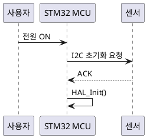
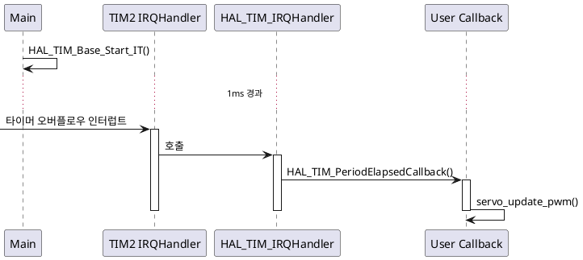
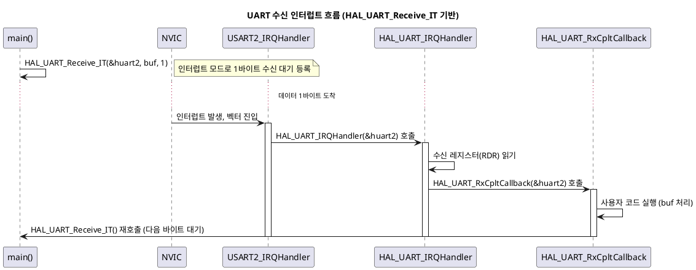
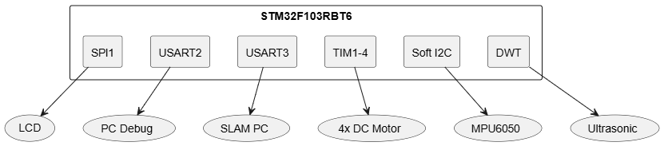
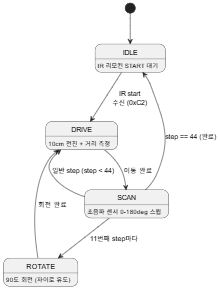
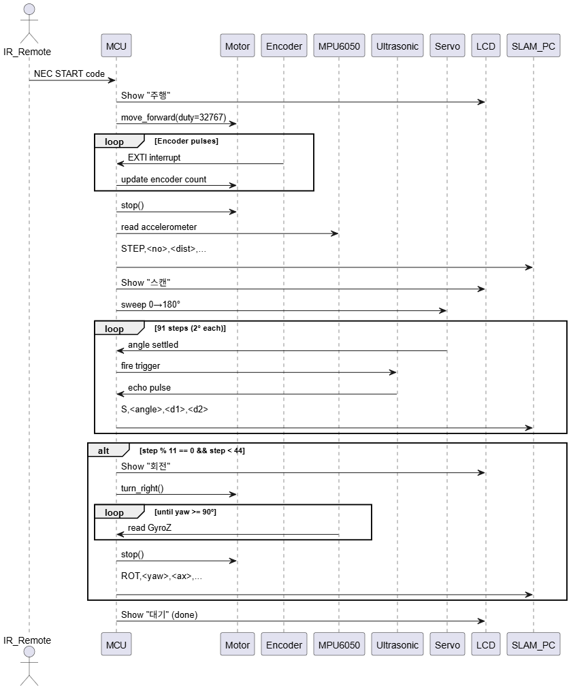
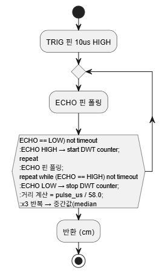
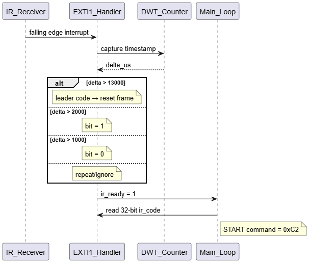
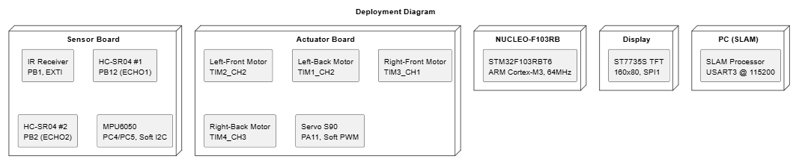
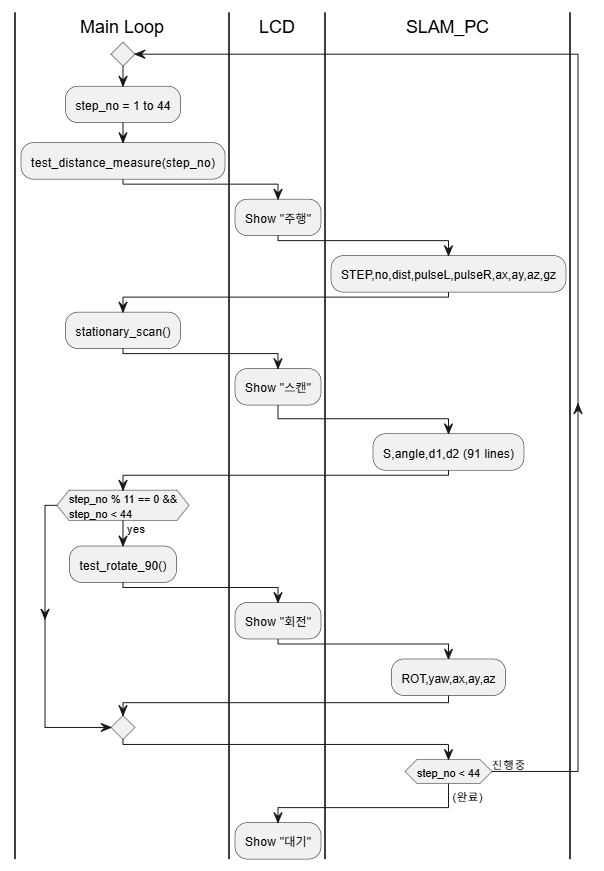

# STM32F103 NUCLEO 펌웨어 교육 — PlantUML 도입 가이드

---

## 목차

1. [PlantUML 설치](#1-plantuml-설치)
2. [PlantUML로 시퀀스 다이어그램 작성](#2-plantuml로-시퀀스-다이어그램-작성)
3. [STM32 인터럽트/HAL 콜백 흐름 예제](#3-stm32-인터럽트hal-콜백-흐름-예제)

---

## 1. PlantUML 설치

### 1-1. 사전 요구사항 — Java

```bash
# Ubuntu
sudo apt install default-jre -y
java -version
```

Windows는 https://www.java.com 에서 JRE 설치.

### 1-2. PlantUML 설치 방법 (3가지 중 택1)

**방법 A — VS Code 확장 (수업 진행 시 가장 추천)**

1. VS Code Extensions에서 **"PlantUML"** (jebbs 제작) 검색 후 설치
2. Graphviz가 이미 설치되어 있으면 (2장에서 설치함) 별도 설정 불필요
3. `.puml` 파일 작성 후 `Alt+D`로 미리보기 (Windows), `Option+D` (Mac)

**방법 B — JAR 파일 직접 실행**

```bash
# 다운로드
wget https://github.com/plantuml/plantuml/releases/latest/download/plantuml.jar

# 다이어그램 생성
java -jar plantuml.jar diagram.puml
# → diagram.png 생성됨
```

**방법 C — 온라인 에디터 (설치 없이 즉시 테스트용)**

- https://www.plantuml.com/plantuml/uml/
- 수업 첫 시간에 설치 없이 바로 시연할 때 유용

### 1-3. 설치 확인

```bash
java -jar plantuml.jar -version
```

---

## 2. PlantUML로 시퀀스 다이어그램 작성

### 2-1. 기본 문법



### 2-2. 활성화 박스(Activation Bar) 사용 — 함수 실행 구간 표현



---

## 3. STM32 인터럽트/HAL 콜백 흐름 예제

UART 수신 인터럽트 예제 (수업에서 바로 사용 가능):



이 예제를 학생들에게 먼저 보여주고, 본인이 작업한 I2C/SPI 모듈로 동일한 형식의 다이어그램을 그려보게 하면 "이해도 검증 과제"로 활용할 수 있습니다.

---

# smart_car PlantUML 문서화 가이드 (2조 샘플)

## 1. 컴포넌트 다이어그램 — 하드웨어 구성

* C4_Component 이슈 있음.
```
@startuml
!include <C4/C4_Component>

System_Boundary(mcu, "STM32F103RBT6") {
  Component(spi1, "SPI1", "HAL", "160x80 ST7735S LCD")
  Component(usart2, "USART2", "HAL", "Debug Console (115200)")
  Component(usart3, "USART3", "HAL", "SLAM Data Output")
  Component(tim1_4, "TIM1-4", "HAL", "4ch x2 = 8ch PWM\n4WD Motor Control")
  Component(exti1, "EXTI1", "HAL", "IR Receiver (NEC)")
  Component(exti3_15, "EXTI3/15_10", "HAL", "Encoder Pulse Counter")
  Component(soft_i2c, "Soft I2C", "Bit-bang", "MPU6050 IMU")
  Component(soft_pwm, "Soft PWM", "DWT", "Servo (0-180deg)")
  Component(dwt, "DWT_CYCCNT", "Core", "us timing, pulse measurement")
}

Rel(spi1, "$lcd", "ST7735S TFT")
Rel(usart2, "$pc", "USB-Serial")
Rel(usart3, "$pc", "SLAM Mapper")
Rel(tim1_4, "$motors", "4x DC Motor")
Rel(exti1, "$ir", "IR Remote")
Rel(exti3_15, "$encoders", "2ch Encoder")
Rel(soft_i2c, "$mpu", "MPU6050 IMU")
Rel(soft_pwm, "$servo", "Servo")
Rel(dwt, "$ultrasonic", "2x HC-SR04")
@enduml
```

```
@startuml
skinparam componentStyle rectangle

rectangle "STM32F103RBT6" {
  [SPI1] as spi1
  [USART2] as usart2
  [USART3] as usart3
  [TIM1-4] as tim
  [Soft I2C] as i2c
  [DWT] as dwt
}

spi1 --> (LCD)
usart2 --> (PC Debug)
usart3 --> (SLAM PC)
tim --> (4x DC Motor)
i2c --> (MPU6050)
dwt --> (Ultrasonic)
@enduml
```

→ 생성물: components.png — MCU와 외부 HW 연결 관계도



## 2. 상태 다이어그램 — 전체 미션 흐름

```
@startuml
state IDLE : IR 리모컨 START 대기
state DRIVE : 10cm 전진 + 거리 측정
state SCAN : 초음파 센서 0-180deg 스윕
state ROTATE : 90도 회전 (자이로 유도)

[*] --> IDLE
IDLE --> DRIVE : IR start\n수신 (0xC2)
DRIVE --> SCAN : 이동 완료
SCAN --> DRIVE : 일반 step (step < 44)
SCAN --> ROTATE : 11번째 step마다
ROTATE --> DRIVE : 회전 완료
SCAN --> IDLE : step == 44 (완료)
@enduml
```
→ 생성물: state_machine.png — 미션 진행 상태 기계



## 3. 시퀀스 다이어그램 — 미션 1 Step

```
@startuml
actor IR_Remote
participant MCU
participant Motor
participant Encoder
participant MPU6050
participant Ultrasonic
participant Servo
participant LCD
participant SLAM_PC

IR_Remote -> MCU: NEC START code
MCU -> LCD: Show "주행"
MCU -> Motor: move_forward(duty=32767)
loop Encoder pulses
  Encoder -> MCU: EXTI interrupt
  MCU -> Motor: update encoder count
end
MCU -> Motor: stop()
MCU -> MPU6050: read accelerometer
MCU -> SLAM_PC: STEP,<no>,<dist>,...\n

MCU -> LCD: Show "스캔"
MCU -> Servo: sweep 0→180°
loop 91 steps (2° each)
  Servo -> MCU: angle settled
  MCU -> Ultrasonic: fire trigger
  Ultrasonic -> MCU: echo pulse
  MCU -> SLAM_PC: S,<angle>,<d1>,<d2>\n
end

alt step % 11 == 0 && step < 44
  MCU -> LCD: Show "회전"
  MCU -> Motor: turn_right()
  loop until yaw >= 90°
    MPU6050 -> MCU: read GyroZ
  end
  MCU -> Motor: stop()
  MCU -> SLAM_PC: ROT,<yaw>,<ax>,...\n
end

MCU -> LCD: Show "대기" (done)
@enduml
```

→ 생성물: mission_step.png — DRIVE → SCAN → (ROTATE) 1사이클



* 1. 시작 트리거
   * IR_Remote → MCU: NEC START code 수신 → 동작 시작

* 2. 전진 주행 구간
   * MCU가 LCD에 "주행" 표시
   * MCU → Motor: move_forward(duty=32767) (50% duty, 절반 속도)
   * loop [Encoder pulses]: 바퀴가 돌 때마다 Encoder의 EXTI 인터럽트가 MCU를 깨우고, MCU가 엔코더 카운트를 갱신 (거리 측정용 펄스 카운팅)
   * MCU → Motor: stop() — 목표 거리 도달 시 정지

* 3. IMU 읽기 및 상태 보고
   * MCU → MPU6050: 가속도계 읽기
   * MCU → SLAM_PC: STEP,<no>,<dist>,... 형식으로 이동 거리/스텝 정보를 SLAM PC에 UART/시리얼 전송

* 4. 초음파 스캔 구간 (Servo + Ultrasonic)
   * LCD에 "스캔" 표시
   * MCU → Servo: 0°→180° 스윕 시작
   * loop [91 steps, 2°씩]: 서보가 2°씩 회전할 때마다

   * Servo → MCU: "angle settled" (각도 도달 신호)
   * MCU → Ultrasonic: trigger 발사
   * Ultrasonic → MCU: echo pulse 수신
   * MCU → SLAM_PC: S,<angle>,<d1>,<d2> (각도별 거리 데이터 2개, 아마 이중 에코나 이전/현재 비교값)
   * → 즉 91개 각도 지점에서 라이다처럼 거리 스캔하여 SLAM_PC에 포인트클라우드 데이터 전송

* 5. 조건부 회전 (alt 구간)
   * 조건: step % 11 == 0 && step < 44 (특정 스텝마다, 즉 91스텝 스캔 중 4번 정도 회전 삽입되는 구조로 추정)
   * LCD에 "회전" 표시
   * MCU → Motor: turn_right()
   * loop [until yaw >= 90°]: MPU6050의 GyroZ 값을 계속 읽으며 90도 회전할 때까지 대기 (자이로 기반 회전각 제어)
   * MCU → Motor: stop()
   * MCU → SLAM_PC: ROT,<yaw>,<ax>,... (회전 완료 후 yaw값과 가속도 데이터 전송)

* 6. 종료
   * LCD에 "대기 (done)" 표시


## 4. 액티비티 다이어그램 — 초음파 측정

```
@startuml
start
:TRIG 핀 10us HIGH;
repeat
  :ECHO 핀 폴링;
repeat while (ECHO == LOW) not timeout
:ECHO HIGH → start DWT counter;
repeat
  :ECHO 핀 폴링;
repeat while (ECHO == HIGH) not timeout
:ECHO LOW → stop DWT counter;
:거리 계산 = pulse_us / 58.0;
:x3 반복 → 중간값(median);
:반환 (cm);
stop
@enduml
```
→ 생성물: ultrasonic_measure.png — 초음파 측정 알고리즘



## 5. 시퀀스 다이어그램 — IR 리모컨 NEC 디코드

```
@startuml
participant IR_Receiver
participant EXTI1_Handler
participant DWT_Counter
participant Main_Loop

IR_Receiver -> EXTI1_Handler: falling edge interrupt
EXTI1_Handler -> DWT_Counter: capture timestamp
DWT_Counter --> EXTI1_Handler: delta_us

alt delta > 13000
  note over EXTI1_Handler: leader code → reset frame
else delta > 2000
  note over EXTI1_Handler: bit = 1
else delta > 1000
  note over EXTI1_Handler: bit = 0
else
  note over EXTI1_Handler: repeat/ignore
end

EXTI1_Handler -> Main_Loop: ir_ready = 1
Main_Loop -> EXTI1_Handler: read 32-bit ir_code
note right of Main_Loop: START command = 0xC2
@enduml
```
* 수정 포인트:
   * :leader code → reset frame → note over EXTI1_Handler: leader code → reset frame
   * :bit = 1 → note over EXTI1_Handler: bit = 1

→ 생성물: ir_decode.png — NEC 프로토콜 디코딩



* 1. 인터럽트 발생 및 시간 측정
   * IR_Receiver → EXTI1_Handler: falling edge interrupt (IR 수신 모듈의 출력이 Low로 떨어질 때마다 EXTI 인터럽트 발생)
   * EXTI1_Handler → DWT_Counter: 현재 타임스탬프 캡처
   * DWT_Counter → EXTI1_Handler: delta_us 반환 (직전 엣지와의 시간 간격, DWT 사이클 카운터 기반 마이크로초 단위 측정)

   * 여기서 핵심은 DWT(Data Watchpoint and Trace) 카운터를 폴링/타이머 대신 써서, 인터럽트 핸들러 안에서 정밀하게 펄스 간격을 잰다는 점이에요. NVIC 인터럽트 지연이 있어도 CYCCNT 기반이라 us 단위 정밀도 유지가 가능합니다.

* 2. NEC 프로토콜 디코딩 로직 (alt 블록)
   * NEC 프로토콜은 펄스 간격(delta)의 길이로 비트를 구분합니다:
   * 조건 (delta)의미처리> 13000 us리더 코드 (9ms 헤더 + 4.5ms 스페이스)프레임 리셋, 새 코드 수신 시작> 2000 us논리 '1' (562us 펄스 + 1690us 스페이스 ≈ 2250us)bit = 1> 1000 us논리 '0' (562us 펄스 + 562us 스페이스 ≈ 1125us)bit = 0그 외노이즈/반복코드repeat/ignore 처리
   * → 이렇게 32비트(8비트 주소 + 8비트 반전주소 + 8비트 커맨드 + 8비트 반전커맨드)가 다 모이면 완료.

* 3. 메인 루프로 전달
   * EXTI1_Handler → Main_Loop: ir_ready = 1 플래그 설정 (인터럽트 컨텍스트는 최소화, 실제 처리는 메인 루프로 넘김 — 임베디드 인터럽트 설계의 정석)
   * Main_Loop → EXTI1_Handler: read 32-bit ir_code 읽어감
   * 노트: START command = 0xC2 — 특정 리모컨 버튼(커맨드 코드 0xC2)이 "주행 시작" 트리거로 매핑됨


## 6. 타이밍 다이어그램 — 서보 PWM

```
@startuml
robust "PA11 (Servo)" as servo

@0
servo is HIGH : "500us (0°)"
@500
servo is LOW : "19500us"
@20000
servo is HIGH : "1500us (90°)"
@21500
servo is LOW : "18500us"
@40000
servo is HIGH : "2500us (180°)"
@42500
servo is LOW : "17500us"
@60000
@enduml
```
→ 생성물: servo_pwm.png — 서보 각도별 펄스 폭


## 7. 배치 다이어그램 — 물리 시스템 구성

* C4_Deployment 이슈 있음
```
@startuml
!include <C4/C4_Deployment>

Deployment_Node(nucleo, "NUCLEO-F103RB", "") {
  Container(mcu, "STM32F103RBT6", "ARM Cortex-M3, 64MHz")
}

Deployment_Node(sensors, "Sensor Board", "") {
  Component(ir, "IR Receiver", "PB1, EXTI")
  Component(eco1, "HC-SR04 #1", "PB12 (ECHO1)")
  Component(eco2, "HC-SR04 #2", "PB2 (ECHO2)")
  Component(mpu, "MPU6050", "PC4/PC5, Soft I2C")
}

Deployment_Node(actuators, "Actuator Board", "") {
  Component(motor_LF, "Left-Front Motor", "TIM2_CH2")
  Component(motor_LB, "Left-Back Motor", "TIM1_CH2")
  Component(motor_RF, "Right-Front Motor", "TIM3_CH1")
  Component(motor_RB, "Right-Back Motor", "TIM4_CH3")
  Component(servo, "Servo S90", "PA11, Soft PWM")
}

Deployment_Node(display, "Display", "") {
  Component(lcd, "ST7735S TFT", "160x80, SPI1")
}

Deployment_Node(pc, "PC (SLAM)", "") {
  Component(slam, "SLAM Processor", "USART3 @ 115200")
}
@enduml
```

```
@startuml
title Deployment Diagram

node "NUCLEO-F103RB" as nucleo {
  rectangle "STM32F103RBT6\nARM Cortex-M3, 64MHz" as mcu
}

node "Sensor Board" as sensors {
  rectangle "IR Receiver\nPB1, EXTI" as ir
  rectangle "HC-SR04 #1\nPB12 (ECHO1)" as eco1
  rectangle "HC-SR04 #2\nPB2 (ECHO2)" as eco2
  rectangle "MPU6050\nPC4/PC5, Soft I2C" as mpu
}

node "Actuator Board" as actuators {
  rectangle "Left-Front Motor\nTIM2_CH2" as motor_LF
  rectangle "Left-Back Motor\nTIM1_CH2" as motor_LB
  rectangle "Right-Front Motor\nTIM3_CH1" as motor_RF
  rectangle "Right-Back Motor\nTIM4_CH3" as motor_RB
  rectangle "Servo S90\nPA11, Soft PWM" as servo
}

node "Display" as display {
  rectangle "ST7735S TFT\n160x80, SPI1" as lcd
}

node "PC (SLAM)" as pc {
  rectangle "SLAM Processor\nUSART3 @ 115200" as slam
}
@enduml
```

→ 생성물: deployment.png — 부품별 물리적 배치



## 8. 전체 미션 시퀀스 — Step별 흐름

```
@startuml
|Main Loop|
repeat
  :step_no = 1 to 44;
  :test_distance_measure(step_no);
  |LCD|
  :Show "주행";
  |SLAM_PC|
  :STEP,no,dist,pulseL,pulseR,ax,ay,az,gz;
  |Main Loop|
  :stationary_scan();
  |LCD|
  :Show "스캔";
  |SLAM_PC|
  :S,angle,d1,d2 (91 lines);
  |Main Loop|
  if (step_no % 11 == 0 &&\nstep_no < 44) then (yes)
    |Main Loop|
    :test_rotate_90();
    |LCD|
    :Show "회전";
    |SLAM_PC|
    :ROT,yaw,ax,ay,az;
  endif
repeat while (step_no < 44) is (진행중)
-> (완료);
|LCD|
:Show "대기";
@enduml
```

→ 생성물: full_mission.png — 44 step 전체 흐름



---

# PlantUML 도구 설치 및 사용법

```
# VSCode 확장 설치
code --install-extension jebbs.plantuml

# 또는 PlantUML jar 직접 사용
# 1. Java 설치 후 PlantUML.jar 다운로드
# 2. 아래 명령으로 SVG/PNG 생성
java -jar plantuml.jar -tsvg diagram.puml
java -jar plantuml.jar -tpng diagram.puml
```

## 권장 작업 순서
1. 상태 다이어그램 (#2) — 전체 미션 구조 이해에 가장 기본
2. 컴포넌트 다이어그램 (#1) — 하드웨어 구성 파악
3. 시퀀스 다이어그램 (#3) — 1 step 실제 동작 흐름
4. 액티비티 다이어그램 (#4) — 초음파 측정 로직 상세
5. IR 디코드 (#5), 서보 (#6) — 주변장치별 상세
6. 배치 (#7) — 최종 보고서용
