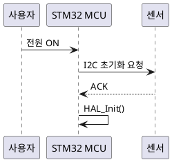
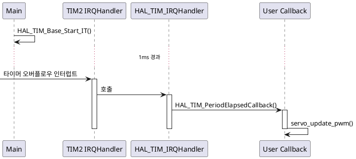
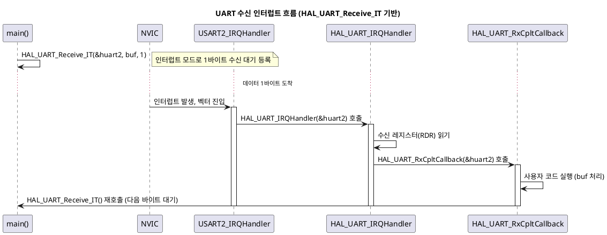

# STM32F103 NUCLEO 펌웨어 교육 — PlantUML 도입 가이드

---

## 목차

1. [PlantUML 설치](#1-plantuml-설치)
2. [PlantUML로 시퀀스 다이어그램 작성](#2-plantuml로-시퀀스-다이어그램-작성)
3. [STM32 인터럽트/HAL 콜백 흐름 예제](#3-stm32-인터럽트hal-콜백-흐름-예제)
4. [수업 적용 체크리스트](#4-수업-적용-체크리스트)


---

## 1. PlantUML 설치

### 1-1. 사전 요구사항 — Java

```bash
# Ubuntu
sudo apt install default-jre -y
java -version
```

Windows는 https://www.java.com 에서 JRE 설치.

### 1-2. PlantUML 설치 방법 (3가지 중 택1)

**방법 A — VS Code 확장 (수업 진행 시 가장 추천)**

1. VS Code Extensions에서 **"PlantUML"** (jebbs 제작) 검색 후 설치
2. Graphviz가 이미 설치되어 있으면 (2장에서 설치함) 별도 설정 불필요
3. `.puml` 파일 작성 후 `Alt+D`로 미리보기 (Windows), `Option+D` (Mac)

**방법 B — JAR 파일 직접 실행**

```bash
# 다운로드
wget https://github.com/plantuml/plantuml/releases/latest/download/plantuml.jar

# 다이어그램 생성
java -jar plantuml.jar diagram.puml
# → diagram.png 생성됨
```

**방법 C — 온라인 에디터 (설치 없이 즉시 테스트용)**

- https://www.plantuml.com/plantuml/uml/
- 수업 첫 시간에 설치 없이 바로 시연할 때 유용

### 1-3. 설치 확인

```bash
java -jar plantuml.jar -version
```

---

## 2. PlantUML로 시퀀스 다이어그램 작성

### 2-1. 기본 문법



### 2-2. 활성화 박스(Activation Bar) 사용 — 함수 실행 구간 표현



---

## 3. STM32 인터럽트/HAL 콜백 흐름 예제

UART 수신 인터럽트 예제 (수업에서 바로 사용 가능):



이 예제를 학생들에게 먼저 보여주고, 본인이 작업한 I2C/SPI 모듈로 동일한 형식의 다이어그램을 그려보게 하면 "이해도 검증 과제"로 활용할 수 있습니다.

---

## 4. 수업 적용 체크리스트

- [ ] 실습 PC에 Doxygen + Graphviz 설치 및 `dot -V` 동작 확인
- [ ] VS Code Doxygen 확장 설치 및 자동완성 동작 확인
- [ ] 샘플 HAL 프로젝트로 Doxyfile 설정 및 1회 문서 생성 시연
- [ ] `warnings.log` 확인 방법 안내 (자가 점검용)
- [ ] PlantUML VS Code 확장 설치 및 미리보기(`Alt+D`) 동작 확인
- [ ] UART 인터럽트 예제 다이어그램 함께 그려보기
- [ ] 실습 개별 과제: 본인 모듈의 Doxygen 주석 + 콜그래프 + 시퀀스 다이어그램 1개씩 제출

---


