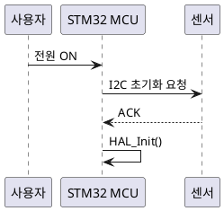
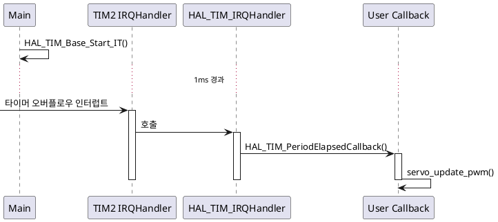
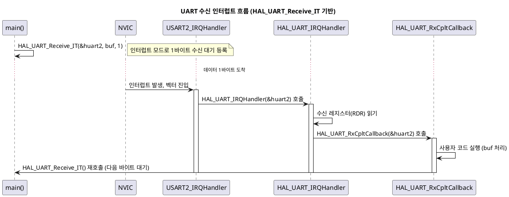

# STM32F103 NUCLEO 펌웨어 교육 — Doxygen+Graphviz / PlantUML 도입 가이드

> 대상: STM32F103 NUCLEO 보드 기반 HAL 펌웨어 교육 <br>
> 목적:
>      ① Doxygen + Graphviz로 정적 API 문서 및 호출 그래프 생성 <br>
>      ② PlantUML로 인터럽트/통신 시퀀스 흐름 시각화 <br>
> 형식: 검토용 초안 (실제 수업 적용 전 설치 검증 목적) <br>

---

## 목차

1. [전체 구성 개요](#1-전체-구성-개요)
2. [Doxygen + Graphviz 설치](#2-doxygen--graphviz-설치)
3. [Doxygen 설정 (Doxyfile)](#3-doxygen-설정-doxyfile)
4. [STM32 HAL 프로젝트에 적용하기](#4-stm32-hal-프로젝트에-적용하기)
5. [Doxygen 결과물 검토 방법](#5-doxygen-결과물-검토-방법)
6. [PlantUML 설치](#6-plantuml-설치)
7. [PlantUML로 시퀀스 다이어그램 작성](#7-plantuml로-시퀀스-다이어그램-작성)
8. [STM32 인터럽트/HAL 콜백 흐름 예제](#8-stm32-인터럽트hal-콜백-흐름-예제)
9. [수업 적용 체크리스트](#9-수업-적용-체크리스트)
10. [트러블슈팅](#10-트러블슈팅)

---

## 1. 전체 구성 개요

| 도구 | 역할 | 출력 형태 | 학생이 보는 것 |
|------|------|-----------|----------------|
| Doxygen | 소스 코드 주석 → API 문서 자동 생성 | HTML (브라우저로 열람) | 함수/구조체/매크로 레퍼런스 |
| Graphviz | Doxygen과 연동되어 함수 호출 관계 시각화 | HTML 내 SVG/PNG 그래프 | Call Graph, Caller Graph |
| PlantUML | 텍스트로 작성한 시퀀스를 다이어그램으로 변환 | PNG/SVG 이미지 | 인터럽트 발생 → 콜백 호출 흐름 |

**권장 워크플로우**

```
디버거로 코드 흐름 직접 추적 (1차시)
        │
        ▼
이해한 내용을 Doxygen 주석으로 작성 (2차시)
        │
        ▼
Doxygen + Graphviz로 정적 문서/콜그래프 생성 (3차시)
        │
        ▼
인터럽트/통신처럼 "시간 흐름"이 중요한 부분은
PlantUML 시퀀스 다이어그램으로 별도 작성 (4차시)
```

---

## 2. Doxygen + Graphviz 설치

### 2-1. Windows (학생 PC 기준, STM32CubeIDE 환경)

1. **Doxygen 설치**
   - 공식 사이트: https://www.doxygen.nl/download.html
   - `doxygen-x.x.x-setup.exe` 다운로드 후 기본 옵션으로 설치
   - 설치 후 명령 프롬프트에서 확인:
     ```cmd
     doxygen --version
     ```

2. **Graphviz 설치** (콜그래프 생성에 필수)
   - 공식 사이트: https://graphviz.org/download/
   - Windows installer 다운로드, 설치 시 **"Add Graphviz to the system PATH"** 옵션 반드시 체크
   - 확인:
     ```cmd
     dot -V
     ```
   - 이 단계를 빠뜨리면 Doxygen이 `dot` 실행 파일을 못 찾아 콜그래프가 생성되지 않음 (가장 흔한 실수)

3. **GUI 프론트엔드 (선택, 초보자 추천)**
   - `doxywizard` — Doxygen 설치 시 함께 설치됨
   - 설정 파일을 명령행 대신 GUI로 작성 가능, 수업 시연용으로 적합

### 2-2. Ubuntu / WSL (RTX 5090 워크스테이션 환경)

```bash
sudo apt update
sudo apt install doxygen graphviz doxygen-gui -y

# 버전 확인
doxygen --version
dot -V
```

### 2-3. VS Code 확장 (선택)

- **"Doxygen Documentation Generator"**: 함수 위에서 `/**` 입력 시 자동으로 `@brief`, `@param`, `@retval` 템플릿 생성
- 설치: VS Code Extensions → `doxygen` 검색 → Christoph Schlosser 제작 확장 설치
- 설정 (`settings.json`):
  ```json
  {
    "doxdocgen.generic.briefTemplate": "@brief {text}",
    "doxdocgen.generic.paramTemplate": "@param {param} ",
    "doxdocgen.generic.returnTemplate": "@retval {type} "
  }
  ```

---

## 3. Doxygen 설정 (Doxyfile)

### 3-1. 기본 설정 파일 생성

```bash
cd ~/stm32_project
doxygen -g Doxyfile
```

`Doxyfile`이 생성되며 약 280개 옵션이 들어있음. 수업에서는 다음 핵심 항목만 수정하도록 안내.

### 3-2. STM32 HAL 프로젝트용 핵심 설정값

```ini
# 프로젝트 정보
PROJECT_NAME           = "STM32F103 NUCLEO Firmware"
PROJECT_BRIEF          = "HAL 기반 임베디드 펌웨어 교육 문서"
OUTPUT_DIRECTORY       = ./docs

# 입력 소스 범위 (HAL 라이브러리 포함 여부 결정 — 중요)
INPUT                  = ./Core/Src ./Core/Inc
RECURSIVE              = YES
FILE_PATTERNS          = *.c *.h

# HAL 드라이버 자체를 문서화에 포함할지 (초보자는 NO 권장 → 본인 코드만 집중)
# 포함하려면 INPUT에 Drivers/STM32F1xx_HAL_Driver 경로 추가

# 주석 추출 방식 — JAVADOC 스타일 (STM32 HAL과 동일 포맷)
JAVADOC_AUTOBRIEF       = YES
JAVADOC_BANNER          = NO

# 콜그래프 활성화 (Graphviz 연동의 핵심)
HAVE_DOT                = YES
DOT_NUM_THREADS         = 0
CALL_GRAPH               = YES
CALLER_GRAPH             = YES
DOT_GRAPH_MAX_NODES      = 50
DOT_IMAGE_FORMAT         = svg
INTERACTIVE_SVG          = YES

# 클래스/구조체 다이어그램 (C 프로젝트라 단순화)
CLASS_DIAGRAMS          = YES
COLLABORATION_GRAPH     = YES
INCLUDE_GRAPH           = YES
INCLUDE_GRAPHED_BY_GRAPH = YES

# 출력 형식
GENERATE_HTML            = YES
GENERATE_LATEX           = NO
GENERATE_TREEVIEW        = YES

# 매크로/전처리기 (HAL은 #define이 많아 중요)
MACRO_EXPANSION          = YES
EXPAND_ONLY_PREDEF       = NO

# 경고 출력 (주석 누락 함수 확인용 — 평가에 활용 가능)
WARNINGS                 = YES
WARN_IF_UNDOCUMENTED     = YES
WARN_LOGFILE             = ./docs/warnings.log
```

> **교육 포인트**: `WARN_IF_UNDOCUMENTED = YES` + `WARN_LOGFILE`을 켜두면, 학생이 주석을 빠뜨린 함수 목록이 로그 파일에 남습니다. 이 로그 자체를 과제 체크리스트로 활용할 수 있습니다.

### 3-3. 문서 생성 실행

```bash
doxygen Doxyfile
```

생성 후 `docs/html/index.html`을 브라우저로 열면 결과 확인 가능.

---

## 4. STM32 HAL 프로젝트에 적용하기

### 4-1. 학생 코드에 Doxygen 주석 작성 예시

```c
/**
 * @brief  타이머 인터럽트 콜백 함수 — 1ms 주기로 호출됨
 * @note   HAL_TIM_PeriodElapsedCallback의 weak 함수를 오버라이드
 * @param  htim 타이머 핸들 포인터 (TIM2 사용 중)
 * @retval None
 */
void HAL_TIM_PeriodElapsedCallback(TIM_HandleTypeDef *htim)
{
    if (htim->Instance == TIM2)
    {
        servo_update_pwm();   /* 서보 PWM 듀티 갱신 */
    }
}
```

### 4-2. 모듈 단위 헤더 주석 (파일 상단)

```c
/**
 * @file    servo_control.c
 * @brief   서보모터 PWM 제어 모듈
 * @details TIM2 CH1을 이용해 1ms~2ms 펄스폭으로 서보 각도 제어
 * @author  학생명
 * @date    2026-07-01
 */
```

이렇게 작성하면 Doxygen이 파일 단위 설명 페이지도 자동 생성합니다.

### 4-3. 콜그래프가 의미 있게 나오는 조건

- 함수가 **실제로 다른 함수를 호출**해야 그래프가 그려짐 (단일 함수는 그래프 없음)
- `static` 함수도 그래프에 포함되려면 `EXTRACT_STATIC = YES` 설정 필요 — STM32 프로젝트는 보통 내부 함수가 많아 이 옵션이 중요
- HAL 라이브러리까지 INPUT에 포함하면 그래프가 매우 복잡해짐 → 처음에는 본인 작성 코드만 포함 권장, 익숙해지면 HAL 포함해서 "내 코드가 HAL의 어디를 호출하는지" 확장

---

## 5. Doxygen 결과물 검토 방법

검토 시 다음 항목을 체크리스트로 활용하시면 좋습니다.

| 체크 항목 | 확인 위치 | 의미 |
|-----------|-----------|------|
| 함수 설명이 비어있지 않은가 | `docs/html/files.html` → 각 함수 클릭 | 주석 충실도 |
| `warnings.log`에 항목이 몇 개인가 | `docs/warnings.log` | 누락된 주석 개수 (정량 평가 가능) |
| Call Graph가 의미 있게 그려지는가 | 함수 페이지 하단 그래프 | 함수 분리/모듈화가 잘 되어 있는지 간접 확인 |
| Caller Graph로 콜백 함수의 호출 경로 추적 | `HAL_TIM_PeriodElapsedCallback` 등 weak 함수 페이지 | 인터럽트 → 콜백 흐름 이해도 |
| Include 그래프로 헤더 의존성 확인 | 파일 페이지 상단 | 불필요한 include 여부 (코드 품질) |

**평가 활용 예시**: `warnings.log`의 줄 수를 `wc -l warnings.log`로 세서 "문서화율" 점수로 활용 가능 (단, 형식적 채점 도구로만 보조 활용 — 내용 충실도는 별도 확인 필요).

---

## 6. PlantUML 설치

### 6-1. 사전 요구사항 — Java

```bash
# Ubuntu
sudo apt install default-jre -y
java -version
```

Windows는 https://www.java.com 에서 JRE 설치.

### 6-2. PlantUML 설치 방법 (3가지 중 택1)

**방법 A — VS Code 확장 (수업 진행 시 가장 추천)**

1. VS Code Extensions에서 **"PlantUML"** (jebbs 제작) 검색 후 설치
2. Graphviz가 이미 설치되어 있으면 (2장에서 설치함) 별도 설정 불필요
3. `.puml` 파일 작성 후 `Alt+D`로 미리보기 (Windows), `Option+D` (Mac)

**방법 B — JAR 파일 직접 실행**

```bash
# 다운로드
wget https://github.com/plantuml/plantuml/releases/latest/download/plantuml.jar

# 다이어그램 생성
java -jar plantuml.jar diagram.puml
# → diagram.png 생성됨
```

**방법 C — 온라인 에디터 (설치 없이 즉시 테스트용)**

- https://www.plantuml.com/plantuml/uml/
- 수업 첫 시간에 설치 없이 바로 시연할 때 유용

### 6-3. 설치 확인

```bash
java -jar plantuml.jar -version
```

---

## 7. PlantUML로 시퀀스 다이어그램 작성

### 7-1. 기본 문법



### 7-2. 활성화 박스(Activation Bar) 사용 — 함수 실행 구간 표현



---

## 8. STM32 인터럽트/HAL 콜백 흐름 예제

UART 수신 인터럽트 예제 (수업에서 바로 사용 가능):



이 예제를 학생들에게 먼저 보여주고, 본인이 작업한 I2C/SPI 모듈로 동일한 형식의 다이어그램을 그려보게 하면 "이해도 검증 과제"로 활용할 수 있습니다.

---

## 9. 수업 적용 체크리스트

- [ ] 학생 PC에 Doxygen + Graphviz 설치 및 `dot -V` 동작 확인
- [ ] VS Code Doxygen 확장 설치 및 자동완성 동작 확인
- [ ] 샘플 HAL 프로젝트로 Doxyfile 설정 및 1회 문서 생성 시연
- [ ] `warnings.log` 확인 방법 안내 (자가 점검용)
- [ ] PlantUML VS Code 확장 설치 및 미리보기(`Alt+D`) 동작 확인
- [ ] UART 인터럽트 예제 다이어그램 함께 그려보기
- [ ] 학생 개별 과제: 본인 모듈의 Doxygen 주석 + 콜그래프 + 시퀀스 다이어그램 1개씩 제출

---

## 10. 트러블슈팅

| 증상 | 원인 | 해결 |
|------|------|------|
| 콜그래프가 전혀 안 나옴 | Graphviz 미설치 또는 PATH 미등록 | `dot -V` 실행해서 확인, Windows는 설치 시 PATH 옵션 체크 |
| 콜그래프가 너무 복잡해서 못 알아봄 | HAL 라이브러리 전체를 INPUT에 포함 | `INPUT`을 본인 작성 코드(`Core/Src`)로 제한 |
| static 함수가 그래프에 안 보임 | `EXTRACT_STATIC = NO` (기본값) | `EXTRACT_STATIC = YES`로 변경 |
| PlantUML 미리보기가 안 뜸 | Java 미설치 | `java -version`으로 확인 후 JRE 설치 |
| PlantUML 한글이 깨짐 | 폰트/인코딩 문제 | `.puml` 파일을 UTF-8로 저장, `skinparam defaultFontName "맑은 고딕"` 추가 |
| Doxygen 한글 주석 깨짐 | 소스 파일 인코딩 불일치 | `Doxyfile`에 `INPUT_ENCODING = UTF-8` 추가, 소스 파일도 UTF-8(BOM 없음)로 저장 |

---

*이 문서는 검토용 초안입니다. 실제 수업 적용 전 설치 환경(학생 PC 스펙, 사내 보안 정책 등)에 맞춰 세부 설정을 조정하시기 바랍니다.*
