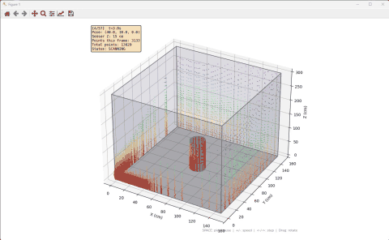
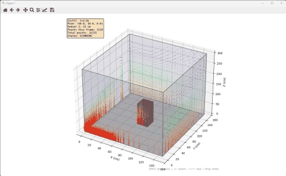

# 3D SLAM 시뮬레이션 — 초음파 3D 스캔

2D SLAM 프로젝트를 확장하여 초음파 센서를 **90° 틀어서 수직(Elevation) 스캔**이 가능하도록 하고,
3차원 점군(Point Cloud)을 생성하여 3D SLAM을 수행합니다.





---

## 1. 개요

### 기존 2D vs 새로운 3D 방식

| 구분 | 2D 방식 | 3D 방식 |
|------|---------|---------|
| 스캔 방향 | 수평(Azimuth) 360° | 수평(Azimuth) 360° + 수직(Elevation) -60°~+60° |
| 센서 방향 | 지면과 수평 | **90° 틀어서** 수직 방향 포함 |
| 출력 | 2D 거리값 (각도, 거리) | **3D 점군** (x, y, z 좌표) |
| 지도 | Occupancy Grid (2D) | **Point Cloud (3D)** |

### 환경 구성

```
 Wall (높이 300cm)
 ┌─────────────────────────────────────┐
 │          ┌──────────┐               │
 │          │  장애물   │               │  ← 장애물 높이 100cm
 │          │ 20×20cm  │               │
 │          └──────────┘               │
 │                                     │
 │  ● ← 로봇 (센서 높이 15cm)          │
 │     벽면 10cm 이격 주행             │
 └─────────────────────────────────────┘
  └──────────────────────────────┘
        150cm × 150cm
```

### 3D 스캔 원리

초음파 센서를 **90도 회전**하여 수직 방향으로도 스캔:

```
          ↑            Elevation +60°
          │    ╱
          │   ╱       Sensor beam
          │  ╱        (vertical sweep)
   ────── ● ──────→  Azimuth 0°
          │  ╲
          │   ╲
          │    ╲
          ↓            Elevation -60°
```

- **Azimuth (수평)**: 0°~360° (5° step)
- **Elevation (수직)**: -60°~+60° (2° step, 1cm 해상도)
- **센서 높이**: 지면에서 15cm (바닥면 가시성 확보)
- 각 위치에서 **4,320개**의 3D 포인트 생성 (72 azimuth × 60 elevation)

---

## 2. 파일 구조

```
C:\slam-3d\
├── simulator_3d.py     # 3D 데이터 생성기
├── viewer_3d.py        # 3D 포인트 클라우드 뷰어
└── README.md
```

### simulator_3d.py

#### 주요 함수

| 함수 | 설명 |
|------|------|
| `cast_ray_3d()` | 3D 공간에서 레이 캐스팅 (벽+천장+장애물) |
| `intersect_box_face()` | 직육면체 면과의 교차점 계산 |
| `scan_3d()` | 전체 3D 스캔 (Azimuth × Elevation) |
| `generate()` | 전체 시뮬레이션 데이터 생성 |

#### 3D 레이 캐스팅

```
레이: (px, py, pz) + t × (dx, dy, dz)

충돌 검사 순서:
1. 4개 벽면 (x=0, x=W, y=0, y=H) — z 범위 [0, wall_height] 확인
2. 천장 (z = wall_height) — (x, y) 범위 확인
3. 사각 장애물 — 4개 측면 + 상단면 (z = obstacle_height)
4. 원기둥 장애물 — 곡면 + 상단면 + 하단면
```

#### 생성 데이터 형식

```json
{
  "environment": {
    "width": 150,
    "height": 150,
    "wall_height": 300,
    "obstacles": [[65, 65, 20, 20, 100]],
    "circles": [[75, 75, 10, 100]]
  },
  "robot": {
    "sensor_height_cm": 15,
    "azimuth_step_deg": 5,
    "elevation_range_deg": [-60, 60],
    "elevation_step_deg": 2
  },
  "data": [
    {
      "timestamp": 0.0,
      "ground_truth": {"x": 10, "y": 10, "theta": 0},
      "points": [
        {
          "x": 149.6, "y": 10.0, "z": 0.44,
          "true_x": 150.0, "true_y": 10.0, "true_z": 0.25,
          "distance": 21.82,
          "azimuth": 0.0, "elevation": -26,
          "surface": "wall"
        }
      ],
      "point_count": 4320,
      "is_turn": false
    }
  ]
}
```

#### 파라미터

| 파라미터 | 기본값 | 설명 |
|----------|--------|------|
| `--wall-height` | 300 | 벽 높이 (cm) |
| `--obstacle-height` | 100 | 장애물 높이 (cm) |
| `--sensor-height` | 15 | 센서 높이 (cm, 바닥면 스캔용) |
| `--azimuth-step` | 5 | 수평 스캔 스텝 (deg) |
| `--elevation-min` / `--elevation-max` | -60 / 60 | 수직 스캔 범위 (deg) |
| `--elevation-step` | 2 | 수직 스캔 스텝 (deg) |
| `--obstacle-mode` | none | none / square / cylinder |

### viewer_3d.py

3D 포인트 클라우드 시각화기.

#### 화면 구성

- **3D 공간**: matplotlib mplot3d를 사용한 인터랙티브 3D 뷰
- **벽**: 반투명 폴리곤 + 모서리선
- **장애물**: 사각기둥 / 원기둥 3D 렌더링
- **포인트 클라우드**: 높이(z)에 따라 **무지개(gist_rainbow)** 컬러 매핑 — 촘촘한 계조로 입체감 표현
- **로봇**: 빨간 점으로 표시
- **궤적**: 파란 선

#### 키보드 조작

| 키 | 동작 |
|----|------|
| `Space` | 재생 / 일시정지 |
| `→` / `←` | 프레임 이동 |
| `+` / `-` | 속도 조절 |
| 마우스 드래그 | 3D 뷰 회전 |

---

## 3. 사용 방법

### 데이터 생성

```bash
# 1. 빈 공간
python simulator_3d.py --obstacle-mode none --output empty_3d.json

# 2. 중앙 사각 기둥 (20×20×100cm)
python simulator_3d.py --obstacle-mode square --output square_3d.json

# 3. 중앙 원기둥 (R10×100cm)
python simulator_3d.py --obstacle-mode cylinder --output cylinder_3d.json

# 빠른 테스트 (해상도 낮춤)
python simulator_3d.py --azimuth-step 10 --elevation-step 5 --output quick.json
```

### 시각화

```bash
python viewer_3d.py square_3d.json
```

---

## 4. 2D 프로젝트와의 차이점

| 항목 | `C:\slam` (2D) | `C:\slam-3d` (3D) |
|------|----------------|-------------------|
| 스캔 차원 | 1D (각도) | **2D (각도 + 고도)** |
| 출력 | 거리값 | **3D 좌표 (x, y, z)** |
| 벽 높이 | 무한대 | **300cm** |
| 장애물 높이 | 무한대 | **100cm** |
| 시각화 | Occupancy Grid | **3D Point Cloud** |
| 레이 캐스팅 | 2D 선-사각형 | **3D 레이-평면/원기둥** |
| 스캔 포인트 수/프레임 | 180개 | **~4,300개** |

---

## 5. 확장 방향

- **Voxel Grid**: 3D 공간을 1cm³ 복셀로 분할한 3D Occupancy Grid
- **OctoMap**: 8진 트리 기반의 효율적인 3D 지도 표현
- **3D ICP**: Iterative Closest Point로 프레임 간 정합
- **RGB-D 융합**: 추후 카메라(Depth) 데이터와 융합
