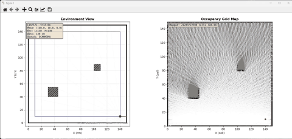
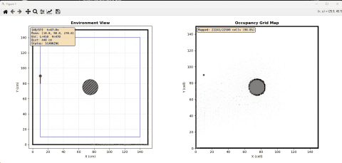
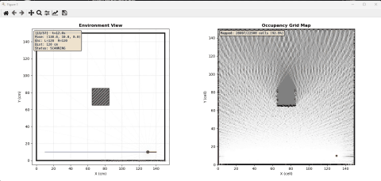

# SLAM 시뮬레이션 데이터 생성기 및 뷰어

초음파 센서와 서보모터, 바퀴 엔코더, IMU(MPU6050)를 탑재한 이동체가
150x150cm 공간을 주행하며 수집한 센서 데이터를 시뮬레이션하고,
이를 Occupancy Grid Mapping으로 시각화하는 도구입니다.








---

## 1. 개발 컨셉

### 하드웨어 구성

```
         ┌─────────── 서보 180° 회전 ───────────┐
         │                                      │
    [초음파B] ←── 180° 등지고 ──→ [초음파A]     │
         │                        │             │
         └─────── 서보모터에 장착 ───────┘       │
                                                 │
          ┌────────── MPU6050 ──────────┐        │
          │   (가속도 + 자이로 6축)      │        │
          └────────────────────────────┘        │
                                                 │
    ┌─── 왼쪽 엔코더 ───┐     ┌─── 오른쪽 엔코더 ───┐
    │ (포토인터럽트)     │     │ (포토인터럽트)     │
    └──────────────────┘     └──────────────────┘
```

### 핵심 아이디어

- **초음파 센서 2개**를 180° 등지게(back-to-back) 설치
- **서보모터**로 180° 회전 → 2개 센서로 360° 전방위 스캔
- 10cm 이동마다 1회 스캔 수행
- 벽면에서 10cm 이격, 코너에서 90° 회전하며 사각 궤적 주행
- **엔코더**로 주행 거리, **IMU**로 자세 추정 데이터 수집

### SLAM 입력 데이터

SLAM(Simultaneous Localization and Mapping) 알고리즘에 필요한 입력:

| 데이터 | 출처 | 용도 |
|--------|------|------|
| 초음파 거리값 | HC-SR04 × 2 + 서보 | 장애물까지의 거리 (360°) |
| 주행 거리 | 바퀴 엔코더(포토인터럽트) | Odometry (이동량) |
| 조향각 | 엔코더 차분 / IMU 자이로 | 회전량 추정 |
| 가속도 / 각속도 | MPU6050 (IMU) | 자세 보정 |

### Obstacle Mode (3가지 시나리오)

| Mode | 설명 |
|------|------|
| `none` | 중앙에 아무것도 없는 빈 공간 |
| `square` | 중앙에 20×20cm 정사각형 기둥 |
| `cylinder` | 중앙에 반지름 10cm (지름 20cm) 원기둥 |

---

## 2. 파일 구조

```
C:\slam\
├── slam_simulator.py    # 데이터 생성기
├── slam_viewer.py       # 시각화 뷰어
└── README.md            # 본 문서
```

### slam_simulator.py — 데이터 생성기

시뮬레이션된 센서 데이터를 JSON 파일로 생성합니다.

#### 주요 함수

| 함수 | 설명 |
|------|------|
| `cast_ray()` | 주어진 위치와 각도에서 벽/장애물까지의 거리 계산 |
| `cast_ray_circle()` | 원기둥 장애물과의 레이-원 교차점 계산 |
| `scan_360()` | 360° 초음파 스캔 데이터 생성 (노이즈 포함) |
| `encoder_ticks()` | 이동 거리 → 엔코더 틱 변환 |
| `generate()` | 전체 시뮬레이션 데이터 생성 |

#### 데이터 흐름

```
robot_path() ──→ cast_ray() per angle ──→ scan_360()
                                              │
                                    noise 추가 (Gaussian)
                                              │
                                    JSON 레코드 저장
```

#### 생성되는 데이터 형식 (JSON)

```json
{
  "environment": {
    "width": 150.0,
    "height": 150.0,
    "obstacles": [[65, 65, 20, 20]],
    "circles": []
  },
  "robot": {
    "wheel_radius_cm": 3.0,
    "wheel_base_cm": 12.0,
    "encoder_cpr": 20,
    "speed_cm_s": 10.0,
    "wall_offset_cm": 10.0,
    "scan_interval_cm": 10.0,
    "scan_angle_step_deg": 2,
    "noise_sigma": 0.5
  },
  "data": [
    {
      "timestamp": 0.0,
      "ground_truth": {"x": 10.0, "y": 10.0, "theta": 0.0},
      "odometry": {
        "left_encoder_ticks": 0,
        "right_encoder_ticks": 0,
        "distance_cm": 0.0
      },
      "scan": [
        {
          "angle_relative": 0,
          "angle_world": 0.0,
          "distance": 139.93,
          "true_distance": 140.0,
          "sensor_id": 0
        },
        ...
      ],
      "is_turn": false
    }
  ]
}
```

#### 주요 파라미터

| 파라미터 | 기본값 | 설명 |
|----------|--------|------|
| `--width` / `--height` | 150 / 150 | 공간 크기 (cm) |
| `--offset` | 10 | 벽면 이격 거리 (cm) |
| `--scan-interval` | 10 | 스캔 간격 (cm) |
| `--angle-step` | 2 | 초음파 각도 분해능 (deg) |
| `--noise` | 0.5 | 센서 노이즈 표준편차 (cm) |
| `--wheel-radius` | 3.0 | 바퀴 반지름 (cm) |
| `--wheel-base` | 12.0 | 바퀴 간 거리 (cm) |
| `--cpr` | 20 | 엔코더 1회전당 펄스 수 |

### slam_viewer.py — 시각화 뷰어

생성된 JSON 데이터를 불러와 두 개의 패널로 시각화합니다.

#### 핵심 로직

**Occupancy Grid Mapping** (알려진 자세 기반):

1. 각 스캔 데이터의 ray를 Bresenham 알고리즘으로 그리드에 레이 트레이싱
2. ray 상의 셀(마지막 제외) → **free** 업데이트 (`l_free = -0.4`)
3. ray 끝(장애물 접촉) 셀 → **occupied** 업데이트 (`l_occ = +0.85`)
4. Log-odds → 확률 변환: `p = 1 - 1/(1 + exp(l))`
5. 검정(점유=1) / 흰색(자유=0) / 회색(미탐색=0.5)으로 표시

**화면 구성:**

```
┌─────────────────────────┬─────────────────────────┐
│   Environment View      │   Occupancy Grid Map    │
│                         │                         │
│   ┌──── 벽 ────┐        │   ■■■□□□□□□            │
│   │  ● 로봇    │        │   ■■□□□□□□□            │
│   │   〰 ray   │        │   ■□□□□□□□□            │
│   │   ·· 궤적  │        │   □□□□□□□□□            │
│   └────────────┘        │   □□□□□□□□□            │
│                         │                         │
│   frame/time/pose 정보  │   mapping 진행률        │
└─────────────────────────┴─────────────────────────┘
```

#### 키보드 조작

| 키 | 동작 |
|----|------|
| `Space` | 재생 / 일시정지 |
| `→` | 다음 프레임 |
| `←` | 이전 프레임 |
| `+` / `=` | 속도 증가 |
| `-` | 속도 감소 |

---

## 3. 사용 방법

### 요구사항

- Python 3.8+
- numpy
- matplotlib

### 설치

```bash
pip install numpy matplotlib
```

### 데이터 생성

```bash
# 1. 빈 공간
python slam_simulator.py --obstacle-mode none --output empty.json

# 2. 중앙 사각 기둥
python slam_simulator.py --obstacle-mode square --output square.json

# 3. 중앙 원기둥
python slam_simulator.py --obstacle-mode cylinder --output cylinder.json

# 사용자 지정 장애물 (커스텀 사각형)
python slam_simulator.py --obstacles "30,40,15,15" "100,80,10,10" --output custom.json
```

### 시각화

```bash
# 기본 (sensor_data.json 자동 로드)
python slam_viewer.py

# 특정 파일 로드
python slam_viewer.py square.json
python slam_viewer.py cylinder.json
```

---

## 4. 시뮬레이션 상세

### 주행 경로

```
  y=150 ┌────────────────────────────────────┐
        │                                    │
        │   (10,140) ← ← ← ← (140,140)      │
        │     ↓                    ↑         │
        │     ↓                    ↑         │
        │   (10,10)  ──→──→  (140,10)       │
        │        10cm 이격                   │
  y=0   └────────────────────────────────────┘
       x=0                                 x=150
```

- 시작: (10, 10), heading 0° (오른쪽)
- 반시계 방향으로 사각형 주행
- 코너에서 90° 회전 (제자리 회전)
- 속도: 10cm/s
- 10cm마다 정지 후 360° 스캔
- 총 57개 레코드 (53개 스캔 + 4개 턴)

### 초음파 센서 모델

- 두 센서가 180° 등져서 설치 (sensor_id 0 / 1)
- 서보가 180° 회전하며 360° 커버
- 각도 분해능: 2° (기본값) → 180개 ray / 스캔
- 거리 노이즈: Gaussian(μ=0, σ=0.5cm)
- 최소 감지 거리: 0.1cm

### 엔코더 시뮬레이션

```
encoder_ticks = distance / (2π × wheel_radius) × CPR
```

- 직진: 좌우 동일 틱 증가
- 회전: 좌우 역방향 틱 (차분으로 회전각 계산)

### IMU 시뮬레이션

- 직진 정속: accel=(0,0,9.81), gyro=(0,0,0)
- 회전 중: gyro_z에 각속도 반영

---

## 5. 코드 구조 설명

### slam_simulator.py

```
main()
  └─ generate()
       ├─ 장애물 설정 (mode에 따라 rects / circles 결정)
       ├─ 초기 위치 스캔
       └─ 각 코너 루프:
            ├─ 10cm 단위 이동 → scan_360() → save()
            └─ 코너 도달 → 90° 회전 → save(is_turn=true)

cast_ray(px, py, angle, w, h, rects, circles)
  ├─ 벽 충돌 검사 (4개 벽면)
  ├─ 사각형 장애물 충돌 검사 (4개 모서리)
  └─ 원형 장애물 충돌 검사 (2차 방정식)

cast_ray_circle(px, py, dx, dy, cx, cy, r)
  └─ 2차 방정식: t² + 2t(dxΔx+dyΔy) + (Δx²+Δy²-r²) = 0
     → 최소 양수 t 선택
```

### slam_viewer.py

```
SlamViewer
  ├─ __init__(): JSON 로드, grid precompute, plot 설정, animation 시작
  ├─ _precompute_grids(): 각 프레임별 누적 occupancy grid 미리 계산
  ├─ _setup_plots(): 2-panel 레이아웃 구성
  ├─ _update(): 현재 프레임의 robot/ray/grid 표시 갱신
  └─ _on_key(): 키보드 이벤트 처리

Occupancy Grid 업데이트 (Bresenham ray tracing):
  ray (px,py) → (end_x,end_y) 의 그리드 셀들을 추적
  → 중간 셀들: log_odds += l_free (-0.4)
  → 끝 셀:     log_odds += l_occ (+0.85)
  → 확률 변환: p = 1 - 1/(1 + exp(lo))
```

---

## 6. 향후 확장 방향

- **Noisy odometry 기반 SLAM**: 실제 엔코더/IMU 노이즈를 반영한 odometry로 자세 추정
- **Particle Filter (GMapping)**: 파티클 필터로 위치 불확실성을 고려한 SLAM
- **실제 하드웨어 연동**: 시뮬레이터 대신 실제 MPU6050 + HC-SR04 + 엔코더 데이터 입력
- **ROS2 연동**: sensor_msgs/LaserScan 형태로 데이터 변환하여 ROS2 SLAM toolchain 활용
- **경로 계획**: 커버리지 기반 자율 주행 경로로 확장
